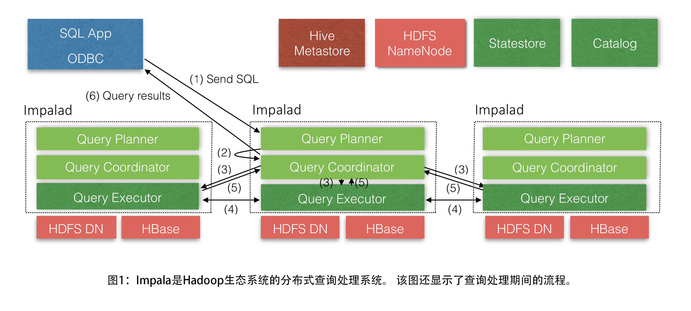
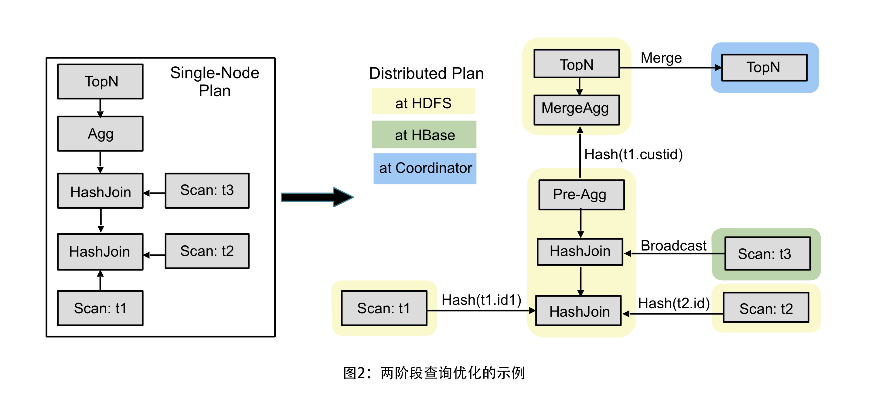
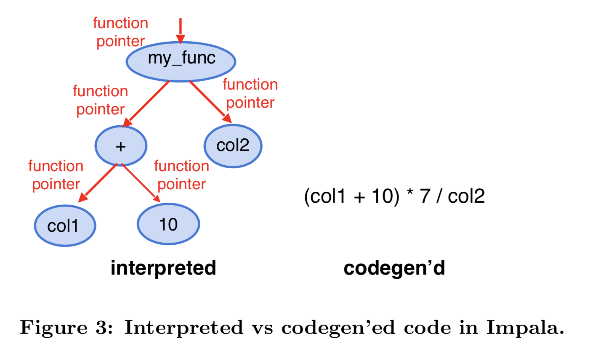
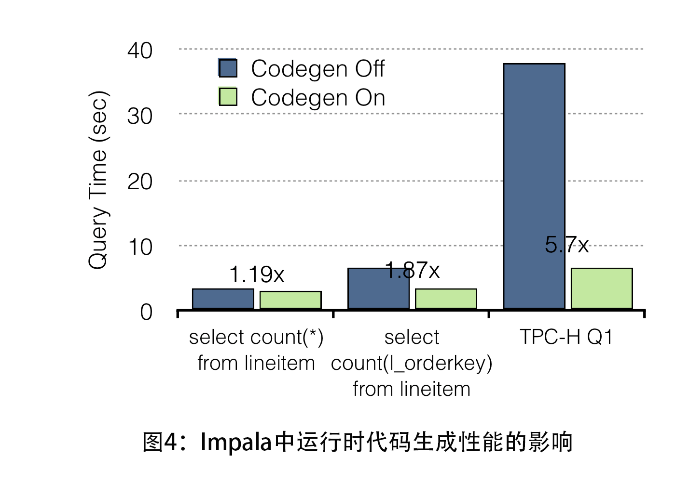
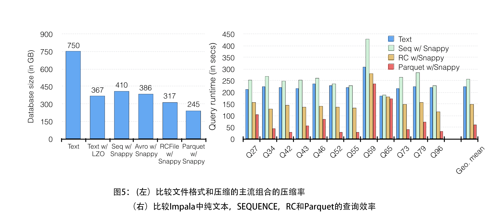
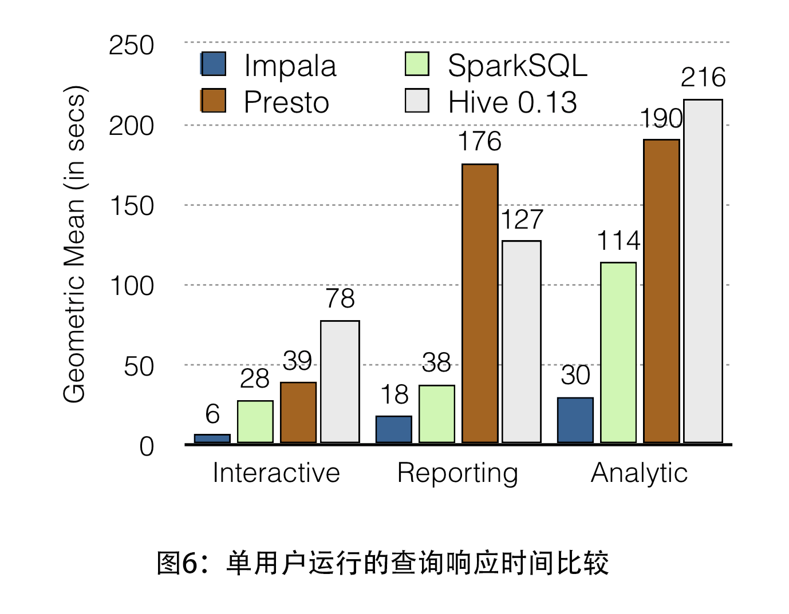
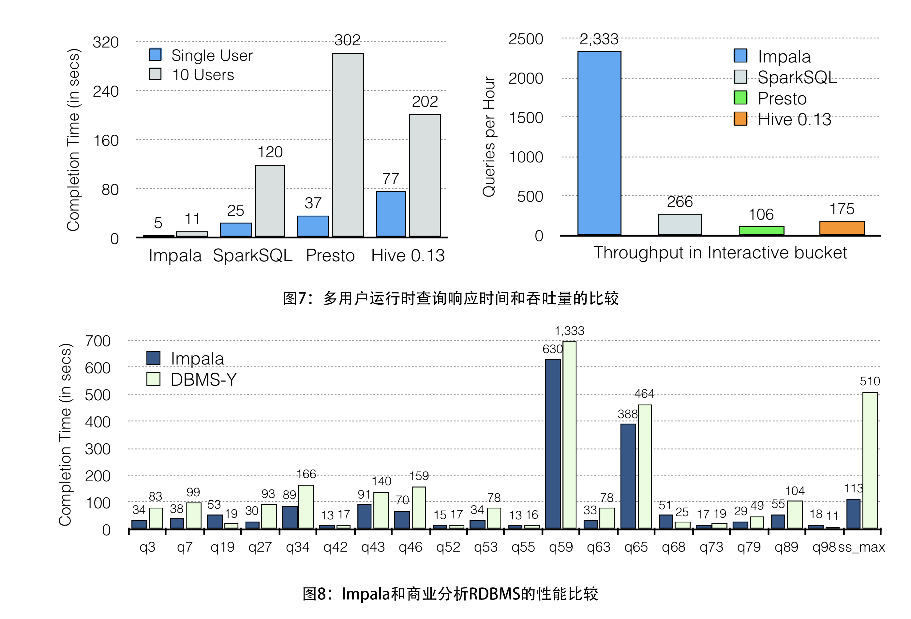

Impala: A Modern, Open-Source SQL Engine for Hadoop （Impala：适用于Hadoop的现代开源SQL引擎）
-----
[论文英文原文](http://cidrdb.org/cidr2015/Papers/CIDR15_Paper28.pdf) <sup>**0**</sup>


作者：  
Marcel Kornacker    Alexander Behm  Victor Bittorf  Taras Bobrovytsky   
Casey Ching Alan Choi   Justin Erickson Martin Grund    Daniel Hecht  
Matthew Jacobs  Ishaan Joshi    Lenni Kuff  Dileep Kumar    Alex Leblang  
Nong Li Ippokratis Pandis   Henry Robinson  David Rorke Silvius Rus  
John Russell    Dimitris Tsirogiannis   Skye Wanderman-Milne    Michael Yoder

马歇尔 科尔纳克  &nbsp;&nbsp;&nbsp;  亚历山大 贝姆  &nbsp;&nbsp;&nbsp;   维克托 比托夫 &nbsp;&nbsp;&nbsp; 塔拉斯 博布罗维茨基  
凯西 钦  &nbsp;&nbsp;&nbsp;  艾伦 崔  &nbsp;&nbsp;&nbsp;  贾斯廷 埃里克森  &nbsp;&nbsp;&nbsp;  马丁 格伦德 &nbsp;&nbsp;&nbsp;  丹尼尔 赫克特  
马修 雅各布斯  &nbsp;&nbsp;&nbsp;   伊桑 乔希 &nbsp;&nbsp;&nbsp;  伦尼 库夫 &nbsp;&nbsp;&nbsp;  迪利普 库马尔   &nbsp;&nbsp;&nbsp;  亚历克斯 莱布隆格  
农 李  &nbsp;&nbsp;&nbsp;   伊波克拉蒂斯 潘迪斯 &nbsp;&nbsp;&nbsp;  亨利 罗宾逊  &nbsp;&nbsp;&nbsp;  戴维 罗克  &nbsp;&nbsp;&nbsp;  西尔维厄斯 罗斯  
约翰 拉塞尔 &nbsp;&nbsp;&nbsp; 季米特里斯 提罗吉安尼  &nbsp;&nbsp;&nbsp;   斯凯 旺达曼-米尔恩  &nbsp;&nbsp;&nbsp;  迈克尔 约德

<br/><br/>

# 目录
* [ABSTRACT (摘要)](#t0)
* [1 INTRODUCTION (简介)](#t1)
* [2 USER VIEW OF IMPALA (Impala的用户视图)](#t2)
	- [2.1 Physical schema design (物理架构设计)](#t2.1)
	- [2.2 SQL Support (SQL 支持)](#t2.2)
* [3 ARCHITECTURE (架构)](#t3)
	- [3.1 State distribution (状态分布)](#t3.1)
	- [3.2 Catalog service (目录服务)](#t3.2)
* [4 FRONTEND (前端)](#t4)
* [5 BACKEND (后端)](#t5)
	- [5.1 Runtime Code Generation (运行时代码生成器)](#t5.1)
	- [5.2 I/O Management (I/O管理)](#t5.2)
	- [5.3 Storage Formats (存储格式)](#t5.3)
* [6 RESOURCE/WORKLOAD MANAGEMENT (资源/工作负载管理)](#t6)
	- [6.1 Llama and YARN (Llama和YARN)](#t6.1)
	- [6.2 Admission Control (准入控制)](#t6.2)
* [7 EVALUATION (评估)](#t7)
	- [7.1 Experimental setup (实验装置)](#t7.1)
	- [7.2 Single User Performance (单用户性能)](#t7.2)
	- [7.3 Mutli-User Performance (多用户性能)](#t7.3)
	- [7.4 Comparing against a commercial RDBMS (与商业RDBMS进行比较)](#t7.4)
* [8 ROADMAP (路线图)](#t8)
	- [8.1 Additional SQL Support (其他SQL支持)](#t8.1)
	- [8.2 Additional Performance Enhancements (其他性能增强)](#t8.2)
	- [8.3 Metadata and Statistics Collection (元数据和统计数据收集)](#t8.3)
	- [8.4 Automated Data Conversion (自动数据转换)](#t8.4)
	- [8.5 Resource Management (资源管理)](#t8.5)
	- [8.6 Support for Remote Data Storage (支持远程数据存储)](#t8.6)
* [9 CONCLUSION (结论)](#t9)
* [注释](#annotation)
* [参考文献](#references)


<br/>

----

<br/>


# ABSTRACT (摘要)
> Cloudera Impala is a modern, open-source MPP SQL engine architected from the ground up for the Hadoop data processing environment. Impala provides low latency and high concurrency for BI/analytic read-mostly queries on Hadoop, not delivered by batch frameworks such as Apache Hive. This paper presents Impala from a user’s perspective, gives an overview of its architecture and main components and briefly demonstrates its superior performance compared against other popular SQL-on-Hadoop systems.

Cloudera Impala 是一个现代化的开源 MPP SQL引擎，专为Hadoop数据处理环境而设计。 Impala 为 Hadoop上 的 BI或者以主要以读为主的分析提供低延迟和高并发性，而不是由Apache Hive等批处理框架提供。本文从用户的角度介绍了Impala，概述了其体系结构和主要组件，并简要论述了与其他流行的 SQL-on-Hadoop 系统相比的优越性能。


# 1. INTRODUCTION (简介)
> Impala is an open-source<sup>1</sup>, fully-integrated, state-of-the-art MPP SQL query engine designed specifically to leverage the flexibility and scalability of Hadoop. Impala’s goal is to combine the familiar SQL support and multi-user performance of a traditional analytic database with the scalability and flexibility of Apache Hadoop and the production-grade security and management extensions of Cloudera Enterprise. Impala’s beta release was in October 2012 and it GA’ed in May 2013. The most recent version, Impala 2.0, was released in October 2014. Impala’s ecosystem momentum continues to accelerate, with nearly one million downloads since its GA.

Impala是一个开源的<sup> **1** </sup>、完全集成的、最先进的 MPP SQL 查询引擎，专门为 Hadoop 的灵活性和可扩展性而设计。 Impala的目标是将熟悉的SQL支持和传统分析型数据库的多用户性能与 Apache Hadoop 的可扩展性和灵活性以及 Cloudera Enterprise 的生产级别的安全和管理扩展相结合。 Impala的测试版于2012年10月发布，并于2013年5月发布GA(General Availability)。最新版本 Impala 2.0 于2014年10月发布。Impala 的生态系统势头继续加速，自GA以来下载量接近100万。

> Unlike other systems (often forks of Postgres), Impala is a brand-new engine, written from the ground up in C++ and Java. It maintains Hadoop’s flexibility by utilizing standard components (HDFS, HBase, Metastore, YARN, Sentry) and is able to read the majority of the widely-used file formats (e.g. Parquet, Avro, RCFile). To reduce latency, such as that incurred from utilizing MapReduce or by reading data remotely, Impala implements a distributed architecture based on daemon processes that are responsible for all aspects of query execution and that run on the same machines as the rest of the Hadoop infrastructure. The result is performance that is on par or exceeds that of commercial MPP analytic DBMSs, depending on the particular workload. 

与其他系统（通常是 Postgres 的分支）不同，Impala 是一个全新的引擎，从头开始用C ++和Java编写。 它通过使用标准组件（HDFS、HBase、Metastore、YARN、Sentry）来保持 Hadoop 的灵活性，并且能够读取大多数广泛使用的文件格式（例如Parquet、Avro、RCFile）。 为了减少延迟，例如采用 MapReduce 或远程读取数据所产生的延迟，Impala实现了一个基于守护进程的分布式体系结构，该进程负责所有方面的查询执行，并在与Hadoop其余部分基础结构相同的机器上运行。 结果是性能相当或优于商用MPP分析DBMS，具体取决于特定的工作负载。

> This paper discusses the services Impala provides to the user and then presents an overview of its architecture and main components. The highest performance that is achievable today requires using HDFS as the underlying storage manager, and therefore that is the focus on this paper; when there are notable differences in terms of how certain technical aspects are handled in conjunction with HBase, we note that in the text without going into detail.

本文讨论了Impala为用户提供的服务，然后概述了其体系结构和主要组件。 目前使用HDFS作为底层存储管理器的可实现的最高性能要求，因此这是本文的重点; 当某些技术方面与HBase在处理方式上存在显著差异时，我们在文中没有详细说明。

> Impala is the highest performing SQL-on-Hadoop system, especially under multi-user workloads. As [Section 7]() shows, for single-user queries, Impala is up to 13x faster than alternatives, and 6.7x faster on average. For multi-user queries, the gap widens: Impala is up to 27.4x faster than alternatives, and 18x faster on average – or nearly three times faster on average for multi-user queries than for single-user ones.

Impala是性能最高的SQL-on-Hadoop系统，尤其是在多用户工作负载下。 如[第7节]()所示，对于单用户查询，Impala比其他选项快13倍，平均速度快6.7倍。 对于多用户查询，差距扩大：Impala比其他选择项快27.4倍，平均速度提高18倍 - 或多用户查询的平均速度比单用户查询快近三倍。

> The remainder of this paper is structured as follows: the next section gives an overview of Impala from the user’s perspective and points out how it differs from a traditional RDBMS. [Section 3]() presents the overall architecture of the system. [Section 4]() presents the frontend component, which includes a cost-based distributed query optimizer, [Section 5]() presents the backend component, which is responsible for the query execution and employs runtime code generation, and [Section 6]() presents the resource/workload management component. [Section 7]() briefly evaluates the performance of Impala. [Section 8]() discusses the roadmap ahead and [Section 9]() concludes.

本文的其余部分结构如下：下一部分从用户的角度概述了Impala，并指出它与传统RDBMS的不同之处。 [第3节]()介绍了系统的整体架构。 [第4节]()提供了前端组件，其中包括基于成本原则的分布式查询优化器，[第5节]()提供了后端组件，它负责查询执行并使用运行时代码生成器，[第6节]()表示资源/工作负载管理组件。 [第7节]()简要评估了Impala的性能。 [第8节]()讨论了前面的路线图，[第9节]()总结。


# 2. USER VIEW OF IMPALA (Impala的用户视图)
> Impala is a query engine which is integrated into the Hadoop environment and utilizes a number of standard Hadoop components (Metastore, HDFS, HBase, YARN, Sentry) in order to deliver an RDBMS-like experience. However, there are some important differences that will be brought up in the remainder of this section.

Impala 是一个集成到Hadoop环境中的查询引擎，它使用了许多标准的Hadoop组件（Metastore、HDFS、HBase、YARN、Sentry），以提供类似RDBMS的体验。 但是，本节的其余部分将提出一些重要的区别。

> Impala was specifically targeted for integration with standard business intelligence environments, and to that end supports most relevant industry standards: clients can connect via ODBC or JDBC; authentication is accomplished with Kerberos or LDAP; authorization follows the standard SQL roles and privileges<sup>2</sup>. In order to query HDFS-resident data, the user creates tables via the familiar CREATE TABLE statement, which, in addition to providing the logical schema of the data, also indicates the physical layout, such as file format(s) and placement within the HDFS directory structure. Those tables can then be queried with standard SQL syntax.

Impala 专门用于与标准商业智能环境的集成，并为此非常支持相关的行业标准：客户端可以通过 ODBC 或 JDBC 连接; 身份验证是使用 Kerberos 或 LDAP 完成的; 授权遵循标准SQL角色和权限<sup> **2** </sup>。 为了查询HDFS已存在的数据，用户通过熟悉的`CREATE TABLE`语句创建表，该语句除了提供数据的逻辑模式之外，还可以指明物理布局，例如文件格式和位置。 HDFS目录结构。 然后可以使用标准SQL语法查询这些表。


## 2.1 Physical schema design (物理架构设计)
> When creating a table, the user can also specify a list of partition columns:`CREATE TABLE T (...) PARTITIONED BY (day int, month int) LOCATION ’<hdfs-path>’ STORED AS PARQUET;`

创建表时，用户还可以指定分区列的列表：`CREATE TABLE T (...) PARTITIONED BY (day int, month int) LOCATION ’<hdfs-path>’ STORED AS PARQUET;`

> For an unpartitioned table, data files are stored by default directly in the root directory<sup>3</sup>. For a partitioned table, data files are placed in subdirectories whose paths reflect the partition columns’ values. For example, for day 17, month 2 of table T, all data files would be located in directory `<root>/day=17/month=2/`. Note that this form of partitioning does not imply a collocation of the data of an individual partition: the blocks of the data files of a partition are distributed randomly across HDFS data nodes.

对于未分区的表，数据文件默认直接存储在根目录中<sup> **3** </sup>。对于分区表，数据文件放在子目录中，其路径反映了分区列的值。 例如，对于表T的第17天，第2个月，所有数据文件都将位于目录`<root>/day=17/month=2/`中。 注意，这种形式的分区并不意味着单个分区的数据的并置：分区的数据文件的块在HDFS数据节点上随机分布。

> Impala also gives the user a great deal of flexibility when choosing file formats. It currently supports compressed and uncompressed text files, sequence file (a splittable form of text files), RCFile (a legacy columnar format), Avro (a binary row format), and Parquet, the highest-performance storage option ([Section 5.3]() discusses file formats in more detail). As in the example above, the user indicates the storage format in the `CREATE TABLE` or `ALTER TABLE` statements. It is also possible to select a separate format for each partition individually. For example one can specifically set the file format of a particular partition to Parquet with:`ALTER TABLE PARTITION(day=17, month=2) SET FILEFORMAT PARQUET`.

Impala 还为用户在选择文件格式时提供了极大的灵活性。它目前支持压缩和未压缩的文本文件，序列文件（可拆分的文本文件形式），RCFile（传统的柱状格式），Avro（二进制行格式）和Parquet，最高性能的存储选项（[第5.3节]()更详细地讨论文件格式）。 如上例所示，用户在“CREATE TABLE”或“ALTER TABLE”语句中指示存储格式。 也可以单独为每个分区选择单独的格式。 例如，可以使用以下方法将特定分区的文件格式专门设置为 Parquet：`ALTER TABLE PARTITION(day=17, month=2) SET FILEFORMAT PARQUET`.

> As an example for when this is useful, consider a table with chronologically recorded data, such as click logs. The data for the current day might come in as CSV files and get converted in bulk to Parquet at the end of each day.

作为一个有用的示例，请考虑一个包含按时间顺序记录的数据的表，例如单击日志。 当天的数据可能以CSV文件的形式出现，并在每天结束时批量转换为Parquet。


## 2.2 SQL Support (SQL 支持)
> Impala supports most of the `SQL-92 SELECT` statement syntax, plus additional `SQL-2003` analytic functions, and most of the standard scalar data types: integer and floating point types, `STRING, CHAR, VARCHAR, TIMESTAMP, and DECIMAL` with up to 38 digits of precision. Custom application logic can be incorporated through user-defined functions (UDFs) in Java and C++, and user-defined aggregate functions (UDAs), currently only in C++.

Impala支持大多数`SQL-92 SELECT`语句语法，以及其他`SQL-2003`分析函数，和大多数标准标量数据类型：整数和浮点类型，`STRING，CHAR，VARCHAR，TIMESTAMP和DECIMAL `精度高达38位。 自定义应用程序逻辑可以通过 Java 和C++ 中的用户自定义函数（UDF）和用户自定义的聚合函数（UDA）合并，目前仅在C ++中。

> Due to the limitations of HDFS as a storage manager, Impala does not support `UPDATE` or `DELETE`, and essentially only supports bulk insertions (`INSERT INTO ... SELECT ...`)<sup> **4** </sup>. Unlike in a traditional RDBMS, the user can add data to a table simply by copying/moving data files into the directory location of that table, using HDFS’s API. Alternatively, the same can be accomplished with the `LOAD DATA` statement.

由于HDFS作为存储管理器的限制，Impala不支持`UPDATE`或`DELETE`，基本上只支持批量插入（`INSERT INTO ... SELECT ...`）<sup> **4**</sup>。 与传统的 RDBMS 不同，用户只需使用 HDFS 的 API 将数据文件复制或移动到该表的目录位置即可将数据添加到表中。 或者可以使用`LOAD DATA`语句完成相同的操作。

> Similarly to bulk insert, Impala supports bulk data deletion by dropping a table partition (`ALTER TABLE DROP PAR- TITION`). Because it is not possible to update HDFS files in-place, Impala does not support an `UPDATE` statement. Instead, the user typically recomputes parts of the data set to incorporate updates, and then replaces the corresponding data files, often by dropping and re-adding the partition

与批量插入类似，Impala 通过删除表分区（`ALTER TABLE DROP PARTITION`）来支持批量数据删除。 由于无法就地更新 HDFS 文件，因此 Impala 不支持`UPDATE`语句。 相反用户通常会重新计算部分数据集以合并更新，然后通常通过删除和重新添加分区来替换相应的数据文件。

> After the initial data load, or whenever a significant fraction of the table’s data changes, the user should run the `COMPUTE STATS <table>` statement, which instructs Impala to gather statistics on the table. Those statistics will subse- quently be used during query optimization.

在初始化数据加载之后，或者当表的大部分数据发生变化时，用户应该运行`COMPUTE STATS <table>`语句，该语句指示 Impala 收集表的统计信息。 随后将在查询优化期间使用这些统计信息。


# 3. ARCHITECTURE (架构)
> Impala is a massively-parallel query execution engine, which runs on hundreds of machines in existing Hadoop clusters. It is decoupled from the underlying storage engine, unlike traditional relational database management systems where the query processing and the underlying storage engine are components of a single tightly-coupled system. Impala’s high-level architecture is shown in [Figure 1]().

Impala 是一个大规模并行查询执行引擎，可在现有 Hadoop 集群中的数百台计算机上运行。 与传统的关系数据库管理系统(RDBMS)不同，它与底层存储引擎分离，其中查询处理和底层存储引擎是单个紧耦合系统的组件。 Impala 的高级架构如 [图1]() 所示。



> An Impala deployment is comprised of three services. The Impala daemon (impalad) service is dually responsible for accepting queries from client processes and orchestrating their execution across the cluster, and for executing individual query fragments on behalf of other Impala daemons. When an Impala daemon operates in the first role by managing query execution, it is said to be the coordinator for that query. However, all Impala daemons are symmetric; they may all operate in all roles. This property helps with fault-tolerance, and with load-balancing.

Impala部署由三个服务组成。 Impala守护程序（impalad）服务负责接受来自客户端进程的查询并协调它们在集群中的执行，以及代表其他 Impala 守护程序执行单个查询片段。 当Impala守护程序通过管理查询执行来操作第一个角色时，它被称为该查询的协调者。 但是所有Impala守护进程都是对称的; 他们可能都在所有角色中运作。 此属性有助于容错和负载平衡。

> One Impala daemon is deployed on every machine in the cluster that is also running a datanode process - the block server for the underlying HDFS deployment - and therefore there is typically one Impala daemon on every machine. This allows Impala to take advantage of data locality, and to read blocks from the filesystem without having to use the network.

一个 Impala 守护程序部署在集群中的每台计算机上，该计算机也运行数据节点进程 - 底层HDFS部署的块服务器 - 因此每台计算机上通常都有一个 Impala 守护程序。 这允许 Impala 利用数据局部性，并从文件系统中读取块而无需使用网络。

> The Statestore daemon (statestored) is Impala’s metadata publish-subscribe service, which disseminates clusterwide metadata to all Impala processes. There is a single statestored instance, which is described in more detail in [Section 3.1]() below.

Statestore守护程序（statestored）是Impala的元数据发布-订阅服务，它将集群范围的元数据传播到所有Impala进程。 有一个状态存储的实例，在下面的[第3.1节]()中有更详细的描述。

> Finally, the Catalog daemon (catalogd), described in [Section 3.2](), serves as Impala’s catalog repository and metadata access gateway. Through the catalogd, Impala daemons may execute DDL commands that are reflected in external catalog stores such as the Hive Metastore. Changes to the system catalog are broadcast via the statestore.

最后，[第3.2节]()中描述的`Catalog`守护程序（catalogd）充当 Impala 的目录存储库和元数据访问网关。 通过 catalogd，Impala守护进程可以执行映射在外部目录存储（如Hive Metastore）中的DDL命令。 系统目录的更改通过 statestore 进行广播。

> All these Impala services, as well as several configuration options, such as the sizes of the resource pools, the available memory, etc.. (see [Section 6]() for more details about resource and workload management) are also exposed to Cloudera Manager, a sophisticated cluster management application<sup> **5** </sup> . Cloudera Manager can administer not only Impala but also pretty much every service for a holistic view of a Hadoop deployment.

所有这些 Impala 服务，以及一些配置选项，例如资源池的大小、可用内存等（有关资源和工作负载管理的更多详细信息，请参阅[第6节]()），也揭示了Cloudera Manager一个复杂的集群管理应用程序<sup> **5** </sup>。 Cloudera Manager 不仅可以管理 Impala，还可以管理几乎所有服务，以便全面了解 Hadoop 部署。


## 3.1 State distribution (状态分布)
> A major challenge in the design of an MPP database that is intended to run on hundreds of nodes is the coordination and synchronization of cluster-wide metadata. Impala’s symmetric-node architecture requires that all nodes must be able to accept and execute queries. Therefore all nodes must have, for example, up-to-date versions of the system catalog and a recent view of the Impala cluster’s membership so that queries may be scheduled correctly.

这个设计最主要的挑战是在数百个节点上运行的MPP数据库的群集范围元数据的协调和同步。Impala 的对称节点架构要求所有节点必须能够接受和执行查询。 因此，所有节点必须具有系统目录的最新版本和Impala集群成员资格的最新视图，以便可以正确调度查询。

> We might approach this problem by deploying a separate cluster-management service, with ground-truth versions of all cluster-wide metadata. Impala daemons could then query this store lazily (i.e. only when needed), which would ensure that all queries were given up-to-date responses. However, a fundamental tenet in Impala’s design has been to avoid synchronous RPCs wherever possible on the critical path of any query. Without paying close attention to these costs, we have found that query latency is often compromised by the time taken to establish a TCP connection, or load on some remote service. Instead, we have designed Impala to push updates to all interested parties, and have designed a simple publish-subscribe service called the statestore to disseminate metadata changes to a set of subscribers.

我们可能通过部署单独的`cluster-management`服务来解决此问题，该服务具有所有集群范围真实状态版本的元数据。 然后 Impala 守护进程可以惰性查询该存储（即仅在需要时），这将确保所有查询都被给予最新响应。 但是 Impala 设计的一个基本原则是尽可能避免在任何查询的关键路径上使用同步RPC。 在没有密切关注这些成本的情况下，我们发现查询延迟通常会受到建立TCP连接或加载某些远程服务所花费的时间的影响。 相反，我们设计了Impala以将更新推送到所有感兴趣的各方，并设计了一个名为statestore的简单发布-订阅服务，以将元数据更改传播给一组订阅者。

> The statestore maintains a set of topics, which are arrays of (key, value, version) triplets called entries where ’key’ and ’value’ are byte arrays, and ’version’ is a 64-bit integer. A topic is defined by an application, and so the statestore has no understanding of the contents of any topic entry. Topics are persistent through the lifetime of the statestore, but are not persisted across service restarts. Processes that wish to receive updates to any topic are called subscribers, and express their interest by registering with the statestore at start-up and providing a list of topics. The statestore responds to registration by sending the subscriber an initial topic update for each registered topic, which consists of all the entries currently in that topic.

statestore 维护一组 Topic，这些主题是（key,value,version）三元组的数组，称为`entries`，其中'key'和'value'是字节数组，'version'是64位整数。topic 由应用程序定义，因此 statestore 不了解任何 topic 条目的内容。 topic 在 statestore 的生命周期内是持久的，但在服务重新启动时不会持久存在。 希望接收任何topic更新的进程称为订阅者，并通过在启动时向 statestore 注册并提供topic列表来表达他们的兴趣。 statestore 通过向订户发送每个已注册topic的初始topic更新来响应注册，该topic由当前在该topic中的所有条目组成。

> After registration, the statestore periodically sends two kinds of messages to each subscriber. The first kind of mes- sage is a topic update, and consists of all changes to a topic(new entries, modified entries and deletions) since the last update was successfully sent to the subscriber. Each subscriber maintains a per-topic most-recent-version identifier which allows the statestore to only send the delta between updates. In response to a topic update, each subscriber sends a list of changes it wishes to make to its subscribed topics. Those changes are guaranteed to have been applied by the time the next update is received.

注册后 statestore 会定期向每个订阅者发送两种消息。 第一种消息是主题更新，包括自上次更新成功发送到订阅者以来对主题的所有更改（新entries，修改的entries和删除）。 每个订户都维护一个每个主题最新版本的标识符，该标识符允许 statestore 仅在更新之间发送增量。 响应主题更新，每个订户发送其希望对其订阅主题进行的更改的列表。 保证在收到下一次更新时应用这些更改。

> The second kind of statestore message is a keepalive. The statestore uses keepalive messages to maintain the connection to each subscriber, which would otherwise time-out its subscription and attempt to re-register. Previous versions of the statestore used topic update messages for both purposes, but as the size of topic updates grew it became difficult to ensure timely delivery of updates to each subscriber, leading to false-positives in the subscriber’s failure-detection process.

第二种 statestore 消息是 keepalive。 statestore 使用 keepalive 消息来维护与每个订户的连接，否则会超时其订阅并尝试重新注册。 以前版本的 statestore 使用主题更新消息用于这两个目的，但随着主题更新的大小增加，很难确保及时向每个订户传递更新，从而导致订户的故障检测过程中出现误报。

> If the statestore detects a failed subscriber (for example, by repeated failed keepalive deliveries), it will cease sending updates. Some topic entries may be marked as ’transient’, meaning that if their ’owning’ subscriber should fail, they will be removed. This is a natural primitive with which to maintain liveness information for the cluster in a dedicated topic, as well as per-node load statistics.

如果 statestore 检测到失败的订阅者（例如，重复失败的 keepalive 传递），它将停止发送更新。 某些主题条目可能会标记为“瞬态”，这意味着如果他们的“拥有”订阅者失败，则会将其删除。 这是一个固有的原语，用于在专用主题中维护集群的活跃度信息，以及每个节点的负载统计信息。

> The statestore provides very weak semantics: subscribers may be updated at different rates (although the statestore tries to distribute topic updates fairly), and may therefore have very different views of the content of a topic. However, Impala only uses topic metadata to make decisions locally, without any coordination across the cluster. For example, query planning is performed on a single node based on the catalog metadata topic, and once a full plan has been computed, all information required to execute that plan is distributed directly to the executing nodes. There is no requirement that an executing node should know about the same version of the catalog metadata topic.

statestore 提供了非常弱的语义：订阅者可能以不同的速率更新（尽管 statestore 尝试公平地分发主题更新），因此可能对主题内容有非常不同的视图。 但是，Impala仅使用主题元数据在本地进行决策，而不会在群集之间进行任何协调。 例如，基于 catalog 元数据主题在单个节点上执行查询计划，并且一旦计算出完整计划，执行该计划所需的所有信息都直接分发到执行节点。 不要求执行节点应该知道 catalog 元数据主题的相同版本。

> Although there is only a single statestore process in existing Impala deployments, we have found that it scales well to medium sized clusters and, with some configuration, can serve our largest deployments. The statestore does not persist any metadata to disk: all current metadata is pushed to the statestore by live subscribers (e.g. load information).Therefore, should a statestore restart, its state can be recovered during the initial subscriber registration phase. Or if the machine that the statestore is running on fails, a new statestore process can be started elsewhere, and subscribers may fail over to it. There is no built-in failover mechanism in Impala, instead deployments commonly use a retargetable DNS entry to force subscribers to automatically move to the new process instance.

虽然现有 Impala 部署中只有一个 statestore 进程，但我们发现它可以很好地扩展到中型群集，并且通过一些配置，可以为我们更大的部署提供服务。 statestore 不会将任何元数据保存到磁盘：所有当前元数据都会被实时订阅者推送到 statestore（例如加载信息）。因此，如果statestore重新启动，其状态可以在初始订阅者注册阶段恢复。 或者如果运行 statestore 的计算出现故障，则可以在其他位置启动新的 statestore 进程，并且订户可能会故障转移到该状态。 Impala中没有内置的故障转移机制，而是部署通常使用可重定向的DNS条目来强制订阅者自动移动到新的流程实例。


## 3.2 Catalog service (目录服务)
> Impala’s catalog service serves catalog metadata to Impala daemons via the statestore broadcast mechanism, and executes DDL operations on behalf of Impala daemons. The catalog service pulls information from third-party metadata stores (for example, the Hive Metastore or the HDFS Namenode), and aggregates that information into an Impalacompatible catalog structure. This architecture allows Impala to be relatively agnostic of the metadata stores for the storage engines it relies upon, which allows us to add new metadata stores to Impala relatively quickly (e.g. HBase support). Any changes to the system catalog (e.g. when a new table has been loaded) are disseminated via the statestore.

Impala 的目录服务通过 statestore 广播机制向 Impala 守护程序提供目录元数据，并代表 Impala 守护程序执行DDL操作。目录服务从第三方元数据存储（例如 Hive Metastore或HDFS Namenode）中提取信息，并将该信息聚合到 Impalacompatible 目录结构中。 这种架构允许 Impala 相对不依赖于它所依赖的存储引擎的元数据存储，这使我们能够相对快速地向 Impala 添加新的元数据存储（例如HBase支持）。系统目录的任何更改（例如当加载新表时）都通过statestore传播。

> The catalog service also allows us to augment the system catalog with Impala-specific information. For example, we register user-defined-functions only with the catalog service(without replicating this to the Hive Metastore, for example), since they are specific to Impala.

目录服务还允许我们使用 Impala 特定信息来扩充系统目录。 例如，我们仅使用目录服务注册用户定义的函数（例如不将其复制到Hive Metastore），因为它们特定于 Impala。

> Since catalogs are often very large, and access to tables is rarely uniform, the catalog service only loads a skeleton entry for each table it discovers on startup. More detailed table metadata can be loaded lazily in the background from its third-party stores. If a table is required before it has been fully loaded, an Impala daemon will detect this and issue a prioritization request to the catalog service. This request blocks until the table is fully loaded.

由于目录通常非常大并且对表的访问很少是统一的，因此目录服务仅为它在启动时发现的每个表加载一个框架条目。 更详细的表元数据可以在第三方存储的后台懒加载。如果在完全加载表之前需要表，则Impala守护程序将检测到此情况并向目录服务发出优先级请求。 此请求将阻塞，直到表完全加载。


# 4. FRONTEND (前端)
> The Impala frontend is responsible for compiling SQL text into query plans executable by the Impala backends. It is written in Java and consists of a fully-featured SQL parser and cost-based query optimizer, all implemented from scratch. In addition to the basic SQL features (select, project, join, group by, order by, limit), Impala supports inline views, uncorrelated and correlated subqueries (that are rewritten as joins), all variants of outer joins as well as explicit left/right semi- and anti-joins, and analytic window functions.

Impala 前端负责将SQL文本编译为 Impala 后端可执行的查询计划。 它是用 Java 编写的，由一个功能齐全的SQL解析器和基于成本的查询优化器组成，所有这些都是从头开始实现的。 除了基本的SQL功能（select，project，join，group by，order by，limit）之外，Impala还支持内联视图，不相关和相关的子查询（被重写为连接）， `outer joins` 的所有变体以及指明的` left/right`连接和`anti-joins`和分析窗口功能。

> The query compilation process follows a traditional division of labor: Query parsing, semantic analysis, and query planning/optimization. We will focus on the latter, most challenging, part of query compilation. The Impala query planner is given as input a parse tree together with query-global information assembled during semantic analysis (table/column identifiers, equivalence classes, etc.). An executable query plan is constructed in two phases: (1) Single node planning and (2) plan parallelization and fragmentation.

查询编译过程遵循传统的分工：查询解析，语义分析和查询计划/优化。 我们将重点关注后者，最具挑战性的查询编译部分。 Impala 查询计划器作为输入提供解析树以及在语义分析期间汇编的查询全局信息（表/列标识符，等价类等）。 可执行查询计划分两个阶段构建：（1）单节点计划和（2）并行化和分段计划。

> In the first phase, the parse tree is translated into a nonexecutable single-node plan tree, consisting of the following plan nodes: HDFS/HBase scan, hash join, cross join, union, hash aggregation, sort, top-n, and analytic evaluation. This step is responsible for assigning predicates at the lowest possible plan node, inferring predicates based on equivalence classes, pruning table partitions, setting limits/offsets, applying column projections, as well as performing some cost-based plan optimizations such as ordering and coalescing analytic window functions and join reordering to minimize the total evaluation cost. Cost estimation is based on table/partition cardinalities plus distinct value counts for each column<sup> **6** </sup>; histograms are currently not part of the statistics. Impala uses simple heuristics to avoid exhaustively enumerating and costing the entire join-order space in common cases.

在第一阶段，解析树被转换为不可执行的单节点计划树，由以下计划节点组成：HDFS/HBase扫描，散列连接，交叉连接，联合，散列聚合，排序，top-n和分析评价。 此步骤负责在最低可能的计划节点上分配断言，根据等价类推断断言，修剪表分区，设置限制/偏移，应用列投影，以及执行一些基于成本的计划优化，例如排序和合并分析 窗口函数和连接重新排序以最小化总评估成本。 成本估算基于表格/分区基数加上每列的不同值计数<sup> **6** </sup>; 直方图目前不是统计数据的一部分。 Impala使用简单的启发式方法来避免在常见情况下详尽地枚举和计算整个 join-order 空间。

> The second planning phase takes the single-node plan as input and produces a distributed execution plan. The general goal is to minimize data movement and maximize scan locality: in HDFS, remote reads are considerably slower than local ones. The plan is made distributed by adding exchange nodes between plan nodes as necessary, and by adding extra non-exchange plan nodes to minimize data movement across the network (e.g., local aggregation nodes). During this second phase, we decide the join strategy for every join node (the join order is fixed at this point). The supported join strategies are broadcast and partitioned. The former replicates the entire build side of a join to all cluster machines executing the probe, and the latter hash-redistributes both the build and probe side on the join expressions. Impala chooses whichever strategy is estimated to minimize the amount of data exchanged over the network, also exploiting existing data partitioning of the join inputs.

第二个计划阶段将单节点计划作为输入，并生成分布式式执行计划。 **总体目标是最小化数据移动并最大化扫描位置**：在HDFS中，远程读取比本地读取慢得多。 通过在必要时在计划节点之间添加交换节点以及通过添加额外的非交换计划节点来最小化跨网络的数据移动（例如，本地聚合节点）来分布该计划。 在第二阶段，我们决定每个连接节点的连接策略（此时连接顺序是固定的）。 支持的连接策略是**broadcast**和**分区**的。 前者将连接的整个构建复制到执行探测的所有集群机器，后者在连接表达式上重新分配构建和探测端。 Impala 选择估计的策略来最小化通过网络交换的数据量，同时利用连接输入的现有数据分区。

> All aggregation is currently executed as a local pre-aggregation followed by a merge aggregation operation. For grouping aggregations, the pre-aggregation output is partitioned on the grouping expressions and the merge aggregation is donein parallel on all participating nodes. For non-grouping aggregations, the merge aggregation is done on a single node. Sort and top-n are parallelized in a similar fashion: a distributed local sort/top-n is followed by a single-node merge operation. Analytic expression evaluation is parallelized based on the partition-by expressions. It relies on its input being sorted on the partition-by/order-by expressions. Finally, the distributed plan tree is split up at exchange boundaries. Each such portion of the plan is placed inside a plan fragment, Impala’s unit of backend execution. A plan fragment encapsulates a portion of the plan tree that operates on the same data partition on a single machine.

所有聚合当前都作为本地预聚合执行，然后执行合并聚合操作。 对于分组聚合，预聚合输出在分组表达式上分区，并且合并聚合在所有参与节点上并行完成。 对于非分组聚合，合并聚合在单个节点上完成。 Sort和top-n以类似的方式并行化：分布式本地排序/top-n之后是单节点合并操作。 基于分区表达式并行化分析表达式评估。 它依赖于其输入按` partition-by/order-by`表达式排序。 最后，分布式计划树在交换边界处分开。 计划的每个这样的部分都放在一个计划片段内，Impala的后端执行单元。 计划片段封装了计划树的一部分，该计划树在单个机器上的相同数据分区上运行。

> [Figure 2](../doc/image/impala-Figure-2.png) illustrates in an example the two phases of query planning. The left side of the figure shows the single-node plan of a query joining two HDFS tables (t1, t2) and one HBase table (t3) followed by an aggregation and order by with limit (top-n). The right-hand side shows the distributed, fragmented plan. Rounded rectangles indicate fragment boundaries and arrows data exchanges. Tables t1 and t2 are joined via the partitioned strategy. The scans are in a fragment of their own since their results are immediately exchanged to a consumer (the join node) which operates on a hash-based partition of the data, whereas the table data is randomly partitioned. The following join with t3 is a broadcast join placed in the same fragment as the join between t1 and t2 because a broadcast join preserves the existing data partition (the results of joining t1, t2, and t3 are still hash partitioned based on the join keys of t1 and t2). After the joins we perform a two-phase distributed aggregation, where a pre-aggregation is computed in the same fragment as the last join. The pre-aggregation results are hash-exchanged based on the grouping keys, and then aggregated once more to compute the final aggregation result. The same two-phased approach is applied to the top-n, and the final top-n step is performed at the coordinator, which returns the results to the user.

[图2](../doc/image/impala-Figure-2.png) 用一个例子说明了查询计划的两个阶段。图的左侧显示了连接两个HDFS表(t1,t2)和一个HBase表(t3)的查询的单节点计划，其后是聚合和按限定条数(top-n)的排序。右侧显示分布式，分散的计划。圆角矩形表示片段边界和箭头数据交换。表t1和t2通过分区策略连接。扫描位于它们自己的片段中，因为它们的结果立即交换给在基于散列的数据分区上操作的消费者（连接节点），而表数据是随机分区的。以下与t3的连接是放置在与t1和t2之间的连接相同的片段中的广播连接，因为广播连接保留了现有数据分区（连接t1，t2和t3的结果仍然基于连接键进行散列分区t1和t2）。在连接之后，我们执行两阶段分布式聚合，其中在与最后一个连接相同的片段中计算预聚合。预聚合结果基于分组key进行散列交换，然后再次聚合以计算最终聚合结果。相同的两阶段方法应用于top-n，最后的top-n步骤在协调器处执行，协调器将结果返回给用户。




# 5. BACKEND (后端)

> Impala’s backend receives query fragments from the frontend and is responsible for their fast execution. It is designed to take advantage of modern hardware. The backend is written in C++ and uses code generation at runtime to produce efficient codepaths (with respect to instruction count) and small memory overhead, especially compared to other engines implemented in Java.

Impala的后端从前端接收查询片段，并负责快速执行。 它旨在利用现代硬件。 后端是用C++ 编写的，并且在运行时使用代码生成器来生成有效的代码路径（关于指令计数）和小的内存开销，特别是与用Java实现的其他引擎相比。

> Impala leverages decades of research in parallel databases. The execution model is the traditional Volcano-style with Exchange operators <sup>\[7]</sup>. Processing is performed batch-at-a-time: each GetNext() call operates over batches of rows, similar to <sup>\[10]</sup> . With the exception of “stop-and-go” operators (e.g. sorting), the execution is fully pipeline-able, which minimizes the memory consumption for storing intermedi-ate results. When processed in memory, the tuples have a canonical in-memory row-oriented format.

Impala利用数十年的并行数据库研究。 执行模型是传统的 Volcano 风格，具有 Exchange运营商<sup>\[7]</sup>。 处理是一次批量执行：每个`GetNext()`调用都在批量行上运行，类似于<sup>\[10]</sup>。 除了`stop-and-go`操作符（例如排序）之外，执行是完全可管道化的，这最小化了用于存储中间结果的存储器消耗。 在内存中处理时，元组具有规范的内存 row-oriented 格式。

> Operators that may need to consume lots of memory are designed to be able to spill parts of their working set to disk if needed. The operators that are spillable are the hash join, (hash-based) aggregation, sorting, and analytic function evaluation.

可能需要占用大量内存的操作算子可以根据需要将部分工作集溢出到磁盘。 可溢出的运算符是散列连接，（基于散列）聚合，排序和分析函数评估。

> Impala employs a partitioning approach for the hash join and aggregation operators. That is, some bits of the hash value of each tuple determine the target partition and the remaining bits for the hash table probe. During normal operation, when all hash tables fit in memory, the overhead of the partitioning step is minimal, within 10% of the performance of a non-spillable non-partitioning-based implementation. When there is memory-pressure, a “victim” partition may be spilled to disk, thereby freeing memory for other partitions to complete their processing. When building the hash tables for the hash joins and there is reduction in cardinality of the build-side relation, we construct a Bloom filter which is then passed on to the probe side scanner, implementing a simple version of a semi-join.

Impala 对hash 连接和聚合运算符采用分区方法。 也就是说每个元组的哈希值的一些位确定目标分区和哈希表探测的剩余位。 在正常操作期间，当所有哈希表都适合内存时，分区步骤的开销很小，在非溢出的非基于分区的实现的性能的10％内。 当存在内存压力时，`victim`分区可能会溢出到磁盘，从而为其他分区释放内存以完成其处理。 当为哈希连接构建散列表并且构建端关系的基数减少时，我们构造一个Bloom过滤器，然后将其传递给探测侧扫描器，实现简单版本的 semi-join 。

```
IntVal my_func(const IntVal & v1, const IntVal & v2){
    return IntVal(v1.val * 7 / v2.val);
}
```




## 5.1 Runtime Code Generation (运行时代码生成器)
> Runtime code generation using LLVM <sup>\[8]</sup> is one of the techniques employed extensively by Impala’s backend to improve execution times. Performance gains of 5x or more are typical for representative workloads.

使用LLVM <sup> \[8] </sup>生成运行时代码是 Impala 后端广泛采用的一种技术，可以缩短执行时间。 典型代表性的工作负载性能提升5倍或更高。

> LLVM is a compiler library and collection of related tools. Unlike traditional compilers that are implemented as standalone applications, LLVM is designed to be modular and reusable. It allows applications like Impala to perform justin-time (JIT) compilation within a running process, with the full benefits of a modern optimizer and the ability to generate machine code for a number of architectures, by exposing separate APIs for all steps of the compilation process.

LLVM 是一个编译器库和相关工具的集合。 与作为独立应用程序实现的传统编译器不同，LLVM设计为模块化和可重用的。 它允许像Impala这样的应用程序在正在运行的进程中执行justin-time（JIT）编译，具有现代优化器的全部优点，并能够为许多体系结构生成机器代码，通过为编译过程的所有步骤公开单独的API。

> Impala uses runtime code generation to produce queryspecific versions of functions that are critical to performance. In particular, code generation is applied to “inner loop” functions, i.e., those that are executed many times (for every tuple) in a given query, and thus constitute a large portion of the total time the query takes to execute. For example, a function used to parse a record in a data file into Impala’s in-memory tuple format must be called for every record in every data file scanned. For queries scanning large tables, this could be billions of records or more. This function must therefore be extremely efficient for good query performance, and even removing a few instructions from the function’s execution can result in large query speedups.

Impala 使用运行时代码生成器来生成对性能至关重要的特定于查询版本的函数。 特别地，代码生成应用于“内循环”函数，即在给定查询中多次执行（对于每个元组）的函数，因此构成查询执行的总时间的大部分。 例如，必须为扫描的每个数据文件中的每个记录调用用于将数据文件中的记录解析为Impala的内存中元组格式的函数。 对于扫描大型表的查询，这可能是数十亿条记录或更多。 因此，此函数必须非常有效以获得良好的查询性能，甚至从函数执行中删除一些指令也会导致查询速度加快。



> Without code generation, inefficiencies in function execution are almost always necessary in order to handle runtime information not known at program compile time. For example, a record-parsing function that only handles integer types will be faster at parsing an integer-only file than a function that handles other data types such as strings and floating-point numbers as well. However, the schemas of the files to be scanned are unknown at compile time, and so a general-purpose function must be used, even if at runtime it is known that more limited functionality is sufficient.

在没有代码生成的情况下，为了处理编译时程序未知的运行时信息，几乎总是需要函数低效率的执行。 例如，仅处理整数类型的记录解析函数在解析仅整数文件时比处理其他数据类型（如字符串和浮点数）的函数更快。 但是，要扫描的文件的模式在编译时是未知的，因此必须使用通用功能，即使在运行时已知更多有限的功能就足够了。

> A source of large runtime overheads are virtual functions. Virtual function calls incur a large performance penalty, particularly when the called function is very simple, as the calls cannot be inlined. If the type of the object instance is known at runtime, we can use code generation to replace the virtual function call with a call directly to the correct function, which can then be inlined. This is especially valuable when evaluating expression trees. In Impala (as in many systems), expressions are composed of a tree of individual operators and functions, as illustrated in the left-hand side of Figure [Figure 3](#f3). Each type of expression that can appear in a tree is implemented by overriding a virtual function in the expression base class, which recursively calls its child expressions. Many of these expression functions are quite simple, e.g., adding two numbers. Thus, the cost of calling the virtual function often far exceeds the cost of actually evaluating the function. As illustrated in [Figure 3](), by resolving the virtual function calls with code generation and then inlining the resulting function calls, the expression tree can be evaluated directly with no function call overhead. In addition, inlining functions increases instruction-level parallelism, and allows the compiler to make further optimizations such as subexpression elimination across expressions.

大量运行时的开销来源是虚函数。虚函数调用会产生很大的性能损失，特别是当被调用函数非常简单时，因为调用无法内联。如果在运行时已知对象实例的类型，我们可以使用代码生成来替换虚函数调用，直接调用正确的函数，然后可以内联。这在评估表达式树型结构时尤其有用。在Impala中（如在许多系统中），表达式由单个运算符和函数的树组成，如图[图3](#f3)的左侧所示。可以出现在树中的每种类型的表达式都是通过重写表达式基类中的虚函数来实现的，该函数以递归方式调用其子表达式。许多这些表达函数非常简单，例如，添加两个数字。因此，调用虚函数的成本通常远远超过实际评估函数的成本。如[图3](#f3)所示，通过使用代码生成解析虚函数调用，然后内联生成的函数调用，可以直接评估表达式树，而无需函数调用开销。此外，内联函数增加了指令级并行性，并允许编译器进一步优化，例如跨表达式的子表达式消除。

> Overall, JIT compilation has an effect similar to customcoding a query. For example, it eliminates branches, unrolls loops, propagates constants, offsets and pointers, inlines functions. Code generation has a dramatic impact on performance, as shown in [Figure 4](). For example, in a 10-node cluster with each node having 8 cores, 48GB RAM and 12 disks, we measure the impact of codegen. We are using an Avro TPC-H database of scaling factor 100 and we run simple aggregation queries. Code generation speeds up the execution by up to 5.7x, with the speedup increasing with the query complexity.

总的来说，JIT编译的效果类似于自定义查询。 例如，它消除了分支、展开循环、广播常量、偏移和指针、内联函数。 代码生成对性能产生巨大影响，如[图4](#f4)所示。 例如，在一个10个节点的集群中，每个节点有8核数，48GB RAM和12个磁盘，我们测量codegen的影响。我们正在使用缩放因子100的 Avro TPC-H数据库，我们运行简单的聚合查询。 代码生成将执行速度提高了5.7倍，加速随着查询复杂性的增加而增加。


## 5.2 I/O Management (I/O管理)
> Efficiently retrieving data from HDFS is a challenge for all SQL-on-Hadoop systems. In order to perform data scans from both disk and memory at or near hardware speed, Impala uses an HDFS feature called **short-circuit local reads**<sup>\[3]</sup> to bypass the DataNode protocol when reading from local disk. Impala can read at almost disk bandwidth (approx. 100MB/s per disk) and is typically able to saturate all available disks. We have measured that with 12 disks, Impala is capable of sustaining I/O at 1.2GB/sec. Furthermore, HDFS caching<sup>\[2]</sup> allows Impala to access memory-resident data at memory bus speed and also saves CPU cycles as there is no need to copy data blocks and/or checksum them.

从HDFS高效地检索数据对于所有SQL-on-Hadoop系统来说都是一项挑战。为了以硬件速度或接近硬件速度从磁盘和内存执行数据扫描，Impala使用称为**short-circuit local reads**<sup> \[3] </sup>的HDFS功能在从本地磁盘读取时绕过DataNode协议。 Impala几乎可以在磁盘带宽（每个磁盘大约100MB/s）下读取，并且通常能够饱满的使所有可用磁盘。 我们测量了12个磁盘，Impala能够以1.2GB/秒的速度维持IO。 此外，HDFS缓存<sup> \[2] </sup>允许Impala以内存总线速度访问内存驻留数据，并且还可以节省CPU周期，因为无需为他们复制数据块and/or校验。

> Reading/writing data from/to storage devices is the respon- sibility of the I/O manager component. The I/O manager assigns a fixed number of worker threads per physical disk (one thread per rotational disk and eight per SSD), providing an asynchronous interface to clients (e.g. scanner threads). The effectiveness of Impala’s I/O manager was recently corroborated by<sup>\[6]</sup>, which shows that Impala’s read throughput is from 4x up to 8x higher than the other tested systems.

`from/to`存储设备`Reading/writing`数据是I/O管理器组件的责任。 I/O管理器为每个物理磁盘分配固定数量的工作线程（每个旋转磁盘一个线程，每个SSD八个），为客户端（例如扫描器线程）提供异步接口。 最近，<sup> \[6] </sup>证实了Impala的I/O管理器的有效性，这表明Impala的读取吞吐量比其他测试系统高4倍至8倍。


## 5.3 Storage Formats (存储格式)
> Impala supports most popular file formats: Avro, RC, Sequence, plain text, and Parquet. These formats can be combined with different compression algorithms, such as snappy, gzip, bz2.

Impala支持最流行的文件格式：Avro、RC、Sequence、纯文本和Parquet。 这些格式可以与不同的压缩算法结合使用，例如snappy、gzip、bz2。

> In most use cases we recommend using Apache Parquet, a state-of-the-art, open-source columnar file format offering both high compression and high scan efficiency. It was codeveloped by Twitter and Cloudera with contributions from Criteo, Stripe, Berkeley AMPlab, and LinkedIn. In addition to Impala, most Hadoop-based processing frameworks including Hive, Pig, MapReduce and Cascading are able to process Parquet.

在大多数用例中，我们建议使用Apache Parquet，这是一种最先进的开源列式文件格式，可提供高压缩和高扫描效率。 它由Twitter和Cloudera开发，由Criteo、Stripe、Berkeley AMPlab和LinkedIn提供。 除了Impala之外，大多数基于Hadoop的处理框架（包括Hive，Pig，MapReduce和Cascading）都能够处理Parquet。

> Simply described, Parquet is a customizable PAX-like<sup>\[1]</sup> format optimized for large data blocks (tens, hundreds, thousands of megabytes) with built-in support for nested data. Inspired by Dremel’s ColumnIO format<sup>\[9]</sup>, Parquet stores nested fields column-wise and augments them with minimal information to enable re-assembly of the nesting structure from column data at scan time. Parquet has an extensible set of column encodings. Version 1.2 supports run-length and dictionary encodings and version 2.0 added support for delta and optimized string encodings. The most recent version (Parquet 2.0) also implements embedded statistics: inlined column statistics for further optimization of scan efficiency, e.g. min/max indexes.

简单地说，Parquet是一种可定制的类似PAX的<sup> \[1] </sup>格式，针对大型数据块（数十，数百，数千兆字节）进行了优化，内置支持嵌套数据。 受Dremel的ColumnIO格式<sup> \[9] </sup>的启发，Parquet按列存储嵌套字段，并使用最少的信息对其进行扩充，以便在扫描时从列数据重新组装嵌套结构。 Parquet有一组可扩展的列编码。 1.2版支持运行长度和字典编码，2.0版增加了对delta和优化字符串编码的支持。 最新版本（Parquet 2.0）还实现了嵌入式统计数据：内联列统计信息，用于进一步优化扫描效率，例如： 最小/最大索引。

> As mentioned earlier, Parquet offers both high compression and scan efficiency. [Figure 5](#f5) (left) compares the size on disk of the Lineitem table of a TPC-H database of scaling factor 1,000 when stored in some popular combinations of file formats and compression algorithms. Parquet with snappy compression achieves the best compression among them. Similarly, [Figure 5](#f5) (right) shows the Impala execution times for various queries from the TPC-DS benchmark when the database is stored in plain text, Sequence, RC, and Parquet formats. Parquet consistently outperforms by up to 5x all the other formats.

如上所述，Parquet提供高压缩和高扫描效率。 [图5](#f5)（左）比较了存储在一些流行的文件格式和压缩算法组合中的缩放因子1,000的TPC-H数据库的Lineitem表的磁盘大小。 带有快速压缩的 Parquet 可实现最佳压缩效果。 类似地，[图5](＃f5)（右）显示了当数据库以纯文本，序列，RC和Parquet格式存储时，来自TPC-DS基准的各种查询的Impala执行时间。 Parquet的表现始终优于所有其他格式的5倍。




# 6. RESOURCE/WORKLOAD MANAGEMENT (资源/工作负载管理)
> One of the main challenges for any cluster framework is careful control of resource consumption. Impala often runs in the context of a busy cluster, where MapReduce tasks, ingest jobs and bespoke frameworks compete for finite CPU, memory and network resources. The difficulty is to coordinate resource scheduling between queries, and perhaps between frameworks, without compromising query latency or throughput.

任何集群框架的主要挑战之一是仔细控制资源消耗。 Impala通常在繁忙集群的环境中运行，其中MapReduce任务，摄取作业和定制框架竞争有限的CPU，内存和网络资源。 困难在于协调查询之间以及可能在框架之间的资源调度，而不会影响查询延迟或吞吐量。

> Apache YARN<sup>\[12]</sup> is the current standard for resource mediation on Hadoop clusters, which allows frameworks to share resources such as CPU and memory without partitioning the cluster. YARN has a centralized architecture, where frameworks make requests for CPU and memory resources which are arbitrated by the central Resource Manager service. This architecture has the advantage of allowing decisions to be made with full knowledge of the cluster state, but it also imposes a significant latency on resource acquisition. As Impala targets workloads of many thousands of queries per second, we found the resource request and response cycle to be prohibitively long.

Apache YARN <sup> \[12] </sup>是Hadoop集群上资源中介的当前标准，它允许框架在不对集群进行分区的情况下共享CPU和内存等资源。 YARN具有集中式体系结构，其中框架对CPU和内存资源进行请求，这些资源由中央资源管理器服务仲裁。 该体系结构的优点是允许在完全了解集群状态的情况下做出决策，但它也会在资源获取方面造成显着的延迟。 由于Impala以每秒数千个查询的工作负载为目标，因此我们发现资源请求和响应周期过长。

> Our approach to this problem was two-fold: first, we implemented a complementary but independent admission control mechanism that allowed users to control their workloads without costly centralized decision-making. Second, we designed an intermediary service to sit between Impala and YARN with the intention of correcting some of the impedance mismatch. This service, called `Llama for Low-Latency Application MAster`, implements resource caching, gang scheduling and incremental allocation changes while still deferring the actual scheduling decisions to YARN for resource requests that don’t hit Llama’s cache.

我们解决这个问题的方法有两个方面：首先，我们实施了一个互补但独立的准入控制机制，允许用户控制他们的工作量而无需昂贵的集中决策。 其次，我们设计了一个中介服务，位于Impala和YARN之间，目的是纠正一些阻抗不匹配。 此服务称为`Llama for Low-Latency Application MAster`，它实现了资源缓存，群组调度和增量分配更改，同时仍将实际调度决策推迟到YARN，以用于未达到Llama缓存的资源请求。

> The rest of this section describes both approaches to resource management with Impala. Our long-term goal is to support mixed-workload resource management through a single mechanism that supports both the low latency decision making of admission control, and the cross-framework support of YARN.

本节的余下部分介绍了使用Impala进行资源管理的两种方法。 我们的长期目标是通过单一机制支持混合工作负载资源管理，该机制既支持准入控制的低延迟决策，又支持YARN的跨框架支持。


## 6.1 Llama and YARN (Llama和YARN)
> Llama is a standalone daemon to which all Impala daemons send per-query resource requests. Each resource request is associated with a resource pool, which defines the fair share of the the cluster’s available resources that a query may use.

Llama是一个独立的守护程序，所有Impala守护程序都会向每个查询资源请求发送。 每个资源请求都与资源池相关联，资源池定义查询可能使用的集群可用资源的公平份额。

> If resources for the resource pool are available in Llama’s resource cache, Llama returns them to the query immediately. This fast path allows Llama to circumvent YARN’s resource allocation algorithm when contention for resources is low. Otherwise, Llama forwards the request to YARN’s resource manager, and waits for all resources to be returned. This is different from YARN’s ’drip-feed’ allocation model where resources are returned as they are allocated. Impala’s pipelined execution model requires all resources to be available simultaneously so that all query fragments may proceed in parallel.

如果资源池的资源在Llama的资源缓存中可用，则Llama会立即将它们返回给查询。 这种快速路径允许Llama在资源争用较低时绕过YARN的资源分配算法。 否则，Llama将请求转发给YARN的资源管理器，并等待返回所有资源。 这与YARN的`drip-feed`分配模型不同，后者在分配资源时返回资源。 Impala的流水线执行模型要求所有资源同时可用，以便所有查询片段可以并行进行。

> Since resource estimations for query plans, particularly over very large data sets, are often inaccurate, we allow Impala queries to adjust their resource consumption estimates during execution. This mode is not supported by YARN, instead we have Llama issue new resource requests to YARN (e.g. asking for 1GB more of memory per node) and then aggregate them into a single resource allocation from Impala’s perspective. This adapter architecture has allowed Impala to fully integrate with YARN without itself absorbing the complexities of dealing with an unsuitable programming interface.

由于查询计划的资源估计（尤其是非常大的数据集）通常不准确，因此我们允许Impala查询在执行期间调整其资源消耗预估。YARN不支持这种模式，相反，我们让Llama向YARN发出新的资源请求（例如，每个节点要求多1GB内存），然后从Impala的角度将它们聚合到一个资源分配中。 这种适配器架构允许Impala与YARN完全集成，而不会吸收处理不合适的编程接口的复杂性。


## 6.2 Admission Control (准入控制)
> In addition to integrating with YARN for cluster-wide resource management, Impala has a built-in admission control mechanism to throttle incoming requests. Requests are assigned to a resource pool and admitted, queued, or rejected based on a policy that defines per-pool limits on the maximum number of concurrent requests and the maximum memory usage of requests. The admission controller was designed to be fast and decentralized, so that incoming requests to any Impala daemon can be admitted without making synchronous requests to a central server. State required to make admission decisions is disseminated among Impala daemons via the statestore, so every Impala daemon is able to make admission decisions based on its aggregate view of the global state without any additional synchronous communication on the request execution path. However, because shared state is received asynchronously, Impala daemons may make decisions locally that result in exceeding limits specified by the policy. In practice this has not been problematic because state is typically updated faster than non-trivial queries. Further, the admission control mechanism is designed primarily to be a simple throttling mechanism rather than a resource management solution such as YARN. 

除了与YARN集成以进行集群范围的资源管理之外，Impala还具有内置的准入控制机制来限制传入的请求。根据定义`per-pool`的最大并发请求数和请求的最大内存使用量的限制的策略，将请求分配给资源池并允许、排队或拒绝。准入控制器设计为快速且分散的，因此可以在不向中央服务器发出同步请求的情况下接纳对任何Impala守护程序的传入请求。通过状态存储在Impala守护程序中传播做出准入决策所需的状态，因此每个Impala守护程序都能够根据其全局状态的聚合视图做出准入决策，而无需在请求执行路径上进行任何其他同步通信。但是，由于共享状态是异步接收的，因此Impala守护程序可能会在本地做出决策，导致超出策略指定的限制。在实践中，这不是问题，因为状态通常比非平凡查询更快地更新。此外，准入控制机制主要设计为简单的节流机制而不是诸如YARN的资源管理解决方案。

> Resource pools are defined hierarchically. Incoming requests are assigned to a resource pool based on a placement policy and access to pools can be controlled using ACLs. The configuration is specified with a YARN fair scheduler allocation file and Llama configuration, and Cloudera Manager provides a simple user interface to configure resource pools, which can be modified without restarting any running services.

资源池是按层次定义的。 传入请求将根据放置策略分配给资源池，并且可以使用ACL控制对池的访问。 配置是用YARN公平调度程序分配文件和Llama配置来指定，Cloudera Manager提供简单的用户界面来配置资源池，可以在不重新启动任何正在运行的服务的情况下对其进行修改。


# 7. EVALUATION (评估)
> The purpose of this section is not to exhaustively evaluate the performance of Impala, but mostly to give some indications. There are independent academic studies that have derived similar conclusions, e.g. <sup>\[6]</sup>.

本节的目的不是要详尽地评估Impala的性能，而主要是为了给出一些指示。 有独立的学术研究得出了类似的结论，例如：<SUP> \[6]</SUP>。


## 7.1 Experimental setup (实验装置)
> All the experiments were run on the same 21-node cluster. Each node in the cluster is a 2-socket machine with 6-core Intel Xeon CPU E5-2630L at 2.00GHz. Each node has 64GB RAM and 12 932GB disk drives (one for the OS, the rest for HDFS).

所有实验都在同一个21节点集群上运行。 集群中的每个节点都是一台2插槽机器，配备6核Intel Xeon CPU E5-2630L，频率为2.00GHz。 每个节点都有64GB RAM和12个932GB磁盘驱动器（一个用于操作系统，其余用于HDFS）。

> We run a decision-support style benchmark consisting of a subset of the queries of TPC-DS on a 15TB scale factor data set. In the results below we categorize the queries based on the amount of data they access, into interactive, reporting, and deep analytic queries. In particular, the interactive bucket contains queries: q19, q42, q52, q55, q63, q68, q73, and q98; the reporting bucket contains queries: q27, q3, q43, q53, q7, and q89; and the deep analytic bucket contains queries: q34, q46, q59, q79, and ss max. The kit we use for these measurements is publicly available <sup>7</sup>.

我们在15TB规模因子数据集上运行由TPC-DS的一部分查询组成的`decision-support`风格标准检查程序。 在下面的结果中，我们根据访问的数据量将查询分类为交互式、报告和深层分析查询。 特别是，交互式bucket包含查询：q19，q42，q52，q55，q63，q68，q73和q98; 报告存储bucket包含查询：q27，q3，q43，q53，q7和q89; 并且深度分析bucket包含查询：q34，q46，q59，q79和ss max。 我们用于这些测量的工具是公开提供的。<sup>[7](#z7)</sup>。

> For our comparisons we used the most popular SQL-on-Hadoop systems for which we were able to show results<sup>8</sup>: Impala, Presto, Shark, SparkSQL, and Hive 0.13. Due to the lack of a cost-based optimizer in all tested engines except Impala we tested all engines with queries that had been converted to SQL-92 style joins. For consistency, we ran those same queries against Impala, although Impala produces identical results without these modifications.

对于我们的比较，我们使用了最流行的SQL-on-Hadoop系统，我们能够显示结果<sup>[8](#z8) </sup>：Impala，Presto，Shark，SparkSQL和Hive 0.13。 由于在Impala之外的所有测试引擎中缺少基于成本的优化器，我们测试了所有已经转换为SQL-92样式连接的查询的引擎。 为了保持一致性，我们针对Impala运行了相同的查询，但Impala在没有这些修改的情况下生成相同的结果。

> Each engine was assessed on the file format that it performs best on, while consistently using Snappy compression to ensure fair comparisons: Impala on Apache Parquet, Hive 0.13 on ORC, Presto on RCFile, and SparkSQL on Parquet.

每个引擎都按照它最佳的文件格式进行评估，同时始终使用Snappy压缩来确保公平比较：Apache Parquet上的Impala，ORC上的Hive 0.13，RCFile上的Presto和Parquet上的SparkSQL。


## 7.2 Single User Performance (单用户性能)
> [Figure 6](#f6) compares the performance of the four systems on single-user runs, where a single user is repeatedly submitting queries with zero think time. Impala outperforms all alternatives on single-user workloads across all queries run. Impala’s performance advantage ranges from 2.1x to 13.0x and on average is 6.7x faster. Actually, this is a wider gap of performance advantage against Hive 0.13 (from an average of 4.9x to 9x) and Presto (from an average of 5.3x to 7.5x) from earlier versions of Impala <sup>9</sup>.

[图6](＃f6)比较了四个系统在单用户运行中的性能，其中一个用户以零思考时间重复提交查询。。 Impala在所有运行的查询中优于单用户工作负载的所有备选方案。 Impala的性能优势范围为2.1x至13.0x，平均速度提高6.7倍。 实际上，与早期版本的Impala <sup> 9 </sup>相比，Hive 0.13（从平均4.9x到9x）和Presto（平均从5.3x到7.5x）的性能优势差距更大。




## 7.3 Mutli-User Performance (多用户性能)
> Impala’s superior performance becomes more pronounced in multi-user workloads, which are ubiquitous in real-world applications. [Figure 7](#f7-8) (left) shows the response time of the four systems when there are 10 concurrent users submitting queries from the interactive category. In this scenario, Impala outperforms the other systems from 6.7x to 18.7x when going from single user to concurrent user workloads. The speedup varies from 10.6x to 27.4x depending on the comparison. Note that Impala’s speed under 10-user load was nearly half that under single-user load–whereas the average across the alternatives was just one-fifth that under single-user load. 

Impala的卓越性能在多用户工作负载中变得更加明显，这些工作负载在实际应用中无处不在。 [图7](f7-8)（左）显示了当有10个并发用户从交互式类别提交查询时四个系统的响应时间。 在这种情况下，从单用户到并发用户工作负载时，Impala的性能优于其他系统，从6.7倍到18.7倍。 根据比较，加速度从10.6x到27.4x不等。 请注意，Impala在10个用户负载下的速度几乎是单用户负载下的一半，而替代方案中的平均值仅为单用户负载下的平均值的五分之一。

> Similarly, [Figure 7](#f7-8)(right) compares the throughput of the four systems. Impala achieves from 8.7x up to 22x higher throughput than the other systems when 10 users submit queries from the interactive bucket.

同样，[图7](#f7-8)（右）比较了四个系统的吞吐量。 当10个用户从交互式存储桶提交查询时，Impala的吞吐量比其他系统高8.7倍至22倍。


## 7.4 Comparing against a commercial RDBMS (与商业RDBMS进行比较)
> From the above comparisons it is clear that Impala is on the forefront among the SQL-on-Hadoop systems in terms of performance. But Impala is also suitable for deployment in traditional data warehousing setups. In [Figure 8](#f7-8) we compare the performance of Impala against a popular commercial columnar analytic DBMS, referred to here as “DBMS-Y” due to a restrictive proprietary licensing agreement. We use a TPC-DS data set of scale factor 30,000 (30TB of raw data) and run queries from the workload presented in the previous paragraphs. We can see that Impala outperforms DBMS-Y by up to 4.5x, and by an average of 2x, with only three queries performing more slowly.

从上面的比较可以看出，Impala在性能方面处于SQL-on-Hadoop系统的最前沿。 但Impala也适用于传统数据仓库设置的部署。 在[图8](#f7-8)中，我们比较了Impala与流行的商业DBMS的性能分析的柱状图，由于限制性的专有许可协议，这里称为“DBMS-Y”。 我们使用比例因子30,000（30TB原始数据）的TPC-DS数据集，并运行前面段落中提出的工作量的查询。 我们可以看到Impala的性能最高可达4.5倍，平均为2倍，只有三个查询的执行速度更慢。




# 8. ROADMAP (路线图)
> In this paper we gave an overview of Cloudera Impala. Even though Impala has already had an impact on modern data management and is the performance leader among SQL-on-Hadoop systems, there is much left to be done. Our roadmap items roughly fall into two categories: the addition of yet more traditional parallel DBMS technology, which is needed in order to address an ever increasing fraction of the existing data warehouse workloads, and solutions to problems that are somewhat unique to the Hadoop environment.

在本文中，我们概述了Cloudera Impala。 尽管Impala已经对现代数据管理产生了影响，并且是SQL-on-Hadoop系统中的性能领导者，但仍有许多工作要做。 我们的路线图项目大致分为两类：添加更传统的并行DBMS技术，以满足现有数据仓库工作负载不断增加的部分需求，以及解决Hadoop环境中某些特有的问题。

## 8.1 Additional SQL Support (其他SQL支持)
> Impala’s support of SQL is fairly complete as of the 2.0 version, but some standard language features are still missing: set `MINUS` and `INTERSECT`; `ROLLUP` and `GROUPING SET`; dynamic partition pruning; `DATE/TIME/DATETIME` data types. We plan on adding those over the next releases.

从2.0版开始，Impala对SQL的支持相当完整，但仍缺少一些标准语言功能：设置`MINUS`和`INTERSECT`; `ROLLUP`和`GROUPING SET`; 动态分区修剪; `DATE / TIME / DATETIME`数据类型。 我们计划在下一个版本中添加这些内容。

> Impala is currently restricted to flat relational schemas, and while this is often adequate for pre-existing data warehouse workloads, we see increased use of newer file formats that allow what are in essence nested relational schemas, with the addition of complex column types (structs, arrays, maps). Impala will be extended to handle those schemas in a manner that imposes no restrictions on the nesting levels or number of nested elements that can be addressed in a single query. 

Impala目前受限于平面关系模式，虽然这通常足以满足预先存在的数据仓库工作负载，但我们看到越来越多的新文件格式的使用允许实质上嵌套的关系模式，并添加了复杂的列类型（结构、数组，map）。 Impala将扩展为以不对嵌套级别或可在单个查询中寻址的嵌套元素数量施加限制的方式处理这些模式。


## 8.2 Additional Performance Enhancements (其他性能增强)
> Planned performance enhancements include intra-node parallelization of joins, aggregation and sort as well as more pervasive use of runtime code generation for tasks such as data preparation for network transmission, materialization of query output, etc. We are also considering switching to a columnar canonical in-memory format for data that needs to be materialized during query processing, in order to take advantage of SIMD instructions <sup>\[11, 13]</sup>.

计划的性能增强包括连接的节点内并行化、聚合和排序，以及更广泛地使用运行时代码生成任务，例如网络传输的数据准备，查询输出的实现等。我们还在考虑切换到canonical规范内存格式，用于在查询处理期间需要实现的数据，以便利用SIMD指令<sup> \[11,13] </sup>。

> Another area of planned improvements is Impala’s query optimizer. The plan space it explores is currently intentionally restricted for robustness/predictability in part due to the lack of sophisticated data statistics (e.g. histograms) and additional schema information (e.g. primary/foreign key constraints, nullability of columns) that would enable more accurate costing of plan alternatives. We plan on adding histograms to the table/partition metadata in the near-to- medium term to rectify some of those issues. Utilizing such additional metadata and incorporating complex plan rewrites in a robust fashion is a challenging ongoing task.

另一个计划改进的领域是Impala的查询优化器。 它探索的计划空间目前有意限制为稳健性/可预测性，部分原因是缺乏复杂的数据统计（例如直方图）和额外的模式信息（例如主/外键约束，列的可空性），这将使得能够更准确地计算成本对于计划替代方案。 我们计划在近中期内向`table/partition`元数据添加直方图，以纠正其中的一些问题。 利用这样的附加元数据并以稳健的方式结合复杂的计划重写是一项具有挑战性的持续任务。


## 8.3 Metadata and Statistics Collection (元数据和统计数据收集)
> The gathering of metadata and table statistics in a Hadoop environment is complicated by the fact that, unlike in an RDBMS, new data can show up simply by moving data files into a table’s root directory. Currently, the user must issue a command to recompute statistics and update the physical metadata to include new data files, but this has turned out to be problematic: users often forget to issue that command or are confused when exactly it needs to be issued. The solution to that problem is to detect new data files automatically by running a background process which also updates the metadata and schedules queries which compute the incremental table statistics.

在Hadoop环境中收集元数据和表统计信息很复杂，因为与RDBMS不同，新数据只需将数据文件移动到表的根目录即可显示。 目前，用户必须发出命令来重新计算统计数据并更新物理元数据以包含新的数据文件，但这已经证明是有问题的：用户经常忘记发出该命令，或者在确切需要发出命令时感到困惑。 该问题的解决方案是通过运行后台进程自动检测新数据文件，后台进程还更新元数据并调度计算增量表统计信息的查询。


## 8.4 Automated Data Conversion (自动数据转换)
> One of the more challenging aspects of allowing multiple data formats side-by-side is the conversion from one format into another. Data is typically added to the system in a structured row-oriented format, such as Json, Avro or XML, or as text. On the other hand, from the perspective of performance a column-oriented format such as Parquet is ideal. Letting the user manage the transition from one to the other is often a non-trivial task in a production environment: it essentially requires setting up a reliable data pipeline (recognition of new data files, coalescing them during the conversion process, etc.), which itself requires a considerable amount of engineering. We are planning on adding automation of the conversion process, such that the user can mark a table for auto-conversion; the conversion process itself is piggy-backed onto the background metadata and statistics gathering process, which additionally schedules conversion queries that run over the new data files.

允许多种数据格式`side-by-side`的更具挑战性的方面之一是从一种格式到另一种格式的转换。 数据通常以结构化的面向行的格式（例如Json、Avro或XML）或文本添加到系统中。 另一方面，从性能的角度来看，Parquet等面向列的格式是理想的。 让用户管理从一个到另一个的转换在生产环境中通常是一项非常重要的任务：它本质上需要建立一个可靠的数据管道（识别新数据文件，在转换过程中合并它们等）， 这本身需要大量的工程。 我们计划添加转换过程的自动化，以便用户可以标记表格进行自动转换; 转换过程本身捎带在后台元数据和统计信息收集过程中，该过程还会调度在新数据文件上运行的转换查询。


## 8.5 Resource Management (资源管理)
> Resource management in an open multi-tenancy environment, in which Impala shares cluster resource with other processing frameworks such as MapReduce, Spark, etc., is as yet an unsolved problem. The existing integration with YARN does not currently cover all use cases, and YARN’s focus on having a single reservation registry with synchronous resource reservation makes it difficult to accommodate low-latency, high-throughput workloads. We are actively investigating new solutions to this problem.

在开放式多租户环境中的资源管理，其中Impala与其他处理框架（如MapReduce、Spark等）共享集群资源，这仍然是一个尚未解决的问题。 与YARN的现有集成目前尚未涵盖所有用例，并且YARN专注于使用具有同步资源预留的单个预留注册表，因此难以适应低延迟，高吞吐量的工作负载。 我们正在积极研究这个问题的新解决方案。


## 8.6 Support for Remote Data Storage (支持远程数据存储)
> Impala currently relies on collocation of storage and computation in order to achieve high performance. However, cloud data storage such as Amazon’s S3 is becoming more popular. Also, legacy storage infrastructure based on SANs necessitates a separation of computation and storage. We are actively working on extending Impala to access Amazon S3 (slated for version 2.2) and SAN-based systems. Going beyond simply replacing local with remote storage, we are also planning on investigating automated caching strategies that allow for local processing without imposing an additional operational burden.

Impala目前依赖于存储和计算的搭配以实现高性能。 但是，亚马逊S3等云数据存储正变得越来越流行。 此外，基于SAN的传统存储基础架构需要分离计算和存储。 我们正在积极致力于扩展Impala以访问Amazon S3（定义为2.2版）和基于SAN的系统。 除了简单地用本地替换远程存储之外，我们还计划研究自动缓存策略，以允许本地处理而不会增加额外的操作负担。


# 9. CONCLUSION (结论)
> In this paper we presented Cloudera Impala, an opensource SQL engine that was designed to bring parallel DBMS technology to the Hadoop environment. Our performance results showed that despite Hadoop’s origin as a batch processing environment, it is possible to build an analytic DBMS on top of it that performs just as well or better that current commercial solutions, but at the same time retains the flexibility and cost-effectiveness of Hadoop.

在本文中，我们介绍了Cloudera Impala，这是一个开源SQL引擎，旨在将并行DBMS技术引入Hadoop环境。 我们的性能结果表明，尽管Hadoop起源于批处理环境，但可以在其上构建分析DBMS，其性能与当前商业解决方案一样好或更好，但同时为了Hadoop保留了灵活性和成本效益。

> In its present state, Impala can already replace a traditional, monolithic analytic RDBMSs for many workloads. We predict that the gap to those systems with regards to SQL functionality will disappear over time and that Impala will be able to take on an every increasing fraction of pre-existing data warehouse workloads. However, we believe that the modular nature of the Hadoop environment, in which Impala draws on a number of standard components that are shared across the platform, confers some advantages that cannot be replicated in a traditional, monolithic RDBMS. In particular, the ability to mix file formats and processing frameworks means that a much broader spectrum of computational tasks can be handled by a single system without the need for data movement, which itself is typically one of the biggest impediments for an organization to do something useful with its data.

在目前的状态下，对于许多的工作负载Impala已经可以替换传统的单片分析RDBMS。 我们预测，与SQL功能相关的那些系统的差距将随着时间的推移而消失，并且Impala将能够承担预先存在的数据仓库工作负载的每一部分。 但是，我们认为Hadoop环境的模块化特性，其中Impala利用了在平台上共享的许多标准组件，赋予了传统的单片RDBMS无法复制的一些优势。 特别是，混合文件格式和处理框架的能力意味着单个系统可以处理更广泛的计算任务，而无需数据移动，它本身通常是组织对其数据进行有用操作的最大障碍之一。

> Data management in the Hadoop ecosystem is still lacking some of the functionality that has been developed for commercial RDBMSs over the past decades; despite that, we expect this gap to shrink rapidly, and that the advantages of an open modular environment will allow it to become the dominant data management architecture in the not-too-distant future.

Hadoop生态系统中的数据管理仍然缺乏过去几十年为商业RDBMS开发的一些功能; 尽管如此，我们预计这一差距将迅速缩小，开放模块化环境的优势将使其在不久的将来成为主导的数据管理架构。


------

##### 注释
**0.** 本文根据知识共享署名许可（http://creativecommons.org/licenses/by/3.0/）发布，允许在任何媒体中进行分发和复制，并允许衍生作品，前提是您将原始作品归于 作者和CIDR 2015。第七届创新数据系统研究双年会（CIDR'15）。 2015年1月4日至7日，美国加利福尼亚州Asilomar。  

**1.** https://github.com/cloudera/impala

**2.** 这是由另一个名为 Sentry \[4]的标准 Hadoop 组件提供的，该组件还可以为 Hive 和其他组件提供基于角色的授权。  

**3.** 但是，位于根目录下的任何目录中的所有数据文件都是表的数据集的一部分。 这是处理未分区表的常用方法，也由Apache Hive使用。

**4.** 我们还应该注意到Impala支持`VALUES`子句。 但是，对于支持HDFS的表，这将为每个INSERT语句生成一个文件，这会导致大多数应用程序的性能非常差。 对于HBase支持的表，VALUES变体通过HBase API执行单行插入。

**5.** http://www.cloudera.com/content/cloudera/en/products-and-services/cloudera-enterprise/cloudera-manager.html

**6.** 我们使用 HyperLogLog 算法\[5]进行不同的值估计。

**7.** https://github.com/cloudera/impala-tpcds-kit

**8.** Hadoop还有其他几个SQL引擎，例如Pivotal HAWQ和IBM BigInsights。 不幸的是，据我们所知，这些系统利用了DeWitt条款和我们在法律上被禁止与他们进行比较。

**9.** http://blog.cloudera.com/blog/2014/05/new-sql-choices-in-the-apache-hadoop-ecosystem-why-impala-continues-to-lead/


<br/><br/>

# 参考文献
\[1] A. Ailamaki, D. J. DeWitt, M. D. Hill, and M. Skounakis. Weaving relations for cache performance. In VLDB, 2001.

\[2] Apache. Centralized cache management in HDFS. Available at https://hadoop.apache.org/docs/r2.3.0/hadoop-project-dist/hadoop-hdfs/CentralizedCacheManagement.html.

\[3] Apache. HDFS short-circuit local reads. Available at http://hadoop.apache.org/docs/r2.5.1/hadoop-project-dist/hadoop-hdfs/ShortCircuitLocalReads.html.

\[4] Apache. Sentry. Available at http://sentry.incubator.apache.org/.

\[5] P. Flajolet, E. Fusy, O. Gandouet, and F. Meunier. HyperLogLog: The analysis of a near-optimal cardinality estimation algorithm. In AOFA, 2007.

\[6] A. Floratou, U. F. Minhas, and F. Ozcan. SQL-on- Hadoop: Full circle back to shared-nothing database architectures. PVLDB, 2014.

\[7] G. Graefe. Encapsulation of parallelism in the Volcano query processing system. In SIGMOD, 1990.

\[8] C. Lattner and V. Adve. LLVM: A compilation frame- work for lifelong program analysis & transformation. In CGO, 2004.

\[9] S. Melnik, A. Gubarev, J. J. Long, G. Romer, S. Shivaku- mar, M. Tolton, and T. Vassilakis. Dremel: Interactive analysis of web-scale datasets. PVLDB, 2010.

\[10] S. Padmanabhan, T. Malkemus, R. C. Agarwal, and A. Jhingran. Block oriented processing of relational database operations in modern computer architectures. In ICDE, 2001.

\[11] V. Raman, G. Attaluri, R. Barber, N. Chainani, D. Kalmuk, V. KulandaiSamy, J. Leenstra, S. Light- stone, S. Liu, G. M. Lohman, T. Malkemus, R. Mueller, I. Pandis, B. Schiefer, D. Sharpe, R. Sidle, A. Storm, and L. Zhang. DB2 with BLU Acceleration: So much more than just a column store. PVLDB, 6, 2013.

\[12] V. K. Vavilapalli, A. C. Murthy, C. Douglas, S. Agarwal, M. Konar, R. Evans, T. Graves, J. Lowe, H. Shah, S. Seth, B. Saha, C. Curino, O. O’Malley, S. Radia, B. Reed, and E. Baldeschwieler. Apache Hadoop YARN: Yet another resource negotiator. In SOCC, 2013.

\[13] T. Willhalm, N. Popovici, Y. Boshmaf, H. Plattner, A. Zeier, and J. Schaffner. SIMD-scan: ultra fast in- memory table scan using on-chip vector processing units. PVLDB, 2, 2009.

<br/><br/>
