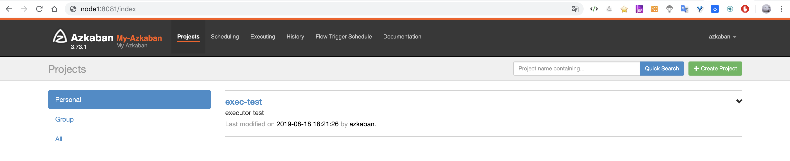

Azkaban - Open-source Workflow Manager
===
[Azkaban 官网](https://azkaban.github.io/)

# 目录
* [安装 - 从源码开始构建](#安装---从源码开始构建)
    + [clone 源码](#clone-源码)
    + [Build](#Build)
    + [切换到需要的版本](#切换到需要的版本)
    + [开始](开始)
        - [设置数据库](#设置数据库)
        - [服务端](#服务端)
            * [azkaban.properties](#azkaban-properties)
            * [azkaban-users.xml](#azkaban-users-xml)
        - [执行端](#执行端)
            * [azkaban.properties](#azkaban-properties-1)
    + [启动](#启动)
    + [使用](#使用)
        - [Project部分](#Project部分)
        - [Job的创建](#Job的创建)
        - [查看Job](#查看Job)
        - [多Job工作流](#多Job工作流)

*****

<br/>

Azkaban是在LinkedIn上创建的批处理工作流作业调度程序，用于运行Hadoop作业。 
Azkaban通过作业依赖性解决订单，并提供易于使用的Web用户界面来维护和跟踪您的工作流程。

Features
* 兼容任何版本的Hadoop
* 易于使用的Web UI
* 简单的Web和http工作流上传
* 项目工作区
* 调度工作流程
* 模块化和可插入
* 身份验证和授权
* 跟踪用户操作
* 有关失败和成功的电子邮件提醒
* SLA警报和自动查杀
* 重试失败的工作

Azkaban由三部分构成：
1. Relational Database(Mysql)
azkaban将大多数状态信息都存于MySQL中,Azkaban Web Server 和 Azkaban Executor Server也需要访问DB。
2. Azkaban Web Server
提供了Web UI，是azkaban的主要管理者，包括 project 的管理，认证，调度，对工作流执行过程的监控等。
3. Azkaban Executor Server
调度工作流和任务，纪录工作流活任务的日志，之所以将AzkabanWebServer和AzkabanExecutorServer分开，主要是因为在某个任务流失败后，可以更方便的将重新执行。而且也更有利于Azkaban系统的升级

- - - -

# 安装 - 从源码开始构建
* Java 8或更高版本
* Azkaban构建使用Gradle，因此需要安装Gradle 
```bash
# 下载
http://services.gradle.org/distributions/gradle-5.4.1-bin.zip
mkdir /usr/local/gradle
unzip -d /usr/local/gradle gradle-5.4.1-bin.zip
ls /usr/local/gradle/gradle-5.4.1

vim ~/.bash_profile
# 输入如下，保存，退出
GRADLE_HOME=/usr/local/gradle/gradle-5.4.1
export PATH=$PATH:$GRADLE_HOME/bin

source ~/.bash_profile
gradle -v
```


## clone 源码
```bash
 git clone https://github.com/azkaban/azkaban.git
```

## Build
进入到 clone 代码的根目录，执行如下命令：
```bash
./gradlew build
```

如果重新构建运行        `./gradlew clean`
如果构建并且安装发布    `./gradlew installDist`
如果运行测试           `./gradlew test`
如果构建时不运行测试    `./gradlew build -x test`

## 切换到需要的版本
```bash
git tag
git checkout tags/3.70.2
git branch

./gradlew clean build -x test

```

上一步完成之后，可以看到如下几个包：
```bash
azkaban/azkaban-web-server/build/distributions/azkaban-web-server-3.70.2.tar.gz
azkaban/azkaban-exec-server/build/distributions/azkaban-exec-server-3.70.2.tar.gz
azkaban/azkaban-db/build/distributions/azkaban-db-3.70.2.tar.gz
azkaban/azkaban-db/build/sql/create-all-sql-3.70.2.sql

```

## 开始
安装方式有两种
* [with the Solo Server](https://azkaban.readthedocs.io/en/latest/getStarted.html#getting-started-with-the-solo-server)
* [with the Multi Executor Server](https://azkaban.readthedocs.io/en/latest/getStarted.html#getting-started-with-the-multi-executor-server)

本次以第二种方式安装

### 设置数据库
保证已经安装了 Mysql，而且官网也建议用户选择 Mysql 作为 Azkaban 数据库。
```sql
# 为 Azkaban 创建数据库
mysql> CREATE DATABASE azkaban;

# 为 Azkaban 创建一个 Mysql 用户，并赋予响应的权限。
mysql> CREATE USER 'username'@'%' IDENTIFIED BY 'password';
mysql> GRANT SELECT,INSERT,UPDATE,DELETE ON azkaban.* to '<username>'@'%' WITH GRANT OPTION;

mysql> use azkaban;

mysql>  source /home/yore/azkaban/azkaban-db/build/sql/create-all-sql-3.70.2.sql;

mysql> show tables;
+--------------------------+
| Tables_in_azkaban        |
+--------------------------+
| QRTZ_BLOB_TRIGGERS       |
| QRTZ_CALENDARS           |
| QRTZ_CRON_TRIGGERS       |
| QRTZ_FIRED_TRIGGERS      |
| QRTZ_JOB_DETAILS         |
| QRTZ_LOCKS               |
| QRTZ_PAUSED_TRIGGER_GRPS |
| QRTZ_SCHEDULER_STATE     |
| QRTZ_SIMPLE_TRIGGERS     |
| QRTZ_SIMPROP_TRIGGERS    |
| QRTZ_TRIGGERS            |
| active_executing_flows   |
| active_sla               |
| execution_dependencies   |
| execution_flows          |
| execution_jobs           |
| execution_logs           |
| executor_events          |
| executors                |
| project_events           |
| project_files            |
| project_flow_files       |
| project_flows            |
| project_permissions      |
| project_properties       |
| project_versions         |
| projects                 |
| properties               |
| triggers                 |
+--------------------------+
29 rows in set (0.00 sec)

```

```bash
vim /etc/my.cnf
[mysqld]
...
max_allowed_packet=1024M

sudo /sbin/service mysqld restart

```

### 服务端
解压前面得到的 `azkaban-web-server-3.70.2.tar.gz`
```bash
tar -zxf azkaban-web-server-3.70.2.tar.gz
```

修改器配置文件
#### azkaban.properties
进入到 `azkaban-web-server-3.70.2/conf/` 文件夹下，修改：
```bash
# Azkaban Personalization Settings
azkaban.name=Test
azkaban.label=My Local Azkaban
azkaban.color=#FF3601
azkaban.default.servlet.path=/index
web.resource.dir=web/
default.timezone.id=Asia/Shanghai
# Azkaban UserManager class
user.manager.class=azkaban.user.XmlUserManager
user.manager.xml.file=conf/azkaban-users.xml
# Loader for projects
executor.global.properties=conf/global.properties
azkaban.project.dir=projects
# Velocity dev mode
velocity.dev.mode=false
# Azkaban Jetty server properties.
jetty.use.ssl=false
jetty.maxThreads=25
jetty.port=8081
# Azkaban Executor settings
# mail settings
mail.sender=791072311@qq.com
mail.host=smtp.qq.com
# User facing web server configurations used to construct the user facing server URLs. They are useful when there is a reverse proxy between Azkaban web servers and users.
# enduser -> myazkabanhost:443 -> proxy -> localhost:8081
# when this parameters set then these parameters are used to generate email links.
# if these parameters are not set then jetty.hostname, and jetty.port(if ssl configured jetty.ssl.port) are used.
azkaban.webserver.external_hostname=cdh6
# azkaban.webserver.external_ssl_port=443
azkaban.webserver.external_port=8081
job.failure.email=
job.success.email=
lockdown.create.projects=false
cache.directory=cache
# JMX stats
jetty.connector.stats=true
executor.connector.stats=true
# Azkaban mysql settings by default. Users should configure their own username and password.
database.type=mysql
mysql.port=3306
mysql.host=cdh1
mysql.database=azkaban
mysql.user=root
mysql.password=123456
mysql.numconnections=100
#Multiple Executor
azkaban.use.multiple.executors=true
azkaban.executorselector.filters=StaticRemainingFlowSize,MinimumFreeMemory,CpuStatus
azkaban.executorselector.comparator.NumberOfAssignedFlowComparator=1
azkaban.executorselector.comparator.Memory=1
azkaban.executorselector.comparator.LastDispatched=1
azkaban.executorselector.comparator.CpuUsage=1

```

#### azkaban-users.xml
修改自己的用户信息
```xml
<azkaban-users>
  <user groups="azkaban" password="azkaban" roles="admin" username="azkaban"/>
  <user password="metrics" roles="metrics" username="metrics"/>

  <role name="admin" permissions="ADMIN"/>
  <role name="metrics" permissions="METRICS"/>
</azkaban-users>
```

### 执行端
解压前面得到的 `azkaban-exec-server-3.70.2.tar.gz`
```bash
tar -zxf azkaban-exec-server-3.70.2.tar.gz
```

#### azkaban.properties
进入到 `azkaban-exec-server-3.70.2/conf/` 文件夹下，修改：
```bash
# Azkaban Personalization Settings
azkaban.name=Test
azkaban.label=My Local Azkaban
azkaban.color=#FF3601
azkaban.default.servlet.path=/index
web.resource.dir=web/
default.timezone.id=Asia/Shanghai
# Azkaban UserManager class
user.manager.class=azkaban.user.XmlUserManager
user.manager.xml.file=conf/azkaban-users.xml
# Loader for projects
executor.global.properties=conf/global.properties
azkaban.project.dir=projects
# Velocity dev mode
velocity.dev.mode=false
# Azkaban Jetty server properties.
jetty.use.ssl=false
jetty.maxThreads=25
jetty.port=8081
# Where the Azkaban web server is located
azkaban.webserver.url=http://cdh6:8081
# mail settings
mail.sender=
mail.host=
# User facing web server configurations used to construct the user facing server URLs. They are useful when there is a reverse proxy between Azkaban web servers and users.
# enduser -> myazkabanhost:443 -> proxy -> localhost:8081
# when this parameters set then these parameters are used to generate email links.
# if these parameters are not set then jetty.hostname, and jetty.port(if ssl configured jetty.ssl.port) are used.
azkaban.webserver.external_hostname=cdh6
# azkaban.webserver.external_ssl_port=443
azkaban.webserver.external_port=8081
job.failure.email=
job.success.email=
lockdown.create.projects=false
cache.directory=cache
# JMX stats
jetty.connector.stats=true
executor.connector.stats=true
# Azkaban plugin settings
azkaban.jobtype.plugin.dir=plugins/jobtypes
# Azkaban mysql settings by default. Users should configure their own username and password.
database.type=mysql
mysql.port=3306
mysql.host=cdh1
mysql.database=azkaban
mysql.user=root
mysql.password=123456
mysql.numconnections=100
# Azkaban Executor settings
executor.maxThreads=50
executor.flow.threads=30


```


## 启动
```bash
cd azkaban-exec-server-3.70.2
bin/start-exec.sh 1>/tmp/azstd-exec.out 2>/tmp/azerr-exec.out &
[root@cdh6 azkaban-exec-server-3.70.2]# curl -G "localhost:$(<./executor.port)/executor?action=activate" && echo
{"status":"success"}

cd azkaban-web-server-3.70.2
bin/start-web.sh 1>/tmp/azstd-web.out 2>/tmp/azerr-web.out &
```

**浏览器访问https://cdh6:8081/**
username=azkaban  password=azkaban
username=metrics  password=metrics


## 使用
登陆后界面如下

首页可看到有六个菜单：
* Projects                  可以创建工程，所有的flow将在工程中运行
* Scheduling                显示定时任务
* Executing                 显示当前运行的任务
* History                   显示历史运行任务
* Flow Trigger Schedule     流触发时间表
* Documentation             文档

### Project部分
创建工程：
一个工程可以包含一个或多个flows，一个flow包含多个job。
Job是我们想在Azkaban中运行的一个进程，**可以是简单的Linux命令，可以是Java程序，也可以是复杂的shell脚本**，
如果我们安装了插件，也可以运行插件。
一个Job可以依赖于另一个Job，这种多个Job和他们的依赖组成的图表叫做Flow。

* 点击绿色的按钮`+ Create Project`，输入Project的`名字`和`说明`，点击 蓝色的 `Create Project`

* 会进入到创建的Project详细页面


    + Flows         工作流程，由多个Job组成
    + Permissions   权限管理
    + Project Logs  工作日志
    
#### Job的创建
创建一个以`.job`结尾的文本文件，例如创建一个Job，用来打印 Hello World，名字叫做 hello-world.job。

输入如下内容，`type=command`表示使用的是Unix原生命令执行，
```bash
#hello-world.job
type=command
command=echo 'Hello World!'
```

将上面的文件打包为`zip`，然后通过`Azkaban Web Client`页面上传压缩包。
<kbd>Upload</kbd> -> <kbd>选择文件</kbd> -> <kbd>Upload</kbd>

`Execute Flow`


`Schedule`: 执行的方式，默认为每分钟执行一次
`Execute`: 开始执行

#### 查看Job
<kbd>Project</kbd> -> <kbd>test</kbd> -> <kbd>Flows / hello-world</kbd>
 -> <kbd>选择文件</kbd> -> <kbd>Executions</kbd>  -> <kbd>Execution Id 例如33</kbd>
 -> <kbd>Job List</kbd> -> <kbd>Details</kbd>
 
可以在日志中查看到打印的内容
```log
28-05-2019 10:21:19 CST hello-world INFO - Starting job hello-world at 1559010079954
28-05-2019 10:21:19 CST hello-world INFO - job JVM args: '-Dazkaban.flowid=hello-world' '-Dazkaban.execid=33' '-Dazkaban.jobid=hello-world'
28-05-2019 10:21:19 CST hello-world INFO - user.to.proxy property was not set, defaulting to submit user azkaban
28-05-2019 10:21:19 CST hello-world INFO - Building command job executor. 
28-05-2019 10:21:19 CST hello-world INFO - Memory granted for job hello-world
28-05-2019 10:21:19 CST hello-world INFO - 1 commands to execute.
28-05-2019 10:21:19 CST hello-world INFO - cwd=/root/.su/azkaban-3.70.2/azkaban-exec-server-3.70.2/executions/33
28-05-2019 10:21:19 CST hello-world INFO - effective user is: azkaban
28-05-2019 10:21:19 CST hello-world INFO - Command: echo 'Hello World!'
28-05-2019 10:21:19 CST hello-world INFO - Environment variables: {JOB_OUTPUT_PROP_FILE=/root/.su/azkaban-3.70.2/azkaban-exec-server-3.70.2/executions/33/hello-world_output_4545773749185721534_tmp, JOB_PROP_FILE=/root/.su/azkaban-3.70.2/azkaban-exec-server-3.70.2/executions/33/hello-world_props_7818103133171060093_tmp, KRB5CCNAME=/tmp/krb5cc__test__hello-world__hello-world__33__azkaban, JOB_NAME=hello-world}
28-05-2019 10:21:19 CST hello-world INFO - Working directory: /root/.su/azkaban-3.70.2/azkaban-exec-server-3.70.2/executions/33
28-05-2019 10:21:19 CST hello-world INFO - Hello World!
28-05-2019 10:21:19 CST hello-world INFO - Process completed successfully in 0 seconds.
28-05-2019 10:21:19 CST hello-world INFO - output properties file=/root/.su/azkaban-3.70.2/azkaban-exec-server-3.70.2/executions/33/hello-world_output_4545773749185721534_tmp
28-05-2019 10:21:19 CST hello-world INFO - Finishing job hello-world at 1559010079981 with status SUCCEEDED
```
### 多Job工作流
多个Job组成一个Flow，在定义 Job时只需要指定dependencies参数
例如
a_canal     Mysql数据增量导入Kafka
b_init      Mysql数据批量导入Kudu
c_flink     Kafka数据实时同步到Kudu
d_flink     Kafka数据实时指标计算

0 15 0 * * ?

#### a_canal.job
```bash
type=command
command=echo 'Mysql数据增量导入Kafka # sh bin/startup.sh'
```

#### b_init.job
```bash
type=command
command=echo 'Mysql数据批量导入Kudu # flink run -c com.yore x_a.jar '
dependencies=a_canal
```

#### c_flink .job
```bash
type=command
command=echo 'Kafka数据实时同步到Kudu # flink run -c com.yore x_c.jar '
dependencies=b_init
```

#### d_flink.job
```bash
type=command
command=echo 'Kafka数据实时指标计算 # flink run -c com.yore x_d.jar'
dependencies=b_init
```


