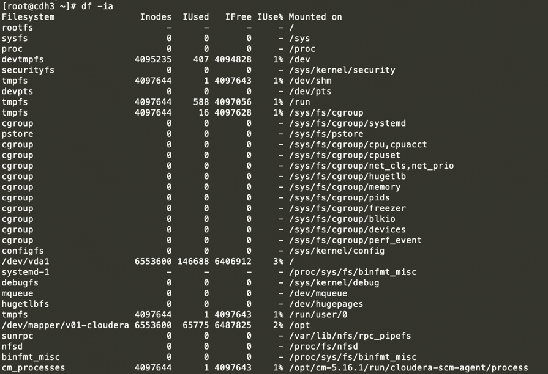
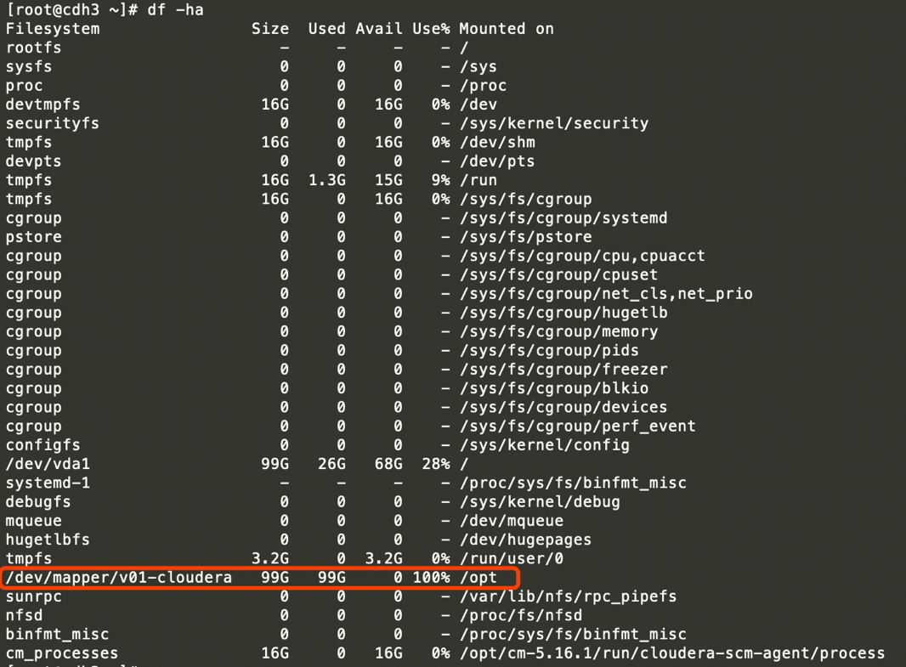
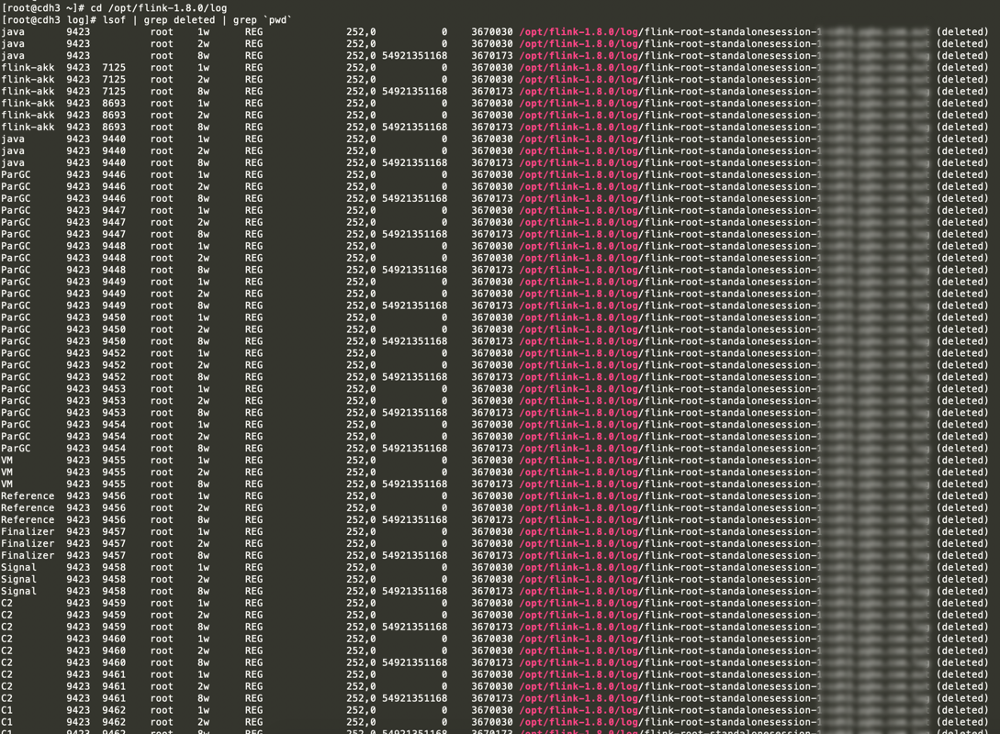
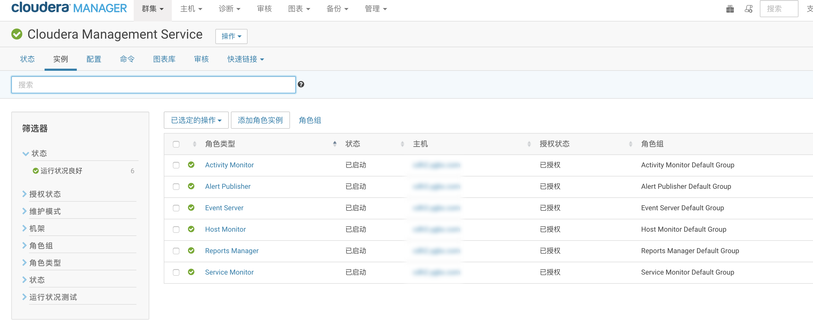

CDH集群消失的节点
----

CDH集群也是大数据常用的大数据平台，可以通过页面方式安装大数据组建、查看配置和修改配置、管理节点、监控实例的运行等。

当我们登陆 Cloudera Manager 页面时，突然发现集群有很多服务都报红了，心中是否也许有点不安。
然后查看所有主机，发现有一个节点已经没有任何状态显示，好吧，赶快查找原因吧，
首先想到的肯定是日志了，但是查看这个节点的日志时，服务已经打不开了，这个节点难道这么任性吗？任何信息都不留就这样消失了吗？
接着看下咱们的`Cloudera Management Service`是否安好，真是的，更糟糕的是这个服务的实例的某些服务竟然还安装在这个节点上。

既然 `Cloudera Management Service` 无法提供服务，于是尝试重启这个服务，再重启的时候发现其他节点对一个的角色都可以启动成功，
但唯独有问题的这个节点现在是服务重启也失败，提示：`No space left on device`，于是登陆这个节点服务器，查看内存：`free -m` 内存完全充足，
那应该是磁盘的问题，首先查看磁盘`i节点`使用信息`df -ia`:


查看磁盘使用：`df -ha`


看这个图也便找到了问题的原因，**磁盘空间不够了**，那就通过  `du -hcd 1 /opt`进一步查看被占用最多的文件，依次排查，
最后发现是测试环境的Flink程序的日志占用了大量空间，因为测试环境会提交很多实时测试代码，日志级别也没有严格限制，
长时间运行导致磁盘被Flink的日志填满。然后用`rm -rf $FLINK_HOME/log/*` 清除全部的Flink日志。

这个问题到这里可能多数人会认为已经解决了，既然如此，那么我们赶快重启我们的 `Cloudera Management Service` 服务，
发现依然无法重启这个节点的服务，**难道是这个节点的磁盘损坏了吗**？那好吧，我们尝试将这个节点的 `Cloudera Management Service` 迁移到其他节点上试下。

为了排除是服务本身的问题，先重启这个节点上分配的有问题的服务，在选择元数据验证数据库时，出现了更匪夷的问题：`Unexpected error. Unable to verify database connection.`
实际上这个节点用这个账号和密码完全可以访问这个数据库的，以前也能，现在也可以，但唯独这里验证就提示不能连接元数据库了。

那么我们尝试将有问题的服务迁移到其他节点，这里点击首页左侧的`Cloudera Management Service`服务 -> 实例 -> 有问题的服务打上√ ->  已选定的操作 ->  停止 -> 
有问题的服务打上√ ->  已选定的操作 ->  删除 -> 添加角色实例 ->  有问题的服务重新选择主机 -> 继续  -> 完成。重启服务，发现没有问题了。

至此，这个消失的节点的问题还是没有彻底解决。其实这里我们忽视了一个问题，就是Linux文件系统的的存储原理，
因为平时多数操作小文件时给人一种错觉像是删除了就删除了似乎空间马上就释放了。
**实际上系统保存一个文件会分两部分，一部分是数据本身，另一部分是指针**，更详细的可以查看相关书籍和文档资料。
这里我们可以先明确清楚，当一个文件被删除时，同时又有进程使用者这个文件，例如**日志文件**，系统并不会马上回收，
因为**虽然此时外界查不到这个文件了，但占用的程序在加载文件时已经获取了该文件占用的`data block`，因此在`bmap`中这些`data block`还不能马上被标记为未使用状态。**

了解了这个是非常重要的，现在我们就想办法让这部分空间释放出来。
进入到前面我们删除日志的目录下，执行
```bash
lsof | grep deleted | grep `pwd`
```

找到对应 pid 的服务，重启这些服务，例如上图，发现只有Flink服务使用，于是输入如下命令重启
```bash
# 关闭Flink集群服务
$FLINK_HOME/bin/stop-cluster.sh

# 可以df先查看磁盘使用情况。如果没问题最后别忘了最后将Flink 服务起来
$FLINK_HOME/bin/start-cluster.sh
```

当磁盘被占满之后，这个问题还挺严重的，因为有些服务还看似正常后台运行，但已经无法再往磁盘中写入数据。
比如，此时如果先排除 cloudera 服务的问题，可能会先关闭这个节点的`agent` 服务：
```bash
/opt/cm-5.16.1/etc/init.d/cloudera-scm-agent stop
```
等再次启动这个服务时 `/opt/cm-5.16.1/etc/init.d/cloudera-scm-agent start` 会发现这个服务已经无法启动了，原因很简单，
启动服务的时候会在`/opt/cm-5.16.1/run/cloudera-scm-agent`目录下的创建一个文件`cloudera-scm-agent.pid`，会将这个服务的pid写入这个文件，
i节点没问题，但是写入数据时，空间不够，pid无法写入这个文件，虽然进程文件在，但是进程就是启动不了。


最后将将需要的服务迁移到这个节点，重启服务即可。



<br/><br/><br/>
******

也可以访问我的博客 [CDH集群'消失'的节点](https://blog.csdn.net/github_39577257/article/details/91129236)
