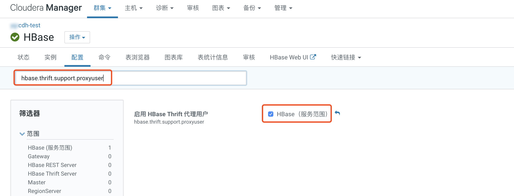
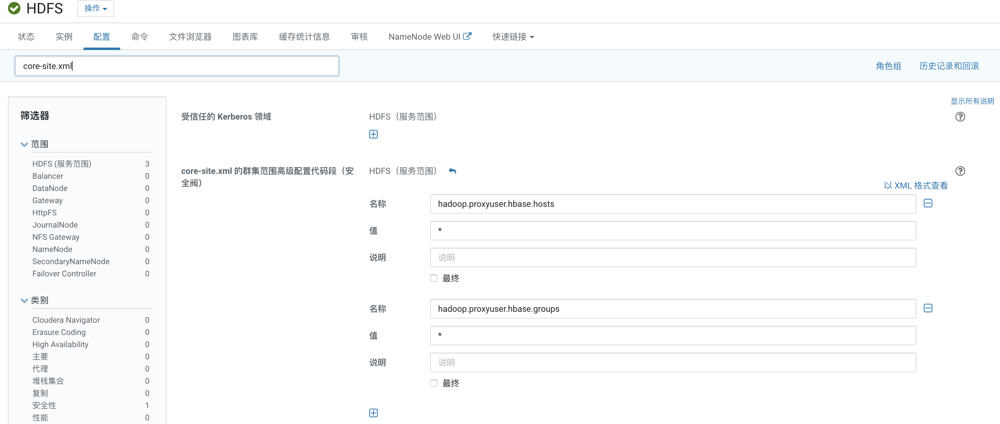
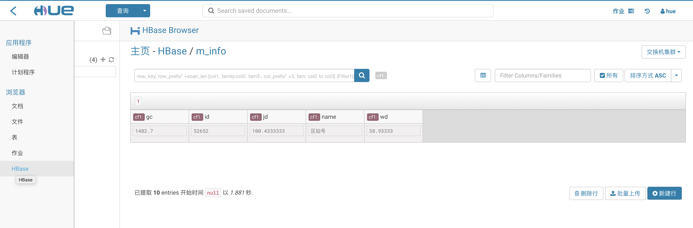

CDH中HUE与HBase的集成
==========
集群搭建完毕后HUE页面浏览HBase的数据会请求不到，这是需要我们进行如下配置

## 1. HBase 配置
在Cloudera Manager页面，点击`HBase`服务，进入到`配置`。依次将如下两项打上对勾
```
hbase.thrift.support.proxyuser

hbase.regionserver.thrift.http
```




## 2 HDFS 配置
这一步主要是为hue和hbase两个用户的代理授权，在HDFS配置中搜如下四个配置项，如果已配置，则跳过下一步，如果没有配置请按照下面添加配置
```
<!--core-site.xml-->
<property>
<name>hadoop.proxyuser.hue.hosts</name>
<value>*</value>
</property>
<property>
<name>hadoop.proxyuser.hue.groups</name>
<value>*</value>
</property>
<property>
<name>hadoop.proxyuser.hbase.hosts</name>
<value>*</value>
</property>
<property>
<name>hadoop.proxyuser.hbase.groups</name>
<value>*</value>
</property>
```

例如，上一步中hue的配置是没有问题的，我们只需要添加hbase的配置项。搜索`core-site.xml`，添加如下配置



这一步如果没有响应的代理权限时，hue页面浏览hbase时会报`9090端口无法连接`的错误提示

## 3 HUE配置
进入hue配置页面，搜`hue_safety_valve.ini`，填入如下值
```
[hbase]
hbase_conf_dir={{HBASE_CONF_DIR}}
thrift_transport=buffered
```

## 4 重启服务

## 5 浏览HBase数据
Hue -> Web Ui -> Hue Web Ui   
输入用户名和密码   
点击左上角的   

点击HBase即可浏览到HBase的数据



