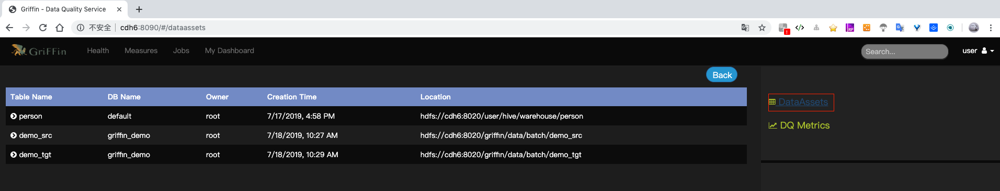
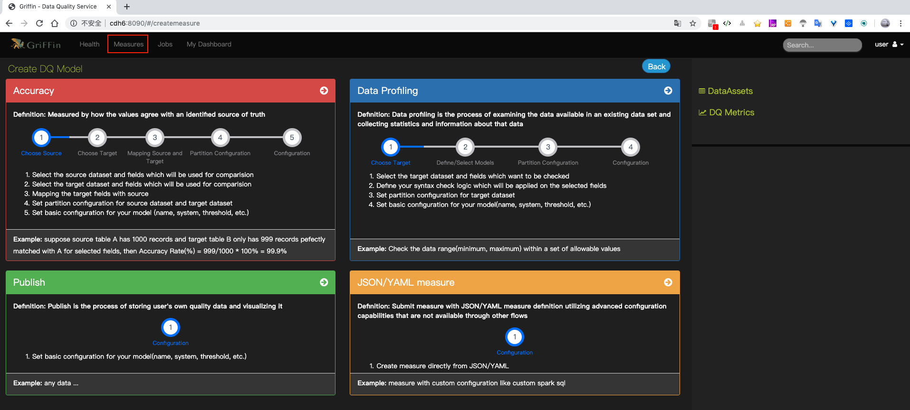
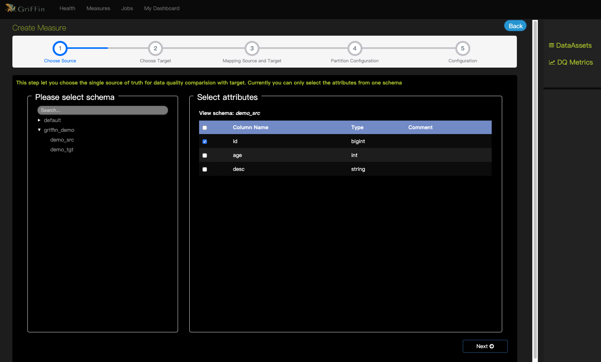
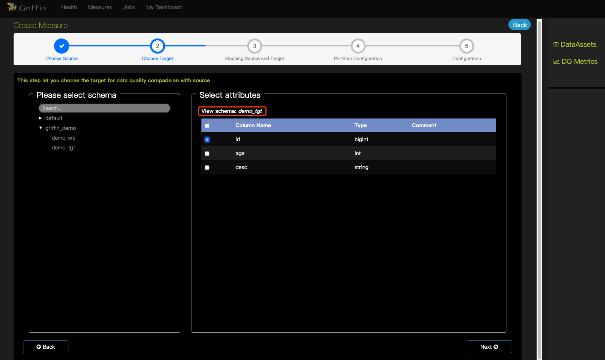
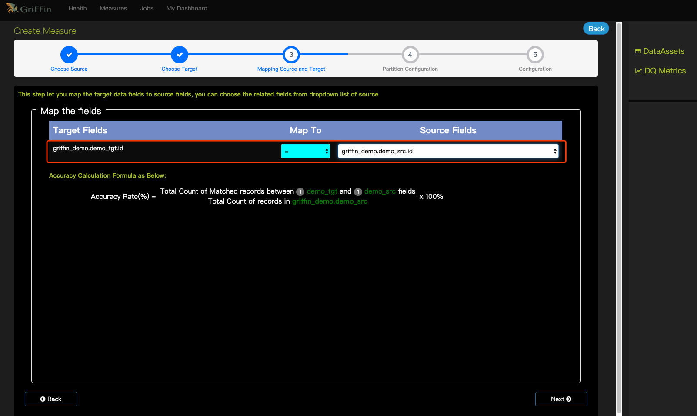
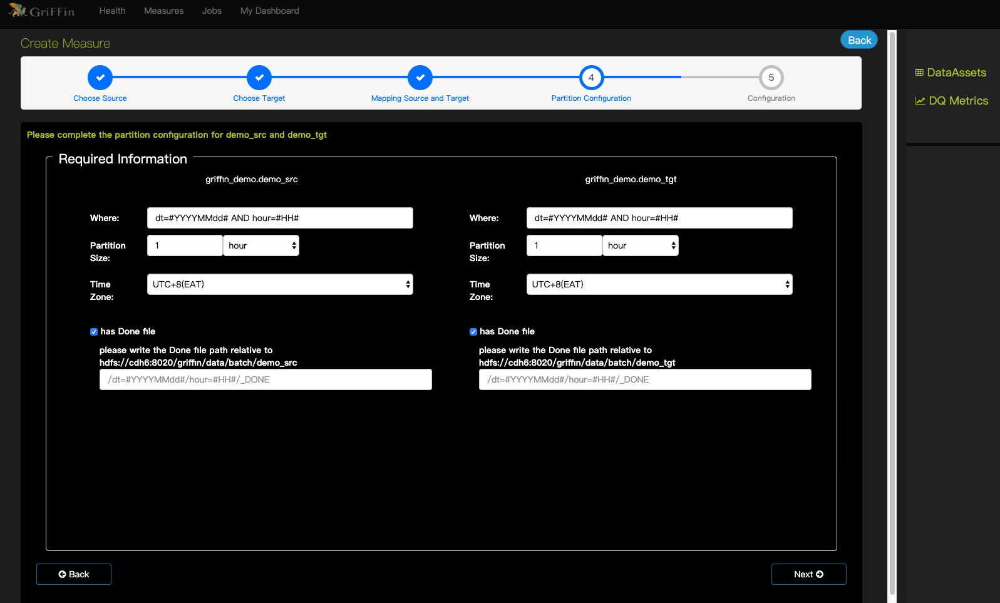
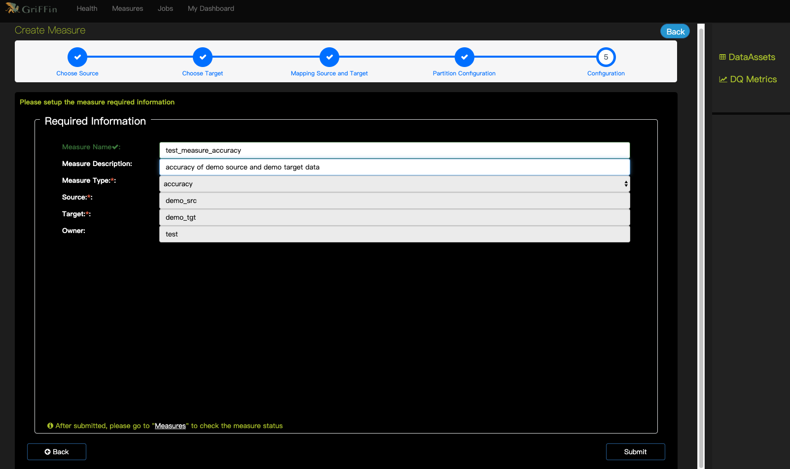
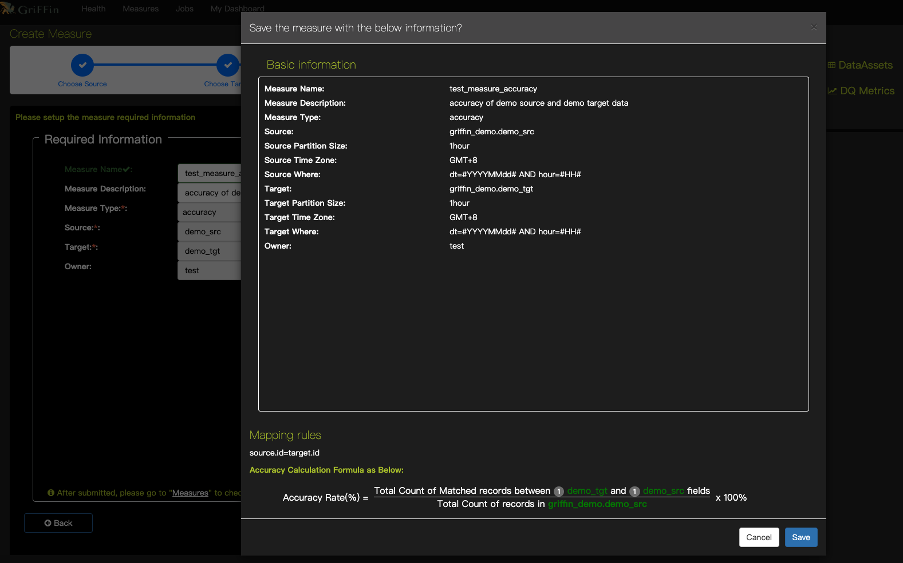
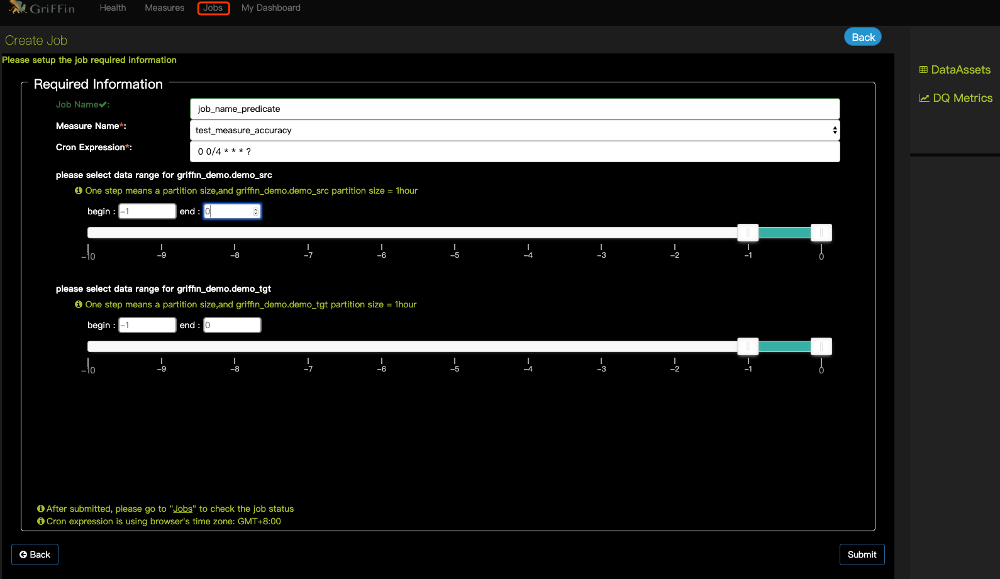

Apache Griffin 5.0 编译安装和使用(包含依赖无法下载的问题解决)
----------
[官网](http://griffin.apache.org/) &nbsp;&nbsp; | &nbsp;&nbsp; 
[Doc](http://griffin.apache.org/docs/quickstart.html) &nbsp;&nbsp; | &nbsp;&nbsp; 
[Apache Griffin Deployment Guide](https://github.com/apache/griffin/blob/master/griffin-doc/deploy/deploy-guide.md) &nbsp;&nbsp; | &nbsp;&nbsp; 
[Apache Griffin Deployment Guide](https://github.com/apache/griffin/blob/master/griffin-doc/deploy/deploy-guide.md)

Big Data Quality Solution For Batch and Streaming

<br/>

# 目录
* 1 简介
* 2 编译
    * 2.1 准备
    * 2.2 获取源码包
        - 2.2.1  下载对应 release 版
        - *2.2.2 clone源码
    * 2.3 配置
        - 2.3.1 MySQL
        - 2.3.2 组件的环境配置
        - 2.3.3 Hive配置
        - 2.3.4 配置 Griffin 的`application.properties`
        - 2.3.5 配置 Griffin 的`quartz.properties`
        - 2.3.6 配置 Griffin 的`sparkProperties.json`
        - 2.3.7 配置 Griffin 的`env_batch.json`
        - 2.3.8 配置 Griffin 的`env_streaming.json`
        - 2.3.9 Elasticsearch设置
        - 2.3.10 驱动包的依赖修改
    * 2.4 编译
        - 2.4.1 切换到需要的版本
        - 2.4.2 开始编译
        - 2.4.3 可能出现的问题
        - 2.4.4 对上面出现的问题的解决
        - 2.4.5 再次编译
* 3 安装
    - 3.1 创建目录
    - 3.2 配置Griffin环境
    - 3.3 将编译好的文件放置到目录下
    - 3.4 启动service.jar，运行Griffin管理服务
    - 3.5 访问 Service Platform WEB 页面
* 4 数据准备
    - 4.1 准备demo表
    - 4.2 获取演示数据
    - 4.3 创建`gen-hive-data.sh`
    - 4.4 执行脚本加载数据
    - 4.5 查看数据
* 5 [使用]()
    + 5.1 数据资产
    + 5.2 创建 measure
        * 5.2.1 Accuracy 
            - 1 Choose source （选择来源）
            - 2 Choose target （选择目标）
            - 3 Mapping source and target （映射source和target）
            - 4 Partition Configuration （分区设置）
            - 5 Configuration （配置）
            - 6 Measure information （度量信息）
    + 5.3 创建 Job
    + 5.4 Metrics 仪表板

*********

# 1 简介
> Apache Griffin is an open source Data Quality solution for Big Data, which supports both batch and streaming mode. It offers an unified process to measure your data quality from different perspectives, helping you build trusted data assets, therefore boost your confidence for your business.

Apache Griffin是大数据的开源数据质量解决方案，支持批处理和流模式。它提供了一个统一的流程，可以从不同角度衡量您的数据质量，帮助您构建可信赖的数据资产，从而提高您对业务的信心。

> Apache Griffin offers a set of well-defined data quality domain model, which covers most of data quality problems in general. It also define a set of data quality DSL to help users define their quality criteria. By extending the DSL, users are even able to implement their own specific features/functions in Apache Griffin.

Apache Griffin提供了一套定义明确的数据质量域模型，它涵盖了大多数数据质量问题。它还定义了一组数据质量DSL，以帮助用户定义他们的质量标准。通过扩展DSL，用户甚至可以在Apache Griffin中实现自己的特定功能/功能。

Apache Griffin于2016年12月7日被接纳为Apache孵化器项目。Apache Griffin于2018年11月21日毕业，成为Apache顶级项目。

架构图如下


# 2 编译
安装 [Apache  griffin](http://griffin.apache.org/) 最新版时，GitHub的 release 是一个源码包，需要下载下来后编译进行安装和配置，问题是编译的时候有些依赖在仓库中根本下载不到，导致编译失败，可以按照如下方法进行编译。

## 2.1 准备
安装之前请确认下面的组件已经安装。如果有没有安装的可以看官网或博客，也可以点击链接查看我的提供的一些安装文档。

* Git （如果直接下载的对应的releases版，可以不需要）
* JDK 1.8 (或更高)
* Maven
* [Mysql 数据库](https://blog.csdn.net/github_39577257/article/details/77433996) （可以是 PostgreSQL ）
* [npm](https://nodejs.org/en/download/)
* [Scala](https://www.scala-lang.org/download/all.html)

* [Hadoop (2.6.0或更高版本)](https://blog.csdn.net/github_39577257/article/details/89020980)
* [Hive (版本2.x)](https://blog.csdn.net/github_39577257/article/details/89020980)
* [Spark (版本2.2.1)](https://github.com/yoreyuan/My_spark/blob/spark-demo-2.x/doc/Depoying.md#3-spark-standalone-mode)
* [Livy](https://github.com/yoreyuan/My_hadoop/blob/master/doc/apache-livy.md)
* [ElasticSearch(5.0或更高版本)](https://github.com/yoreyuan/My_hadoop/blob/master/doc/elasticsearch-install.md)
* Zookeeper

## 2.2 获取源码包
以下方式选择其一即可
###  2.2.1  下载对应 release 版
* 下载： ` wget https://github.com/apache/griffin/archive/griffin-0.5.0.tar.gz`
* 解压： ` tar -zxf griffin-0.5.0.tar.gz `
* 进入项目源码目录： ` cd  griffin-griffin-0.5.0/ `

### * 2.2.2 clone源码
* 获取源码： ` git clone https://github.com/apache/griffin.git `
* 进入项目源码目录： ` cd griffin/ `
* 查看tag： ` git tag `
* 切换到对应的版本(这里切换到最新版)：` git checkout tags/griffin-0.5.0 `
* 查看当前所处的分支： ` git branch `


# 2.3 配置
## 2.3.1 MySQL
因为Griffin使用了 Quartz 进行任务的调度，因此需要在MySQL中创建Quartz 调度器用到的库。并进行初始化
```bash
# 在MySQL服务器中执行命令，创建一个 quartz 库
mysql -u <username> -e "create database quartz" -p
```

在下载的源码中[`service/src/main/resources/Init_quartz_mysql_innodb.sql`](https://github.com/apache/griffin/blob/master/service/src/main/resources/Init_quartz_mysql_innodb.sql)找到sql脚本，
上传到Mysql Service， 使用`Init_quartz_mysql_innodb.sql`在MySQL中初始化 Quartz。
```bash
mysql -u <username> -p quartz < Init_quartz_mysql_innodb.sql
```

## 2.3.2 组件的环境配置
`export`下面的变量。或者创建一个`griffin_env.sh`文件，写入下面的内容，并将脚本配置到`.bashrc`
```bash
#!/bin/bash
export JAVA_HOME=/usr/local/zulu8

export HADOOP_HOME=/opt/hadoop-3.1.2
export HADOOP_COMMON_HOME=/opt/hadoop-3.1.2
export HADOOP_COMMON_LIB_NATIVE_DIR=/opt/hadoop-3.1.2/lib/native
export HADOOP_HDFS_HOME=/opt/hadoop-3.1.2
export HADOOP_INSTALL=/opt/hadoop-3.1.2
export HADOOP_MAPRED_HOME=/opt/hadoop-3.1.2
export HADOOP_USER_CLASSPATH_FIRST=true
export HADOOP_CONF_DIR=$HADOOP_HOME/etc/hadoop
export SPARK_HOME=/opt/spark-2.4.3-bin-hadoop2.7
export LIVY_HOME=/opt/apache-livy-0.6.0-incubating-bin
export HIVE_HOME=/opt/apache-hive-3.1.1-bin
export YARN_HOME=/opt/hadoop-3.1.2
export SCALA_HOME=/usr/share/scala

export PATH=$PATH:$HIVE_HOME/bin:$HADOOP_HOME/bin:$SPARK_HOME/bin:$LIVY_HOME/bin:$SCALA_HOME/bin

```

## 2.3.3 Hive配置
在Spark中我们配置过:
```
spark.yarn.dist.files		hdfs:///home/spark_conf/hive-site.xml
```

这里也需要将 hive 的配置文件 `hive-site.xml` 上传到hdfs的这个地方
```bash
hdfs dfs -put $HIVE_HOME/conf/hive-site.xml hdfs:///home/spark_conf/
```

## 2.3.4 配置 Griffin 的 [application.properties](https://github.com/apache/griffin/blob/griffin-0.5.0/service/src/main/resources/application.properties)
进入到下载的源码目录，编辑 ` service/src/main/resources/application.properties ` 配置文件
```yaml
# Apache Griffin server port (default 8080)
server.port = 8090
spring.application.name=griffin_service

# db configuration
spring.datasource.url=jdbc:mysql://cdh1:3306/quartz?autoReconnect=true&useSSL=false
spring.datasource.username=king
spring.datasource.password=123456
spring.jpa.generate-ddl=true
spring.datasource.driver-class-name=com.mysql.jdbc.Driver
spring.jpa.show-sql=true

# Hive metastore
# 这里配置的值为`hive-site.xml`中的 `hive.metastore.uris`配置项的值
hive.metastore.uris=thrift://cdh6:9083
hive.metastore.dbname=hive_metastore
hive.hmshandler.retry.attempts=15
hive.hmshandler.retry.interval=2000ms
# Hive cache time
cache.evict.hive.fixedRate.in.milliseconds=900000

# Kafka schema registry
kafka.schema.registry.url=http://cdh3:9092
# Update job instance state at regular intervals
jobInstance.fixedDelay.in.milliseconds=60000
# Expired time of job instance which is 7 days that is 604800000 milliseconds.Time unit only supports milliseconds
jobInstance.expired.milliseconds=604800000
# schedule predicate job every 5 minutes and repeat 12 times at most
#interval time unit s:second m:minute h:hour d:day,only support these four units
predicate.job.interval=5m
predicate.job.repeat.count=12
# external properties directory location
external.config.location=
# external BATCH or STREAMING env
external.env.location=
# login strategy ("default" or "ldap")
login.strategy=default
# ldap
ldap.url=ldap://hostname:port
ldap.email=@example.com
ldap.searchBase=DC=org,DC=example
ldap.searchPattern=(sAMAccountName={0})
# hdfs default name
fs.defaultFS=hdfs://cdh6:8020

# elasticsearch
# elasticsearch.host = <IP>
# elasticsearch.port = <elasticsearch rest port>
# elasticsearch.user = user
# elasticsearch.password = password
elasticsearch.host=cdh2
elasticsearch.port=9200
elasticsearch.scheme=http

# livy
livy.uri=http://cdh6:8998/batches
# yarn url
yarn.uri=http://cdh6:8088
# griffin event listener
internal.event.listeners=GriffinJobEventHook

# 压缩
server.compression.enabled=true
server.compression.mime-types=application/json,application/xml,text/html,text/xml,text/plain,application/javascript,text/css

```

## 2.3.5 配置 Griffin 的 [quartz.properties](https://github.com/apache/griffin/blob/griffin-0.5.0/service/src/main/resources/quartz.properties)
进入到下载的源码目录，编辑 ` service/src/main/resources/quartz.properties ` 配置文件。默认亦可。
```yaml
org.quartz.scheduler.instanceName=spring-boot-quartz
org.quartz.scheduler.instanceId=AUTO
org.quartz.threadPool.threadCount=5
org.quartz.jobStore.class=org.quartz.impl.jdbcjobstore.JobStoreTX
# If you use postgresql, set this property value to org.quartz.impl.jdbcjobstore.PostgreSQLDelegate
# If you use mysql, set this property value to org.quartz.impl.jdbcjobstore.StdJDBCDelegate
# If you use h2, it's ok to set this property value to StdJDBCDelegate, PostgreSQLDelegate or others
org.quartz.jobStore.driverDelegateClass=org.quartz.impl.jdbcjobstore.PostgreSQLDelegate
org.quartz.jobStore.useProperties=true
org.quartz.jobStore.misfireThreshold=60000
org.quartz.jobStore.tablePrefix=QRTZ_
org.quartz.jobStore.isClustered=true
org.quartz.jobStore.clusterCheckinInterval=20000
```

## 2.3.6 配置 Griffin 的 [sparkProperties.json](https://github.com/apache/griffin/blob/griffin-0.5.0/service/src/main/resources/sparkProperties.json)
进入到下载的源码目录，编辑 ` service/src/main/resources/sparkProperties.json ` 配置文件。先配置上`griffin-measure.jar`在hdfs上的位置，
`spark.yarn.dist.files`即为[1.3.3](#1.3.3)那里hive-site.xml上传的位置。
```json
{
  "file": "hdfs://cdh6:8020/griffin/griffin-measure.jar",
  "className": "org.apache.griffin.measure.Application",
  "name": "griffin",
  "queue": "default",
  "numExecutors": 2,
  "executorCores": 1,
  "driverMemory": "1g",
  "executorMemory": "1g",
  "conf": {
    "spark.yarn.dist.files": "hdfs://cdh6:8020/home/spark_conf/hive-site.xml"
  },
  "files": [
  ]
}
```


## 2.3.7 配置 Griffin 的 [env_batch.json](https://github.com/apache/griffin/blob/griffin-0.5.0/service/src/main/resources/env/env_batch.json)
进入到下载的源码目录，编辑 ` service/src/main/resources/env/env_batch.json ` 配置文件。根据自己的需求调整sink信息。配置HDFS的输出路径和Elasticsearch URL。
```json
{
  "spark": {
    "log.level": "WARN"
  },
  "sinks": [
    {
      "type": "CONSOLE",
      "config": {
        "max.log.lines": 10
      }
    },
    {
      "type": "HDFS",
      "config": {
        "path": "hdfs://cdh6:8020/griffin/persist",
        "max.persist.lines": 10000,
        "max.lines.per.file": 10000
      }
    },
    {
      "type": "ELASTICSEARCH",
      "config": {
        "method": "post",
        "api": "http://cdh2:9200/griffin/accuracy",
        "connection.timeout": "1m",
        "retry": 10
      }
    }
  ],
  "griffin.checkpoint": []
}

```

## 2.3.8 配置 Griffin 的 [env_streaming.json](https://github.com/apache/griffin/blob/griffin-0.5.0/service/src/main/resources/env/env_streaming.json)
进入到下载的源码目录，编辑 ` service/src/main/resources/env/env_streaming.json ` 配置文件。同env_batch.json的更改类似。
```json
{
  "spark": {
    "log.level": "WARN",
    "checkpoint.dir": "hdfs://cdh6:8020/griffin/checkpoint/${JOB_NAME}",
    "init.clear": true,
    "batch.interval": "1m",
    "process.interval": "5m",
    "config": {
      "spark.default.parallelism": 4,
      "spark.task.maxFailures": 5,
      "spark.streaming.kafkaMaxRatePerPartition": 1000,
      "spark.streaming.concurrentJobs": 4,
      "spark.yarn.maxAppAttempts": 5,
      "spark.yarn.am.attemptFailuresValidityInterval": "1h",
      "spark.yarn.max.executor.failures": 120,
      "spark.yarn.executor.failuresValidityInterval": "1h",
      "spark.hadoop.fs.hdfs.impl.disable.cache": true
    }
  },
  "sinks": [
    {
      "type": "CONSOLE",
      "config": {
        "max.log.lines": 100
      }
    },
    {
      "type": "HDFS",
      "config": {
        "path": "hdfs://cdh6:8020/griffin/persist",
        "max.persist.lines": 10000,
        "max.lines.per.file": 10000
      }
    },
    {
      "type": "ELASTICSEARCH",
      "config": {
        "method": "post",
        "api": "http://cdh2:9200/griffin/accuracy"
      }
    }
  ],
  "griffin.checkpoint": [
    {
      "type": "zk",
      "config": {
        "hosts": "cdh1:2181,cdh2:2181,cdh3:2181",
        "namespace": "griffin/infocache",
        "lock.path": "lock",
        "mode": "persist",
        "init.clear": true,
        "close.clear": false
      }
    }
  ]
}

```

## 2.3.9 Elasticsearch设置
这里提前在Elasticsearch设置索引，以便将分片数，副本数和其他设置设置为所需的值：
```bash
curl -k -H "Content-Type: application/json" -X PUT http://cdh2:9200/griffin \
 -d '{
    "aliases": {},
    "mappings": {
        "accuracy": {
            "properties": {
                "name": {
                    "fields": {
                        "keyword": {
                            "ignore_above": 256,
                            "type": "keyword"
                        }
                    },
                    "type": "text"
                },
                "tmst": {
                    "type": "date"
                }
            }
        }
    },
    "settings": {
        "index": {
            "number_of_replicas": "2",
            "number_of_shards": "5"
        }
    }
}'
```

创建成功后会返回，如果安装了Elasticsearch head工具，可以在Web页面上看到我们创建的索引信息。
```json
{"acknowledged":true,"shards_acknowledged":true,"index":"griffin"}
```


## 2.3.10 驱动包的依赖修改
编译之前需要修改下Mysql驱动的依赖范围，否则启动后会报如下的错误：
```
Caused by: org.springframework.beans.BeanInstantiationException: Failed to instantiate [org.apache.tomcat.jdbc.pool.DataSource]: Factory method 'dataSource' threw exception; nested exception is java.lang.IllegalStateException: Cannot load driver class: com.mysql.jdbc.Driver
	……
	... 36 more
Caused by: java.lang.IllegalStateException: Cannot load driver class: com.mysql.jdbc.Driver
	……
	... 36 more
```

原因为程序启动无法加载jdbc驱动类，因此编辑`service/pom.xml`，大概在113行，将注释的`mysql-connector-java`释放开。
```xml
    <dependency>
        <groupId>mysql</groupId>
        <artifactId>mysql-connector-java</artifactId>
        <version>${mysql.java.version}</version>
    </dependency>
```


## 2.4 编译

### 2.4.1 (直接下载的对应版本的可以跳过此步)切换到需要的版本
如果是clone的源码，需要切入到一个版本，再进行编译。查看到各个版本，
```bash
[root@cdh6 griffin]# git tag
griffin-0.1.4-incubating
griffin-0.1.5-incubating
griffin-0.1.6-incubating
griffin-0.2.0-incubating
griffin-0.3.0-incubating
griffin-0.4.0
griffin-0.4.0-incubating
griffin-0.5.0
```

切换到最新版本 `griffin-0.5.0`
```
[root@cdh griffin]# git checkout tags/griffin-0.5.0
Note: checking out 'tags/griffin-0.5.0'.
You are in 'detached HEAD' state. You can look around, make experimental
changes and commit them, and you can discard any commits you make in this
state without impacting any branches by performing another checkout.
If you want to create a new branch to retain commits you create, you may
do so (now or later) by using -b with the checkout command again. Example:
  git checkout -b new_branch_name
HEAD is now at a3a71ac... [maven-release-plugin] prepare release griffin-0.5.0
```

查看当前所处分支
输入如下命令，可以看到当前已经切换到我们需要的分支上了。
```
[root@cdh griffin]# git branch
* (detached from griffin-0.5.0)
  master
```

### 2.4.2 开始编译
使用maven命令编译项目，跳过测试可以加快编译过程的速度
```bash
mvn clean
mvn -T2C install -DskipTests
```
**-T2C**：一个CPU核心启动两个线程进行编译，可以加快源码编译的速度。
**install**：将编译完源码直接安装到Maven库中。
**-DskipTests**：跳过测试工程和测试类。


### 2.4.3 可能出现的问题
如果此时包如下错误，缺少  `kafka-schema-registry-client`，可按照如下方式解决：
```
[INFO] ------------------------------------------------------------------------
[INFO] Reactor Summary for Apache Griffin 0.5.0 0.5.0:
[INFO]
[INFO] Apache Griffin 0.5.0 ............................... SUCCESS [  9.715 s]
[INFO] Apache Griffin :: UI :: Default UI ................. SKIPPED
[INFO] Apache Griffin :: Web Service ...................... FAILURE [02:55 min]
[INFO] Apache Griffin :: Measures ......................... SKIPPED
[INFO] ------------------------------------------------------------------------
[INFO] BUILD FAILURE
[INFO] ------------------------------------------------------------------------
[INFO] Total time:  03:08 min (Wall Clock)
[INFO] Finished at: 2019-05-27T14:27:07+08:00
[INFO] ------------------------------------------------------------------------
[ERROR] Failed to execute goal on project service: Could not resolve dependencies for project org.apache.griffin:service:jar:0.5.0: Could not find artifact io.confluent:kafka-schema-registry-client:jar:3.2.0 in nexus-aliyun (http://maven.aliyun.com/nexus/content/groups/public) -> [Help 1]
[ERROR]
[ERROR] To see the full stack trace of the errors, re-run Maven with the -e switch.
[ERROR] Re-run Maven using the -X switch to enable full debug logging.
[ERROR]
[ERROR] For more information about the errors and possible solutions, please read the following articles:
[ERROR] [Help 1] http://cwiki.apache.org/confluence/display/MAVEN/DependencyResolutionException
[ERROR]
[ERROR] After correcting the problems, you can resume the build with the command
[ERROR]   mvn <goals> -rf :service
```

### 2.4.4 对上面出现的问题的解决

本想我们手动把 `kafka-schema-registry-client-3.2.0.jar` 下载下来导入就行了嘛，然而现实是就是如此骨感，我们访问 Maven仓库，`https://mvnrepository.com/artifact/io.confluent/kafka-schema-registry-client` ，发现并没有我们需要的版本 `3.2.0` ，而是

于是我们是不是又想，那我们把源码中的 `kafka-schema-registry-client` 版本改为3.3.1或者3.3.0，重新编译下就行了嘛，我们很容易在clone下的源码 `griffin/service` 的 `pom.xml`  大概在41行找到 `        <confluent.version>3.2.0</confluent.version>` 把这个修改成 3.3.1，然后保存，重新编译，然而又会发现出现了如下的错误
```
[INFO] ------------------------------------------------------------------------
[INFO] BUILD FAILURE
[INFO] ------------------------------------------------------------------------
[INFO] Total time:  31.256 s (Wall Clock)
[INFO] Finished at: 2019-05-27T14:53:27+08:00
[INFO] ------------------------------------------------------------------------
[ERROR] Failed to execute goal org.apache.maven.plugins:maven-compiler-plugin:3.6.1:compile (default-compile) on project service: Compilation failure: Compilation failure:
[ERROR] error reading /opt/.m2/repository/io/confluent/kafka-schema-registry-client/3.3.1/kafka-schema-registry-client-3.3.1.jar; error in opening zip file
[ERROR] error reading /opt/.m2/repository/io/confluent/kafka-schema-registry-client/3.3.1/kafka-schema-registry-client-3.3.1.jar; error in opening zip file
[ERROR] /home/yore/griffin/service/src/main/java/org/apache/griffin/core/metastore/kafka/KafkaSchemaServiceImpl.java:[24,62] package io.confluent.kafka.schemaregistry.client.rest.entities does not exist
[ERROR] /home/yore/griffin/service/src/main/java/org/apache/griffin/core/metastore/kafka/KafkaSchemaServiceImpl.java:[25,62] package io.confluent.kafka.schemaregistry.client.rest.entities does not exist
[ERROR] /home/yore/griffin/service/src/main/java/org/apache/griffin/core/metastore/kafka/KafkaSchemaServiceImpl.java:[26,62] package io.confluent.kafka.schemaregistry.client.rest.entities does not exist
[ERROR] /home/yore/griffin/service/src/main/java/org/apache/griffin/core/metastore/kafka/KafkaSchemaService.java:[22,62] package io.confluent.kafka.schemaregistry.client.rest.entities does not exist
[ERROR] /home/yore/griffin/service/src/main/java/org/apache/griffin/core/metastore/kafka/KafkaSchemaService.java:[23,62] package io.confluent.kafka.schemaregistry.client.rest.entities does not exist
[ERROR] /home/yore/griffin/service/src/main/java/org/apache/griffin/core/metastore/kafka/KafkaSchemaService.java:[24,62] package io.confluent.kafka.schemaregistry.client.rest.entities does not exist
[ERROR] /home/yore/griffin/service/src/main/java/org/apache/griffin/core/metastore/kafka/KafkaSchemaServiceImpl.java:[58,12] cannot find symbol
[ERROR]   symbol:   class SchemaString
[ERROR]   location: class org.apache.griffin.core.metastore.kafka.KafkaSchemaServiceImpl
[ERROR] /home/yore/griffin/service/src/main/java/org/apache/griffin/core/metastore/kafka/KafkaSchemaServiceImpl.java:[88,12] cannot find symbol
[ERROR]   symbol:   class Schema
[ERROR]   location: class org.apache.griffin.core.metastore.kafka.KafkaSchemaServiceImpl
[ERROR] /home/yore/griffin/service/src/main/java/org/apache/griffin/core/metastore/kafka/KafkaSchemaServiceImpl.java:[98,12] cannot find symbol
[ERROR]   symbol:   class Config
[ERROR]   location: class org.apache.griffin.core.metastore.kafka.KafkaSchemaServiceImpl
[ERROR] /home/yore/griffin/service/src/main/java/org/apache/griffin/core/metastore/kafka/KafkaSchemaServiceImpl.java:[108,12] cannot find symbol
[ERROR]   symbol:   class Config
[ERROR]   location: class org.apache.griffin.core.metastore.kafka.KafkaSchemaServiceImpl
[ERROR] /home/yore/griffin/service/src/main/java/org/apache/griffin/core/metastore/kafka/KafkaSchemaService.java:[27,5] cannot find symbol
[ERROR]   symbol:   class SchemaString
[ERROR]   location: interface org.apache.griffin.core.metastore.kafka.KafkaSchemaService
[ERROR] /home/yore/griffin/service/src/main/java/org/apache/griffin/core/metastore/kafka/KafkaSchemaService.java:[33,5] cannot find symbol
[ERROR]   symbol:   class Schema
[ERROR]   location: interface org.apache.griffin.core.metastore.kafka.KafkaSchemaService
[ERROR] /home/yore/griffin/service/src/main/java/org/apache/griffin/core/metastore/kafka/KafkaSchemaService.java:[35,5] cannot find symbol
[ERROR]   symbol:   class Config
[ERROR]   location: interface org.apache.griffin.core.metastore.kafka.KafkaSchemaService
[ERROR] /home/yore/griffin/service/src/main/java/org/apache/griffin/core/metastore/kafka/KafkaSchemaService.java:[37,5] cannot find symbol
[ERROR]   symbol:   class Config
[ERROR]   location: interface org.apache.griffin.core.metastore.kafka.KafkaSchemaService
[ERROR] /home/yore/griffin/service/src/main/java/org/apache/griffin/core/metastore/kafka/KafkaSchemaController.java:[22,62] package io.confluent.kafka.schemaregistry.client.rest.entities does not exist
[ERROR] /home/yore/griffin/service/src/main/java/org/apache/griffin/core/metastore/kafka/KafkaSchemaController.java:[23,62] package io.confluent.kafka.schemaregistry.client.rest.entities does not exist
[ERROR] /home/yore/griffin/service/src/main/java/org/apache/griffin/core/metastore/kafka/KafkaSchemaController.java:[24,62] package io.confluent.kafka.schemaregistry.client.rest.entities does not exist
[ERROR] /home/yore/griffin/service/src/main/java/org/apache/griffin/core/metastore/kafka/KafkaSchemaController.java:[40,12] cannot find symbol
[ERROR]   symbol:   class SchemaString
[ERROR]   location: class org.apache.griffin.core.metastore.kafka.KafkaSchemaController
[ERROR] /home/yore/griffin/service/src/main/java/org/apache/griffin/core/metastore/kafka/KafkaSchemaController.java:[56,12] cannot find symbol
[ERROR]   symbol:   class Schema
[ERROR]   location: class org.apache.griffin.core.metastore.kafka.KafkaSchemaController
[ERROR] /home/yore/griffin/service/src/main/java/org/apache/griffin/core/metastore/kafka/KafkaSchemaController.java:[62,12] cannot find symbol
[ERROR]   symbol:   class Config
[ERROR]   location: class org.apache.griffin.core.metastore.kafka.KafkaSchemaController
[ERROR] /home/yore/griffin/service/src/main/java/org/apache/griffin/core/metastore/kafka/KafkaSchemaController.java:[67,12] cannot find symbol
[ERROR]   symbol:   class Config
[ERROR]   location: class org.apache.griffin.core.metastore.kafka.KafkaSchemaController
[ERROR] -> [Help 1]
[ERROR]
[ERROR] To see the full stack trace of the errors, re-run Maven with the -e switch.
[ERROR] Re-run Maven using the -X switch to enable full debug logging.
[ERROR]
[ERROR] For more information about the errors and possible solutions, please read the following articles:
[ERROR] [Help 1] http://cwiki.apache.org/confluence/display/MAVEN/MojoFailureException
[ERROR]
[ERROR] After correcting the problems, you can resume the build with the command
[ERROR]   mvn <goals> -rf :service
```
发现引入的这个版本没有 `io.confluent.kafka.schemaregistry.client.rest.entities` 个方法，得了，还是老老实实查看官网，下载  `kafka-schema-registry-client-3.2.0.jar` 吧。
访问官网，然后找到历史版本的下载页面 [Previous Versions](https://www.confluent.io/previous-versions/)，点击如下下载：


如果网速不好的话，需要稍等会儿，文件confluent-oss-3.2.0-2.11.tar.gz.tar 大概4百多兆。

将下载后的 `confluent-oss-3.2.0-2.11.tar.gz.tar` 解压，得到 `confluent-3.2` 文件，然后进入到 `share/java/camus/` 下可以看到 `kafka-schema-registry-client-3.2.0.jar` 文件，这个就是我们需要的，将这个文件上传到服务器上。

将 `kafka-schema-registry-client-3.2.0.jar` 手动将jar包导入到本地Maven库，执行如下命令：
```bash
mvn install:install-file -DgroupId=io.confluent -DartifactId=kafka-schema-registry-client -Dversion=3.2.0 -Dpackaging=jar -Dfile=kafka-schema-registry-client-3.2.0.jar
```

### 2.4.5 再次编译
先请求上次编译失败的文件，然后再次编译`Griffin`
```bash
mvn clean
mvn -T2C install -DskipTests
```

这次顺利编译成功
```
[INFO] ------------------------------------------------------------------------
[INFO] Reactor Summary for Apache Griffin 0.5.0 0.5.0:
[INFO]
[INFO] Apache Griffin 0.5.0 ............................... SUCCESS [  3.925 s]
[INFO] Apache Griffin :: UI :: Default UI ................. SUCCESS [03:46 min]
[INFO] Apache Griffin :: Web Service ...................... SUCCESS [03:03 min]
[INFO] Apache Griffin :: Measures ......................... SUCCESS [01:30 min]
[INFO] ------------------------------------------------------------------------
[INFO] BUILD SUCCESS
[INFO] ------------------------------------------------------------------------
[INFO] Total time:  04:02 min (Wall Clock)
[INFO] Finished at: 2019-05-27T15:49:03+08:00
[INFO] ------------------------------------------------------------------------
```

<br/>


# 3 安装

## 3.1 创建目录
```bash
# 创建Griffin安装的位置
mkdir /opt/griffin-0.5.0

# Hadoop需要的路径
hadoop fs -mkdir -p /griffin/persist
hadoop fs -mkdir /griffin/checkpoint

```

## 3.2 配置Griffin环境
```bash
vim ~/.bash_profile
```
添加如下配置，保存并推出。
```bash
#Griffin配置
export GRIFFIN_HOME=/opt/griffin-0.5.0
```

## 3.3 将编译好的文件放置到目录下
```bash
# 重命名measure、service
mv measure/target/measure-0.5.0.jar $GRIFFIN_HOME/griffin-measure.jar
mv service/target/service-0.5.0.jar $GRIFFIN_HOME/griffin-service.jar

# 将measure上传到HDFS
hadoop fs -put $GRIFFIN_HOME/griffin-measure.jar /griffin/

```

## 3.4 启动service.jar，运行Griffin管理服务。
```bash
# 启动之前请确保Hive的 metastore 服务正常开启
nohup java -jar $GRIFFIN_HOME/griffin-service.jar>$GRIFFIN_HOME/service.out 2>&1 &
```

启动之后我们可以查看启动日志，如果日志中没有错误，则启动成功，
```bash
tail -f $GRIFFIN_HOME/service.out
```

## 3.5 访问 Service Platform WEB 页面
几秒钟之后，我们可以访问Apache Griffin的 UI [http://cdh6:8090](http://cdh6:8090)，其端口号为`application.properties`中的server.port值。


输入用户名和密码
* username: user
* password: test


<br/>


# 4 数据准备
## 4.1 准备demo表
```bash
hive -e "create database griffin_demo"
hive --database griffin_demo
```
创建demo表
```sql
hive> CREATE EXTERNAL TABLE `demo_src`(
    >   `id` bigint,
    >   `age` int,
    >   `desc` string)
    > PARTITIONED BY (
    >   `dt` string,
    >   `hour` string)
    > ROW FORMAT DELIMITED
    >   FIELDS TERMINATED BY '|'
    > LOCATION
    >   'hdfs://cdh6:8020/griffin/data/batch/demo_src';

hive> CREATE EXTERNAL TABLE `demo_tgt`(
    >   `id` bigint,
    >   `age` int,
    >   `desc` string)
    > PARTITIONED BY (
    >   `dt` string,
    >   `hour` string)
    > ROW FORMAT DELIMITED
    >   FIELDS TERMINATED BY '|'
    > LOCATION
    >   'hdfs://cdh6:8020/griffin/data/batch/demo_tgt';

hive> show tables;
OK
demo_src
demo_tgt
Time taken: 0.051 seconds, Fetched: 2 row(s)

-- 检查表的定义
hive> show create table demo_src;
OK
CREATE EXTERNAL TABLE `demo_src`(
  `id` bigint,
  `age` int,
  `desc` string)
PARTITIONED BY (
  `dt` string,
  `hour` string)
ROW FORMAT SERDE
  'org.apache.hadoop.hive.serde2.lazy.LazySimpleSerDe'
WITH SERDEPROPERTIES (
  'field.delim'='|',
  'serialization.format'='|')
STORED AS INPUTFORMAT
  'org.apache.hadoop.mapred.TextInputFormat'
OUTPUTFORMAT
  'org.apache.hadoop.hive.ql.io.HiveIgnoreKeyTextOutputFormat'
LOCATION
  'hdfs://cdh6:8020/griffin/data/batch/demo_src'
TBLPROPERTIES (
  'bucketing_version'='2',
  'transient_lastDdlTime'='1563416877')
Time taken: 0.215 seconds, Fetched: 21 row(s)

-- 如果有问题，删除后再重新创建
-- drop table if exists demo_src;
-- drop table if exists demo_tgt;

```

## 4.2 [获取演示数据](http://griffin.apache.org/data/batch/)
```bash
cd $GRIFFIN_HOME/data
wget http://griffin.apache.org/data/batch/gen_demo_data.sh
wget http://griffin.apache.org/data/batch/gen_delta_src.sh
wget http://griffin.apache.org/data/batch/demo_basic
wget http://griffin.apache.org/data/batch/delta_src
wget http://griffin.apache.org/data/batch/delta_tgt
wget http://griffin.apache.org/data/batch/insert-data.hql.template
#如果前面已经成功创建了 demo_src demo_tgt，可以不用下载这个脚本
#wget http://griffin.apache.org/data/batch/create-table.hql
chmod 755 *.sh
./gen_demo_data.sh

```

查看生成的数据如下：
```bash
[root@cdh6 data]# head -3 delta_src
124|262|262
124|1752|1752
124|533|533
[root@cdh6 data]# head -3 demo_src
0|1|1
0|2|2
0|3|3
[root@cdh6 data]# head -3 demo_tgt
0|1|1
0|2|2
0|3|3
```

## 4.3 创建 `gen-hive-data.sh`
在`$GRIFFIN_HOME/data`下创建如Hive数据生成的脚本
```bash
#!/bin/bash

#create table。因为前面已经手动创建，这里注释，不用再次创建了
#hive -f create-table.hql
echo "create table done"

#current hour
sudo ./gen_demo_data.sh
cur_date=`date +%Y%m%d%H`
dt=${cur_date:0:8}
hour=${cur_date:8:2}
partition_date="dt='$dt',hour='$hour'"
sed s/PARTITION_DATE/$partition_date/ ./insert-data.hql.template > insert-data.hql
hive -f insert-data.hql
src_done_path=/griffin/data/batch/demo_src/dt=${dt}/hour=${hour}/_DONE
tgt_done_path=/griffin/data/batch/demo_tgt/dt=${dt}/hour=${hour}/_DONE
hadoop fs -mkdir -p /griffin/data/batch/demo_src/dt=${dt}/hour=${hour}
hadoop fs -mkdir -p /griffin/data/batch/demo_tgt/dt=${dt}/hour=${hour}
hadoop fs -touchz ${src_done_path}
hadoop fs -touchz ${tgt_done_path}
echo "insert data [$partition_date] done"

#last hour
sudo ./gen_demo_data.sh
cur_date=`date -d '1 hour ago' +%Y%m%d%H`
dt=${cur_date:0:8}
hour=${cur_date:8:2}
partition_date="dt='$dt',hour='$hour'"
sed s/PARTITION_DATE/$partition_date/ ./insert-data.hql.template > insert-data.hql
hive -f insert-data.hql
src_done_path=/griffin/data/batch/demo_src/dt=${dt}/hour=${hour}/_DONE
tgt_done_path=/griffin/data/batch/demo_tgt/dt=${dt}/hour=${hour}/_DONE
hadoop fs -mkdir -p /griffin/data/batch/demo_src/dt=${dt}/hour=${hour}
hadoop fs -mkdir -p /griffin/data/batch/demo_tgt/dt=${dt}/hour=${hour}
hadoop fs -touchz ${src_done_path}
hadoop fs -touchz ${tgt_done_path}
echo "insert data [$partition_date] done"

#next hours
set +e
while true
do
  sudo ./gen_demo_data.sh
  cur_date=`date +%Y%m%d%H`
  next_date=`date -d "+1hour" '+%Y%m%d%H'`
  dt=${next_date:0:8}
  hour=${next_date:8:2}
  partition_date="dt='$dt',hour='$hour'"
  sed s/PARTITION_DATE/$partition_date/ ./insert-data.hql.template > insert-data.hql
  hive -f insert-data.hql
  src_done_path=/griffin/data/batch/demo_src/dt=${dt}/hour=${hour}/_DONE
  tgt_done_path=/griffin/data/batch/demo_tgt/dt=${dt}/hour=${hour}/_DONE
  hadoop fs -mkdir -p /griffin/data/batch/demo_src/dt=${dt}/hour=${hour}
  hadoop fs -mkdir -p /griffin/data/batch/demo_tgt/dt=${dt}/hour=${hour}
  hadoop fs -touchz ${src_done_path}
  hadoop fs -touchz ${tgt_done_path}
  echo "insert data [$partition_date] done"
  sleep 3600
done
set -e

```

**注意**： 如果演示使用的库不是defalut，需要修改`insert-data.hql.template`脚本如下。例如使用`griffin_demo`库时修改为如下
```sql
LOAD DATA LOCAL INPATH 'demo_src' INTO TABLE griffin_demo.demo_src PARTITION (PARTITION_DATE);
LOAD DATA LOCAL INPATH 'demo_tgt' INTO TABLE griffin_demo.demo_tgt PARTITION (PARTITION_DATE);
```

## 4.4 执行脚本加载数据
执行上述脚本
```bash
chmod +x gen-hive-data.sh
./gen-hive-data.sh
```

加载完成后，往hive表中 `griffin_demo.demo_src`表和 `griffin_demo.demo_tgt` 分别插入375000条数据。

## 4.5 查看数据
过段时间我们就可以查看数据，
```sql
-- 查看hive的数据
hive> select * from demo_src limit 3;
OK
0       1       1       20190707        10
0       2       2       20190707        10
0       3       3       20190707        10
Time taken: 0.236 seconds, Fetched: 3 row(s)
hive> select * from demo_tgt limit 3;

```

查看HDFS上的数据
```bash
[root@cdh6 data]# hdfs dfs -ls /griffin/data/batch
Found 2 items
drwxr-xr-x   - root supergroup          0 2019-07-07 11:22 /griffin/data/batch/demo_src
drwxr-xr-x   - root supergroup          0 2019-07-07 11:22 /griffin/data/batch/demo_tgt
[root@cdh6 data]# hdfs dfs -ls /griffin/data/batch/demo_src/
Found 1 items
drwxr-xr-x   - root supergroup          0 2019-07-07 11:23 /griffin/data/batch/demo_src/dt=20190707
```

# 5 [使用](https://github.com/apache/griffin/blob/master/griffin-doc/ui/user-guide.md)
登陆系统，访问Apache Griffin的 UI [http://cdh6:8090](http://cdh6:8090)

## 5.1 数据资产
您可以通过单击右上角的“DataAssets”来检查数据资产。


## 5.2 创建 measure
单击头部的“Measures”，然后选择“Create Measure”。可以使用该measure来处理数据并获得所需的结果。



* 如果要测量源和目标之间的匹配率，请选择**Accuracy**。
* 如果要检查数据的特定值（例如：空列计数），请选择**Data Profiling**。

### 5.2.1 Accuracy 
通过价值如何与确定的事实来源一致来衡量。

#### 1 Choose source （选择来源）
选择我们将用于比较的数据源与字段。选择`demo-src`



#### 2 Choose target （选择目标）
选择我们将用于比较的数据源与字段。选择`demo-tgt`



#### 3 Mapping source and target （映射source和target）
1. "Map To": 选择source和target匹配的规则。共以下6中选项:
    * `=` : 两列的数据应完全匹配。
    * `!=` : 两列的数据应该不同。
    * `> `: 目标列数据应大于源列数据。
    * `>=` : 目标列数据应大于或等于源数据。
    * `< `: 目标列数据应小于源列数据。
    * `<= `: 目标列数据应小于或等于源列数据。

2. "Source fields": 选择要与目标列进行比较的源列。


#### 4 Partition Configuration （分区设置）
为源数据集和目标数据集设置分区配置。分区大小表示hive数据库最小数据单元，用于分割要计算的数据。条件填写`dt=#YYYYMMdd# AND hour=#HH#`

`Done file` 表示done file分区路径的格式。



#### 5 Configuration （配置）
设置所需的度量信息。organization为度量的组，稍后可以安组来管理度量仪表面板。




#### 6 Measure information （度量信息）
创建新的精确度量后，我们可以看到列出的度量信息的汇总页面。



可以看到下面有一个准确率的计算公式，假如源表A有1000条数据，目标表B只有999条记录，且能够与所选的字段信息匹配，那么准确率= 999/1000 * 100％= 99.9％。

## 5.3 创建 Job
通过点击 "Jobs"，然后选择 "Create Job"。我们可以定期提交作业以执行测量。

填入定时的cron 表达式。现在仅支持简单的定期调度工作进行测量。



说明：
* **Job Name**: 设置Job的名字
* **Measure Name**: 要执行的measure的名称，这个是从前面创建的Measure的名字中选择。
* **Cron Expression**: cron 表达式。 For example: 0 0/4 * * *.
    ```bash
    # For details see man 4 crontabs
    # Example of job definition:
    # .---------------- minute (0 - 59)
    # |  .------------- hour (0 - 23)
    # |  |  .---------- day of month (1 - 31)
    # |  |  |  .------- month (1 - 12) OR jan,feb,mar,apr ...
    # |  |  |  |  .---- day of week (0 - 6) (Sunday=0 or 7) OR sun,mon,tue,wed,thu,fri,sat
    # |  |  |  |  |
    # *  *  *  *  * user-name  command to be executed
    ```
* **Begin**: 数据段开始时间与触发时间的比较
* **End**: 数据段结束时间与触发时间比较。

提交作业后，Apache Griffin将在后台安排作业，计算完成后，您可以监视仪表板以在UI上查看结果。

## 5.4 Metrics 仪表板
* 点击头部的`Health`会显示指标数据的热图。
* 点击右侧的`DQ Metrics`可以看到指标图标。单击图标可以放大。


<br/><br/>

###### 👉访问我的博客 [Apache Griffin 5.0 编译安装和使用(包含依赖无法下载的问题解决)](https://blog.csdn.net/github_39577257/article/details/90607081)


