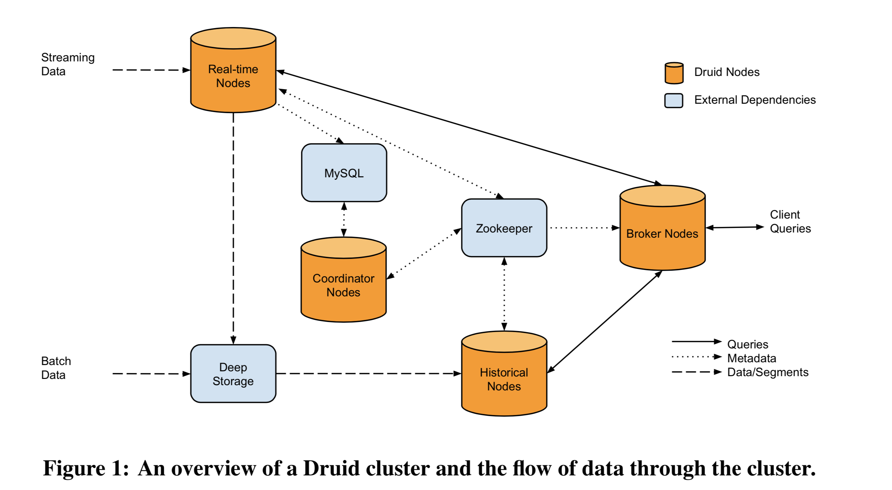
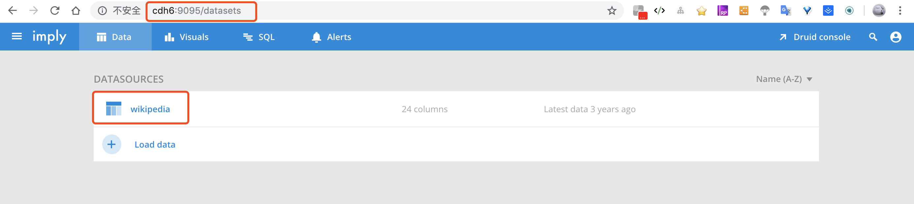

《Druid 实时大数据分析原理与实践》
=========
作者：欧阳辰、流麒赟、张海雷、高振源 等著

--腾讯、小米、优酷、云测等互联网公司的一线实践经验，为你解读海量数据实时OLAP平台

出版时间： 2017年3月第1版

******
前言
----
2011年，MetaMarkets公司为了解决广告交易中海量实时数据的分析问题，在尝试了各种SQL和NoSQL方案后，最后决定自行设计且创建了Druid，该项目于2013年开原。
Druid是一个支持在大型数据集上进行实时查询而设计的开源数据分析和存储系统，提供了低成本、高性能、高可靠的解决方案，整个系统支持水平扩展，管理方便。

Druid之所以保持高效，原因有以下几点：
* 数据进行了有效的聚合或预计算
* 数据结构的优化，应用了Bitmap的压缩算法
* 可扩展的高可用架构，灵活支持部署的扩展
* 社区的力量，Druid开发和用户社区保持活跃，不断推动Druid的完善和改进

**********

# 目录
* 一 初始Druid
    + 1.1 Druid是什么
    + 1.2 大数据分析和Druid
    + 1.3 Druid的产生
        - 1.3.1 MetaMarkets简介
        - 1.3.2 失败总结
    + 1.4 Druid的三个设计原则
        - 1.4.1 快速查询
        - 1.4.2 水平扩展能力
        - 1.4.3 实时分析
    + 1.5 Druid的技术特点
        - 1.5.1 数据吞吐量大
        - 1.5.2 支持流式数据摄入
        - 1.5.3 查询灵活且快
        - 1.5.4 社区支持力度大
    + 1.6 Druid的Hello World
        - 1.6.1 Druid的部署环境
        - 1.6.2 Druid的基本概念
    + 1.7 系统的扩展性
    + 1.8 性能指标
    + 1.9 Druid的应用场景
        - 1.9.1 国内公司
        - 1.9.2 国外公司
    + 1.10 小节
* 二 数据分析及相关软件
    + 2.1 数据分析及相关概念
    + 2.2 数据分析软件的发展
    + 2.3 数据分析软件的分裂
        - 2.3.1 商业软件
        - 2.3.2 时序数据库
        - 2.3.3 开源分布式计算平台
        - 2.3.4 开源分析数据库
        - 2.3.5 SQL on Hadoop/Spark
        - 2.3.6 数据分析云服务
    + 2.4 小节
* 三 架构详解
    + 3.1 Druid架构概览
    + 3.2 Druid架构设计思想
        - 3.2.1 索引对树结构的选择
        - 3.2.2 Druid总体架构
        - 3.2.3 基于DataSource与Segment的数据结构
    + 3.3 扩展系统
        - 3.3.1 主要的扩展
        - 3.3.2 下载与加载扩展
    + 3.4 实时节点
        - 3.4.1 Segment数据文件的制造与传播
        - 3.4.2 高可用性与可扩展性
    + 3.5 历史节点
        - 3.5.1 内存为王的查询之道
        - 3.5.2 层的分组功能
        - 3.5.3 高可用性与可扩展性
    + 3.6 查询节点
        - 3.6.1 查询中枢点
        - 3.6.2 缓存的使用
        - 3.6.3 高可用
    + 3.7 协调节点
        - 3.7.1 集群数据负载均衡的主宰
        - 3.7.2 利用规则管理数据生命周期
        - 3.7.3 副本实现Segment的高可用性
        - 3.7.4 高可用性
    + 3.8 索引服务
        - 3.8.1 主从结构的架构
        - 3.8.2 统治节点
        - 3.8.3 中间管理者与苦工
        - 3.8.4 任务
    + 3.9 小节
* 四 安装与配置
    + 4.1 安装准备
        - 4.1.1 安装包简介
        - 4.1.2 安装环境
        - 4.1.3 Druid外部依赖
    + 4.2 简单示例
        - 4.2.1 服务运行
        - 4.2.2 数据导入与查询
    + 4.3 规划与部署
    + 4.4 基本配置
        - 4.4.1 基础依赖配置
        - 4.4.2 数据节点配置调优
        - 4.4.3 查询节点配置优化
    + 4.5 集群节点配置示例
        - 4.5.1 节点规划
        - 4.5.2 Master机器配置
        - 4.5.3 Data机器配置
    + 4.6 小节


******

一 初始Druid
----
# 1.1 Druid是什么
这里提到的Druid是一个分布式的支持实时分析的数据存储系统。美国广告技术公司MetaMarkets于2011年创建了Druid项目，并与2012年开园了Druid项目。
Druid设计之初的想法就是**为分析而生**，它在处理数据的规模、数据处理的实时性方面、比传统的OLAP系统有礼显著的性能改进。

# 1.2 大数据分析和Druid
整个数据分析的基础架构通常分为以下几类：
* 使用Hadoop/Spark的MR分析
* 将Hadoop/Spark的结果注入RDBMS中提供实时分析
* 将结果注入到容量更大的NoSQL中，例如HBase等
* 将数据源进行流式处理，对接流式计算框架，例如Storm，结果落在RDBMS/NoSQL中
* 将数据源进行流式处理，堆积分析数据库，例如：Druid、Vertica等。

# 1.3 Druid的产生
## 1.3.1 MetaMarkets简介
Druid 诞生于 MetaMarkets 公司。随着互联网广告越来越多地采用程序化交易的方式，因此广告交易量大大增多，MetaMarkets主要帮组广告交易平台、供应方平台和需求方平台童工深度的数据分析服务。

面对这些业务背景下，MetaMarkets 的工程师在早期的数据分析平台审计上，经过了两个阶段的努力后，最终决定自主开发Druid系统来满足业务需求。第一阶段，主要是基于RDBMS的查询分析，经过这个二阶段，
开发人员提出了一个结论：常规的关系型数据库管理系统（RDBMS）并不能满足实时大规模数据分析的性能需求。因此，他们在第二阶段的工作中，将NoSQL作为数据落地时的存储，
利用NoSQL的高性能、可扩展特性解决数据分析的实时问题。

## 1.3.2 失败总结
经历两次的尝试之后，MetaMarkets决定创建一个分布式的内存OLAP系统，用于解决以下两个核心问题。
* REBMS的查询太慢
* 支持灵活的查询分析能力

# 1.4 Druid的三个设计原则
1. **快速查询（Fast Query）**：部分数据的聚合（Partial Aggregate）+ 内存优化（In-Memory）+ 索引（Index）
2. **水平扩展能力（Horizontal Scalability）**：分布式数据（Distributed Data）+ 并行化查询（Parallelizable Query）
3. **实时分析（Realtime Analytics）**：不可变的过去，只追加的未来（Immutable Past，Append-Only Future）

## 1.4.1 快速查询
对于数据分析场景，大部分情况下，我们之关系一定粒度聚合的数据，而非每一行原始数据的细节情况。因此数据聚合粒度可以是1分钟、5分钟、1小时或1天等。

数据内存化也是提高查询速度的杀手锏。内存资源一般有是非常有限的，Druid里面使用了Bitmap和各种压缩技术。

另外，我了支持Drill-Down某些维度，Druid维护了一些倒排索引。这种方式可以加快AND和OR等计算操作。

## 1.4.2 水平扩展能力
Druid按照时间范围吧聚合数据进行分区处理。对于基数维度，只按照时间切分有时候是不够的（Druid的每个Segment不超过2000万行），故Druid还支持对Segment进一步分区。

Druid的查询模块能够告知和处理集群的状态变化，查询总是在有效的集群架构中进行。集群上的查询可以灵活的水平扩展。

## 1.4.3 实时分析
Druid提供了包含基于时间维度数据的存储服务，并且任何一行数据都是历史真实发生的时间。

# 1.5 Druid的技术特点
* 数据吞吐量大
* 支持流式数据摄入和实施
* 查询灵活且快
* 社区支持力度大

## 1.5.1 数据吞吐量大
在集群中可以处理每天几十亿到百亿的事件。

## 1.5.2 支持流式数据摄入

## 1.5.3 查询灵活且快
Druid支持在任何维度组合上进行查询，访问速度极快。

## 1.5.4 社区支持力度大

# 1.6 Druid的Hello World
## 1.6.1 Druid的部署环境
Druid系统用Java编写，JDK最好选用8，，旧版本今后会不再支持。操作系统支持主流的Linux和Mac OS，不支持Window系统。内存配置越大越好，建议8GB以上，如果用于测试，4GB也可运行。

## 1.6.2 Druid的基本概念
### 数据格式
Druid在数据摄入之前，首先需要定义一个数据源，这个数据源有些类似于数据库中的表的概念。每个数据集合包括三部分：时间列（TimeStamp）、维度列（Dimension）和指标列（Metric）


* 时间序列。每个数据集都必须有时间序列，这个列时数据聚合的重要维度，Druid会将时间很近的一些数据进行聚合。另外，所有的查询都需要指定查询时间范围。

* 维度列。维度列来自OLAP的概念，用来标识一些事件，这些标识主要用于过滤或者切片数据，维度列的字段为字符串。

* 指标列。指标对应于OLAP概念中的Fact，即用于聚合和计算的列。指标列字段通常为数值类型，计算操作通常包括Count、Sum和Mean等。

### 数据摄入
Druid提供了两种数据摄入的方式，一种是实时数据摄入，另一种是批处理数据摄入。

### 数据查询
Druid原生查询采用JSON格式，通过HTTP传送。

# 1.7 系统的扩展性
Druid是一个分布式系统，采用Lambda架构，将实时数据和批处理数据合理地解耦。实时数据处理部分是面向**写多读少**的优化，批处理部分是面向**读多写少**

# 1.8 性能指标
性能测试涉及太多的因素，包括测试数据源、访问模式、机器配置和部署等，因此很难有统一的业界标准。

对于1GB的数据和100GB的数据，从查询性能来看，Druid基本晚上MySQL，查询时间缩小了5~10倍，随着数据量的增大，这种性能改善的程度会越来越大。

# 1.9 Druid的应用场景
为了支持更大的数据量、更灵活的分布式部署、更实时的数据摄入，Druid舍去了OLAP查询中比较复杂的操作，例如JOIN等。想比传统数据库，Druid是一种时序数据库，
按照一种时间序列数据库，按照一定的时间粒度对数据进行聚合，以加快分析查询。

## 1.9.1 国内公司
* 腾讯
* 阿里巴巴
* 新浪微博
* 小米
* 滴滴打车
* 优酷土豆
* 蓝海通讯
* YeahMobi

## 1.9.2 国外公司
* 雅虎
* PayPal
* eBay
* Hulu
* 思科

# 1.10 小节
[Druid技术论文](http://static.druid.io/docs/druid.pdf)


<br/>

******
二 数据分析及相关软件
----
# 2.1 数据分析及相关概念
**数据分析**是指通过数据的收集，进行数据处理和分析，将数据整理成有用的信息，包括有价值的洞察和可以付之于行动的建议。
**数据分析的目的**就是帮助我们把数据变成信息，再从信息变成知识，最后从知识变成智慧。

在数据分析领域，商务智能（Business Intelligent，BI）、数据挖掘（Data Mining，DM）、联机分析处理（On-Line Analytical Processing, OLAP）等概念
在名称上和数据分析方面非常接近。

* **BI**：商务智能是在商业数据上进行价值挖掘的过程。商务智能的历史很长，很多时候会特备之通过数仓技术进行业务报表制作和分析的过程，
在分析方法上通常是用聚合、分片等方式进行数据处理。在技术上，商务智能包括ETL、数仓、OLAP、数据挖掘等技术。

* **数据挖掘**：数据挖掘是指在大量数据中自动搜索隐藏于其中的有特殊关系信息的过程。

* **联机分析处理**：OLAP是一种简历数据系统的方法，其核心思想即简历多维度的数据立方体，以维度和度量为基础概念，辅以元数据实现可以钻取、切片、切块等灵活、系统和只管的数据展现。

数据分析即是一门艺术，它结合技术、想象、经验和意愿等综合因素的平衡和融合；也是一个经验和想象力的融合，它实际数据算法、统计分析、工具和软件工程的一种结合，
以解决业务的问题为目标，帮助人们从数据中获取智慧。

# 2.2 数据分析软件的发展

# 2.3 数据分析软件的分裂
* 商业软件
* 开源时序数据库
* 开源计算框架
* 开源数据分析软件
* 开源SQL on Hadoop
* 云端数据分析SaaS

## 2.3.1 商业软件
商用数据库软件种类繁多，但是真正能够支持TB级别以上数据存储和分析的并不多，如下是几种

* HP Vertical。创立者是数据库巨擘 Michael Stonebraker。2011年被惠普收购。
* Oracle Exadata。它是数据库软件和最新硬件的完美集合，他提供最快、最可靠的数据平台，不仅支持常规的数据库应用，也支持联机分析处理和数仓的场景。
* Teradata。天睿公司专注于大数据分析、数据仓库和整合营销管理解决方案的供应商。

## 2.3.2 时序数据库
时序数据库用于记录过去时间的各个数据点的信息，最典型的应用就是服务器的各种性能指标，例如CPU、内存使用情况等。
时序数据库在设计上需要支持高吞吐、高效数据压缩，支持历史查询、分布式部署等。对染Druid更加接近数仓的角色，但是在很多特性上也属于一种时序数据库。

* **OpenTSDB**。是一个开源的时序数据库，支持存储千亿的数据点，并提供精确查询功能。它广泛用于服务器心梗的监控和度量，包括网络和服务器、传感器、IoT、金融数据的实时监控领域。
它的主要涉及思路是利用HBase的Key存储一些Tag信息，将同一个小时数据放在一行存储，提高了查询书读。

* **InfluxDB**。它是最近非常流行的时序数据库，采用GoLang语言开发。技术特点有：支持任意数量的列，支持方便、强大的查询语言、集成了数据采集、存储和可视化功能。

## 2.3.3 开源分布式计算平台
* Hadoop
* Spark

## 2.3.4 开源分析数据库
* **Pinot**。
* **Kylin**


**Druid、Pinot和Kylin比较**    
Druid和Pinot解决的业务问题非常类似。Pinot架构的设计比较规范，系统也比较复杂，由于开源时间短，社区的支持力度若雨Druid。
Druid的设计轻巧，代码库也比较容易懂，支持比较灵活的功能增强。
Kylin的最大优势是支持SQL访问，可以兼容传统的BI工具和报表系统，在西能上没有太大优势。

项 | Druid | Pinot | Kylin
:---- | :---- | :---- |  :---- | 
使用场景 | 实时处理分析 | 实时处理分析 | OLAP分析引擎
开发语言 | Java | Java | Java
接口协议 | JSON | JSON | OLAP/JDBC
发布时间 | 2011年 | 2015年 | 2015年
资助者 | MetaMarkets / Imply.io | LinkedIn | eBay
技术 | 实时聚合 | 实时聚合 | 预处理，Cache 

**Dremel**。神秘的谷歌Dremel。是谷歌的"交互式"数据分析系统，支持上千台机器的集群部署，处理PB级别的数据，可以对网状的只读数据进行随机查询访问。
谷歌开发的Dremel将数据处理时间缩短到秒级，它也成为MapReduce的一个有力补充。《Dremel:Interactive Analysis of WebScaleDatasets》

**Apache Drill**。通过开源的方式实现了谷歌的Dremel。

Elasticsearch。简称**ES**，是Elastic公司推出的基于Lucene的分布式搜索服务系统，它是一个高可靠、可扩展、分布式的全文搜索引擎，提供了方便的RESTFUL Web接口。

## 2.3.5 SQL on Hadoop/Spark
Hadoop生态发展多年，常用的分析过程有以下几种
* 数据从HDFS导入RDBMS/NoSQL
* 基于HDFS，写代码通过MapReduce进行数据分析
* 基于HDFS，编写SQL直接访问
    - SQL访问内部转换为MapReduce任务
    0 访问引擎直接访问HDFS文件系统。
    
1. Hive
2. Impala。Cloudera受Dremel启发开发的实时交互SQL大数据查询工具，
3. Facebook Presto。

## 2.3.6 数据分析云服务
1. Redshift
2. 阿里云数据仓库。


# 2.4 小节
[Teradata-Architecture.html](http://www.teradatawiki.net/2013/09/Teradata-Architecture.html)


<br/>

******
三 架构详解
----
Druid的目标是提供一个能够在大数据集上做实时数据消费与探索的平台。然而，对普遍的数据平台来说，数据的高效深入与快速查询往往是一对难以两全的指标，因此需要在其中做一些取舍与权衡。
Druid是能够在同时提供性能卓越的数据实时摄入，又能提供复杂的查询性能。它是如何做到的呢？答案是通过其独到的架构设计、基于DataSource与Segment的数据结构，以及在许多系统细节上的优秀设计与实现。

# 3.1 Druid架构概览

* **实时节点**（Realtime Node）：即摄入实时数据，以及生成Segment数据文件
* **历史节点**（Historical Node）：加载已经生成好的数据文件，以供数据查询
* **查询节点**（Broker Node）：对外提供数据查询服务，并同时从实时节点与历史节点查询数据，合并后返回给调用方
* **协调节点**（Coordinator Node）：负责历史节点的数据负载均衡，以及通过规则管理数据的声明周期。

同时集群还包含以下三类外部依赖：
* **元数据库**（Metastore）：存储Druid集群的元数据信息，比如Segment的相关信息，一般用MySQL或PostgreSQL
* **分布式协调服务**（Coordination）：为Druid集群提供一致性协调服务的组件，通常为Zookeeper
* **数据文件存储库**（DeepStorage）：存放生成的Segment数据文件，并共历史节点下载。对于单节点集群可以是本地磁盘，而对于分布式集群一般是HDFS或NFS。

# 3.2 Druid架构设计思想
提高数据库数据的查询速度的关键点之一便是尽量减少磁盘的访问次数。

## 3.2.1 索引对树结构的选择
### 1 二叉查找树与平衡二叉树
最常见的树结构是二叉查找树（Binary Search Eree），他就是一颗二叉有序树，保证左子数上的所有节点的值都小于跟节点的值，而右子数上所有节点的值都大于节点的值。
其优点在于实现简单，并且数在平衡状态下查找效率能达到O(log<sub>2</sub>N)；缺点是在极端非平衡情况下查询效率会退化到O(N)，因此很难保证索引的效率。

### 2 B+ 树
* B+树节点只存放键值，不存放数值，而由叶子节点存放数值。这样会使节点的度比较大，而树的高度就比较低，从而有利于提高查询效率。
* 叶子节点存放数值，并按照值大小顺序排序，且带指向相邻节点的指针，以便高效地进行区间数据查询；并且所有叶子节点与跟节点的距离相等，一次任何查询的效率都很相似
* 与二叉树不同，B+树的数据更新操作不从根节点开始，而从叶子节点开始，并且在更新过程中树能以比较小的代价实现自平衡。

**缺点**，随着数据插入的不断发生，叶子节点会慢慢分裂，这可能会导致逻辑上原本连续的数据实际上存放在不同的物理磁盘块位置上，在做范围查询的时候回导致较高的磁盘IO，一致严重影响性能。

### 3 日志结构合并数（Log-Structured Merge-Tree）
**磁盘的顺序读写是远高于随机读写的**。B+数的索引结构是违背了磁盘的基本特点的，它会需要较多的磁盘随机读写。

1992年日志结构（Log-Structured）的新型索引结构方法应运而生，它将磁盘盘作为一个大的日志，每次都讲新的数据及其索引结构添加到日志的末端，以实现对磁盘的顺序操作，不过它的随机读取数据的效率很低。

1996年，一篇名为《The log-structured merge-tree》(LSM-tree)的论文提出了日志结构合并树的概念，这个方法既吸收了日志结构方法的有点，有通过将数据文件预排序客服了日志结构方法随机读性能较差的问题。
尽管当时LSM-tree新颖且优势鲜明，但它真正名声鹊起却是在10年之后的2006年，那年谷歌的一篇使用了LSM-tree技术的论文《Bigtable：A Distributed Storage System for Structured Data》横空出世，
在分布式数据领域掀起一阵旋风，随后两个名声赫赫的大数据开源组件（2007年的HBase与2008年的Cassandra）直接在其思想基础上破茧而出，彻底改变了大数据基础组件的格局，同时也极大推广了LSM-tree。

LSM-tree最大的特点是同时使用了两部分类树的数据结构来存储数据，并同时提供查询。其中一部分数据结构（C<sub>0</sub>树）存在于内存缓存（通常叫做memtable）中，负责接收新的数据插入更新以及读请求，
并直接在内存中对数据进行排序；另一部分数据结构（C<sub>1</sub>树）存在于磁盘上（这部分通常叫做sstable），它们是由存在于内存缓冲中的C<sub>0</sub>树冲写到磁盘而成的，主要负责提供读操作，
特点是有序且不可更改。

LSM-tree的另一大特点是除了使用两部分类树的数据结构外，还会使用日志文件（通常叫做commit log）来为数据恢复做保障。这三类数据结构的协作顺序一般是：所有的新插入与更新操作都首先记录到commit log中，
这个操作叫做WAL（Write Ahead Log），然后在写到memtable，最后当达到一定条件时数据会从memtable冲写到sstable，并抛弃相关的log数据；memtable和sstable可同时提供查询；当memtable出问题时，
可从commit log与sstable中将memtable的数据恢复。

## 3.2.2 Druid总体架构
LSM-tree比较适合那些数据插入操作远多于数据更新删除操作与读操作的场景，同时Druid在一开始就是为了时序数据场景设计的，而该场景正好符合LSM-tree的优势特点，因此Druid架构便吸收了LSM-tree的思想。

Druid的类LSM-tree架构中的实时节点负责消费实时数据，与经典LSM-tree架构不同的是，Druid不提供日志及实行WAL原则，实时数据首先会被直接加载进行实时节点内存中国的堆结构缓存区（相当于memtable）,
当条件满足是，缓存区里的数据会被冲写到磁盘上形成一个数据块（Segment Split），同时实时节点又会立即将新 生成的数据块加载到内存中的非堆区，因此无论是堆结果缓存区还是非堆区里的数据，
都能够被查询节点（Broker Node）查询。

[Figure 2](../../paper/druid.pdf)

同时，实时节点会周期性地将磁盘上同一个时段内生成的所有数据块合并为一个大的数据块（Segment）。这个过程在实时节点中叫做Segment Merge操作，相当于LSM-tree架构中的数据合并操作（Compaction）。
黑帮好的Segment会立即被实时节点上传到数据文件存储库（DeepStorage）中，随后协调节点（Coordinator Node）会知道一个历史节点（Historical Node）去文件存储库，将新生成的Segment下载到其本地磁盘中。
当历史节点成功加载到Segment后，会通过分布式协调服务（Coordinator）在集群中声明其从此刻开始负责提供该Segm的查询，当实时节点收到该声明后会立即向集群声明其不再提供该Segment的查询，
接下来查询节点会转从该节点查询此Segment的数据。而对于全局数据来说，查询节点会同时从实时节点（少量当前数据）与历史节点（大量历史数据）分别查询，然后做一个结果的整合，最后再返回给用户。
Druid的这种架构安排实际上也在一定程度上借鉴了命令查询职责分离模式（CQRS），这也是Druid不同于HBase等LSM-tree系架构的一个显著特点。


Druid的这种架构带来的优势如下：
* 类LSM-tree架构使得Druid能够保证数据的高速写入，并且能够提供比较快速的实时查询，这十分符合许多时序数据的应用场景
* 由于Druid在设计之初就不提供对已有数据的更改，以及不识闲传统LSM-tree架构中普遍应用的WAL原则，虽然这样导致了Druid不适应于某些需要数据更新的场景，也降低了数据完整性的保障，
但Druid相对于其他传统的LSM-tree架构实现来说也着实减少了不少数据处理的工作量，因此让自己在能能方面更胜一筹。
* Druid命令查询负责职责分离模式的借鉴也使得自己的组建职责分明，架构更加清晰明了，方便针对不同模块进行针对性的优化。

## 3.2.3 基于DataSource与Segment的数据结构
与Druid相辅相成的是基于DataSource与Segment的数据结构，它们共同成就了Druid的高性能有时。

### DataSource结构
与RDBMS相比较，Druid的DataSource可以理解为RDBMS中的表（Table）。DataSource有包含如下几个部分：
* 时间序列
* 维度列
* 指标列

无论是实时数据消费还是批量数据处理，Druid在基于DataSource结构存储数据时即可选择对任意指标列进行聚合（Roll Up）操作，改操作主要基于维度列和时间范围
* 同纬度的值做聚合：所有维度列的值都相同是，这一类行数据符合聚合操作。
* 对指定时间粒度内的值做聚合：符合参数queryGranularity指定的范围，比如时间列的值同为1分钟内的所有行，聚合操作相当于对数据表所欲列做了Group By操作。

### Segment结构
DataSource是一个逻辑概念，Segment却是数据的实际物理存储格式，Druid正式通过Segment实现类对数据的横纵向切割（Slice and Dice）操作。从坐具按时间分布的角度来看，
通过参数segmengGranularity的设置，Druid将不同时间范围内的数据存储在不同的Segment数据块中，这便是所谓的数据横向切割。

# 3.3 扩展系统
通过实现一个扩展系统（Extension System），让很多组件功能能够通过扩展的形式轻易地在Druid平台上进行加载与更换。

## 3.3.1 主要的扩展
目前Druid项目自带的一些扩展如下：

名称      | 描述
:----    | :-----
druid-avro-extensions   | 使得Druid能够摄入avro格式的数据。一般可在dataSchema中的parser部分进行指定使用
druid-hdfs-storage      | 使用HDFS作为 DeepStorage
druid-s3-extensions     | 使用AWS S3作为 DeepStorage
druid-histogram         | 对histogram 值进行近似计算
druid-datasketches      | 使得Druid的聚合操作能够使用datasketches库
druid-namespace-lookup  | 命名空间发现
druid-kafka-eight       | 消费Kafka数据的Firehose（使用Kafka High Level Consumer API）
druid-kafka-extraction-namespace | 基于Kafka命名空间发现，依赖于命名空间发现扩展
mysql-metadata-storage  | 使用Mysql作为元数据数据库
postgresql-metadata-storage      | 使用PostgreSQL最为元数据库

目前Druid社区贡献的一些扩展

名称      | 描述
:----    | :-----
druid-azure-extensions              | 使用Microsoft Azure作为DeepStorage
druid-cassandr-storage              | 使用Cassandra作为DeepStorage
druid-cloudfiles-extensions         | 基于Rackspace Cloudfiles的DeepStorage与Firehose
druid-kafka-eight-simpleConsumer    | 消费Kafka数据的Firehose（使用Kafka Low Level Consumer API）
druid-rabbitmq      | 基于rabbitmq的Firehose
druid-emitter       | Graphite metrics的发射器（emitter）

## 3.3.2 下载与加载扩展
例如下载druid-rabbimq、mysql-metadata-storage、hadoop-client到本地
```bash
java -classpath "/my/druid/libary/*" io.druid.cli.Main tools pull-deps --clean -c io.druid.extensions:mysql-metadata-storage:0.9.0 -c io.druid.extensions.contrib:druid-rabbitmq:0.9.0 -h org.apache.hadoop:hadoop-client:2.4.0
```

加载扩展的方式有两种：
* 将扩展加载到Druid Service的classpath中，Druid便能加载到相关扩展。
* 在common。runtime。properties文件中国通过`druid.extensions.directory`指定扩展目录

# 3.4 实时节点
实时节点主要负责即时摄入实时数据，以及生成Segment数据文件，其拥有超强的数据深入速度

## 3.4.1 Segment数据文件的制造与传播
实时节点通过Firehose来消费实时数据。Firehose是Druid中实时消费数据的模型，可以有不同具体的实现。

## 3.4.2 高可用性与可扩展性
从设计开，实时节点拥有很好的可扩展性与高可用性。

# 3.5 历史节点
负责加载已生成好的数据文件已提供数据查询。

## 3.5.1 内存为王的查询之道
历史节点在启动的时候，首先会检查自己本地的缓存（Local Cache）中已存在的Segment数据文件，然后从DeepStorage只下载属于自己但目前不在自己本地磁盘上的Segment数据文件。
无论是何种查询，历史节点都会首先将相关Segment数据文件从磁盘加载到内存，然后再提供查询服务。

## 3.5.2 层的分组功能
**硬件的异构性**： 在集群中不同节点的硬件性能不同

**数据温度**：用来形容数据被访问的频繁程度，越频繁温度越高。根据数据温度，数据可以笼统地分为以下三类
* 热数据：经常被访问。特点是总的数据量不算大，但要求响应速度最快
* 温数据：不经常被访问。特点是总的数据量一般，且要求响应速度尽量快
* 冷数据：偶尔被访问。特点是总的数据量占比最大，但响应速度不用很快

**基于上述理论考虑，在实践中往往要求将硬件资源根据性能容量等指标分为不同的组，并为这些硬件都打上组标签**。Druid因此提出了层（Tier）的概念。

## 3.5.3 高可用性与可扩展性
历史节点拥有极佳的可扩展与高可用性。新的历史节点被添加后，会通过Zookeeper被协调节点发现，然后协调节点将会自动分配相关的Segment给它；
原有的历史节点被移除集群后，同样会被协调节点发现，然后协调节点会将原本分配给它的Segment重新分配给其它处于工作装填的历史节点。

# 3.6 查询节点
Broker Node对外提供数据查询服务，并同时从实时及诶单与历史节点查询数据，合并后返回给调用方。

## 3.6.1 查询中枢点
通常情况下，Druid集群直接对完提供查询的节点之后查询节点，因此，查询节点便是整个集群的查询中枢点。

## 3.6.2 缓存的使用
Druid也使用了Cache机制来提高自己的查询效率，Druid提供了两类截至作为Cache一提供选择。
* 外部Cache，比如 Memcached
* 本地Cache，比如查询节点或历史节点的内存作为Cache。

## 3.6.3 高可用
一般Druid集群只需要一个查询节点即可，单位了放置出现单个节点失败导致无法查询及诶单可用的情况，通常会多加一个查询节点到集群中。
在实践中也常常会通过Nginx作为客户端查询的Gateway来完成对多个查询节点的负载均衡，并达到集群高可用的效果

# 3.7 协调节点
Coordinator Node负载历史节点的数据负载，以及通过规则管理数据的声明周期。

## 3.7.1 集群数据负载均衡的主宰
对于历史节点来说，协调节点便是它们的Master节点，因为协调节点将会给历史节点分配数据，完成数据分布在历史节点的负载均衡。
当协调节点不可访问时，历史节点虽然还能向外提供查询服务，但已经不再接收新的Segment数据了

## 3.7.2 利用规则管理数据生命周期
Druid利用针对每个DataSource设置的规则（Rule）来加载（Load）或丢弃（Drop）具体的数据文件，以管理数据声命周期。
可以对一个DataSource按顺序添加多条规则，对于一个Segment数据文件来说，协调节点会逐条检查规则，当碰到当前Segment数据文件符合某条规则的请款时，
协调节点会立即命令历史节点对该Segment数据文件执行这条规则，加载或丢弃，并停止检查余下的规则，否则继续检查下一条设置好的规则。

## 3.7.3 副本实现Segment的高可用性
当某个历史节点突然退出集群的时候，它本身所包含的Segment数据在被负载均衡到其他历史节点前的一段时间内无法查询，因此从这个意义上来说Segment数据存在单点失效的问题。
Druid通过Segment数据文件的副本解决了这个问题。

Druid允许用户对某个DataSource定义其Segment数据文件在历史节点中的副本数量。副本数量默认为1。

## 3.7.4 高可用性
对于协调者，高可用性的问题只需要在集群中添加多个协调节点即可，

# 3.8 索引服务
Druid提供了一组名为索引服务（Index Service）的组件也可以产生Segment数据文件。相比实时节点产生的Segment数据文件的方式，索引服务的有点是除了对数据能够用pull方式外，
还支持Push的方式。
* 可以通过API的编程方式来灵活定义任务配置
* 通过更灵活地管理与使用系统资源
* 可以完成Segment副本数量的控制
* 能够灵活完成各Segment数据文件相关的所有操作，如合并、删除Segment数据文件等。

## 3.8.1 主从结构的架构
不同于实时及诶单的单节点模式，索引服务实际包含一组组件，兵役主从结构作为其架构方式，其中统治节点（Overload Node）为主节点，而中间管理者（Middle Manager）为从节点。

## 3.8.2 统治节点（Overload Node）
统治节点为索引服务的主节点，对外负责接收任务请求，对内负责将任务分解并下发到从节点中间管理者（Middle Manager）上。其有两种运行模式
* 本地模式（Local Mode）：默认模式，该模式下，统治节点不仅负责集群的任务协调分配工作，也能够负责启动一些Peon来完成一部分具体的任务
* 远程模式（Remote Mode）： 统治节点与中间管理者分别运行在不同节点上，它仅负责集群的任务协调分配工作，不负责完成任何具体的任务。
统治节点提供RESTFUL的访问方法，因此客户端可以通过HTTP Post请求想统治节点提交任务，命令如`http://$OVERLORD_IP:$PORT/druid/indexer/v1/task`；
客户端杀掉某个任务`http://$OVERLORD_IP:$PORT/druid/indexer/v1/task/{taskId}/shutdown`；通过请求控制台查看任务和工作节点的状态`http://$OVERLORD_IP:$PORT/console.html`。

## 3.8.3 中间管理者与苦工
中间管理者就是索引服务的工作节点，负责接收统治节点分配的任务，然后启动相关Peon（即独立的JVM）来完成了具体的任务。这样的架构实际与Hadoop Yarn很像
* 统治节点相当于YARN的ResourcesManager，负责集群资源管理与任务分配
* 中间管理者相当于YARN的NodeManager，负责管理独立节点的资源并接受任务
* Peon相当于YARN的Container，启动在具体界定啊上负责具体任务的执行

## 3.8.4 任务
索引服务能执行的任务（Task）基本与索引数据（Segment数据）相关，

父类      | Type      | 名称        | 描述
:----     |:----     |:----     |:----     
创建Segment型  | index_hadoop  | Hadoop索引任务 | 利用Hadoop集群执行MR任务以完成Segment数据文件的创建，适合体量比较大的Segment数据文件的创建任务
创建Segment型  | index      | 普通索引任务   | 利用Druid集群本身的系统资源完成Segment数据文件的创建，适合体量比较小的Segment数据文件的创建任务
合并Segment型  | append     | 附加索引任务   | 将若干个Segment数据文件收尾相连，最终合成一个Segment数据文件
合并Segment型  | merge      | 合并索引任务   | 将若该个Segment数据文件按照指定的聚合方法合并为一个Segment数据文件
销毁Segment型  | kill       | 销毁索引任务   | 彻底将执行的Segment数据文件从Druid集群（包括DeepStorage）上删除
混杂型  | hadoop_convert_segment | 版本转换任务 | 通常用来重定义Segment数据文件的压缩方法等要素。Hadoop版本转换任务会利用Hadoop集群执行MR任务以完成Segment数据文件的转换，适合体量比较大的Segment数据文件的版本转换
混杂型  | convert_segment   | 版本转换任务   | 会利用Druid集群本身的系统资源完成Segment数据文件的转换，适合体量比较小的Segment数据文件的版本转换
混杂型  | noop | 无操作任务   | 将任务启动并沉睡一段时间，并不完成具体的任何工作。通常用来做测试用

# 3.9 小节


<br/>

******
四 安装与配置
----
Druid依赖的其他组件有：Zookeeper、MySQL、HDFS，

* Druid服务的安装部署（单机版适用于测试学习，集群版适用于生产环境）
* 通过一个简单例子快速上手Druid的数据导入和查询
* 如何搭建一个Druid集群已以及关键配置说明

# 4.1 安装准备
## 4.1.1 安装包简介
获取Druid安装包有以下几种方式
* **源代码编译**：[druid/release](https://github.com/apache/drill/releases)，主要用于定制化需求时，比如结合实际环境中的周边依赖，或者是加入支持特定查询的部分的优化必定等。
* **官网安装包下载**：[download](https://druid.apache.org/downloads.html)，包含Druid部署运行的最基本组件
* **Imply组合套件**：[Imply](https://imply.io/get-started)，该套件包含了稳定版本的Druid组件、实时数据写入支持服务、图形化展示查询Web UI和SQL查询支持组件等，目的是为更加方便、快速地部署搭建基于Druid的数据分析应用产品。

这里采用第三种方式来部署Druid，利用组合套件可以方便、快捷地构建数据分析应用平台。

下载后的包为`imply-3.0.3.tar.gz.tar`，解压后的目录如下：
```
├─┬ imply-3.0.3
  ├── bin                 # 包含运行相关组件的脚本程序
  ├── conf                # 包含生产环境集群配置文件
  ├── conf-quickstart     # 包含单机测试环境配置文件
  ├── dist                # 包含相关软件包（druid、pivod、tranquility-server和zookeeper）
  └── quickstart          # 包含单机测试版快速上手相关文件

```

## 4.1.2 安装环境
* JDK（推荐1.8）
* NodeJS （PlyQL、Pivot依赖）
* Linux或者类UNIX操作系统
* 4GB以上内存

## 4.1.3 Druid外部依赖
* **Deep Storage**（数据文件存储库）：
* **Metadata Storage**（元数据库）：
* **Zookeeper**（集群状态管理服务）：

# 4.2 简单示例
* Druid 离线数据的输入方式
* Druid 实时数据的摄入方式
* Druid数据查询方式

## 4.2.1 服务运行
以imply-3.0.3.tar.gz.tar为例（Druid版本为0.15.0），外部依赖默认配置
* DeepStorage -> 本地存储
* Metadata Storage -> Derby
* Zookeeper -> Imply安装包自带的zk服务

### 服务安装与启动
```bash
#curl -O https://static.imply.io/release/${version}
# 解压
tar -zxf  imply-3.0.3.tar.gz.tar
cd imply-3.0.3
# 启动
nohup bin/supervise -c conf/supervise/quickstart.conf > quickstart.log &

```

### 服务停止与重启
```bash
# 停止服务
bin/service --down
# 重启
bin/service --restart $service_name

```

启动后会在目录下生成`quickstart.log`文件 和 `var`目录，查看日志可以看到通过quickstart启动了一下的服务。默认端口信息可以查看`bin/verify-default-ports`

服务  |   简介  | 访问地址
Zookeeper   | 分布式协调服务   | --
Coordinator | 协调节点，管理集群状态   | http://localhost:8081
broker      | 查询节点，处理查询请求   | http://localhost:8082/druid/v2
historical  | 历史节点，管理历史数据   | http://localhost:8083/druid/v2
overlord    | 统治节点，管理数据写入任务 | http://localhost:8090/console.html
middleManager | 中间管理者，负责写数据处理 | --
pivot | 数据查询Web UI   | http://localhost:9095
tranquility-server | 实时写入服务，hTTP协议   | http://localhost:8200/v1/post/datasource

## 4.2.2 数据导入与查询
* `quickstart/wikipedia-2016-06-27-sampled.json`：文件包含维基百科网站一段时间内收集到的日志数据
* `quickstart/wikipedia-index.json`文件为离线写入任务的描述文件，其用JSON格式组织和定义了写入任务的数据源、时间信息、维度信息、指标信息等。


导入待分析的日志数据到Druid
```bash
# https://docs.imply.io/on-prem/quickstart 
bin/post-index-task --file quickstart/wikipedia-index.json
```
执行命令后会显示如下，`status: SUCCESS`则导入成功。
```
Beginning indexing data for wikipedia
Task started: index_wikipedia_2019-07-14T08:18:34.261Z
Task log:     http://localhost:8090/druid/indexer/v1/task/index_wikipedia_2019-07-14T08%3A18%3A34.261Z/log
Task status:  http://localhost:8090/druid/indexer/v1/task/index_wikipedia_2019-07-14T08%3A18%3A34.261Z/status
Task index_wikipedia_2019-07-14T08:18:34.261Z still running...
Task index_wikipedia_2019-07-14T08:18:34.261Z still running...
Task index_wikipedia_2019-07-14T08:18:34.261Z still running...
Task finished with status: SUCCESS
Completed indexing data for wikipedia. Now loading indexed data onto the cluster...
Traceback (most recent call last):
  File "/opt/imply-3.0.3/bin/post-index-task-main", line 188, in <module>
    main()
  File "/opt/imply-3.0.3/bin/post-index-task-main", line 185, in main
    await_load_completion(args, datasource, load_timeout_at)
  File "/opt/imply-3.0.3/bin/post-index-task-main", line 134, in await_load_completion
    response_obj = json.loads(response.read())
  File "/usr/lib64/python2.7/json/__init__.py", line 338, in loads
    return _default_decoder.decode(s)
  File "/usr/lib64/python2.7/json/decoder.py", line 366, in decode
    obj, end = self.raw_decode(s, idx=_w(s, 0).end())
  File "/usr/lib64/python2.7/json/decoder.py", line 384, in raw_decode
    raise ValueError("No JSON object could be decoded")
ValueError: No JSON object could be decoded
```

导入成功后，可以通过Pivot页面查询，浏览器访问地址 [http://localhost:9095](http://localhost:9095)



# 4.3 规划与部署
从功能上可以划分为：
* **Master**：管理节点，包含协调节点和统治节点，负责管理数据的写入任务以及容错相关处理。
* **Data**：数据节点，包含历史节点和中间管理者，负责数据写入处理，李四数据的加载与查询。
* **Query**：查询节点，包含查询节点和Pivot WEB界面，负责提供数据查询接口和WEB交互查询功能。

### 管理节点和查询节点

管理节点和查询节点配置文件如下：
```bash
cp conf/supervise/master-no-zk.conf conf/supervise/master-with-query.conf
vim conf/supervise/master-with-query.conf

```

配置内容如下
```yaml
:verify bin/verify-java
:verify bin/verify-version-check
:verify bin/verify-node

broker bin/run-druid broker conf
historical bin/run-druid historical conf
coordinator bin/run-druid coordinator conf
pivot bin/run-pivot conf
coordinator bin/run-druid coordinator conf
# !p数字，表示服务关闭的权重，默认值为50，数值越大越优先关闭。
!p80 overlord bin/run-druid overlord conf

```

运行命令如下：
```yaml
nohup bin/supervise -c conf/supervise/master-with-query.conf > master-with-query.log &
```

### 数据节点
```bash
conf/supervise/data.conf
```

配置如下
```yaml
:verify bin/verify-java
:verify bin/verify-version-check

historical bin/run-druid historical conf
middleManager bin/run-druid middleManager conf

```

运行命令如下：
```yaml
nohup bin/supervise -c conf/supervise/data.conf > data.log &
```

# 4.4 基本配置
## 4.4.1 基础依赖配置
配置文件为：`conf/druid/_common/common.runtime.properties`

### Zookeeper
```yaml
#
# Zookeeper
#
druid.zk.service.host=cdh1:2181,cdh2:2181,cdh3:2181
druid.zk.paths.base=/imply-druid
```

###  Metadata storage (推荐使用MySQL或者PostgreSQL)
```yaml
#
# Metadata storage
#
# For Derby server on your Druid Coordinator (only viable in a cluster with a single Coordinator, no fail-over):
#druid.metadata.storage.type=derby
#druid.metadata.storage.connector.connectURI=jdbc:derby://master.example.com:1527/var/druid/metadata.db;create=true
#druid.metadata.storage.connector.host=master.example.com
#druid.metadata.storage.connector.port=1527

# For MySQL:
druid.metadata.storage.type=mysql
druid.metadata.storage.connector.connectURI=jdbc:mysql://chd1:3306/imply-druid
druid.metadata.storage.connector.user=root
druid.metadata.storage.connector.password=123456

# For PostgreSQL:
#druid.metadata.storage.type=postgresql
#druid.metadata.storage.connector.connectURI=jdbc:postgresql://db.example.com:5432/druid
#druid.metadata.storage.connector.user=...
#druid.metadata.storage.connector.password=...

```

### Deep storage (采用HDFS)
```yaml
#
# Deep storage
#
# For local disk (only viable in a cluster if this is a network mount):
#druid.storage.type=local
#druid.storage.storageDirectory=var/druid/segments

# For HDFS:
druid.storage.type=hdfs
druid.storage.storageDirectory=hdfs://cdh6:8020/imply-druid/segments

# For S3:
#druid.storage.type=s3
#druid.storage.bucket=your-bucket
#druid.storage.baseKey=druid/segments
#druid.s3.accessKey=...
#druid.s3.secretKey=...

```

### Indexing service logs
```yaml

# For local disk (only viable in a cluster if this is a network mount):
#druid.indexer.logs.type=file
#druid.indexer.logs.directory=var/druid/indexing-logs

# For HDFS:
druid.indexer.logs.type=hdfs
druid.indexer.logs.directory=hdfs://cdh6:8020/imply-druid/indexing-logs

# For S3:
#druid.indexer.logs.type=s3
#druid.indexer.logs.s3Bucket=your-bucket
#druid.indexer.logs.s3Prefix=druid/indexing-logs
```

## 4.4.2 数据节点配置调优（historical、middleManager）
historical与middleManager配置

* JVM内存使用 -Xmx 和 -Xms
* druid.server.http.numThreads
* druid.processing.buffer.sizeBytes
* druid.processing.numMergeBuffers
* druid.processing.numThreads
* 
* `druid.server.maxSize` 和 `druid.segmentCache.locations`
* druid.worker.capacity
*
* 

## 4.4.3 查询节点配置优化
[Apache Druid (incubating) Configuration Reference](https://druid.apache.org/docs/latest/configuration/index.html)

# 4.5 集群节点配置示例
## 4.5.1 节点规划
* Master机器： 64GB内存、16核CPU、250GB磁盘空间
* Data机器：   64GB内存、24核CPU、1TB磁盘空间

**时区**统一设置为`UTC+0800`

## 4.5.2 Master机器配置
### 协调节点
* jvm.config
```bash
-server
-Xms3g
-Xmx3g
-Duser.timezone=UTC+0800
-Dfile.encoding=UTF-8
-XX:+ExitOnOutOfMemoryError
-Djava.io.tmpdir=var/tmp
-Djava.util.logging.manager=org.apache.logging.log4j.jul.LogManager
-Dderby.stream.error.file=var/druid/derby.log
```

* runtime.properties
```yaml
druid.service=imply-druid/coordinator
# 部署机器的IP地址
druid.host=cdh6
druid.port=8081

druid.coordinator.startDelay=PT30S
druid.coordinator.period=PT30S
```

### 统治节点
* jvm.config
```bash
-server
-Xms3g
-Xmx3g
-XX:NewSize=256m
-XX:MaxNewSize=256m
-XX:+UseConcMarkSweepGC
-XX:+PrintGCDetails
-XX:+PrintGCTimeStamps
-XX:+ExitOnOutOfMemoryError
-Duser.timezone=UTC+0800
-Dfile.encoding=UTF-8
-Djava.io.tmpdir=var/tmp
-Djava.util.logging.manager=org.apache.logging.log4j.jul.LogManager

```

* runtime.properties
```yaml
druid.service=imply-druid/overlord
# 部署机器的IP地址
druid.host=cdh6
druid.port=8090

druid.indexer.queue.startDelay=PT30S
druid.indexer.runner.type=remote
druid.indexer.storage.type=metadata
```

查询当前统治节点任务分配方式设置如下：
```bash
curl -L -H'Content-Type:application/json' -X GET http://${OVERLORD_IP:PORT}/druid/indexer/v1/worker/history?count=10
```

统治节点分配写入数据任务给middleManager的负载模式需要服务启动后通过动态HTTP POST请求的方式修改，默认方式为`fillCapacity`，推荐修改为`equalDistribution`方式
```bash
curl -L -H'Content-Type: application/json' -X POST -d '{"selectStragey":{"type":"equalDistribution"}}' http://${OVERLORD_IP:PORT}/druid/indexer/v1/worker
```

### 查询节点
* jvm.config
```bash
-server
-Xms24g
-Xmx24g
-XX:NewSize=6g
-XX:MaxNewSize=6g
-XX:MaxDirectMemorySize=8g
-XX:+UseConcMarkSweepGC
-XX:+PrintGCDetails
-XX:+PrintGCTimeStamps
-XX:+ExitOnOutOfMemoryError
-Duser.timezone=UTC+0800
-Dfile.encoding=UTF-8
-Djava.io.tmpdir=var/tmp
-Djava.util.logging.manager=org.apache.logging.log4j.jul.LogManager

```

* runtime.properties
```yaml
druid.service=imply-druid/broker
# 部署机器的IP地址
druid.host=cdh6
druid.port=8082

# HTTP server settings
# HTTP请求的处理的线程数
druid.server.http.numThreads=50

# HTTP client settings
# 查询节点与历史节点通信连接池的大小
druid.broker.http.numConnections=10
druid.broker.http.readTimeout=PT5M
druid.broker.http.maxQueuedBytes=50000000

# Processing threads and buffers
# 512MB。 2147483647
druid.processing.buffer.sizeBytes=536870912
druid.processing.numMergeBuffers=2
# 处理线程数1，15
druid.processing.numThreads=1
druid.processing.tmpDir=var/druid/processing

# Query cache disabled -- push down caching and merging instead
# false,
druid.broker.cache.useCache=true
druid.broker.cache.populateCache=true
druid.broker.cache.unCacheable=[]
# JVM堆内LRU缓存大小，5.6GB
druid.cache.sizeInBytes=6000000000
# 查询节点请求历史节点方式，有random和connectionCount两种
druid.broker.balancer.type=connectionCount

# SQL
druid.sql.enable=true
```

### 历史节点（加载热点数据）
* jvm.config
```bash
-server
-Xms8g
-Xmx8g
-XX:NewSize=4g
-XX:MaxNewSize=4g
-XX:MaxDirectMemorySize=16g
-XX:+UseConcMarkSweepGC
-XX:+PrintGCDetails
-XX:+PrintGCTimeStamps
-XX:+ExitOnOutOfMemoryError
-Duser.timezone=UTC+0800
-Dfile.encoding=UTF-8
-Djava.io.tmpdir=var/tmp
-Djava.util.logging.manager=org.apache.logging.log4j.jul.LogManager

```

* runtime.properties
```yaml
druid.service=imply-druid/historical
# 部署机器的IP地址
druid.host=cdh6
druid.port=8083

# HTTP server threads
# HTTP请求处理线程数
druid.server.http.numThreads=40

# Processing threads and buffers
# 每个查询处理线程的中间结果缓存大小，单位Byte， 1073741824
druid.processing.buffer.sizeBytes=536870912
# 查询线程数 15
druid.processing.numMergeBuffers=2
druid.processing.numThreads=7
druid.processing.tmpDir=var/druid/processing

# Segment storage
# Segment本地加载路径与最大存储空间大小，单位Byte， 130000000000=121GB
druid.segmentCache.locations=[{"path":"var/druid/segment-cache","maxSize"\:130000000000}]
druid.server.maxSize=130000000000

# Query cache
druid.historical.cache.useCache=true
druid.historical.cache.populateCache=true
druid.cache.type=caffeine
druid.cache.sizeInBytes=2000000000

# Tier
# 自动以数据层名称，默认为_default_tier，不同数据层的Segment数据无法相互复制
#druid.server.tier=hot
# 自定义数据层优先级，默认为0，值越大优先级越高，该功能用于冷热数据层划分
#druid.server.priority=10

```

## 4.5.3 Data机器配置

# 4.6 小节


<br/>

******
五 
-------


