Apache Kylink
----
[官网](http://kylin.apache.org/)  &nbsp; &nbsp;|  &nbsp; &nbsp; [GitHub](https://github.com/apache/kylin)  &nbsp; &nbsp;|  &nbsp; &nbsp; [文档](http://kylin.apache.org/docs/) &nbsp; &nbsp;|  &nbsp; &nbsp; [下载](http://kylin.apache.org/download/)

# 1 概览
Apache Kylin™是一个开源的分布式分析引擎，提供Hadoop/Spark之上的SQL查询接口及多维分析（OLAP）能力以支持超大规模数据，最初由`eBay Inc.` 开发并贡献至开源社区。它能在亚秒内查询巨大的Hive表。
它采用多维立方体预计算技术，可以将大数据的SQL查询速度提升到亚秒级别。相对于之前的分钟乃至小时级别的查询速度，亚秒级别速度是百倍到千倍的提升，该引擎为超大规模数据集上的交互式大数据分析打开了大门。

## Kylin是什么
* 可扩展超快的基于大数据的OLAP引擎：Kylin是为减少在Hadoop/Spark上百亿规模数据查询延迟而设计；
* Hadoop ANSI SQL 接口：作为一个OLAP引擎，Kylin为Hadoop提供标准SQL支持大部分查询功能；
* 交互式查询能力：通过Kylin，用户可以与Hadoop数据进行亚秒级交互，在同样的数据集上提供比Hive更好的性能；
* 多维立方体（MOLAP Cube）：用户能够在Kylin里为百亿以上数据集定义数据模型并构建立方体；
* 实时 OLAP：Kylin可以在数据产生时进行实时处理，用户可以在秒级延迟下进行实时数据的多维分析；
* 与BI工具无缝整合：Kylin提供与BI工具的整合能力，如Tableau，PowerBI/Excel，MSTR，QlikSense，Hue和SuperSet。


## Kylin的特性
* Job管理与监控
* 压缩与编码
* 增量更新
* 利用HBase Coprocessor
* 基于HyperLogLog的Dinstinc Count近似算法
* 友好的web界面以管理，监控和使用立方体
* 项目及表级别的访问控制安全
* 支持LDAP、SSO

Apache Kylin™令使用者仅需三步，即可实现超大数据集上的亚秒级查询。
1. 定义数据集上的一个星形或雪花形模型
2. 在定义的数据表上构建cube
3. 使用标准SQL通过ODBC、JDBC或RESTFUL API进行查询，仅需亚秒级响应时间即可获得查询结果


# 2 概念
## 2.1 维度和度量
简单来讲，**维度**就是观察数据的角度。比如电商的销售数据，可以从时间的维度来观察，也可以进一步细化，从时间和地区的维度来观察。
维度一般是一组离散的值，比如时间维度上的每一个独立的日期，或者商品维度上的每一件独立的商品。因此统计时可以把维度值相同的记录聚合在一起，
然后应用聚合函数做累加、平均、去重复计数等聚合计算。

**度量**就是被聚合的统计值，也是聚合运算的结果，它一般是连续的值，例如在电商销售数据中的销售额，抑或是销售商品的总件数。通过比较和测算度量，
分析师可以对数据进行评估，比如今年的销售额相比去年有多大的增长，增长的速度是否达到预期，不同商品类别的增长比例是否合理等。

## 2.2 事实表和维表
**事实表**是用来记录事件的，包含了每个事件的具体要素，以及具体发生的事情。**维表**则是对事实表中事件的要素的描述信息。

比如，事实表的一条数据中可能会包含唯一标记符（主键）、时间、地点、人物和事件等，也就是记录了整个事件的信息，但是对地点和人物等只是用关键标识符来表示，
比如一串数字、字母或者数字字母组成，而这些关键标记的具体含义，我们可以从维表中获取。基于事实表和维表就可以构建出多种维度模型，包括最常见的星型模型、雪花型模型。
有的公司还会使用星座模型，这个模型是由星型模型扩展而来的，为了表示多个事实之间的关系，可以共享多个维度，这些共享维度对每个拥有它的事实表来说都具有相同的意义。

## 2.3 星型模型和雪花型模型
**星型模型**是一种多维的数据关系，它由一个或多个事实表（Fact Table）和一组维表（Dimension Table）组成，所有维表都直接连接到事实表上，
整个图就像星星一样。每个维表都有一个维作为主键，所有这些维的主键组合成事实表的主键。

事实表的非主键属性（即非维度）成为事实（Fact），它们一般都是数值或其他可以进行计算的数据；而维（事实表主键的部分或全部）多数都是文字、时间等类型的数据，
按这种方式组织好数据，我们就可以按照不同的维来对这些事实数据进行求和、求平均、计数、百分比的聚集计算。这样就可以从不同的角度通过数字来分析业务主题的情况。

星型模型是一种非正规化的结构，多维数据集的每一个维度都直接与事实表相连接，不存在渐变维度，所以数据有一定的冗余，比如在地域维度表中，
存在A国家B省的C城市以及A国家B省的D城市两条记录，那么国家A和省B的信息分别存储了两次，即存在冗余。

当有一个或多个维表没有直接连接到实时表上，而是通过其它维表连接到事实表上时，这个时候的图就像多个雪花连接在一起，因此成为**雪花型模型**。

雪花型模型是对星型模型的扩展，它对星型模型的维表进一步层次化，原有的各维表可能被扩展为小的事实表，形成一些局部的层次区域，
这些被分解的表都连接到主维度表而不是事实表。比如，可以将国家地域维度分解为国家、省份、城市等维表，它的优点就是通过最大限度地减少数据存储量以及联合较小的维表来改善查询性能。
雪花型结构去除了数据冗余，但是在进行事实表和维表之间的连接查询时，其效率就比星型模型低了。在冗余可以接受的前提下，实际运用中星型模型使用更多，也更有效率。

## 2.4 OLAP
前面在Kylin的概览部分提到过OLAP，OLAP（On-line Analytical Processing,联机分析处理）是在基于数据仓库多维模型的基础上实现的面向分析的各类操作的集合，
与之对应的是OLTP（On-line Transaction Processing，联机事物处理），这个在传统的数据库中用的比较多，从功能角度来看，OLTP负责基本业务的正常运转，
而业务数据积累时所产生的价值信息则被OLAP不断呈现，企业高层通过参考这些信息会不断调整经营方针，也会促进基础业务的不断优化，
这是OLTP与OLAP最根本的区别（其他OLTP与OLAP的差别各位可以自行网上搜索，这里不再啰嗦）。

OLAP系统按照其存储器的数据存储格式分为：ROLAP（Relation OLAP）、MOLAP（Multidimension OLAP）、HOLAP（Hybrid OLAP）四种。

**ROLAP**，关系OLAP，它将分析用的多维数据存储在关系数据库中，并根据应用的需求，有选择地定义一批实视图作为表也存储在关系数据库中。不必要将每一个SQL查询都作为实视图保存，
只定义那些应用频率比较高、计算工作量比较大的查询作为实视图。对每个针对OLAP服务器的查询，优先利用已经计算好的实视图来生成查询结果以提高查询效率。
同时用作ROLAP存储器的RDBMS也针对OLAP作相应的优化，比如并行存储、并行查询、并行数据管理、基于成本的查询优化、位图索引、SQL的OLAP扩展(cube,rollup)等等。

**MOLAP**，多维OLAP，它将OLAP分析所用到的多维数据物理上存储为多维数组的形式，形成“立方体”的结构。维的属性值被映射成多维数组的下标值或下标的范围，
而总结数据作为多维数组的值存储在数组的单元中。由于MOLAP采用了新的存储结构，从物理层实现起，因此又称为物理OLAP（Physical OLAP）；
而ROLAP主要通过一些软件工具或中间软件实现，物理层仍采用关系数据库的存储结构，因此称为虚拟OLAP（Virtual OLAP）。

**HOLAP**，混合型OLAP，它基于混合数据组织的OLAP实现，如底层是关系型的，高层是多维矩阵型的。这种方式具有更好的灵活性。
特点是将明细数据保留在关系型数据库的事实表中，但是聚合后的数据保存在Cube中，聚合时需要比ROLAP更多的时间，查询效率比ROLAP高，但低于MOLAP。

**OLAP**的基本操作是以查询为主，即数据库中常见的SELECT操作，但是查询可以很复杂，比如基于关系数据库的查询可以多表关联，
可以使用COUNT、SUM、AVG等聚合函数。OLAP正是基于多维模型定义了一些常见的面向分析的操作类型而使这些操作显得更加直观。
OLAP的多维分析操作包括：钻取(Drill-down)、上卷(Roll-up)、切片(Slice)、切块(Dice)以及旋转(Pivot)，如下图所示。

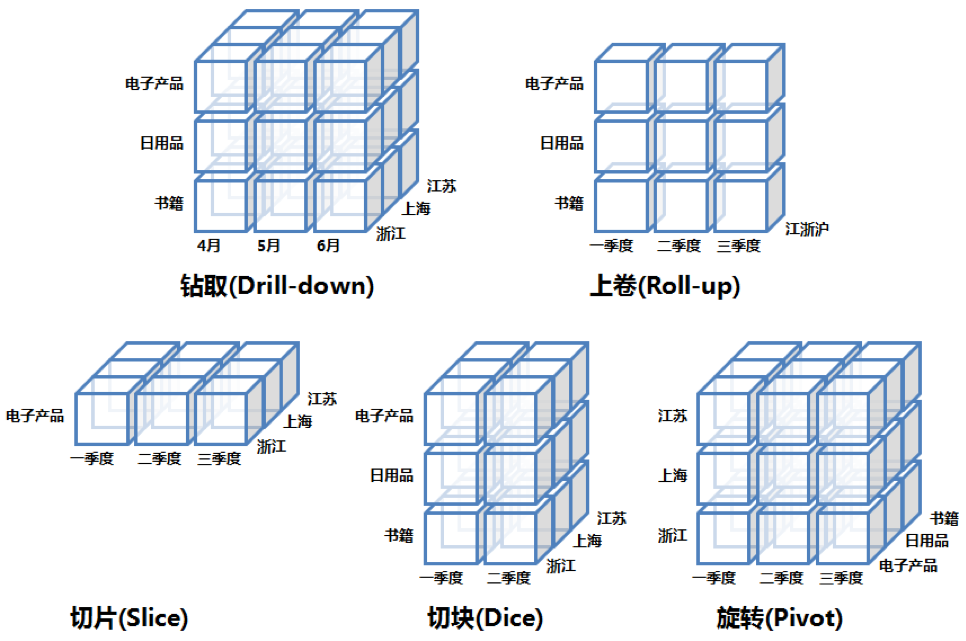

* **钻取(Drill-down)**：在维的不同层次间的变化，从上层降到下一层，或者说是将汇总数据拆分到更细节的数据，比如通过对2016年第二季度的总销售数据进行钻取来查看2016年第二季度4、5、6每个月的消费数据。当然也可以钻取江苏省来查看南京市、江苏市、宿迁市等城市的销售数据。当然上面所说的所有数据都已经在预处理中根据维度组合计算出了所有的度量结果。
* **上卷(Roll-up)**：钻取的逆操作，即从细粒度数据项更高汇总层的聚合，如将江苏省、上海市和浙江省的销售数据进行汇总来查看江浙沪地区的销售数据。
* **切片(Slice)**：选择维中特定的值进行分析，比如只选择电子产品的销售数据，或者2016年第二季度的数据。
* **切块(Dice)**：选择维中特定区间的数据或者某批特定值进行分析，比如选择2016年第一季度到2016年第二季度的销售数据，或者是电子产品和日用品的销售数据。
* **旋转(Pivot)**：即维的位置的互换，就像是二维表的行列转换，如上图中通过旋转实现产品维和地域维的互换。


# 3 搭建
## 3.1 软件要求
* Hadoop: 2.7+, 3.1+ (since v2.5)
* Hive: 0.13 - 1.2.1+
* HBase: 1.1+, 2.0 (since v2.5)
* Spark (可选) 2.3.0+
* Kafka (可选) 1.0.0+ (since v2.5)
* JDK: 1.8+ (since v2.5)
* OS: Linux only, CentOS 6.5+ or Ubuntu 16.0.4+

经过前几张我们的环境里已经安装了 JDK 1.8、CentOS 7、Hadoop 3.1.2、Hive 3.1.1、Zookeeper 3.4.14、HBase 2.2.1，对于安装 Kylin 2.6.3 版本这些硬件要求基本都满足。

Kylin 依赖于 Hadoop 集群处理大量的数据集。您需要准备一个配置好 HDFS，YARN，MapReduce,，Hive， HBase，Zookeeper 和其他服务的 Hadoop 集群供 Kylin 运行。
Kylin 可以在 Hadoop 集群的任意节点上启动。方便起见，您可以在 master 节点上运行 Kylin。但为了更好的稳定性，我们建议您将 Kylin 部署在一个干净的 Hadoop client 节点上，
该节点上 Hive，HBase，HDFS 等命令行已安装好且 client 配置（如 core-site.xml，hive-site.xml，hbase-site.xml及其他）也已经合理的配置且其可以自动和其它节点同步。

运行 Kylin 的 Linux 账户要有访问 Hadoop 集群的权限，包括创建/写入 HDFS 文件夹，Hive 表， HBase 表和提交 MapReduce 任务的权限。

## 3.2 硬件要求
运行 Kylin 的服务器的最低配置为 4 core CPU，16 GB 内存和 100 GB 磁盘。 对于高负载的场景，建议使用 24 core CPU，64 GB 内存或更高的配置。

## 3.3 安装

```bash
# 1 下载。可以访问 https://kylin.apache.org/download/ 下载适合您版本的二级制文件
# 例如因为前面换进中Hadoop 为3.1.2 ，所以这里下载基于Hadoop 3 的二进制包
wget http://mirrors.tuna.tsinghua.edu.cn/apache/kylin/apache-kylin-2.6.3/apache-kylin-2.6.3-bin-hadoop3.tar.gz -P /opt/

# 2 解压
tar -zxf /opt/apache-kylin-2.6.3-bin-hadoop3.tar.gz -C /opt
cd /opt/apache-kylin-2.6.3-bin-hadoop3

# 3 查看目录。如果没有可以使用这个命令安装：yum -y install tree
# 目录的详细说明如下：
#  bin: shell 脚本，用于启动／停止 Kylin，备份／恢复 Kylin 元数据，以及一些检查端口、获取 Hive/HBase 依赖的方法等；
#  conf: Hadoop 任务的 XML 配置文件，这些文件的作用可参考配置页面
#  lib: 供外面应用使用的 jar 文件，例如 Hadoop 任务 jar, JDBC 驱动, HBase coprocessor 等.
#  meta_backups: 执行 bin/metastore.sh backup 后的默认的备份目录;
#  sample_cube 用于创建样例 Cube 和表的文件。
#  tomcat: 自带的 tomcat，用于启动 Kylin 服务。
#  tool: 用于执行一些命令行的jar文件。
[root@cdh1 apache-kylin-2.6.3-bin-hadoop3]# tree -L 1
# .
# ├── bin
# ├── commit_SHA1 （文件）
# ├── conf
# ├── lib
# ├── LICENSE   （文件）
# ├── NOTICE    （文件）
# ├── README.md （文件）
# ├── sample_cube
# ├── tomcat
# └── tool

```

## 3.4 环境变量和 Spark
配置Kylin环境变量 `vim /etc/profile`，添加如下
```bash
export KYLIN_HOME=/opt/apache-kylin-2.6.3-bin-hadoop3
```

从 v2.6.1 开始，Kylin 不再包含 Spark 二进制包; 我们需要另外下载 Spark，然后设置`SPARK_HOME`系统变量到 Spark 安装目录：
```bash
# 下载Spark
wget http://mirrors.tuna.tsinghua.edu.cn/apache/spark/spark-2.3.4/spark-2.3.4-bin-hadoop2.7.tgz

# 解压
tar -zxvf spark-2.3.4-bin-hadoop2.7.tgz -C $KYLIN_HOME

# 重命名spark文件
mv $KYLIN_HOME/spark-2.3.4-bin-hadoop2.7 $KYLIN_HOME/spark

# Remove unused components in Spark
rm -rf $KYLIN_HOME/spark/lib/spark-examples-*
rm -rf $KYLIN_HOME/spark/examples
rm -rf $KYLIN_HOME/spark/data
rm -rf $KYLIN_HOME/spark/R

```

也可以执行Kylin自带的脚本，这种方式会下载`Spark 2.3.2` Hadoop的版本是`Hadoop 2.7`，如果网络有限制或者版本有要求，不推荐用这种方式的。
```bash
# 执行脚本下载 spark-2.3.2-bin-hadoop2.7.tgz
# 
# 这种方式会将Spark下载到 /tmp/spark_package
# 会自动访问  http://archive.apache.org/dist/spark/spark-2.3.2/spark-2.3.2-bin-hadoop2.7.tgz
$KYLIN_HOME/bin/download-spark.sh

```
 
 
## 3.5 检查运行环境
Kylin 运行在 Hadoop 集群上，对各个组件的版本、访问权限及 CLASSPATH 等都有一定的要求，为了避免遇到各种环境问题，我们可以运行Kylin自带的
脚本来进行环境检测，如果我们的环境存在任何的问题，脚本将打印出详细报错信息。如果没有报错信息，代表我们的环境适合 Kylin 运行。
```bash
# 检查运行环境
$KYLIN_HOME/bin/check-env.sh

# 检查Kylin依赖的 HBase 是否完整
$KYLIN_HOME/bin/find-hbase-dependency.sh
# 检查Kylin依赖的 Hive 是否完整
$KYLIN_HOME/bin/find-hive-dependency.sh


```

## 3.6 配置Kylin参数
Kylin 会自动从环境中读取 Hadoop 配置（core-site.xml），Hive 配置（hive-site.xml）和 HBase 配置（hbase-site.xml），
另外Kylin 的配置文件在 `$KYLIN_HOME/conf/` 目录下，配置文件的目录结构如下
```bash
[root@cdh1 conf]# tree -L 1
# .
# ├── kylin_hive_conf.xml               # 该文件包含了 Hive 任务的配置项
# ├── kylin_job_conf_inmem.xml          # 该文件包含了 MapReduce 任务的配置项。当执行 In-mem Cubing 任务时，需要在改文件中为 mapper 申请更多的内存
# ├── kylin_job_conf.xml                # 该文件包含了 MapReduce 任务的配置项。
# ├── kylin-kafka-consumer.xml          # 该文件包含了 Kafka 任务的配置项。
# ├── kylin.properties                  # 该文件是 Kylin 使用的全局配置文件。
# ├── kylin-server-log4j.properties     # 该文件包含了 Kylin 服务器的日志配置项。
# ├── kylin-spark-log4j.properties
# ├── kylin-tools-log4j.properties      # 该文件包含了 Kylin 命令行的日志配置项。
# └── setenv.sh # 该文件是用于设置环境变量的 shell 脚本，可以通过 KYLIN_JVM_SETTINGS 调整 Kylin JVM 栈的大小，且可以设置 KAFKA_HOME 等其他环境变量。

0 directories, 9 files
```

Kylin的配置文件主要是[kylin.properties](https://kylin.apache.org/docs30/install/configuration.html)，
重要的配置如下，其它配置可以查看官方的配置文档。
```yaml
# 同一个Metadata表。默认HBase表为kylin_metadata。主要用来保存元数据
kylin.metadata.url=kylin_metadata@hbase
# 指定 Kylin 服务所用的 HDFS 路径，默认值为 /kylin
kylin.env.hdfs-working-dir=/kylin
# 指定 Kylin 部署的用途，参数值可选 DEV。可选参数：DEV、QA、PROD
#  DEV will turn on some dev features, QA and PROD has no difference in terms of functions.
#  在 DEV 模式下一些开发者功能将被启用
kylin.env=DEV
# 指定 Kylin 服务所用的 ZooKeeper 路径，默认值为 /kylin
kylin.env.zookeeper-base-path=/kylin
# 指定 Kylin 实例的运行模式，参数值可选 all， job， query，默认值为 all
#   job 模式代表该服务仅用于任务调度，不用于查询；
#   query 模式代表该服务仅用于查询，不用于构建任务的调度；
#   all 模式代表该服务同时用于任务调度和 SQL 查询。
#  all表示既可以运行job引擎，又可以运行query引擎。在一个Kylin引擎下只能运行一个Job引擎
kylin.server.mode=all
# 指定集群名称
kylin.server.cluster-name=my-kylin
## List of web servers in use, this enables one web server instance to sync up with other servers.
kylin.server.cluster-servers=cdh1:7070
# 指定 Kylin 的 REST 服务所使用的时区，默认值为 GMT+8
kylin.web.timezone=GMT+8
# 是否支持跨域访问，默认值为 TRUE
kylin.web.cross-domain-enabled=true
# 是否启用 Dashboard，默认值为 FALSE
kylin.web.dashboard-enabled=true

#### JOB ###
# 作业失败时最大尝试的次数，默认为0，不进行尝试
kylin.job.retry=3
# 作业的最大并行度，默认为10
kylin.job.max-concurrent-jobs=10

### 邮件通知设置
## If true, will send email notification on job complete
##kylin.job.notification-enabled=true
##kylin.job.notification-mail-enable-starttls=true
##kylin.job.notification-mail-host=smtp.office365.com
##kylin.job.notification-mail-port=587
##kylin.job.notification-mail-username=kylin@example.com
##kylin.job.notification-mail-password=mypassword
##kylin.job.notification-mail-sender=kylin@example.com

#### ENGINE ###
# reduce阶段默认输入的大小，默认为500MB
kylin.engine.mr.reduce-input-mb=500

#### SOURCE ###
# Kylin作业工程中产生的中间表存放在Hive的库名，默认在 default
kylin.source.hive.database-for-flat-table=default
# Hive client类型, valid value [cli, beeline]
#  如果系统支持持beeline，可以修改为beeline
kylin.source.hive.client=cli
# Parameters for beeline client, only necessary if hive client is beeline
# 当使用beeline时需要配置此参数
#kylin.source.hive.beeline-params=-n root --hiveconf hive.security.authorization.sqlstd.confwhitelist.append='mapreduce.job.*|dfs.*' -u jdbc:hive2://localhost:10000


#### STORAGE ###
# The storage for final cube file in hbase
kylin.storage.url=hbase
# htable表的压缩编解码方式 , valid value [none, snappy, lzo, gzip, lz4]
kylin.storage.hbase.compression-codec=none
# HBase的region切分大小，默认为5GB
kylin.storage.hbase.region-cut-gb=5
# HBase表的底层存储的HFile大小，越小的HFile，导致转换HFile的MR就会有更多的reduces，并且处理的速度更快
# 如果设置为0，则取消这个优化策略。默认为2GB
kylin.storage.hbase.hfile-size-gb=2

```

## 3.7 启动和停止Kylin
```bash
# 启动。在启动前先确定 Hadoop和HBase已经启动
$KYLIN_HOME/bin/kylin.sh start
# 服务器启动后，您可以通过查看kylin.log获得运行时日志。
tail -f $KYLIN_HOME/logs/kylin.log

# 关闭
$KYLIN_HOME/bin/kylin.sh stop

# 查看Kylin后台进程
ps -ef | grep kylin

```

启动成功后控制台会打印如下信息，此时我们可以看到Kylin的Web UI信息
```
Retrieving hadoop conf dir...
KYLIN_HOME is set to /opt/apache-kylin-2.6.3-bin-hadoop3
Retrieving hive dependency...
Retrieving hbase dependency...
hbase 检查完毕 /opt/hbase-2.2.1/lib/hbase-common-2.2.1.jar
Retrieving hadoop conf dir...
Retrieving kafka dependency...
Retrieving Spark dependency...
Start to check whether we need to migrate acl tables
Retrieving hive dependency...
Retrieving hbase dependency...
hbase 检查完毕 /opt/hbase-2.2.1/lib/hbase-common-2.2.1.jar
Retrieving hadoop conf dir...
Retrieving kafka dependency...
Retrieving Spark dependency...

……

A new Kylin instance is started by root. To stop it, run 'kylin.sh stop'
Check the log at /opt/apache-kylin-2.6.3-bin-hadoop3/logs/kylin.log
Web UI is at http://node1:7070/kylin

```


## 3.8 错误解决

**错误1**：如果启动时报无法通过指定的URL找到Kylin在HBase的元信息表：
```
Exception in thread "main" java.lang.IllegalArgumentException: Failed to find metadata store by url: kylin_metadata@hbase
	at org.apache.kylin.common.persistence.ResourceStore.createResourceStore(ResourceStore.java:99)
	at org.apache.kylin.common.persistence.ResourceStore.getStore(ResourceStore.java:111)
	at org.apache.kylin.rest.service.AclTableMigrationTool.checkIfNeedMigrate(AclTableMigrationTool.java:99)
	at org.apache.kylin.tool.AclTableMigrationCLI.main(AclTableMigrationCLI.java:43)
Caused by: java.lang.reflect.InvocationTargetException
	at sun.reflect.NativeConstructorAccessorImpl.newInstance0(Native Method)
	at sun.reflect.NativeConstructorAccessorImpl.newInstance(NativeConstructorAccessorImpl.java:62)
	at sun.reflect.DelegatingConstructorAccessorImpl.newInstance(DelegatingConstructorAccessorImpl.java:45)
	at java.lang.reflect.Constructor.newInstance(Constructor.java:423)
	at org.apache.kylin.common.persistence.ResourceStore.createResourceStore(ResourceStore.java:92)
	... 3 more

```

这种问题是因为HBase或者ZooKeeper或者HDFS上的元信息没有彻底删除或者权限不够，导致信息初始化不完整，因此可以先保证HDFS上配置的路径有相应的权限，
如果HBase有初始化的表，进入HBase shell 删除对应的表，最后进入ZooKeeper的Cli将Kylin和HBase的ZNode节点信息删除，
再重启Kylin进行元信息的初始化，必要时可能还需要重启系统。
```
# 进入 zkCli.sh ，对znode进行操作
[root@cdh1 logs]# zkCli.sh

# 删除如下信息
[zk: localhost:2181(CONNECTED) 1] rmr /kylin/kylin_metadata
[zk: localhost:2181(CONNECTED) 2] rmr /hbase/table/kylin_metadata

```

**错误2**：启动时成功的，但至当我们访问 http://<hostname>:7070/kylin 时发现无法访问，因此查看日志cat -f $KYLIN_HOME/logs/kylin.out，
发现如下错误。这个错误情况比较复杂，如果Web UI可能正常访问，此问题可以不用管，因为我们没有设置https访问。但是如果WebUI不能访问，需要我们解决了。
```
Caused by: org.apache.catalina.LifecycleException: Protocol handler initialization failed
	at org.apache.catalina.connector.Connector.initInternal(Connector.java:995)
	at org.apache.catalina.util.LifecycleBase.init(LifecycleBase.java:107)
	... 18 more
Caused by: java.lang.IllegalArgumentException: /opt/apache-kylin-2.6.3-bin-hadoop3/tomcat/conf/.keystore (没有那个文件或目录)
	at org.apache.tomcat.util.net.AbstractJsseEndpoint.createSSLContext(AbstractJsseEndpoint.java:115)
	at org.apache.tomcat.util.net.AbstractJsseEndpoint.initialiseSsl(AbstractJsseEndpoint.java:86)
	at org.apache.tomcat.util.net.NioEndpoint.bind(NioEndpoint.java:244)
	at org.apache.tomcat.util.net.AbstractEndpoint.init(AbstractEndpoint.java:1087)
	at org.apache.tomcat.util.net.AbstractJsseEndpoint.init(AbstractJsseEndpoint.java:265)
	at org.apache.coyote.AbstractProtocol.init(AbstractProtocol.java:581)
	at org.apache.coyote.http11.AbstractHttp11Protocol.init(AbstractHttp11Protocol.java:68)
	at org.apache.catalina.connector.Connector.initInternal(Connector.java:993)
	... 19 more
```

从日志中可以看到端口初始化失败，紧接着是 `/opt/apache-kylin-2.6.3-bin-hadoop3/tomcat/conf/` 没有 `.keystore` ，
因此我们首先排查报错的那个路径是否有对应的写权限，查看这个目录的权限,赋予权限后重启。
```bash
# 1 进入到 conf 目录下
[root@node1 conf]# cd /opt/apache-kylin-2.6.3-bin-hadoop3/tomcat/conf/

# 1.1 查看信息，发现这个目录下的文件下权限不够，因此赋予权限
[root@node1 conf]# ll
总用量 252
drwxr-xr-x 3 root root     23 10月  6 03:16 Catalina
-rw-r--r-- 1 root root  13548 6月  27 19:25 catalina.policy
-rw-r--r-- 1 root root   7746 6月  27 19:25 catalina.properties
-rw-r--r-- 1 root root   7746 6月  27 19:25 catalina.properties.bak
-rw-r--r-- 1 root root   1534 6月  27 19:25 context.xml
-rw-r--r-- 1 root root   1338 6月  27 19:25 context.xml.bak
-rw-r--r-- 1 root root   1149 6月  27 19:25 jaspic-providers.xml
-rw-r--r-- 1 root root   2313 6月  27 19:25 jaspic-providers.xsd
-rw-r--r-- 1 root root   3622 6月  27 19:25 logging.properties
-rw-r--r-- 1 root root   7157 6月  27 19:25 server.xml
-rw-r--r-- 1 root root   7511 6月  27 19:25 server.xml.bak
-rw-r--r-- 1 root root   7157 6月  27 19:25 server.xml.init
-rw-r--r-- 1 root root   2164 6月  27 19:25 tomcat-users.xml
-rw-r--r-- 1 root root   2633 6月  27 19:25 tomcat-users.xsd
-rw-r--r-- 1 root root 169322 6月  27 19:25 web.xml

[root@cdh1 conf]# cd ..
# 1.2 conf先的文件权限赋为 755
[root@cdh1 tomcat]# chmod 755 -R ./conf

```

重启后再次访问Web UI看是否可能正常访问，如果还是无法正常访问，可以修改Kylin自带的Tomcat的配置文件，将https相关的配置注释掉。
```html
# 2 去掉Kylin自带的Tomcat配置文件中的htts
vim $KYLIN_HOME/tomcat/conf/server.xml

# 2.1 搜做https并将其注释掉
<!--<Connector port="7443" protocol="org.apache.coyote.http11.Http11Protocol"
                   maxThreads="150" SSLEnabled="true" scheme="https" secure="true"
                   keystoreFile="conf/.keystore" keystorePass="changeit"
                   clientAuth="false" sslProtocol="TLS" />-->

# 2.2 再次重启

```

**错误3**：这个错误隐藏的比较深，也是比较常见的错误，因为在启动的时候，我们可以从启动控制台打印的日志里看到并没有加载Hive的lib下的依赖，
但是当我们执行关于Hive操作时（例如Job执行时、数据导入时等）就会在Web UI页面提示因为某个类导致了失败，此时我们查看Kylin的
日志`cat $KYLIN_HOME/logs/kylin.out`，会发下如下的错误，网上也有一些解决方法（在系统环境变量添加
`export hive_dependency=$HIVE_HOME/conf:$HIVE_HOME/lib/*:$HCAT_HOME/share/hcatalog/hive-hcatalog-core-3.1.1.jar`，
然后修改Kylin启动脚本，还有将Hive的lib下的jar全部拷贝到Kylin的lin下的），但是都会产生一些问题，我这里发现这样做后Kylin的元数据信息表无法初始化。
```
java.lang.NoClassDefFoundError: org/apache/hadoop/hive/conf/HiveConf
	at org.apache.kylin.source.hive.HiveClientFactory.getHiveClient(HiveClientFactory.java:27)
	at org.apache.kylin.source.hive.RedistributeFlatHiveTableStep.computeRowCount(RedistributeFlatHiveTableStep.java:40)
	at org.apache.kylin.source.hive.RedistributeFlatHiveTableStep.doWork(RedistributeFlatHiveTableStep.java:91)
	at org.apache.kylin.job.execution.AbstractExecutable.execute(AbstractExecutable.java:167)
	at org.apache.kylin.job.execution.DefaultChainedExecutable.doWork(DefaultChainedExecutable.java:71)
	at org.apache.kylin.job.execution.AbstractExecutable.execute(AbstractExecutable.java:167)
	at org.apache.kylin.job.impl.threadpool.DefaultScheduler$JobRunner.run(DefaultScheduler.java:114)
	at java.util.concurrent.ThreadPoolExecutor.runWorker(ThreadPoolExecutor.java:1149)
	at java.util.concurrent.ThreadPoolExecutor$Worker.run(ThreadPoolExecutor.java:624)
	at java.lang.Thread.run(Thread.java:748)
Caused by: java.lang.ClassNotFoundException: org.apache.hadoop.hive.conf.HiveConf
	at org.apache.catalina.loader.WebappClassLoaderBase.loadClass(WebappClassLoaderBase.java:1309)
	at org.apache.catalina.loader.WebappClassLoaderBase.loadClass(WebappClassLoaderBase.java:1137)
	... 10 more
```

然后我们还是仔细看下Kylin启动时打印的环境变量信息，可以发现其实它是会将Kylin的lib文件夹下的依赖jar添加进来的，因此我们根据提示的错误信息，找到这个缺少的类的jar包，
然后将这个jar包软连接到Kylin的lib，重启启动Kylin问题就可以完美解决。这里笔者也是经过多次排查，需要完整引入如下的五个Hive的依赖jar。
```bash
# 将hive-common-3.1.1.jar软连接到Kylin的lib下。org/apache/hadoop/hive/conf/HiveConf所在的包
ln -s $HIVE_HOME/lib/hive-common-3.1.1.jar $KYLIN_HOME/lib/hive-common-3.1.1.jar
ln -s $HIVE_HOME/lib/hive-exec-3.1.1.jar $KYLIN_HOME/lib/hive-exec-3.1.1.jar
ln -s $HIVE_HOME/lib/hive-hcatalog-core-3.1.1.jar $KYLIN_HOME/lib/hive-hcatalog-core-3.1.1.jar
ln -s $HIVE_HOME/lib/hive-standalone-metastore-3.1.1.jar $KYLIN_HOME/lib/hive-standalone-metastore-3.1.1.jar
ln -s $HIVE_HOME/lib/libfb303-0.9.3.jar $KYLIN_HOME/lib/libfb303-0.9.3.jar

##########
# 一个创建软连接的脚本
##!/bin/bash
#cd $HIVE_HOME/lib
#for a in *.jar;do
#ln -s $HIVE_HOME/lib/$a $KYLIN_HOME/lib/$a 
#done
##########

################
#1 在系统环境配置文件中添加 hive_dependency
#vim /etc/profile
# 添加如下
#export hive_dependency=$HIVE_HOME/conf:$HIVE_HOME/lib/*:$HCAT_HOME/share/hcatalog/hive-hcatalog-core-3.1.1.jar
#2 生效
#source /etc/profile
# 在Kylin启动脚本添加上这个参数
#3vim $KYLIN_HOME/bin/kylin.sh

#43     #retrive $KYLIN_EXTRA_START_OPTS
#44     if [ -f "${dir}/setenv.sh" ]; then
#45         echo "WARNING: ${dir}/setenv.sh is deprecated and ignored, please remove it and use ${KYLIN_HOME}/conf/setenv.sh instead"
#46         source ${dir}/setenv.sh
#47     fi
#48 
#49     if [ -f "${KYLIN_HOME}/conf/setenv.sh" ]; then
#50         source ${KYLIN_HOME}/conf/setenv.sh
#51     fi
#52     export HBASE_CLASSPATH_PREFIX=$CATALINA_HOME/bin/bootstrap.jar:$CATALINA_HOME/bin/tomcat-juli.jar:$CATALINA_HOME/lib/*:$hive_dependency:$HBASE_CLASSPATH_PREFIX
#53     export HBASE_CLASSPATH_PREFIX=${KYLIN_HOME}/conf:${KYLIN_HOME}/lib/*:${KYLIN_HOME}/ext/*:${HBASE_CLASSPATH_PREFIX}
#54     export HBASE_CLASSPATH=${HBASE_CLASSPATH}:${hive_dependency}:${kafka_dependency}:${spark_dependency}
#55 
#56     verbose "HBASE_CLASSPATH: ${HBASE_CLASSPATH}"
#57 }
################

#重启Kylin
$KYLIN_HOME/bin/kylin.sh stop
$KYLIN_HOME/bin/kylin.sh start

```


## 3.9 启动后的HDFS目录结构
Kylin 会在 HDFS 上生成文件，根目录是 `/kylin/`, 然后会使用 Kylin 集群的元数据表名作为第二层目录名，默认为 `kylin_metadata` (可以在conf/kylin.properties中定制).

通常, `/kylin/kylin_metadata` 目录下会有这么几种子目录：cardinality, coprocessor, kylin-job_id, resources, jdbc-resources。
* **cardinality**： Kylin 加载 Hive 表时，会启动一个 MR 任务来计算各个列的基数，输出结果会暂存在此目录。此目录可以安全清除。
* **coprocessor**：Kylin 用于存放 HBase coprocessor jar 的目录，请勿删除。
* **kylin-job_id**： Cube 计算过程的数据存储目录，请勿删除。 如需要清理，请遵循 storage cleanup guide.
* **resources**：Kylin 默认会将元数据存放在 HBase，但对于太大的文件（如字典或快照），会转存到 HDFS 的该目录下，请勿删除。如需要清理，请遵循 cleanup resources from metadata。
* **jdbc-resources**：性质同上，只在使用 MySQL 做元数据存储时候出现。

<br/>

# 4 使用Kylin
Kylin 启动后我们可以通过浏览器 [http://<hostname>:7070/kylin](http://cdh1:7070/kylin) 进行访问。
其中 <hostname> 为具体的机器名、IP 地址或域名，默认端口为 7070。

初始用户名和密码是 **ADMIN/KYLIN**。

我们安装的Kylin自带了一份用于测试的样例数据，这份数据包含了几张表的数据，大小为 1.49 MB，文件名的格式为`库名.表名`，其中事实表为`KYLIN_SALES`，
维表为`KYLIN_CAL_DT`和`KYLIN_CATEGORY_GROUPINGS`，另外两张表我们暂时先不用管。
```bash
# 查看样例数据的数据量
[root@cdh1 conf]# wc -l $KYLIN_HOME/sample_cube/data/*
  10000 /opt/apache-kylin-2.6.3-bin-hadoop3/sample_cube/data/DEFAULT.KYLIN_ACCOUNT.csv
    731 /opt/apache-kylin-2.6.3-bin-hadoop3/sample_cube/data/DEFAULT.KYLIN_CAL_DT.csv
    144 /opt/apache-kylin-2.6.3-bin-hadoop3/sample_cube/data/DEFAULT.KYLIN_CATEGORY_GROUPINGS.csv
    244 /opt/apache-kylin-2.6.3-bin-hadoop3/sample_cube/data/DEFAULT.KYLIN_COUNTRY.csv
   9999 /opt/apache-kylin-2.6.3-bin-hadoop3/sample_cube/data/DEFAULT.KYLIN_SALES.csv
  21118 总用量

```

KYLIN_SALES 表时一个事实表，其保存了销售订单的明细信息，每一行对应着一笔交易订单。
CATEGORY_GROUPINGS 是一个维表，其保存了商品分类的详细介绍。
KYLIN_CAL_DT 也是一个维表，表中保存了时间的扩展信息。

```
# KYLIN_SALES
0,2012-12-14,Others,88750,0,11,36.2828,4,10000349,10002313,ANALYST,Beijing
1,2012-08-28,Others,175750,0,13,23.8563,20,10000927,10004376,ANALYST,Beijing

# CATEGORY_GROUPINGS
48027,Coins & Paper Money:Paper Money: World:Asia:Japan,0,,,,10,Coins,2008-06-03,2013-07-16 08:23:09,USER_X,USER_Y,11116,Coins & Paper Money,3411,8008,48027,48027,48027,48027,Paper Money: World,Asia,Japan,Japan,Japan,Japan,262144,N,-999,Coins,5837,3069,48027,10,1,Collectibles
164261,Jewelry & Watches:Fashion Jewelry:Earrings:Dangle & Chandelier:Sterling Silver (w/o Stone),0,,,,17,JewelrGemWatches,2008-08-12,2012-09-11 20:26:04,USER_X,USER_Y,281,Jewelry & Watches,10968,50647,50647,50647,50647,50647,Fashion Jewelry,Earrings,Earrings,Earrings,Earrings,Earrings,262144,N,-999,JewelrGemWatches,2928,1873,50647,17,1,Fashion

# KYLIN_CAL_DT
2012-08-16,2012-01-01,2012-07-01,2012-08-01,2012-08-11,0,-1,-3,-15,-103,0,-1,-4,-15,-15,41501,228,47,16,6,33,5928,2,8,1364,3,455,114,2012-12-31,2012-09-30,2012-08-31,2012-08-17,16-Aug-2012,Aug 16th 2012,Fri 08-16-13,1,0,0,0,2012-06-21,365,92,31,7,2012-12-30,2012-06-30,2012-07-28,2012-08-11,2012-08-12,2012-08-16,Fri       ,2012M08,Aug-2012,N,2012M08   ,N,Year 2012 - Quarter 03,2012Q03   ,N,33,2012,2012-08-11,2012-08-17,N,Wk.33 - 13,2012-08-11 00:00:00,2012-08-17 00:00:00,2012W33   ,2012W33   ,08/11/13 - 08/17/13,08/11 - 08/17,2012,N,2012-08-16,2011-08-16,2012-05-16,2012-02-16,2012-07-16,2012-06-16,2012-08-09,2012-08-02,0,0,0,0,0,0,0,0,8,3,33,3,1,1,1,2005-09-07,USER_X  ,2012-11-27 00:16:56,USER_X
2012-01-03,2012-01-01,2012-01-01,2012-01-01,2012-01-01,0,-3,-10,-47,-328,0,-3,-11,-47,-47,41276,3,3,3,5,1,5896,1,1,1357,1,453,114,2012-12-31,2012-03-31,2012-01-31,2012-01-05,03-Jan-2012,Jan 3rd 2012,Thu 01-03-13,1,0,0,0,2012-12-21,365,90,31,5,2012-12-30,2012-12-30,2012-12-30,2012-12-30,2012-12-31,2012-01-03,Thu       ,2012M01,Jan-2012,N,2012M01   ,N,Year 2012 - Quarter 01,2012Q01   ,N,1,2012,2012-12-30,2012-01-05,N,Wk.01 - 13,2012-01-01 00:00:00,2012-01-05 00:00:00,2012W01   ,2012W01   ,01/01/13 - 01/05/13,01/01 - 01/05,2012,N,2012-01-03,2011-01-03,2012-10-03,2012-07-03,2012-12-03,2012-11-03,2012-12-27,2012-12-20,0,0,0,0,0,0,0,0,1,1,1,1,1,1,1,2005-09-07,USER_X  ,2012-11-27 00:16:56,USER_X

```

## 4.1 准备数据
我们执行 ${KYLIN_HOME}/bin/sample.sh脚本，这个脚本主要做的事情有：①在Hive中创建前面提到的几张表并将数据导入，其创建时执行的脚本为
`$KYLIN_HOME/sample_cube/create_sample_tables.sql`，这个脚本中主要是建表语句和加载数据；②上传Sample Cube的metadata，样例Cube的元数据位于
`$KYLIN_HOME/sample_cube/template`下，每个目录都代表元数据的一部分，而且目录下面都是json格式的文件。当这脚本执行完毕后，会在控制台提示
`Restart Kylin Server or click Web UI => System Tab => Reload Metadata to take effect`，重启服务或者在Web UI页面重新加载元数据(意思就是重启Kylin不是必须的操作)，
我们这里选择通过Web UI加载元数据，如下图，按照提示点在Web UI，击**System**，然后点击页面右边的**Actions**下面的第一个选线**Reload Metadata**。
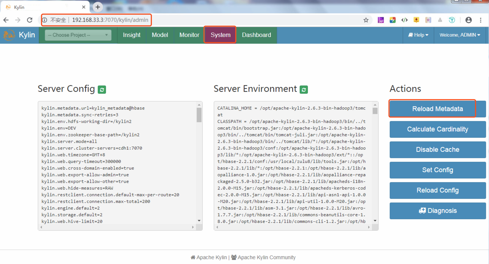

在弹出的提示框中选择Yes即可，后面提示我们加载元数据成功。

我们点击页头的Model，可以看到我们刚才导入的kylin_sales_cube。最左面的选项栏Models显示的我们的模式设计，这里定义了事实表和维度的关联方式、维度、度量等内容。
傍边的Data Source的数据源，支持从Hive中加载数据表，以及使用Streaming Table。最右边的Cubes 就是根据Models来设计的所有Cube列表，
我们可以选择一个Cube进行Drop、Delete、Build、Refresh等操作。

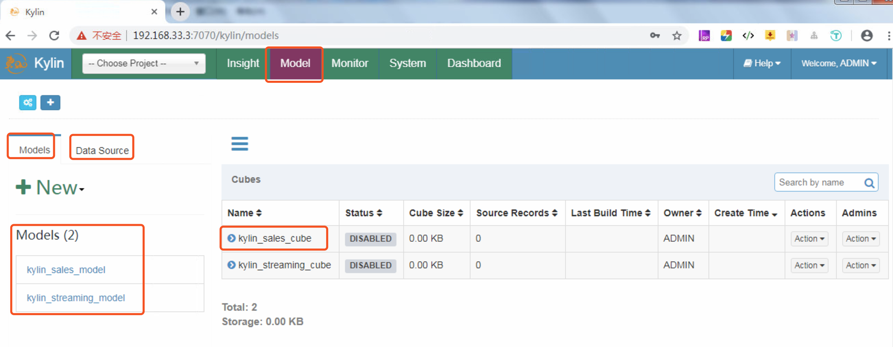


## 4.2 构建Cube
选在页头的`-- Choose Project --`，选择`Learn_Kylin`，在Cubes页面单击Cube名称为`kylin_sales_cube`栏右侧的`Actions`下拉框并选择`Build`操作。
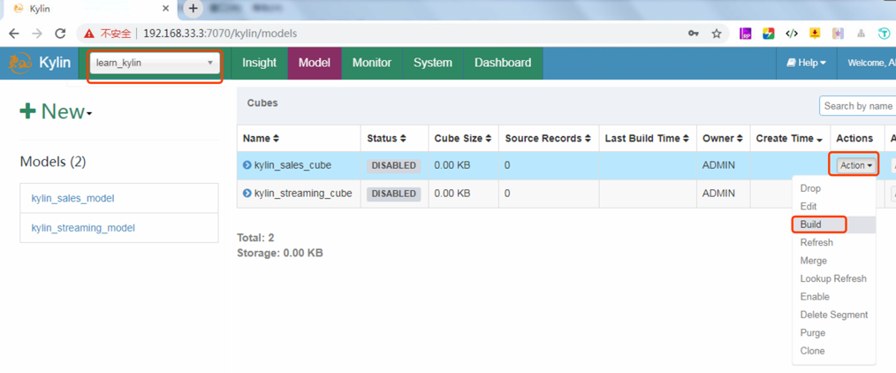

会有如下的弹出窗口。选择Build Cube的时间范围（这个Cube是增量更新的），我们可以看到开始时间已经给我们设置好了（2012-01-01 00:00:00），
这是因为在我们创建Cube过程中设置Refresh的分区开始时间已经设置好了，这个时间也是Hive表`kylin_sales`中字段`part_dt`最小的时间，
我们选择一年的数据，因此结束日期选择2013-01-01 00:00:00（不包含这一天）。
```sql
0: jdbc:hive2://localhost:10000> SELECT MIN(part_dt) min_part_dt,MAX(part_dt) max_part_dt FROM kylin_sales;
+--------------+--------------+
| min_part_dt  | max_part_dt  |
+--------------+--------------+
| 2012-01-01   | 2014-01-01   |
+--------------+--------------+

```
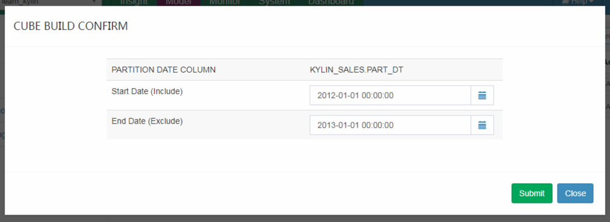

接下来我们单击`Submit`提交，提交后会在右下角`Success`。成功之后，我们可以从`Monitor`页面的所有Job中找到新建的Job，如下图所示。
Job栏包含了Job Name、Cube、Process等内容，而且还包含了Actions相关操作。
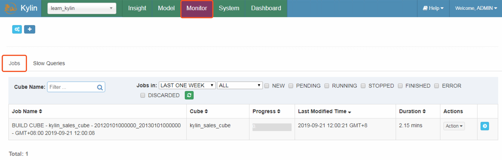

单击Job最右边的箭头符号，查看Job的详细执行流程。Job详细信息为跟踪一个Job提供了它的每一步记录，也可以查看每一步的执行日志。我们可以将光标放在某个步骤状态图标上查看基本状态和信息。
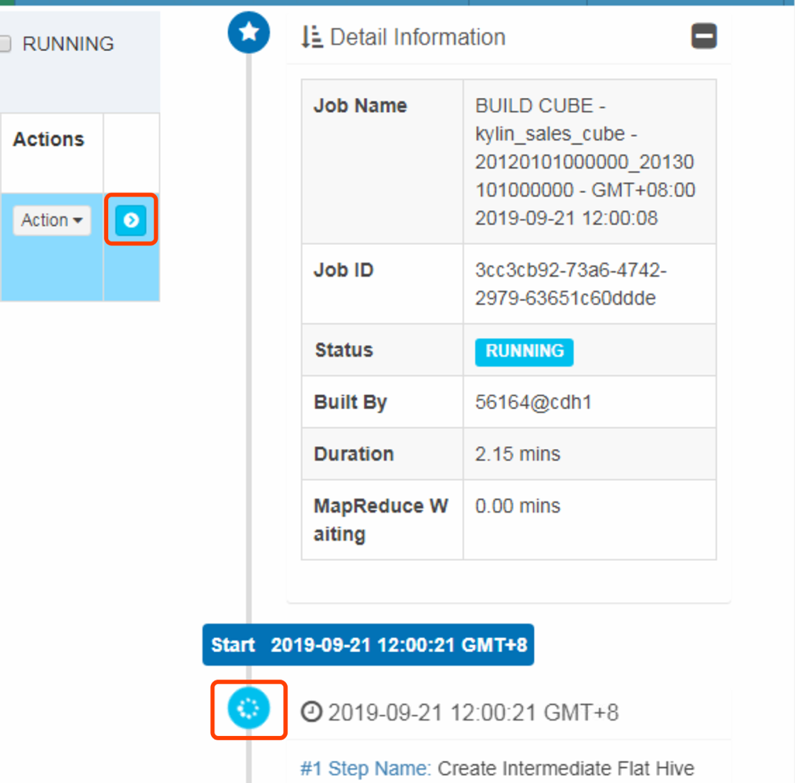

从上面我们可以看到Job还在执行，我们在这个时间可以看下Hive和Hadoop方面都有哪些变化。

**Hive方面的变化**
在Cube构建过程中，我们可以查看Hive表的变化，直接在默认的库下执行即可（kylin.source.hive.database-for-flat-table=default），
我们可以发现有一个表名很长的表，其实这个就是`Intermediate Flat Table`有人称之为平面表。
```sql
0: jdbc:hive2://localhost:10000> SHOW tables;
+----------------------------------------------------+
|                      tab_name                      |
+----------------------------------------------------+
| kylin_account                                      |
| kylin_cal_dt                                       |
| kylin_category_groupings                           |
| kylin_country                                      |
| kylin_intermediate_kylin_sales_cube_c2245d04_6204_d762_1458_8af95480fe3c |
| kylin_sales                                        |
+----------------------------------------------------+
7 rows selected (0.171 seconds)

```

查看日志信息可以看到如下执行的SQL语句。从这个SQL中可以看到创建了一个名字很长的中间临时表，其内容大概为事实表和维度表的关联输后输出维度和度量指标，
以及根据我们增量构建Cube时指定的开始和结束时间来裁剪数据范围。
```sql
Create and distribute table, cmd: 
hive -e "USE default;

DROP TABLE IF EXISTS kylin_intermediate_kylin_sales_cube_c2245d04_6204_d762_1458_8af95480fe3c;
CREATE EXTERNAL TABLE IF NOT EXISTS kylin_intermediate_kylin_sales_cube_c2245d04_6204_d762_1458_8af95480fe3c
(
`KYLIN_SALES_TRANS_ID` bigint
,`KYLIN_SALES_PART_DT` date
,`KYLIN_SALES_LEAF_CATEG_ID` bigint
,`KYLIN_SALES_LSTG_SITE_ID` int
,`KYLIN_CATEGORY_GROUPINGS_META_CATEG_NAME` string
,`KYLIN_CATEGORY_GROUPINGS_CATEG_LVL2_NAME` string
,`KYLIN_CATEGORY_GROUPINGS_CATEG_LVL3_NAME` string
,`KYLIN_SALES_LSTG_FORMAT_NAME` string
,`KYLIN_SALES_SELLER_ID` bigint
,`KYLIN_SALES_BUYER_ID` bigint
,`BUYER_ACCOUNT_ACCOUNT_BUYER_LEVEL` int
,`SELLER_ACCOUNT_ACCOUNT_SELLER_LEVEL` int
,`BUYER_ACCOUNT_ACCOUNT_COUNTRY` string
,`SELLER_ACCOUNT_ACCOUNT_COUNTRY` string
,`BUYER_COUNTRY_NAME` string
,`SELLER_COUNTRY_NAME` string
,`KYLIN_SALES_OPS_USER_ID` string
,`KYLIN_SALES_OPS_REGION` string
,`KYLIN_SALES_PRICE` decimal(19,4)
)
STORED AS SEQUENCEFILE
LOCATION 'hdfs://node1:8020/kylin/kylin_metadata/kylin-3cc3cb92-73a6-4742-2979-63651c60ddde/kylin_intermediate_kylin_sales_cube_c2245d04_6204_d762_1458_8af95480fe3c';
-- 'auto.purge'='true' 表示数据删除后不会放到回收♻️箱，而是直接删除
ALTER TABLE kylin_intermediate_kylin_sales_cube_c2245d04_6204_d762_1458_8af95480fe3c SET TBLPROPERTIES('auto.purge'='true');
INSERT OVERWRITE TABLE `kylin_intermediate_kylin_sales_cube_c2245d04_6204_d762_1458_8af95480fe3c` SELECT
`KYLIN_SALES`.`TRANS_ID` as `KYLIN_SALES_TRANS_ID`
,`KYLIN_SALES`.`PART_DT` as `KYLIN_SALES_PART_DT`
,`KYLIN_SALES`.`LEAF_CATEG_ID` as `KYLIN_SALES_LEAF_CATEG_ID`
,`KYLIN_SALES`.`LSTG_SITE_ID` as `KYLIN_SALES_LSTG_SITE_ID`
,`KYLIN_CATEGORY_GROUPINGS`.`META_CATEG_NAME` as `KYLIN_CATEGORY_GROUPINGS_META_CATEG_NAME`
,`KYLIN_CATEGORY_GROUPINGS`.`CATEG_LVL2_NAME` as `KYLIN_CATEGORY_GROUPINGS_CATEG_LVL2_NAME`
,`KYLIN_CATEGORY_GROUPINGS`.`CATEG_LVL3_NAME` as `KYLIN_CATEGORY_GROUPINGS_CATEG_LVL3_NAME`
,`KYLIN_SALES`.`LSTG_FORMAT_NAME` as `KYLIN_SALES_LSTG_FORMAT_NAME`
,`KYLIN_SALES`.`SELLER_ID` as `KYLIN_SALES_SELLER_ID`
,`KYLIN_SALES`.`BUYER_ID` as `KYLIN_SALES_BUYER_ID`
,`BUYER_ACCOUNT`.`ACCOUNT_BUYER_LEVEL` as `BUYER_ACCOUNT_ACCOUNT_BUYER_LEVEL`
,`SELLER_ACCOUNT`.`ACCOUNT_SELLER_LEVEL` as `SELLER_ACCOUNT_ACCOUNT_SELLER_LEVEL`
,`BUYER_ACCOUNT`.`ACCOUNT_COUNTRY` as `BUYER_ACCOUNT_ACCOUNT_COUNTRY`
,`SELLER_ACCOUNT`.`ACCOUNT_COUNTRY` as `SELLER_ACCOUNT_ACCOUNT_COUNTRY`
,`BUYER_COUNTRY`.`NAME` as `BUYER_COUNTRY_NAME`
,`SELLER_COUNTRY`.`NAME` as `SELLER_COUNTRY_NAME`
,`KYLIN_SALES`.`OPS_USER_ID` as `KYLIN_SALES_OPS_USER_ID`
,`KYLIN_SALES`.`OPS_REGION` as `KYLIN_SALES_OPS_REGION`
,`KYLIN_SALES`.`PRICE` as `KYLIN_SALES_PRICE`
 FROM `DEFAULT`.`KYLIN_SALES` as `KYLIN_SALES`
INNER JOIN `DEFAULT`.`KYLIN_CAL_DT` as `KYLIN_CAL_DT`
ON `KYLIN_SALES`.`PART_DT` = `KYLIN_CAL_DT`.`CAL_DT`
INNER JOIN `DEFAULT`.`KYLIN_CATEGORY_GROUPINGS` as `KYLIN_CATEGORY_GROUPINGS`
ON `KYLIN_SALES`.`LEAF_CATEG_ID` = `KYLIN_CATEGORY_GROUPINGS`.`LEAF_CATEG_ID` AND `KYLIN_SALES`.`LSTG_SITE_ID` = `KYLIN_CATEGORY_GROUPINGS`.`SITE_ID`
INNER JOIN `DEFAULT`.`KYLIN_ACCOUNT` as `BUYER_ACCOUNT`
ON `KYLIN_SALES`.`BUYER_ID` = `BUYER_ACCOUNT`.`ACCOUNT_ID`
INNER JOIN `DEFAULT`.`KYLIN_ACCOUNT` as `SELLER_ACCOUNT`
ON `KYLIN_SALES`.`SELLER_ID` = `SELLER_ACCOUNT`.`ACCOUNT_ID`
INNER JOIN `DEFAULT`.`KYLIN_COUNTRY` as `BUYER_COUNTRY`
ON `BUYER_ACCOUNT`.`ACCOUNT_COUNTRY` = `BUYER_COUNTRY`.`COUNTRY`
INNER JOIN `DEFAULT`.`KYLIN_COUNTRY` as `SELLER_COUNTRY`
ON `SELLER_ACCOUNT`.`ACCOUNT_COUNTRY` = `SELLER_COUNTRY`.`COUNTRY`
WHERE 1=1 AND (`KYLIN_SALES`.`PART_DT` >= '2012-01-01' AND `KYLIN_SALES`.`PART_DT` < '2013-01-01')
;
```

查看Hadoop发生的变化可以先将Hadoop的jobhistory开启，Hadoop的版本不同，开启这个服务的命令也不同，可以执行如下命令开启Hadoop 3.1.2 的 historyserver ，
然后我们就可以看到提交的构建Cube作业的执行信息，同样这个也可以对后续的问题进行快速定位。
```bash
# 启动 jobhistory。访问 http://node1:19888/jobhistory
$HADOOP_HOME/sbin/mr-jobhistory-daemon.sh start historyserver
WARNING: Use of this script to start the MR JobHistory daemon is deprecated.
WARNING: Attempting to execute replacement "mapred --daemon start" instead.
#$HADOOP_HOME/bin/mapred historyserver >/dev/null 2>&1 &
```
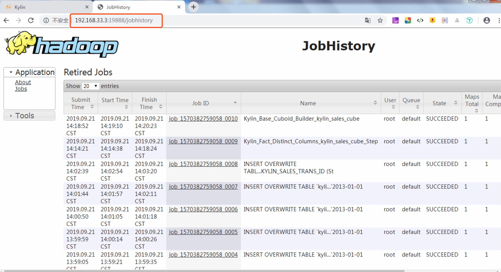

如果想放弃这个Job，单击Job选项的`Actions`下拉框中的`Discard`按钮。Job成功执行完毕后如下图所示：
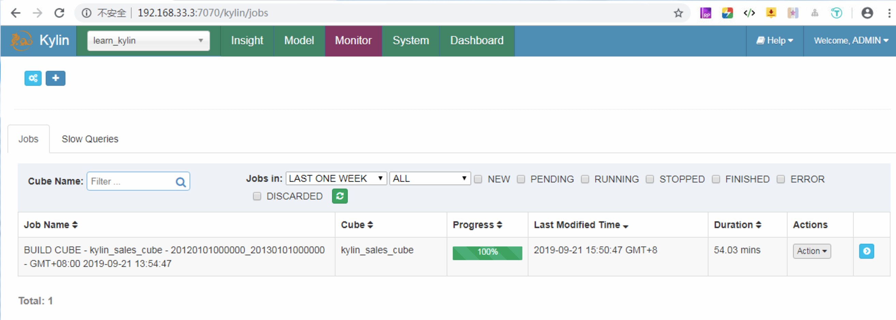

## 4.3 对构建好的Cube进行查询
切换到 Kylin 的 Insight 页面，这个页面提供了交互式的SQL查询。将下面的sql写入到`New Query`中，然后点击右下角提交SQL查询，如下图所示。
```sql
SELECT PART_DT,SUM(PRICE) AS total_selled, COUNT(DISTINCT SELLER_ID) AS sellers
FROM KYLIN_SALES GROUP BY PART_DT ORDER BY PART_DT;

```
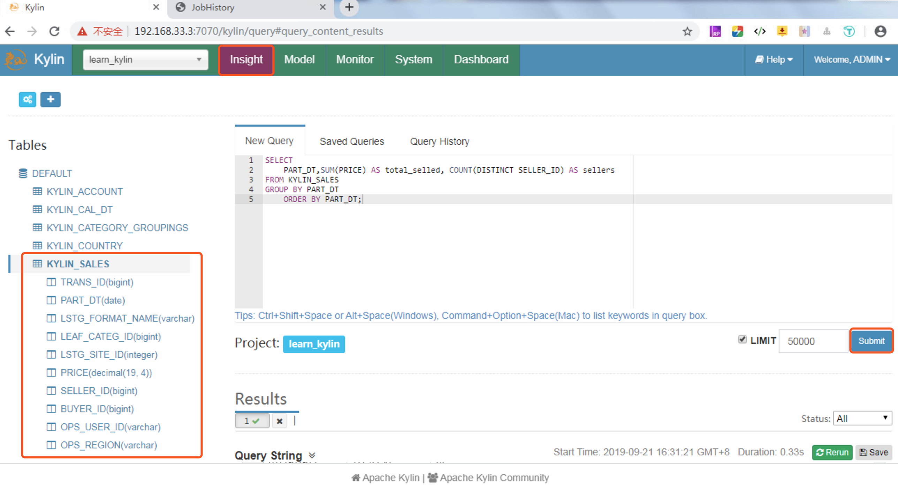

很快执行就成功了，在页面下面可以看到0.33秒就返回了结果，结果如下图所示。
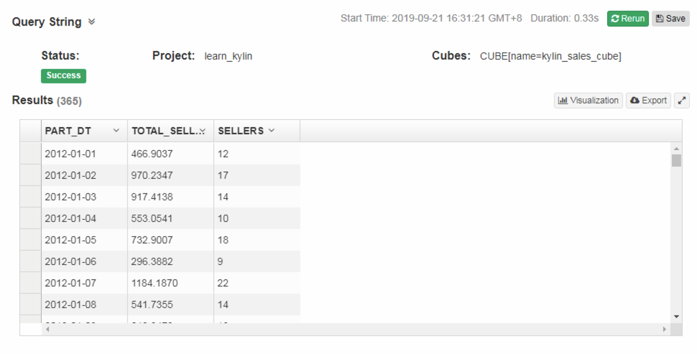


为了感受这个速度，和结果的准确性，我们同样可以在Hive里执行以下，查看下结果和执行的速度，两个对比一下。

```sql
-- 1 查看表默认库下的表。可以看到前面表名很长的表已经不在了
+---------------------------+
|         tab_name          |
+---------------------------+
| kylin_account             |
| kylin_cal_dt              |
| kylin_category_groupings  |
| kylin_country             |
| kylin_sales               |
| person                    |
+---------------------------+
6 rows selected (3.409 seconds)

-- 2 执行同样的 SQL 
--    这里只展示结果表前面一部分的数据。从执行的结果可以看到，Hive执行的结果和Kylin执行的结果一模一样。
--    但是从执行速度上看，Hive用了65秒钟执行完毕，Kylin只用了0.33秒就查询到了结果。
--    所有从这里可以看到Kylin经过Cube构建，经过预计算后的查询速度非常快。
0: jdbc:hive2://localhost:10000> SELECT PART_DT,SUM(PRICE) AS total_selled, COUNT(DISTINCT SELLER_ID) AS sellers 
. . . . . . . . . . . . . . . .> FROM KYLIN_SALES GROUP BY PART_DT ORDER BY PART_DT;
+-------------+---------------+----------+
|   part_dt   | total_selled  | sellers  |
+-------------+---------------+----------+
| 2012-01-01  | 466.9037      | 12       |
| 2012-01-02  | 970.2347      | 17       |
| 2012-01-03  | 917.4138      | 14       |
| 2012-01-04  | 553.0541      | 10       |
| 2012-01-05  | 732.9007      | 18       |
| 2012-01-06  | 296.3882      | 9        |
| 2012-01-07  | 1184.1870     | 23       |
| 2012-01-08  | 541.7355      | 14       |
|    ……       | ……            | ……       |
+-------------+---------------+----------+
731 rows selected (65.254 seconds)

```


# 案例
[Kylin 在携程的实践](https://kyligence.io/zh/blog/usecaseofctrip1/)
[Apache Kylin在链家的实践——链家数据分析引擎的演变史](https://kyligence.io/zh/blog/kylin-lianjia-practice/)


