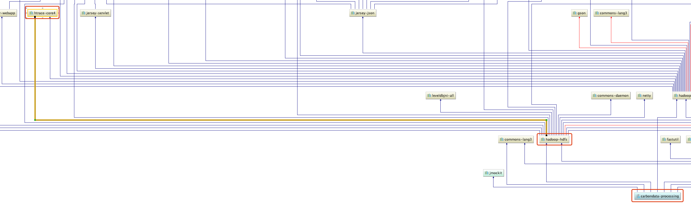

CarbonData与其它框架的集成
---

# 1 编译CarbonData
如果只是和Spark集成是比较简单，官方已经提供了这个编译后的jar包，因此可以直接下载官方提供的`apache-carbondata-1.6.0-bin-spark2.3.2-hadoop2.7.2.jar`包：
[carbondata/1.6.0](https://dist.apache.org/repos/dist/release/carbondata/1.6.0/)。可以直接下载官方已经打好的二进制jar包。
```bash
wget https://dist.apache.org/repos/dist/release/carbondata/1.6.0/apache-carbondata-1.6.0-bin-spark2.3.2-hadoop2.7.2.jar
```

因为配置Hive是需要基本jar包（carbondata-hive-1.6.0.jar、carbondata-hive-1.6.0.jar等包），访问网页查看 [carbondata-hive](https://mvnrepository.com/artifact/org.apache.carbondata/carbondata-hive)，
发现Maven仓库中有最新版的依赖（在之前编译因为Maven中央仓库没有这个依赖包，会导致我发编译），因此我们这里直接采用编译的源码的方式。

**下面**我将采用编译源码的方式安装部署（指定Spark版本为2.3.4、指定Hadoop版本为3.1。2）。

## 1.1 要求
* 类Unix环境（Linux、Mac OS X）
* Git
* Apache Maven（推荐3.3版本或者更高）
* Java 7 或者 Java 8
* [Apache Thrift](http://thrift.apache.org/docs/install/centos) 0.9.3

运行环境中需要Hadoop和Hive，这里使用官方的版本：**Hadoop 2.7.2**、**Hive 1.2.2**

## 1.2 Thrift
```bash
# 1 安装依赖
yum -y install automake libtool flex bison pkgconfig gcc-c++ boost-devel libevent-devel zlib-devel python-devel ruby-devel openssl-devel

# 2 安装 thrift
wget http://archive.apache.org/dist/thrift/0.9.3/thrift-0.9.3.tar.gz
tar -zxf thrift-0.9.3.tar.gz
cd thrift-0.9.3/
./configure --with-boost=/usr/local
make -j24
make install

# 3 验证
thrift -version

```

**错误一**：如果在编译时报如下错误：
```log
g++: error: /usr/local/lib64/libboost_unit_test_framework.a: No such file or directory
make[5]: *** [processor_test] Error 1
make[5]: *** Waiting for unfinished jobs....
make[5]: Leaving directory `/opt/thrift-0.9.3/lib/cpp/test'
make[4]: *** [all] Error 2
make[4]: Leaving directory `/opt/thrift-0.9.3/lib/cpp/test'
make[3]: *** [all-recursive] Error 1
make[3]: Leaving directory `/opt/thrift-0.9.3/lib/cpp'
make[2]: *** [all-recursive] Error 1
make[2]: Leaving directory `/opt/thrift-0.9.3/lib'
make[1]: *** [all-recursive] Error 1
make[1]: Leaving directory `/opt/thrift-0.9.3'
make: *** [all] Error 2
```

出现上面的错误是因为`./configure` 的时候是默认编译32位的，不会在`lib64/`下产生文件，可以先查找`libboost_unit_test_framework.a`文件，再在提示的目录下创建一个软连接。
```bash
find / -name libboost_unit_test_framework.a
# 将/usr/local/lib/libboost_unit_test_framework.a软连到lib64下
ln -s /usr/local/lib/libboost_unit_test_framework.a /usr/local/lib64/libboost_unit_test_framework.a
```

**错误二**：`libboost_unit_test_framework.a`找不到时，则需要手动安装boost库
```bash
# https://www.boost.org/
wget https://dl.bintray.com/boostorg/release/1.71.0/source/boost_1_71_0.tar.gz
tar zxf boost_1_71_0.tar.gz
cd boost_1_71_0/
./bootstrap.sh 
./b2 install

ln -s /usr/local/lib/libboost_unit_test_framework.a /usr/local/lib64/libboost_unit_test_framework.a
```

**错误三**：问题解决后再次`make install`，此时可能还会遇到如下的错误：
```bash
collect2: error: ld returned 1 exit status
make[4]: *** [processor_test] Error 1
make[4]: Leaving directory `/opt/thrift-0.9.3/lib/cpp/test'
make[3]: *** [install] Error 2
make[3]: Leaving directory `/opt/thrift-0.9.3/lib/cpp/test'
make[2]: *** [install-recursive] Error 1
make[2]: Leaving directory `/opt/thrift-0.9.3/lib/cpp'
make[1]: *** [install-recursive] Error 1
make[1]: Leaving directory `/opt/thrift-0.9.3/lib'
make: *** [install-recursive] Error 1
```

安装`libevent`，然后再次安装thrift
```bash
wget https://github.com/libevent/libevent/releases/download/release-2.0.22-stable/libevent-2.0.22-stable.tar.gz
tar -zxf libevent-2.0.22-stable.tar.gz
cd libevent-2.0.22-stable
./configure --prefix=/usr
make
sudo make install 
```

## 1.3 编译CarbonData
执行如下命令获取源码并编译：
```bash
#1 clone源码
git clone https://github.com/apache/carbondata.git
cd carbondata/

# 2 选择版本。这里选择最新的CarbonData-1.6.0
git tag 
git checkout tags/apache-CarbonData-1.6.0-rc3

# 3 编译。指定Spark版本为2.3.4，Hadoop版本为 2.7.2
#mvn -DskipTests -Pspark-2.3 -Dspark.version=2.3.4 -Dhadoop.version=3.1.2 clean package
#mvn -DskipTests -Pspark-2.3 -Dspark.version=2.4.0-cdh6.2.0 -Dhadoop.version=3.0.0-cdh6.2.0 clean package
mvn -DskipTests -Pspark-2.3 -Dspark.version=2.3.4 -Dhadoop.version=2.7.2 clean package

```

**错误1**：依赖获取失败
```log
[INFO] ------------------------------------------------------------------------
[ERROR] Failed to execute goal on project carbondata-hive: Could not resolve dependencies for project org.apache.carbondata:carbondata-hive:jar:1.6.0: Could not transfer artifact org.pentaho:pentaho-aggdesigner-algorithm:jar:5.1.5-jhyde from/to conjars (http://conjars.org/repo): conjars.org: Name or service not known: Unknown host conjars.org: Name or service not known -> [Help 1]
[ERROR]
[ERROR] To see the full stack trace of the errors, re-run Maven with the -e switch.
[ERROR] Re-run Maven using the -X switch to enable full debug logging.
[ERROR]
[ERROR] For more information about the errors and possible solutions, please read the following articles:
[ERROR] [Help 1] http://cwiki.apache.org/confluence/display/MAVEN/DependencyResolutionException
[ERROR]
[ERROR] After correcting the problems, you can resume the build with the command
[ERROR]   mvn <goals> -rf :carbondata-hive
```
**解决**。我们直接下载依赖包，手动导入本地Maven仓库。执行如下命令。
```bash
wget https://repo.spring.io/plugins-release/org/pentaho/pentaho-aggdesigner-algorithm/5.1.5-jhyde/pentaho-aggdesigner-algorithm-5.1.5-jhyde.jar

# 手动导入jar包到本地仓库
mvn install:install-file -DgroupId=org.pentaho -DartifactId=pentaho-aggdesigner-algorithm -Dversion=5.1.5-jhyde -Dpackaging=jar -Dfile=pentaho-aggdesigner-algorithm-5.1.5-jhyde.jar

```

**错误2**：如果更改了Hadoop版本可能会报`org.apache.htrace.fasterxml.jackson.core.type`不存在
```log
[ERROR] Failed to execute goal org.apache.maven.plugins:maven-compiler-plugin:3.2:compile (default-compile) on project carbondata-processing: Compilation failure: Compilation failure:
[ERROR] /root/apache/carbondata/processing/src/main/java/org/apache/carbondata/processing/loading/parser/impl/JsonRowParser.java:[34,53] package org.apache.htrace.fasterxml.jackson.core.type does not exist
[ERROR] /root/apache/carbondata/processing/src/main/java/org/apache/carbondata/processing/loading/parser/impl/JsonRowParser.java:[35,52] package org.apache.htrace.fasterxml.jackson.databind does not exist
[ERROR] /root/apache/carbondata/processing/src/main/java/org/apache/carbondata/processing/loading/parser/impl/JsonRowParser.java:[55,5] cannot find symbol
[ERROR]   symbol:   class ObjectMapper
[ERROR]   location: class org.apache.carbondata.processing.loading.parser.impl.JsonRowParser
[ERROR] /root/apache/carbondata/processing/src/main/java/org/apache/carbondata/processing/loading/parser/impl/JsonRowParser.java:[55,37] cannot find symbol
[ERROR]   symbol:   class ObjectMapper
[ERROR]   location: class org.apache.carbondata.processing.loading.parser.impl.JsonRowParser
[ERROR] /root/apache/carbondata/carbondata3/processing/src/main/java/org/apache/carbondata/processing/loading/parser/impl/JsonRowParser.java:[58,50] cannot find symbol
[ERROR]   symbol:   class TypeReference
[ERROR]   location: class org.apache.carbondata.processing.loading.parser.impl.JsonRowParser
[ERROR] -> [Help 1]
[ERROR]
[ERROR] To see the full stack trace of the errors, re-run Maven with the -e switch.
[ERROR] Re-run Maven using the -X switch to enable full debug logging.
[ERROR]
[ERROR] For more information about the errors and possible solutions, please read the following articles:
[ERROR] [Help 1] http://cwiki.apache.org/confluence/display/MAVEN/MojoFailureException
[ERROR]
[ERROR] After correcting the problems, you can resume the build with the command
[ERROR]   mvn <goals> -rf :carbondata-processing
```

**分析**。可以看到源码中**processing**模块中使用的对象不存在，通过源码分析，报错的部分引用的包来自于`htrace-core`依赖，而这个包又继承自`hadoop-hdfs`。
问题就发生在Hadoop版本更改之后导致hadoop-hdfs的依赖`htrace-core`也发生了改变，因此查看这个依赖的代码，
发现`TypeReference`的包名由`org.apache.htrace.fasterxml.jackson.core.type.TypeReference`改为了`org.apache.htrace.shaded.fasterxml.jackson.core.type.TypeReference`、
`ObjectMapper`的包名由`import org.apache.htrace.fasterxml.jackson.databind.ObjectMapper`改为了`org.apache.htrace.shaded.fasterxml.jackson.databind.ObjectMapper`。



**解决**。 因此我们将`processing/src/main/java/org/apache/carbondata/processing/loading/parser/impl/JsonRowParser.java`代码中注釋掉第34、35行，导入新的包名，如下：
```
34 //import org.apache.htrace.fasterxml.jackson.core.type.TypeReference;
35 //import org.apache.htrace.fasterxml.jackson.databind.ObjectMapper;
36 import org.apache.htrace.shaded.fasterxml.jackson.core.type.TypeReference;
37 import org.apache.htrace.shaded.fasterxml.jackson.databind.ObjectMapper;
```

**错误3**：`findbugs-maven-plugin`检查项目时有一个Bug
```log
[INFO] ------------------------------------------------------------------------
[ERROR] Failed to execute goal org.codehaus.mojo:findbugs-maven-plugin:3.0.4:check (analyze-compile) on project carbondata-core: failed with 1 bugs and 0 errors  -> [Help 1]
[ERROR]
[ERROR] To see the full stack trace of the errors, re-run Maven with the -e switch.
[ERROR] Re-run Maven using the -X switch to enable full debug logging.
[ERROR]
[ERROR] For more information about the errors and possible solutions, please read the following articles:
[ERROR] [Help 1] http://cwiki.apache.org/confluence/display/MAVEN/MojoExecutionException
[ERROR]
[ERROR] After correcting the problems, you can resume the build with the command
[ERROR]   mvn <goals> -rf :carbondata-core
```
**解决(第①步)**：通过IDEA工具打开源码发现项目中`maven-duplicate-finder-plugin`的版本无法识别，所以进行如下修改，将报错的如下四个模块的pom文件中的此插件添加上版本信息
* `examples/spark2/pom.xml`第**204**行
* `datamap/mv/core/pom.xml`第**132**行
* `datamap/mv/plan/pom.xml`第**126**行
* `integration/presto/pom.xml`第**637**行
```xml
      <plugin>
        <groupId>com.ning.maven.plugins</groupId>
        <artifactId>maven-duplicate-finder-plugin</artifactId>
        <!-- 这里添加上版本，1.0.9 -->
        <version>1.0.9</version>
        <configuration>
          <skip>true</skip>
        </configuration>
      </plugin>
```

**解决(第②步)**：因为我们修改了Spark和Hadoop的版本，这里就不进行严格的分析工作，因此分析工作的等级。
修改父级pom文件，大概在390多行，添加如下设置。
```xml
    <plugin>
        <groupId>org.codehaus.mojo</groupId>
        <artifactId>findbugs-maven-plugin</artifactId>
        <version>3.0.4</version>
        <configuration>
          <!-- 设置分析工作的等级，可以为Min、Default和Max -->
          <effort>Low</effort>
          <!-- Low、Medium和High (Low最严格) -->
          <threshold>High</threshold>
          <excludeFilterFile>${dev.path}/findbugs-exclude.xml</excludeFilterFile>
          <failOnError>true</failOnError>
          <findbugsXmlOutput>true</findbugsXmlOutput>
          <xmlOutput>true</xmlOutput>
          <effort>Max</effort>
        </configuration>
        <executions>
          <execution>
            <id>analyze-compile</id>
            <phase>compile</phase>
            <goals>
              <goal>check</goal>
            </goals>
          </execution>
        </executions>
      </plugin>
```

**编译成功**。上面的问题解决后，再次编译，编译成功后显示如下信息：
```log
[INFO] Reactor Summary for Apache CarbonData :: Parent 1.6.0:
[INFO]
[INFO] Apache CarbonData :: Parent ........................ SUCCESS [  2.343 s]
[INFO] Apache CarbonData :: Common ........................ SUCCESS [  8.144 s]
[INFO] Apache CarbonData :: Core .......................... SUCCESS [ 35.548 s]
[INFO] Apache CarbonData :: Processing .................... SUCCESS [ 16.732 s]
[INFO] Apache CarbonData :: Hadoop ........................ SUCCESS [  8.838 s]
[INFO] Apache CarbonData :: Hive .......................... SUCCESS [ 36.953 s]
[INFO] Apache CarbonData :: Streaming ..................... SUCCESS [ 20.272 s]
[INFO] Apache CarbonData :: Store SDK ..................... SUCCESS [01:11 min]
[INFO] Apache CarbonData :: Spark Datasource .............. SUCCESS [ 41.440 s]
[INFO] Apache CarbonData :: Spark Common .................. SUCCESS [01:05 min]
[INFO] Apache CarbonData :: CLI ........................... SUCCESS [ 33.643 s]
[INFO] Apache CarbonData :: Lucene Index DataMap .......... SUCCESS [  9.463 s]
[INFO] Apache CarbonData :: Bloom Index DataMap ........... SUCCESS [  7.759 s]
[INFO] Apache CarbonData :: Spark2 ........................ SUCCESS [01:46 min]
[INFO] Apache CarbonData :: Spark Common Test ............. SUCCESS [ 57.039 s]
[INFO] Apache CarbonData :: DataMap Examples .............. SUCCESS [  2.454 s]
[INFO] Apache CarbonData :: Materialized View Plan ........ SUCCESS [ 40.615 s]
[INFO] Apache CarbonData :: Materialized View Core ........ SUCCESS [ 40.122 s]
[INFO] Apache CarbonData :: Assembly ...................... SUCCESS [ 31.297 s]
[INFO] Apache CarbonData :: Examples ...................... SUCCESS [ 30.754 s]
[INFO] Apache CarbonData :: presto ........................ SUCCESS [ 44.017 s]
[INFO] Apache CarbonData :: Flink Examples ................ SUCCESS [  3.032 s]
[INFO] ------------------------------------------------------------------------
[INFO] BUILD SUCCESS
[INFO] ------------------------------------------------------------------------
[INFO] Total time:  11:54 min
[INFO] Finished at: 2019-09-15T10:19:59+08:00
[INFO] ------------------------------------------------------------------------
```

<br/>

# 2 与执行引擎集成 
CarbonData可以与Spark、Presto和Hive执行引擎集成。以下文档指南有关使用这些执行引擎进行安装和配置。

## 2.1 Spark
### 2.1.1 安装Spark
这里安装以[Spark Standalone Mode](https://spark.apache.org/docs/2.3.4/spark-standalone.html)为例。
如果是集群只需要在slaver文件把worker节点添加进入然后发到各个节点启动即可。
```bash
# 1 下载Spark。这里下载Spark 2.3.4 版本
wget https://www-eu.apache.org/dist/spark/spark-2.3.4/spark-2.3.4-bin-hadoop2.7.tgz

# 2 解压
tar -zxf spark-2.3.4-bin-hadoop2.7.tgz -C /opt

```

* 配置Spark环境变量
```bash
# 配置到系统环境变量配置文件。也可以是当前用户环境下（vim ~/.bash_profile）
vim  /etc/profile

# 在上面打开的配置文件中添加如下配置
export SPARK_HOME=/opt/spark-2.3.4-bin-hadoop2.7
export PATH=$PATH:$SPARK_HOME/bin:$SPARK_HOME/sbin

# 按 :wq 保存并推出

# 立即生效
source /etc/profile
```

* 创建用到的路径，并上传hive的配置
```bash
hadoop fs -mkdir -p /spark/eventLog
hadoop fs -mkdir /spark/historyEventLog
hadoop fs -mkdir -p /app/spark_lib/
hadoop fs -mkdir /app/spark_conf/

# 上传hive-site.xml
hadoop fs -put $HIVE_HOME/conf/hive-site.xml /app/spark_conf/
# hive配置文件放到spark配置目录下
cp $HIVE_HOME/conf/hive-site.xml $SPARK_HOME/conf
# jar包上传到HDFS上
hadoop fs -put $SPARK_HOME/jars/*  hdfs:///app/spark_lib/

mkdir $SPARK_HOME/pids 

```

* 配置文件`spark-defaults.conf`
```bash
cd $SPARK_HOME/conf
cp spark-defaults.conf.template spark-defaults.conf
vi spark-defaults.conf
```

修改如下配置，保存退出
```bash
spark.master                     spark://node3:7077
spark.eventLog.enabled           true
spark.eventLog.dir               hdfs://node1:8020/spark/eventLog
spark.serializer                 org.apache.spark.serializer.KryoSerializer
spark.driver.memory              1g
#spark.executor.extraJavaOptions  -XX:+PrintGCDetails -Dkey=value -Dnumbers="one two three"   

# HDFS用到的路径如果没有需先创建出来。 
spark.yarn.jars                 	hdfs://node1:8020/app/spark_lib/*
spark.yarn.dist.files				$SPARK_HOME/conf/hive-site.xml
spark.sql.broadcastTimeout  		500

spark.history.fs.logDirectory		hdfs://node1:8020/spark/historyEventLog
# 如果端口被占用，可以换用其它端口
spark.history.ui.port				8081
spark.history.fs.update.interval	10s
#	The number of application UIs to retain. If this cap is exceeded, then the oldest applications will be removed.
spark.history.retainedApplications	50
spark.history.fs.cleaner.enabled	false
spark.history.fs.cleaner.interval	1d
spark.history.fs.cleaner.maxAge		7d
spark.history.ui.acls.enable		false
```

* 修改配置文件`spark-env.sh`
```bash
cd $SPARK_HOME/conf
cp spark-env.sh.template spark-env.sh
vim spark-env.sh
```
添加如下配置，保存退出
```bash
export JAVA_HOME=/usr/local/zulu8
export SPARK_HOME=/opt/spark-2.3.4-bin-hadoop2.7
export SPARK_MASTER_IP=node3
export SPARK_EXECUTOR_MEMORY=1G
HADOOP_CONF_DIR=$HADOOP_HOME/etc/hadoop
SPARK_MASTER_HOST=node3
SPARK_MASTER_PORT=7077
# master SParkUI用的端口，如果不绑定，默认为8080，如果这个端口被占用，就会依次往后的端口绑定
SPARK_MASTER_WEBUI_PORT=8082
SPARK_LOCAL_IP=node3
# 默认是在tmp，但如果tmp被清除，会导致集群无法关停，所以最好配置上pid的路径
SPARK_PID_DIR=$SPARK_HOME/pids
```

* slaves
```bash
cd $SPARK_HOME/conf
cp slaves.template slaves
vim slaves
```
添加如下配置，保存退出
```bash
node3
```

* Spark启停
```bash
# 启动
$SPARK_HOME/sbin/start-all.sh
$SPARK_HOME/sbin/start-history-server.sh

# 停止
$SPARK_HOME/sbin/stop-all.sh
$SPARK_HOME/sbin/stop-history-server.sh
```

* 测试
查看Java进程，会看到三个Spark的后台进程：`Master`、`Worker`、`HistoryServer`
```bash
[root@node3 conf]# jps -l | grep spark
16824 org.apache.spark.deploy.worker.Worker
17053 org.apache.spark.deploy.history.HistoryServer
16703 org.apache.spark.deploy.master.Master
```

浏览器访问：
* master： [ http://node3:8082/ ](http://node3:8082/)
* worker:  [ http://node3:8081/ ](http://node3:8081/)
* History: [ http://node3:8083/ ](http://node3:8083/)

Spark SQL
```sql
-- 1 进入Spark sql 
$SPARK_HOME/bin/spark-sql

-- 2 查看库
spark-sql> show databases;
default
Time taken: 2.19 seconds, Fetched 1 row(s)

-- 3 查看表。可以看到Hive原先创建的两个表 movie 、quote 
spark-sql> show tables;
default movie   false
default person  false
default quote   false
Time taken: 0.153 seconds, Fetched 3 row(s)

-- 4 查询数据。同样执行电影数据的查询。
spark-sql> SELECT m.id,m.movie_name,m.rating_num,m.rating_people,q.rank,q.quote FROM movie m
         > LEFT JOIN quote q ON q.id=m.id
         > ORDER BY m.rating_num DESC,m.rating_people DESC LIMIT 10;
1292052 肖申克的救赎 The Shawshank Redemption (1994)    9.7     1502851 1       希望让人自由。
1291546 霸王别姬 (1993) 9.6     1112641 2       风华绝代。
1296141 控方证人 Witness for the Prosecution (1957)     9.6     195362  29      比利·怀德满分作品。
1292063 美丽人生 La vita è bella (1997) 9.5     690618  5       最美的谎言。
1295124 辛德勒的名单 Schindler's List (1993)    9.5     613865  8       拯救一个人，就是拯救整个世界。
1295644 这个杀手不太冷 Léon (1994)      9.4     1363430 3       怪蜀黍和小萝莉不得不说的故事。
1292720 阿甘正传 Forrest Gump (1994)    9.4     1178003 4       一部美国近现代史。
1292722 泰坦尼克号 Titanic (1997)       9.4     1119405 7       失去的才是永恒的。
1293182 十二怒汉 12 Angry Men (1957)    9.4     253408  36      1957年的理想主义。
1291561 千与千寻 千と千尋の神隠し (2001)        9.3     1205228 6       最好的宫崎骏，最好的久石让。
Time taken: 4.079 seconds, Fetched 10 row(s)
'
-- 5 退出
spark-sql> exit;

```

### 1.1.2 CarbonData与Spark集成
```bash
# 1 创建carbonlib目录
mkdir $SPARK_HOME/carbonlib
cd $SPARK_HOME/carbonlib

# 2 获取carbondata
#  方式1：直接下载
# wget https://dist.apache.org/repos/dist/release/carbondata/1.6.0/apache-carbondata-1.6.0-bin-spark2.3.2-hadoop2.7.2.jar
#  方式2：从编译的源码。
#   将我们编译成功的 apache-carbondata-1.6.0-bin-spark2.3.4-hadoop3.1.2.jar 上传到Spark节点下的 $SPARK_HOME/carbonlib
scp assembly/target/scala-2.11/apache-carbondata-1.6.0-bin-spark2.3.4-hadoop2.7.2.jar root@node3/opt/spark-2.3.4-bin-hadoop2.7/carbonlib

```

在Spark类路径中添加carbonlib文件夹路径
```bash
# $SPARK_HOME/conf/spark-env.sh，配置或添加
SPARK_CLASSPATH=$SPARK_HOME/carbonlib/*

```

复制GitHub对应版本的配置文件[carbon.properties.template](https://github.com/apache/carbondata/blob/apache-CarbonData-1.6.0-rc3/conf/carbon.properties.template) 
到文件`$SPARK_HOME/conf/`文夹下的`carbon.properties`。或者从下载的源码`carbondata/conf/`目录下将`carbon.properties.template`复制到`$SPARK_HOME/conf/`，并重命名为`carbon.properties`。

```bash
# 1 创建HDFS
hadoop fs -mkdir /app/carbon

# 2 重命名。将上面连接在浏览器打开，复制配置文件模板
vim $SPARK_HOME/conf/carbon.properties

# 3 在上面的配置文件（carbon.properties）中添加如下配置，HDFS路径，数据保存的位置
carbon.storelocation=hdfs://cdh5:8020/app/carbon/store

```

接下来在Spark节点master节点中配置`$SPARK_HOME/conf/spark-defaults.conf`文件中下表中提到的属性
```bash
#CarbonData配置项
## 要传递给驱动程序的一串额外JVM选项。例如，GC设置或其他日志记录。
spark.driver.extraJavaOptions		-Dcarbon.properties.filepath=$SPARK_HOME/conf/carbon.properties
## 要传递给执行程序的一串额外JVM选项。例如，GC设置或其他日志记录。注意：您可以输入以空格分隔的多个值。
spark.executor.extraJavaOptions		-Dcarbon.properties.filepath=$SPARK_HOME/conf/carbon.properties

# If use Spark + Hive 1.1.X, it needs to add carbondata assembly jar and carbondata-hive jar into parameter 'spark.sql.hive.metastore.jars' in spark-default.conf file.
#spark.sql.hive.metastore.jars=hive/auxlibs/*:jars/*

```

将上面几步添加的包和配置文件以同样的方式复制到Spark其它节点上。并重启Spark。


### 1.1.3 使用
使用前请保证Hadoop、Hive、Spark服务均运行。
```bash
# 1 添加测试数据。在spark任意节点执行，例如将数据放到家目录下
cd ~
# 写入sample.csv文件数据
cat > sample.csv << EOF
id,name,city,age
1,david,shenzhen,31
2,eason,shenzhen,27
3,jarry,wuhan,35
EOF

# 2 创建数据文件HDFS路径，
hadoop fs -mkdir -p /home/carbondata
hadoop fs -mkdir -p /app/carbon/store

# 3 上传样例数据到HDFS上
hadoop fs -put ~/sample.csv /home/carbondata/

# 4 执行spark-shell。核数和内存大小根据自己环境指定合适的值。
$SPARK_HOME/bin/spark-shell \
--master spark://cdh5:7077 \
--total-executor-cores 2 \
--executor-memory 2G \
--jars file:///$SPARK_HOME/carbonlib/apache-carbondata-1.6.0-bin-spark2.3.4-hadoop2.7.2.jar

```

在spark-shell中执行如下代码
```sql
-- 1 导入如下包
scala> import org.apache.spark.sql.SparkSession
scala> import org.apache.spark.sql.CarbonSession._

-- 2 创建 CarbonSession
scala> val carbon = SparkSession.builder().config(sc.getConf).getOrCreateCarbonSession("hdfs://cdh5:8020/app/carbon/store")

-- 3 查看表。可以看到Hive表依然可以查看到
scala> carbon.sql("SHOW TABLES").show()
+--------+----------+-----------+
|database| tableName|isTemporary|
+--------+----------+-----------+
| default|     movie|      false|
| default|     quote|      false|
+--------+----------+-----------+

-- 4 使用CarbonData查询电影数据，可以看到在Spark SQL中使用CarbonData同样可以查询Hive中的数据。
--  show(false)表示显示时如果字符串过长不进行截取。
scala> carbon.sql(
                  s"""
                     | SELECT m.id,m.movie_name,m.rating_num,m.rating_people,q.rank,q.quote FROM movie m
                     | LEFT JOIN quote q ON q.id=m.id
                     | ORDER BY m.rating_num DESC,m.rating_people DESC LIMIT 10
                  """.stripMargin).show(false)
+-------+---------------------------------------+----------+-------------+----+---------------+
|id     |movie_name                             |rating_num|rating_people|rank|quote          |
+-------+---------------------------------------+----------+-------------+----+---------------+
|1292052|肖申克的救赎 The Shawshank Redemption (1994) |9.7       |1502851      |1   |希望让人自由。        |
|1291546|霸王别姬 (1993)                            |9.6       |1112641      |2   |风华绝代。          |
|1296141|控方证人 Witness for the Prosecution (1957)|9.6       |195362       |29  |比利·怀德满分作品。     |
|1292063|美丽人生 La vita è bella (1997)            |9.5       |690618       |5   |最美的谎言。         |
|1295124|辛德勒的名单 Schindler's List (1993)         |9.5       |613865       |8   |拯救一个人，就是拯救整个世界。|
|1295644|这个杀手不太冷 Léon (1994)                    |9.4       |1363430      |3   |怪蜀黍和小萝莉不得不说的故事。|
|1292720|阿甘正传 Forrest Gump (1994)               |9.4       |1178003      |4   |一部美国近现代史。      |
|1292722|泰坦尼克号 Titanic (1997)                   |9.4       |1119405      |7   |失去的才是永恒的。      |
|1293182|十二怒汉 12 Angry Men (1957)               |9.4       |253408       |36  |1957年的理想主义。    |
|1291561|千与千寻 千と千尋の神隠し (2001)                   |9.3       |1205228      |6   |最好的宫崎骏，最好的久石让。 |
+-------+---------------------------------------+----------+-------------+----+---------------+
'
```

我们知道Hive和Spark SQL中都不支持数据跟新和根据条件删除，这也是为什么介绍使用CarbonData的原因，因为CarbonData可以实现数据的UPDATE和DELETE，
接下来我们演示下CarbonData如何对数据进行更新和删除的，但需要我们创建一个存储格式为carbondata的表。
```sql
-- 1 创建表。这一步会在上面getOrCreateCarbonSession指定HDFS路径/carbon/data/store创建出来
-- 注意这里STORED AS carbondata，存储格式使用 carbondata 
scala> carbon.sql(
           s"""
              | CREATE TABLE IF NOT EXISTS test_table(
              |   id string,
              |   name string,
              |   city string,
              |   age Int)
              | STORED AS carbondata
           """.stripMargin)

-- 2 加载数据
scala> carbon.sql("LOAD DATA INPATH '/home/carbondata/sample.csv' INTO TABLE test_table")

-- 3 查询表数据
scala> carbon.sql("SELECT * FROM test_table").show()
+---+-----+--------+---+
| id| name|    city|age|
+---+-----+--------+---+
|  1|david|shenzhen| 31|
|  2|eason|shenzhen| 27|
|  3|jarry|   wuhan| 35|
+---+-----+--------+---+

-- 4 统计相同城市的平均年龄
scala> carbon.sql(
           s"""
              | SELECT city, avg(age), sum(age)
              | FROM test_table
              | GROUP BY city
           """.stripMargin).show()
+--------+--------+--------+
|    city|avg(age)|sum(age)|
+--------+--------+--------+
|   wuhan|    35.0|      35|
|shenzhen|    29.0|      58|
+--------+--------+--------+

-- 5 插入一条数据。这里的。show()是一个执行算子，仅用作执行这个sql(一个Job)
scala> carbon.sql(
           s"""
              | INSERT INTO test_table VALUES("5", "Mercury", "Beijing", 20)
           """.stripMargin).show()
-- 再次查询数据，可以看到数据已经插入到表中。
scala> carbon.sql("SELECT * FROM test_table").show()
+---+-------+--------+---+
| id|   name|    city|age|
+---+-------+--------+---+
|  1|  david|shenzhen| 31|
|  2|  eason|shenzhen| 27|
|  3|  jarry|   wuhan| 35|
|  5|Mercury| Beijing| 20|
+---+-------+--------+---+

-- 6 修改一条数据。注意这里设置条件时和一般的SQL不同
scala> carbon.sql(
           s"""
              | UPDATE test_table SET (age)=(18) WHERE id='5'
           """.stripMargin).show()
-- 再次查询数据，可以看id为5的年龄已经更改为18岁啦。
scala> carbon.sql("SELECT * FROM test_table").show()
+---+-------+--------+---+
| id|   name|    city|age|
+---+-------+--------+---+
|  1|  david|shenzhen| 31|
|  2|  eason|shenzhen| 27|
|  3|  jarry|   wuhan| 35|
|  5|Mercury| Beijing| 18|
+---+-------+--------+---+

-- 7 删除一条数据
scala> carbon.sql(
           s"""
              | DELETE FROM test_table WHERE id='1'
           """.stripMargin).show()
-- 再次查询数据，可以看id为1的那条数据已经被删除。
scala> carbon.sql("SELECT * FROM test_table").show()
+---+-------+--------+---+
| id|   name|    city|age|
+---+-------+--------+---+
|  2|  eason|shenzhen| 27|
|  3|  jarry|   wuhan| 35|
|  5|Mercury| Beijing| 18|
+---+-------+--------+---+


```

### 1.1.4 使用CarbonData Thrift服务器执行查询
```bash
# https://spark.apache.org/docs/latest/sql-distributed-sql-engine.html
# 使用默认资源设置
# 1 也可以根据集群资源情况指定：
#    指定 driver 占用的内存            --driver-memory 20G
#    指定 executor 进程数             --num-executors 3
#    指定每个 executor 进程占用的资源   --executor-memory 250G
#    指定每个 executor 进程使用的核数   --executor-cores 32 

#  2 从Spark 1.6 开始，默认的Thrift服务是多会话模式运行，这意味着每个JDBC / ODBC连接都拥有自己的SQL配置和临时功能注册表的副本，缓存的表仍然共享。
#  如果要以但会话模式通过指定：--conf spark.sql.hive.thriftServer.singleSession=true 
#
#  3 记得如果HDFS上没有这个文件夹，需要创建出来。hadoop fs -mkdir /app/carbon/warehouse/carbon.store
spark-submit \
$SPARK_HOME/sbin/start-thriftserver.sh \
--hiveconf hive.server2.thrift.port=10001 \
--hiveconf hive.server2.thrift.bind.host=cdh5 \
--class org.apache.carbondata.spark.thriftserver.CarbonThriftServer \
--jars $SPARK_HOME/carbonlib/apache-carbondata-1.6.0-bin-spark2.3.4-hadoop2.7.2.jar \
hdfs://cdh5:8020/app/carbon/warehouse/carbon.store


spark-submit \
$SPARK_HOME/sbin/start-thriftserver.sh \
--hiveconf hive.server2.thrift.port=10001 \
--hiveconf hive.server2.thrift.bind.host=cdh5 \
--master spark:cdh5:7077 \
--class org.apache.carbondata.spark.thriftserver.CarbonThriftServer \
$SPARK_HOME/carbonlib/apache-carbondata-1.6.0-bin-spark2.3.4-hadoop2.7.2.jar \
hdfs://cdh5:8020/app/carbon/warehouse/carbon.store


```

使用Beeline连接Thrift Server 
```sql
[root@cdh5 tmp]# $SPARK_HOME/bin/beeline -u jdbc:hive2://cdh5:10001
Connecting to jdbc:hive2://cdh5:10001
Connected to: Spark SQL (version 2.3.4)
Driver: Hive JDBC (version 1.2.1.spark2)
Transaction isolation: TRANSACTION_REPEATABLE_READ
Beeline version 1.2.1.spark2 by Apache Hive

-- 查看表
0: jdbc:hive2://cdh5:10000> show tables;
+-------------+--+
|  tab_name   |
+-------------+--+
| movie       |
| quote       |
| test_table  |
+-------------+--+
3 rows selected (0.129 seconds)


```


<br/>


## 2.2 Hive
安装的时候涉及到Hadoop、Hive、Spark，我们为了防止出现一些不可预期的异常，直接使用CarbonData默认的版本（Hadoop2.7.2、Hive1.2.1、Spark 2.3.2）

### 2.2.1 Spark 设置
通过 2.1 我们已经将CarbonData 和 Spark 进行了集成，那里我们已经将`hive-site.xml`文件放到了`$SPARK_HOME/conf/`下，我们首先需要在其中修改配置，然后倒入一份数据
```bash
# 进入到Spark的家目录
cd $SPARK_HOME

# 编辑Hive配置文件，添加如下配置项(大概在940左右)
vim conf/hive-site.xml

```

```xml
  <property>
    <name>hive.metastore.pre.event.listeners</name>
    <value>org.apache.carbondata.hive.CarbonHiveMetastoreListener</value>
    <description>List of comma separated listeners for metastore events.</description>
  </property>

```

### 2.2.2 In Spark
```bash
# 1 添加测试数据。在spark任意节点执行，例如将数据放到家目录下
cd ~
# 写入sample.csv文件数据
cd ~
cat > sample2.csv << EOF
id,name,scale,country,salary
1,yuhai,1.77,china,33000.1
2,runlin,1.70,china,33000.2
EOF

# 2 创建HDFS文件夹
hadoop fs -mkdir /app/carbon/metastore_db
hadoop fs -mkdir /app/carbon/warehouse

# 3 上传样例数据到HDFS上
hadoop fs -put ~/sample2.csv /home/carbondata/

# 4 Start Spark shell
$SPARK_HOME/bin/spark-shell \
--jars file:///$SPARK_HOME/carbonlib/apache-carbondata-1.6.0-bin-spark2.3.4-hadoop2.7.2.jar

```

在Spark Shell中执行如下命令
```sql
-- 1 导入包
scala> import org.apache.spark.sql.SparkSession
scala> import org.apache.spark.sql.CarbonSession._

-- 2 定义变量
scala> val rootPath = "hdfs://cdh5:8020/app/carbon"
scala> val storeLocation = s"$rootPath/store"
scala> val warehouse = s"$rootPath/warehouse"
scala> val metaStoreDB = s"$rootPath/metastore_db"

-- 3 声明一个carbon对象
--  scala> val carbon = SparkSession.builder().config(sc.getConf).getOrCreateCarbonSession("hdfs://node1:8020/app/carbon/store")
scala> val carbon = SparkSession.builder().enableHiveSupport().config("spark.sql.warehouse.dir", warehouse).config(org.apache.carbondata.core.constants.CarbonCommonConstants.STORE_LOCATION, storeLocation).getOrCreateCarbonSession(storeLocation, metaStoreDB)


-- 4 创建一个表
scala> carbon.sql(
           s"""
              | CREATE TABLE hive_carbon(
              |   id Int,
              |   name string,
              |   scale DECIMAL,
              |   country string, 
              |   salary double
              | )STORED BY 'carbondata'
           """.stripMargin)

-- 5 查看表。可以看到Hive表依然可以查看到
scala> carbon.sql("SHOW TABLES").show()
+--------+-----------+-----------+
|database|  tableName|isTemporary|
+--------+-----------+-----------+
| default|hive_carbon|      false|
| default|      movie|      false|
| default|      quote|      false|
| default| test_table|      false|
+--------+-----------+-----------+

-- 6 加载数据
scala> carbon.sql("LOAD DATA INPATH '/home/carbondata/sample2.csv' INTO TABLE hive_carbon")

-- 7 查询数据
scala> carbon.sql("SELECT * FROM hive_carbon").show()
+---+------+-----+-------+-------+
| id|  name|scale|country| salary|
+---+------+-----+-------+-------+
|  1| yuhai|    2|  china|33000.1|
|  2|runlin|    2|  china|33000.2|
+---+------+-----+-------+-------+

-- 8 同样也可以支持插入和根据条件删除数据。这里不再演示，这一步主要是通过spark shell 将数据插入到hive_carbon

```

### 2.2.2 Hadoop 设置
```bash
# Create tar.gz file of carbonlib folder and move it inside the carbonlib folder.
cd $SPARK_HOME
# 这一步会在Spark的根目录下生成一个 tar.gz 的压缩包
tar -zcvf carbondata.tar.gz carbonlib/
mv carbondata.tar.gz carbonlib/

```


### 2.2.3 部署依赖包 

```bash
# ------ 在编译的节点 ------
# 1 在carbondata 编译目录下创建文件夹
mkdir -p hive/auxlibs/

# 2 将用到的jar包拷贝到我们的目录中
cp assembly/target/scala-2.11/apache-carbondata-1.6.0-bin-spark2.3.4-hadoop2.7.2.jar hive/auxlibs/
cp integration/hive/target/carbondata-hive-1.6.0.jar hive/auxlibs/

# 3 将CarbonData包发送到Hive的目录下。因为hive我们只在node1上有，所以这里只发送到node1节点
scp -r hive root@node3:/opt/spark-2.3.4-bin-hadoop2.7/

# ------ 在 Hive 服务节点执行------
# 4 转hive服务器。继续添加依赖包
cp $SPARK_HOME/jars/spark-catalyst*.jar $SPARK_HOME/hive/auxlibs/
cp $SPARK_HOME/jars/scala*.jar $SPARK_HOME/hive/auxlibs/

# 5 导入环境变量。可以将这个系统或用户的环境变量配置文件中
export HIVE_AUX_JARS_PATH=$SPARK_HOME/hive/auxlibs/

# 6 修复快照问题
mkdir -p $SPARK_HOME/Library/Java/Extensions
#a fast C++ compresser/decompresser developed by Google.
cp $SPARK_HOME/jars/snappy-java-*.jar $SPARK_HOME/Library/Java/Extensions
# 也可以添加到系统或用户的环境变量配置文件中。如果环境变量已设置过HADOOP_OPTS，追加上就行
export HADOOP_OPTS="-Dorg.xerial.snappy.lib.path=/Library/Java/Extensions -Dorg.xerial.snappy.lib.name=libsnappyjava.jnilib -Dorg.xerial.snappy.tempdir=/tmp/carbondata-1.6"

# 7 放置CarbonData jar。如果Hive有其它节点也拷贝到其它节点的Hive的lib下
cp $SPARK_HOME/hive/auxlibs/carbondata-hive-1.6.0.jar $HIVE_HOME/lib/
cp $SPARK_HOME/hive/auxlibs/apache-carbondata-1.6.0-bin-spark2.3.4-hadoop2.7.2.jar $HIVE_HOME/lib/
# 考本CarbonData jar到YARN服务的所有其它节点
cp $SPARK_HOME/hive/auxlibs/carbondata-hive-1.6.0.jar $HADOOP_HOME/share/hadoop/yarn/lib
cp $SPARK_HOME/hive/auxlibs/apache-carbondata-1.6.0-bin-spark2.3.4-hadoop2.7.2.jar $HADOOP_HOME/share/hadoop/yarn/lib

cp $SPARK_HOME/hive/auxlibs/carbondata-hive-1.6.0.jar $SPARK_HOME/hive/
cp $SPARK_HOME/hive/auxlibs/apache-carbondata-1.6.0-bin-spark2.3.4-hadoop2.7.2.jar $HIVE_HOME/lib/
# 考本CarbonData jar到YARN服务的所有其它节点
cp $SPARK_HOME/hive/auxlibs/carbondata-hive-1.6.0.jar $SPARK_HOME/yarn/lib
cp $SPARK_HOME/hive/auxlibs/apache-carbondata-1.6.0-bin-spark2.3.4-hadoop2.7.2.jar $SPARK_HOME/yarn/lib


```


### 2.2.4 Hive CLI
通过Hive读取 CarbonData 表。目前CarbonData不支持分区表，数据类型不支持map。
```bash
# 1 执行beeline命令，登陆beeline
beeline

# 2 连接Hive。通过beeline连接
[root@node3 ~]# beeline
Beeline version 1.2.2 by Apache Hive

```

**启动时问题**：如果连接Hive是提示如下信息
```log
ls: cannot access /opt/spark-2.3.4-bin-hadoop2.7/lib/spark-assembly-*.jar: No such file or directory

```
**解决**：原因是Spark升级到2.x之后，将包已经拆分，放到了`$SPARK_HOME/jars`下。因此修改`$HIVE_HOME/bin/hive`脚本，大概在116行，将其修改为下面的
```
113 # add Spark assembly jar to the classpath
114 if [[ -n "$SPARK_HOME" ]]
115 then
116   #sparkAssemblyPath=`ls ${SPARK_HOME}/lib/spark-assembly-*.jar`
      sparkAssemblyPath=`ls ${SPARK_HOME}/jars/*.jar`
117   CLASSPATH="${CLASSPATH}:${sparkAssemblyPath}"
118 fi

```

执行如下SQL
```sql
-- 3 beeline方式连接hive
--  从SLF4J打印出的日志可以看到，我们配置的环境变量已生效。apache-carbondata-1.6.0-bin-spark2.3.4-hadoop2.7.2.jar和
--  hive/auxlibs下的包都加载到Hive了
beeline> !connect  jdbc:hive2://cdh5:10000
Connecting to jdbc:hive2://node3:10000
Enter username for jdbc:hive2://node3:10000: hive       -- 根据提示输入用户名
Enter password for jdbc:hive2://node3:10000: *******    -- 根据提示输入密码
SLF4J: Class path contains multiple SLF4J bindings.
SLF4J: Found binding in [jar:file:/opt/apache-hive-1.2.2-bin/lib/apache-carbondata-1.6.0-bin-spark2.3.4-hadoop2.7.2.jar!/org/slf4j/impl/StaticLoggerBinder.class]
SLF4J: Found binding in [jar:file:/opt/spark-2.3.4-bin-hadoop2.7/hive/auxlibs/apache-carbondata-1.6.0-bin-spark2.3.4-hadoop2.7.2.jar!/org/slf4j/impl/StaticLoggerBinder.class]
SLF4J: Found binding in [jar:file:/opt/hadoop-2.7.2/share/hadoop/common/lib/slf4j-log4j12-1.7.10.jar!/org/slf4j/impl/StaticLoggerBinder.class]
SLF4J: Found binding in [jar:file:/opt/hadoop-2.7.2/share/hadoop/yarn/lib/apache-carbondata-1.6.0-bin-spark2.3.4-hadoop2.7.2.jar!/org/slf4j/impl/StaticLoggerBinder.class]
SLF4J: See http://www.slf4j.org/codes.html#multiple_bindings for an explanation.
SLF4J: Actual binding is of type [org.slf4j.impl.Log4jLoggerFactory]
Connected to: Apache Hive (version 1.2.1)
Driver: Apache CarbonData :: Common (version 1.6.0)
Transaction isolation: TRANSACTION_REPEATABLE_READ

-- 4 查看表
0: jdbc:hive2://node3:10000> show tables;
+---------------+--+
|   tab_name    |
+---------------+--+
| hive_carbon   |
| movie         |
| quote         |
| test_table    |
+---------------+--+
4 rows selected (0.108 seconds)

-- 5 设置如下和CarbonData整合的属性
--  These properties helps to recursively traverse through the directories to read the carbon folder structure.
0: jdbc:hive2://node3:10000> set hive.mapred.supports.subdirectories=true;
No rows affected (0.006 seconds)

0: jdbc:hive2://node3:10000> set mapreduce.dir.recursive=true;
No rows affected (0.004 seconds)

-- 6 建表。
--  注意1：这里直接创建的是内表，删除表时源数据文件也会自动删除，如果仅想删除表而不删除数据，请创建外表：create external table hive_carbon_1 ……
--  注意2：指定数据存放位置（LOCATION）时精确到表，否则删除表时，会将此目录下的所有数据删除
--  注意3：建表时必须指定存储类型，STORED AS INPUTFORMAT 跟CarbonData输入类型 OUTPUTFORMAT 输出的CarbonData类型
0: jdbc:hive2://node3:10000> create table hive_carbon_1(
0: jdbc:hive2://node3:10000> id int,
0: jdbc:hive2://node3:10000> name string,
0: jdbc:hive2://node3:10000> scale decimal,
0: jdbc:hive2://node3:10000> country string,
0: jdbc:hive2://node3:10000> salary double
0: jdbc:hive2://node3:10000> ) ROW FORMAT SERDE 'org.apache.carbondata.hive.CarbonHiveSerDe'
0: jdbc:hive2://node3:10000> WITH SERDEPROPERTIES (
0: jdbc:hive2://node3:10000> 'mapreduce.input.carboninputformat.databaseName'='default',
0: jdbc:hive2://node3:10000> 'mapreduce.input.carboninputformat.tableName'='HIVE_CARBON_EXAMPLE'
0: jdbc:hive2://node3:10000> ) STORED AS INPUTFORMAT 'org.apache.carbondata.hive.MapredCarbonInputFormat'
0: jdbc:hive2://node3:10000> OUTPUTFORMAT 'org.apache.carbondata.hive.MapredCarbonOutputFormat'
0: jdbc:hive2://node3:10000> LOCATION '/app/carbon/warehouse/hive_carbon_1';
No rows affected (0.325 seconds)

-- 7 查看建表信息
-- 7.1 查看通过Spark创建的hive_carbon表
0: jdbc:hive2://node3:10000> show create table hive_carbon;
+---------------------------------------------------------------------------------------------------------------+--+
|                            createtab_stmt                                                                     |         
+---------------------------------------------------------------------------------------------------------------+--+
| CREATE EXTERNAL TABLE `hive_carbon`(                                                                          |
|   `id` int COMMENT '',                                                                                        |
|   `name` string COMMENT '',                                                                                   |
|   `scale` decimal(10,0) COMMENT '',                                                                           |
|   `country` string COMMENT '',                                                                                |
|   `salary` double COMMENT '')                                                                                 |
| ROW FORMAT SERDE                                                                                              |
|   'org.apache.carbondata.hive.CarbonHiveSerDe'                                                                |
| WITH SERDEPROPERTIES (                                                                                        |
|   'carbonSchemaPartsNo'='1',                                                                                  |
|   'dbName'='default',                                                                                         |
|   'isExternal'='false',                                                                                       |
|   'isTransactional'='true',                                                                                   |
|   'isVisible'='true',                                                                                         |
|   'path'='hdfs://node1:8020/app/carbon/store/default/hive_carbon',                                            |
|   'tableName'='hive_carbon',                                                                                  |
|   'tablePath'='hdfs://node1:8020/app/carbon/store/default/hive_carbon')                                       |
| STORED AS INPUTFORMAT                                                                                         |
|   'org.apache.carbondata.hive.MapredCarbonInputFormat'                                                        |
| OUTPUTFORMAT                                                                                                  |
|   'org.apache.carbondata.hive.MapredCarbonOutputFormat'                                                       |
| LOCATION                                                                                                      |
|   'hdfs://node1:8020/app/carbon/store/default/hive_carbon_2f33c4e1-3e30-4179-90b5-a4585e9319df'               |
| TBLPROPERTIES (                                                                                               |
|   'COLUMN_STATS_ACCURATE'='false',                                                                            |
|   'numFiles'='0',                                                                                             |
|   'numRows'='-1',                                                                                             |
|   'rawDataSize'='-1',                                                                                         |
|   'spark.sql.create.version'='2.3.4',                                                                         |
|   'spark.sql.sources.provider'='org.apache.spark.sql.CarbonSource',                                           |
|   'spark.sql.sources.schema.numParts'='1',                                                                    |
|   'spark.sql.sources.schema.part.0'='{\"type\":\"struct\",\"fields\":[{\"name\":\"id\",\"type\":\"integer …… '|
|   'totalSize'='0',                                                                                            |
|   'transient_lastDdlTime'='1568927724')                                                                       |
+---------------------------------------------------------------------------------------------------------------+--+
34 rows selected (0.133 seconds)

-- 7.2 查看通过Hive创建表 hive_carbon_1。
0: jdbc:hive2://node3:10000> show create table hive_carbon_1;
+--------------------------------------------------------------------------+--+
|                              createtab_stmt                              |
+--------------------------------------------------------------------------+--+
| CREATE TABLE `hive_carbon_1`(                                            |
|   `id` int COMMENT '',                                                   |
|   `name` string COMMENT '',                                              |
|   `scale` decimal(10,0) COMMENT '',                                      |
|   `country` string COMMENT '',                                           |
|   `salary` double COMMENT '')                                            |
| ROW FORMAT SERDE                                                         |
|   'org.apache.carbondata.hive.CarbonHiveSerDe'                           |
| WITH SERDEPROPERTIES (                                                   |
|   'mapreduce.input.carboninputformat.databaseName'='default',            |
|   'mapreduce.input.carboninputformat.tableName'='HIVE_CARBON_EXAMPLE')   |
| STORED AS INPUTFORMAT                                                    |
|   'org.apache.carbondata.hive.MapredCarbonInputFormat'                   |
| OUTPUTFORMAT                                                             |
|   'org.apache.carbondata.hive.MapredCarbonOutputFormat'                  |
| LOCATION                                                                 |
|   'hdfs://node3:8020/user/hive/warehouse/hive_carbon_1'                  |
| TBLPROPERTIES (                                                          |
|   'COLUMN_STATS_ACCURATE'='false',                                       |
|   'numFiles'='0',                                                        |
|   'numRows'='-1',                                                        |
|   'rawDataSize'='-1',                                                    |
|   'totalSize'='0',                                                       |
|   'transient_lastDdlTime'='1568927722')                                  |
+--------------------------------------------------------------------------+--+
24 rows selected (0.069 seconds)

-- 加载数据到 hive_carbon_1 表。这一步会将数据文件移动到表指定的数据文件下。
0: jdbc:hive2://node3:10000> LOAD DATA INPATH '/home/carbondata/sample2.csv' INTO TABLE default.hive_carbon_1;
INFO  : Loading data to table default.hive_carbon_1 from hdfs://node3:8020/home/carbondata/sample2.csv
INFO  : Table default.hive_carbon_1 stats: [numFiles=52, numRows=0, totalSize=21316, rawDataSize=0]
No rows affected (0.327 seconds)

-- 
SELECT COUNT(*) FROM hive_carbon_1;


-- 删除表
0: jdbc:hive2://node3:10000> drop table hive_carbon_1;
No rows affected (0.561 seconds)

-- 退出
0: jdbc:hive2://node3:10000> !quit
Closing: 0: jdbc:hive2://node3:10000


create table hive_carbon_1(
id int,
name string,
scale decimal,
country string,
salary double
) ROW FORMAT SERDE 'org.apache.carbondata.hive.CarbonHiveSerDe'
WITH SERDEPROPERTIES (
'tablePath'='hdfs://cdh5:8020/app/carbon/store/default/hive_carbon_1',
'mapreduce.input.carboninputformat.databaseName'='default',
'mapreduce.input.carboninputformat.tableName'='hive_carbon_1'
) STORED AS INPUTFORMAT 'org.apache.carbondata.hive.MapredCarbonInputFormat'
OUTPUTFORMAT 'org.apache.carbondata.hive.MapredCarbonOutputFormat'
LOCATION '/app/carbon/warehouse/hive_carbon_1';


create table hive_carbon_1(id int, name string, scale decimal, country string, salary double) 
ROW FORMAT SERDE 'org.apache.carbondata.hive.CarbonHiveSerDe' WITH SERDEPROPERTIES (
'mapreduce.input.carboninputformat.databaseName'='default', 
'mapreduce.input.carboninputformat.tableName'='HIVE_CARBON_EXAMPLE'
) STORED AS INPUTFORMAT 'org.apache.carbondata.hive.MapredCarbonInputFormat' OUTPUTFORMAT 'org.apache.carbondata.hive.MapredCarbonOutputFormat' LOCATION 'location_to_the_carbon_table';


carbon.sql(
           s"""
              | create table hive_carbon_1(
              |  id int,
              |  name string,
              |  scale decimal,
              |  country string,
              |  salary double
              |  ) ROW FORMAT SERDE 'org.apache.carbondata.hive.CarbonHiveSerDe'
              |  WITH SERDEPROPERTIES (
              |  'mapreduce.input.carboninputformat.databaseName'='default',
              |  'mapreduce.input.carboninputformat.tableName'='HIVE_CARBON_EXAMPLE'
              |  ) STORED AS INPUTFORMAT 'org.apache.carbondata.hive.MapredCarbonInputFormat'
              |  OUTPUTFORMAT 'org.apache.carbondata.hive.MapredCarbonOutputFormat'
              |  LOCATION '/app/carbon/warehouse/hive_carbon_1'
           """.stripMargin)
           

carbon.sql(
           s"""
              | show create table hive_carbon_1
           """.stripMargin)

```


## 2.3 Presto
[presto-guide.md](https://github.com/apache/carbondata/blob/master/docs/quick-start-guide.md#installing-and-configuring-carbondata-on-presto)。
下面的修改同时在Worker节点也需要修改。
[关于Presto 版本：](https://github.com/prestodb/presto/issues/12913)，所以请务必安装0.217版本的Presto。


```bash
# 1 在 Presto 服务安装目录下下的 plugin 中创建 carbondata 目录。这里是在node2节点
cd /opt/presto-0.217/presto-server-0.217/plugin
mkdir carbondata

# 2 将我们编译的 CarbonData 中的 Presto 传输到上面创建的目录中
# 在CarbonData源码编译的服务器的源码根目录下
scp -r integration/presto/target/carbondata-presto-1.6.0/* root@node2:/opt/presto-0.217/presto-server-0.217/plugin/carbondata

# 3 在Presto的配置目录下新建 carbondata.properties 。并在所有节点上设置所需的属性。
cd /opt/presto-0.217/presto-server-0.217/etc/catalog
vim carbondata.properties

```
将如下信息编辑到 `carbondata.properties` 文件中
```yaml
# the configurations and setup is similar to hive connector of presto. 
# Please refer https://prestodb.io/docs/current/connector/hive.html for more details.

# 和 presto-server-0.217/plugin 下新建的 carbondata保持一致
connector.name=carbondata
# Hive Metastore 服务器端口 。端口查看Hive配置文件hive-site.xml的 hive.metastore.port
hive.metastore.uri=thrift://node3:9083
hive.config.resources=$HADOOP_HOME/etc/hadoop/core-site.xml,$HADOOP_HOME/etc/hadoop/hdfs-site.xml,$HADOOP_HOME/etc/hadoop/mapred-site.xml

```

在Presto的jvm.config配置文件中最后一行添加carbon配置文件路径
```bash
-Dcarbon.properties.filepath=/opt/presto-0.217/presto-server-0.217/etc/catalog/carbondata.properties
```

重启Presto，进入Presto CLI。
```bash
# 1 停止
/opt/presto-0.217/presto-server-0.217/bin/launcher stop

# 2 启动
/opt/presto-0.217/presto-server-0.217/bin/launcher start

# 3 进入Presto CLI。Presto协调节点的端口有config.properties中的http-server.http.port配置项确定
presto --server localhost:8080 --catalog carbondata --schema default

```

在Presto cli中执行如下查询
```sql
-- 1 查看可用的Presto的Catalog
presto:default> show catalogs;
  Catalog
------------
 carbondata
 hive
 jmx
 kudu
 memory
 mongodb
 mysql
 system
(8 rows)
Query 20191023_173118_00003_skmd7, FINISHED, 2 nodes
Splits: 36 total, 36 done (100.00%)
0:01 [0 rows, 0B] [0 rows/s, 0B/s]

-- 2 catalogs 选择为 carbondata
presto:default> use carbondata;
USE

-- 3 查看当前catalogs下的 schemas 
presto:carbondata> show schemas;
       Schema
--------------------
 default
 information_schema
(2 rows)
Query 20191024_092849_00015_c6ggb, FINISHED, 1 node
Splits: 19 total, 19 done (100.00%)
0:00 [2 rows, 35B] [11 rows/s, 196B/s]

-- 4 查看 指定 schemas 下的表
presto:carbondata> show tables from default;
    Table
-------------
 hive_carbon
 movie
 quote
 test_table
(4 rows)
Query 20191024_093052_00016_c6ggb, FINISHED, 1 node
Splits: 19 total, 19 done (100.00%)
0:00 [4 rows, 99B] [16 rows/s, 410B/s]


-- 5 查询 CarbonData 表 test_table
presto:carbondata> select * from default.test_table;
 id |  name   |   city   | age
----+---------+----------+-----
 2  | eason   | shenzhen |  27
 3  | jarry   | wuhan    |  35
 5  | Mercury | BeiJin   |  18
(3 rows)
Query 20191024_093206_00017_c6ggb, FINISHED, 1 node
Splits: 18 total, 18 done (100.00%)
0:02 [3 rows, 135B] [1 rows/s, 61B/s]


-- 6 查询hive中的其它表。可以看到非CarbonData表依然可以执行。
presto:carbondata> SELECT m.id,m.movie_name,m.rating_num,m.rating_people,q.rank,q.quote FROM default.movie m
                -> LEFT JOIN default.quote q ON q.id=m.id
                -> ORDER BY m.rating_num DESC,m.rating_people DESC LIMIT 10;
   id    |                  movie_name                  | rating_num | rating_people | rank |             quote
---------+----------------------------------------------+------------+---------------+------+--------------------------------
 1292052 | 肖申克的救赎 The Shawshank Redemption (1994) |        9.7 |       1502851 |    1 | 希望让人自由。
 1291546 | 霸王别姬 (1993)                              |        9.6 |       1112641 |    2 | 风华绝代。
 1296141 | 控方证人 Witness for the Prosecution (1957)  |        9.6 |        195362 |   29 | 比利·怀德满分作品。
 1292063 | 美丽人生 La vita è bella (1997)              |        9.5 |        690618 |    5 | 最美的谎言。
 1295124 | 辛德勒的名单 Schindler's List (1993)         |        9.5 |        613865 |    8 | 拯救一个人，就是拯救整个世界。
 1295644 | 这个杀手不太冷 Léon (1994)                   |        9.4 |       1363430 |    3 | 怪蜀黍和小萝莉不得不说的故事。
 1292720 | 阿甘正传 Forrest Gump (1994)                 |        9.4 |       1178003 |    4 | 一部美国近现代史。
 1292722 | 泰坦尼克号 Titanic (1997)                    |        9.4 |       1119405 |    7 | 失去的才是永恒的。
 1293182 | 十二怒汉 12 Angry Men (1957)                 |        9.4 |        253408 |   36 | 1957年的理想主义。
 1291561 | 千与千寻 千と千尋の神隠し (2001)             |        9.3 |       1205228 |    6 | 最好的宫崎骏，最好的久石让。
(10 rows)
Query 20191024_093444_00019_c6ggb, FINISHED, 1 node
Splits: 67 total, 67 done (100.00%)
0:01 [500 rows, 176KB] [713 rows/s, 252KB/s]
'


```

