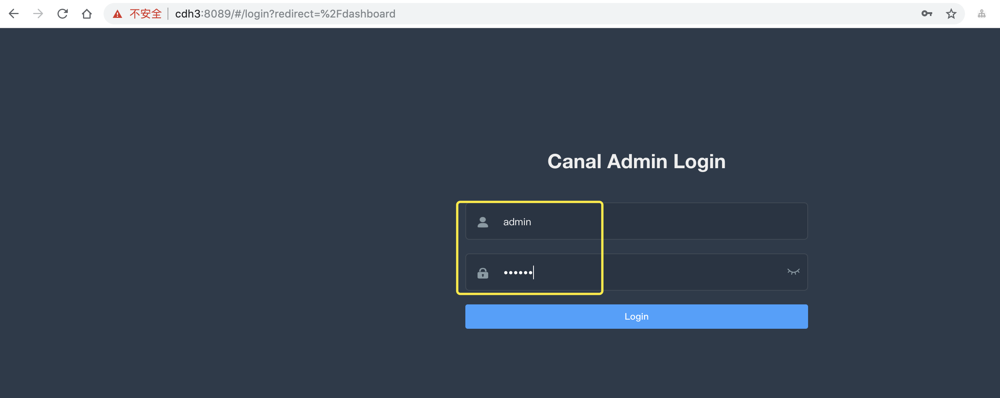
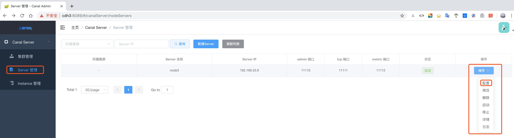

[Alibaba / canal](https://github.com/alibaba/canal)
---

# 简介
canal\[kə'næl]，译意为水道/管道/沟渠，主要用途是基于 MySQL 数据库增量日志解析，提供增量数据订阅和消费


# 1 QuickStart
## 1.1 MySQL
MySQL的配置文件`my.cnf`中已经进行了如下配置
```bash
[mysqld]
# 开启 binlog
log_bin=mysql-bin
# 选择 ROW 模式
binlog_format=ROW
# 配置 MySQL replaction 需要定义，不要和 canal 的 slaveId 重复
server_id=1

```

授权 canal 链接 MySQL 账号具有作为 MySQL slave 的权限, 如果已有账户可直接 grant
```sql
CREATE USER canal IDENTIFIED BY 'canal';  
GRANT SELECT, REPLICATION SLAVE, REPLICATION CLIENT ON *.* TO 'canal'@'%';
-- GRANT ALL PRIVILEGES ON *.* TO 'canal'@'%' ;
FLUSH PRIVILEGES;

```

## 1.2 canal安装部署
`canal 1.1.1`版本之后, 默认支持将canal server接收到的binlog数据直接投递到MQ, 目前默认支持的MQ有：[kafka](https://github.com/apache/kafka)、[RocketMQ](https://github.com/apache/rocketmq)

下面的安装也是主要这对MQ方式的安装，以Kafka为例。[Canal Kafka RocketMQ QuickStart](https://github.com/alibaba/canal/wiki/Canal-Kafka-RocketMQ-QuickStart).


### 1.2.1 下载与解压资源
```bash
# 下载
#wget https://github.com/alibaba/canal/releases/download/canal-1.1.4/canal.adapter-1.1.4.tar.gz
wget https://github.com/alibaba/canal/releases/download/canal-1.1.4/canal.deployer-1.1.4.tar.gz

# 注意：一定要创建 canal 安装文件夹
mkdir /opt/canal-1.1.4/deployer
# 解压
tar -zxf canal.deployer-1.1.4.tar.gz -C /opt/canal-1.1.4/deployer
```

还可以将canal配置到环境变量里：
```bash
# set canal environment
export CANAL_HOME=/opt/canal-1.1.4/deployer
export PATH=$PATH:CANAL_HOME/bin
```

### 1.2.2 修改 instance.properties 配置文件
修改`/opt/canal-1.1.4/deployer/conf/example/instance.properties`文件，如下：
```yaml
#################################################
## mysql serverId , v1.0.26+ will autoGen
## 可以通过在 MySQL中执行如下命令
##  show variables like 'log_bin';
##  show variables like 'server_id';
##  show variables like 'binlog_format';
canal.instance.mysql.slaveId=325

# enable gtid use true/false
canal.instance.gtidon=false

# position info
canal.instance.master.address=cdh1:3306
canal.instance.master.journal.name=
canal.instance.master.position=
canal.instance.master.timestamp=
canal.instance.master.gtid=

# rds oss binlog
canal.instance.rds.accesskey=
canal.instance.rds.secretkey=
canal.instance.rds.instanceId=

# table meta tsdb info
canal.instance.tsdb.enable=true
#canal.instance.tsdb.url=jdbc:mysql://127.0.0.1:3306/canal_tsdb
#canal.instance.tsdb.dbUsername=canal
#canal.instance.tsdb.dbPassword=canal

#canal.instance.standby.address =
#canal.instance.standby.journal.name =
#canal.instance.standby.position =
#canal.instance.standby.timestamp =
#canal.instance.standby.gtid=

# MySQL username/password
canal.instance.dbUsername=canal
canal.instance.dbPassword=canal
canal.instance.connectionCharset = UTF-8
# enable druid Decrypt database password
canal.instance.enableDruid=false
#canal.instance.pwdPublicKey=MFwwDQYJKoZIhvcNAQEBBQADSwAwSAJBALK4BUxdDltRRE5/zXpVEVPUgunvscYFtEip3pmLlhrWpacX7y7GCMo2/JM6LeHmiiNdH1FWgGCpUfircSwlWKUCAwEAAQ==

# table regex
#canal.instance.filter.regex=.*\\..*
canal.instance.filter.regex=rms\\.rms_loan_info
# table black regex
canal.instance.filter.black.regex=
# table field filter(format: schema1.tableName1:field1/field2,schema2.tableName2:field1/field2)
#canal.instance.filter.field=test1.t_product:id/subject/keywords,test2.t_company:id/name/contact/ch
# table field black filter(format: schema1.tableName1:field1/field2,schema2.tableName2:field1/field2)
#canal.instance.filter.black.field=test1.t_product:subject/product_image,test2.t_company:id/name/contact/ch

# mq config
canal.mq.topic=canal
# dynamic topic route by schema or table regex
#canal.mq.dynamicTopic=mytest1.user,mytest2\\..*,.*\\..*
canal.mq.partition=0
# hash partition config
#canal.mq.partitionsNum=3
canal.mq.partitionsNum=1
#canal.mq.partitionHash=test.table:id^name,.*\\..*
canal.mq.partitionHash=rms.rms_loan_info:id
#################################################


```


### 1.2.3 修改 canal.properties 配置文件
修改`/opt/canal-1.1.4/deployer/conf/canal.properties`文件，如下：
```yaml
#################################################
######### 		common argument		#############
#################################################
# tcp bind ip
canal.ip =
# register ip to zookeeper
canal.register.ip =
canal.port = 11111
canal.metrics.pull.port = 11112
# canal instance user/passwd
# canal.user = canal
# canal.passwd = E3619321C1A937C46A0D8BD1DAC39F93B27D4458

# canal admin config
#canal.admin.manager = 120.0.0.1:8089
canal.admin.port = 11110
canal.admin.user = admin
canal.admin.passwd = 4ACFE3202A5FF5CF467898FC58AAB1D615029441

canal.zkServers =
# flush data to zk
canal.zookeeper.flush.period = 1000
canal.withoutNetty = false
# tcp, kafka, RocketMQ
canal.serverMode = kafka
# flush meta cursor/parse position to file
canal.file.data.dir = ${canal.conf.dir}
canal.file.flush.period = 1000
## memory store RingBuffer size, should be Math.pow(2,n)
canal.instance.memory.buffer.size = 16384
## memory store RingBuffer used memory unit size , default 1kb
canal.instance.memory.buffer.memunit = 1024 
## meory store gets mode used MEMSIZE or ITEMSIZE
canal.instance.memory.batch.mode = MEMSIZE
canal.instance.memory.rawEntry = true

## detecing config
canal.instance.detecting.enable = false
#canal.instance.detecting.sql = insert into retl.xdual values(1,now()) on duplicate key update x=now()
canal.instance.detecting.sql = select 1
canal.instance.detecting.interval.time = 3
canal.instance.detecting.retry.threshold = 3
canal.instance.detecting.heartbeatHaEnable = false

# support maximum transaction size, more than the size of the transaction will be cut into multiple transactions delivery
canal.instance.transaction.size =  1024
# mysql fallback connected to new master should fallback times
canal.instance.fallbackIntervalInSeconds = 60

# network config
canal.instance.network.receiveBufferSize = 16384
canal.instance.network.sendBufferSize = 16384
canal.instance.network.soTimeout = 30

# binlog filter config
canal.instance.filter.druid.ddl = true
canal.instance.filter.query.dcl = false
canal.instance.filter.query.dml = false
canal.instance.filter.query.ddl = false
canal.instance.filter.table.error = false
canal.instance.filter.rows = false
canal.instance.filter.transaction.entry = false

# binlog format/image check
canal.instance.binlog.format = ROW,STATEMENT,MIXED 
canal.instance.binlog.image = FULL,MINIMAL,NOBLOB

# binlog ddl isolation
canal.instance.get.ddl.isolation = false

# parallel parser config
canal.instance.parser.parallel = true
## concurrent thread number, default 60% available processors, suggest not to exceed Runtime.getRuntime().availableProcessors()
#canal.instance.parser.parallelThreadSize = 16
## disruptor ringbuffer size, must be power of 2
canal.instance.parser.parallelBufferSize = 256

# table meta tsdb info
canal.instance.tsdb.enable = true
canal.instance.tsdb.dir = ${canal.file.data.dir:../conf}/${canal.instance.destination:}
canal.instance.tsdb.url = jdbc:h2:${canal.instance.tsdb.dir}/h2;CACHE_SIZE=1000;MODE=MYSQL;
canal.instance.tsdb.dbUsername = canal
canal.instance.tsdb.dbPassword = canal
# dump snapshot interval, default 24 hour
canal.instance.tsdb.snapshot.interval = 24
# purge snapshot expire , default 360 hour(15 days)
canal.instance.tsdb.snapshot.expire = 360

# aliyun ak/sk , support rds/mq
canal.aliyun.accessKey =
canal.aliyun.secretKey =

#################################################
######### 		destinations		#############
#################################################
canal.destinations = example
# conf root dir
canal.conf.dir = ../conf
# auto scan instance dir add/remove and start/stop instance
canal.auto.scan = true
canal.auto.scan.interval = 5

canal.instance.tsdb.spring.xml = classpath:spring/tsdb/h2-tsdb.xml
#canal.instance.tsdb.spring.xml = classpath:spring/tsdb/mysql-tsdb.xml

canal.instance.global.mode = spring
canal.instance.global.lazy = false
canal.instance.global.manager.address = ${canal.admin.manager}
#canal.instance.global.spring.xml = classpath:spring/memory-instance.xml
canal.instance.global.spring.xml = classpath:spring/file-instance.xml
#canal.instance.global.spring.xml = classpath:spring/default-instance.xml

##################################################
######### 		     MQ 		     #############
##################################################
#canal.mq.servers =  192.168.100.167:9092,192.168.100.166:9092,192.168.100.165:9092
canal.mq.servers =  cdh1:9092,cdh2:9092,cdh3:9092
canal.mq.retries = 0
canal.mq.batchSize = 16384
canal.mq.maxRequestSize = 1048576
canal.mq.lingerMs = 100
canal.mq.bufferMemory = 33554432
canal.mq.canalBatchSize = 50
canal.mq.canalGetTimeout = 100
canal.mq.flatMessage = true
canal.mq.compressionType = none
canal.mq.acks = all
#canal.mq.properties. =
canal.mq.producerGroup = test
# Set this value to "cloud", if you want open message trace feature in aliyun.
canal.mq.accessChannel = local
# aliyun mq namespace
#canal.mq.namespace =
# kafka消息投递是否使用事务
canal.mq.transaction = false

##################################################
#########     Kafka Kerberos Info    #############
##################################################
canal.mq.kafka.kerberos.enable = false
canal.mq.kafka.kerberos.krb5FilePath = "../conf/kerberos/krb5.conf"
canal.mq.kafka.kerberos.jaasFilePath = "../conf/kerberos/jaas.conf"
```


### 1.2.4 启动与关闭
```bash
# 启动
sh /opt/canal-1.1.4/deployer/bin/startup.sh

# 查看 server 日志
tail -f /opt/canal-1.1.4/deployer/logs/canal/canal.log
# 查看 instance 的日志
tail -f /opt/canal-1.1.4/deployer/logs/example/example.log

# 关闭
sh /opt/canal-1.1.4/deployer/bin/stop.sh

```

## 1.3 Canal Admin
[Canal Admin QuickStart](https://github.com/alibaba/canal/wiki/Canal-Admin-QuickStart)

canal-admin设计上是为canal提供整体配置管理、节点运维等面向运维的功能，提供相对友好的WebUI操作界面，方便更多用户快速和安全的操作。

Canal版本必须大于等于`1.1.4`，因为其需要依赖canal-server提供面向admin的动态运维管理接口。

### 1.3.1 下载与解压资源
```bash
# 下载
wget https://github.com/alibaba/canal/releases/download/canal-1.1.4/canal.admin-1.1.4.tar.gz

# 注意：一定要创建 canal 安装文件夹
mkdir /opt/canal-1.1.4/admin
# 解压
tar -zxf canal.admin-1.1.4.tar.gz -C /opt/canal-1.1.4/admin

```

### 1.3.2 修改 application.yml 配置文件
修改`/opt/canal-1.1.4/admin/conf/application.yml`文件。主要修改MySQL信息，其它根据情况设置，如下：
```yaml
server:
  port: 8089
spring:
  jackson:
    date-format: yyyy-MM-dd HH:mm:ss
    time-zone: GMT+8

spring.datasource:
  address: cdh1:3306
  database: canal_manager
  username: canal
  password: canal
  driver-class-name: com.mysql.jdbc.Driver
  url: jdbc:mysql://${spring.datasource.address}/${spring.datasource.database}?useUnicode=true&characterEncoding=UTF-8&useSSL=false
  hikari:
    maximum-pool-size: 30
    minimum-idle: 1

canal:
  adminUser: admin
  adminPasswd: admin

```

### 1.3.3 canal-server端配置
修改`/opt/canal-1.1.4/deployer/conf/canal.properties`配置，如下：
```yaml
# register ip
canal.register.ip =

# canal admin config
canal.admin.manager = cdh3:8089
canal.admin.port = 11110
canal.admin.user = admin
canal.admin.passwd = 4ACFE3202A5FF5CF467898FC58AAB1D615029441
# admin auto register
canal.admin.register.auto = true
canal.admin.register.cluster =

```

重亲启动 canal-server 。**注意**启动后原先的配置会交给admin管理，需要重新再管理页面修改配置后，MQ才会接收到消息
```bash
# 关闭
sh /opt/canal-1.1.4/deployer/bin/stop.sh

# 启动
sh /opt/canal-1.1.4/deployer/bin/startup.sh
# 或者修改 /opt/canal-1.1.4/deployer/conf/canal_local.properties配置文件(配置如上)，然后启动时指定配置
#sh /opt/canal-1.1.4/deployer/bin/startup.sh local

```


### 1.3.4 初始化数据库
从上面的配置文件可以看到，程序运行需要连接MySQL的`canal_manager`库，因此先初始化这个库。
将`/opt/canal-1.1.4/admin/conf/canal_manager.sql`脚本上传到MySQL数据库，然后登陆MySQL，执行如下命令
```sql
source /opt/canal_manager.sql
```

### 1.3.5 启动与关闭
```bash
# 启动
sh /opt/canal-1.1.4/admin/bin/startup.sh

# 查看admin日志
tail -f /opt/canal-1.1.4/admin/logs/admin.log
#如果显示如下代表启动成功，且端口号为8089
#2019-09-26 20:18:56.110 [main] INFO  o.s.boot.web.embedded.tomcat.TomcatWebServer - Tomcat started on port(s): 8089 (http) with context path ''
#2019-09-26 20:18:56.114 [main] INFO  com.alibaba.otter.canal.admin.CanalAdminApplication - Started CanalAdminApplication in 3.801 seconds (JVM running for 5.476)

# 如果需要关闭，执行如下命令
sh /opt/canal-1.1.4/admin/bin/stop.sh

```

### 1.3.6 canal-admin WEB UI
从启动日志可以看到启动的端口，因此我们访问 [http://cdh3:8089/](http://cdh3:8089/)。
* **Username**： admin
* **Password**： 123456


### 1.3.7 使用
进入首页后，可看到如下页面，canal-server 信息可以展示出来。


#### Server 管理
修改配置文件(canal.properties)，在上面的页面点击 操作->配置，进入到修改配置文件页面。主要修改如下几项配置，可以将消息推送到Kafka。最后保存
```yaml
canal.admin.manager = cdh3:8089

# tcp, kafka, RocketMQ
canal.serverMode = kafka

canal.mq.servers = cdh1:9092,cdh2:9092,cdh3:9092
# kafka消息投递是否使用事务
canal.mq.transaction = false

```

#### Instance 管理
新建 Instance操作 -> 载入模板，修改配置（对应于原先的`/opt/canal-1.1.4/deployer/conf/example/instance.properties`），
* **Instance名称**：输入一个Instance名字（比如叫rms）
* **所属集群/主机**：选择一个canal-server主机名
* **instance.properties**：可以载入模板；可以将原先配置好的，复制到这里。
* 保存。

#### 测试
先开启一个Kafka的消费者控制台
```bash
# --from-beginning 表示从头消费数据
# --topic 指定Kafka的Topic名字，这里指定的是canal，前提是这个Topic已经创建
#kafka-topics.sh --create --zookeeper localhost:2181 --partitions 1 --replication-factor 1 --topic canal 
kafka-console-consumer.sh --bootstrap-server localhost:9092 --from-beginning --topic canal

```
修改监测的MySQL库下的表（这里监测的是rms库rms_loan_info表），然后观察上面开启的消费者控制台是否可以接受到消息。


