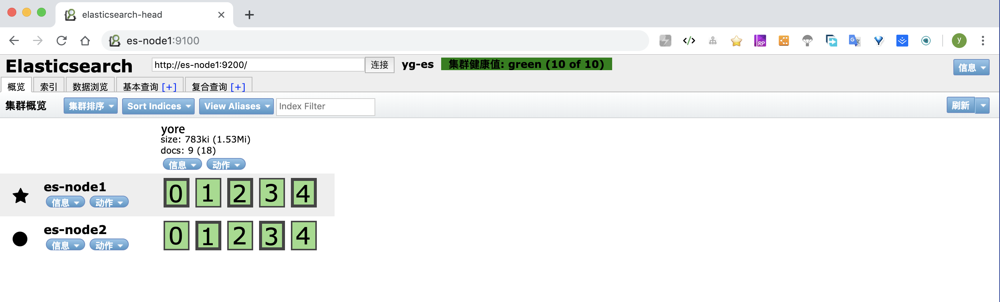

Elasticsearch
====
[ES 官网](https://www.elastic.co/cn/) | [ES GitHub](https://github.com/elastic/elasticsearch)

# 目录
* 1 ES 安装
    + 1.1 下载解压
    + 1.2 设置用户和权限
    + 1.3 配置
        - 配置 elasticsearch.yml
    + 1.4 启动
    + 1.5 Head 插件安装 
        - 1.5.1 npm安装
        - 1.5.2 如果没有安装 Git 先安装 Git
        - 1.5.3 下载 `elasticsearch-head`
        - 1.5.4 安装插件
        - 1.5.5 配置 Gruntfile.js 
        - 1.5.6 配置 _site/app.js
        - 1.5.7 启动访问
        - 1.5.8 定时监控Head 插件是否运行
    + 1.6 重启服务
        - 1.6.1 关闭服务
        - 1.6.2 修改配置
        - 1.6.3 启动服务
* 2 中文分词器
    + 2.1 安装 IK 分词器
    + 2.2 配置 IK 分词器(没特殊要求可以先不用配置)
    + 2.3 使用

<br/><br/>


# 1. ES 安装
本次以 `Elasticsearch 6.8.0` 安装示例。可以打开连接下载
[Past Releases](https://www.elastic.co/cn/downloads/past-releases#elasticsearch)


## 1.1 下载解压
打开官网 [Elasticsearch 6.8.0](https://www.elastic.co/downloads/past-releases/elasticsearch-6-8-0)，
下载对应版本。例如下载 Linux版： [MACOS/LINUX](https://artifacts.elastic.co/downloads/elasticsearch/elasticsearch-6.8.0.tar.gz)

解压
```bash
tar -zxf elasticsearch-6.8.0.tar.gz -C /usr/local/
cd /usr/local
mv elasticsearch-6.8.0 elasticsearch
```

## 1.2 设置用户和权限
**创建新用户**  
```bash
# 添加用户
adduser es
# 设定密码
passwd es

```

**配置 sysctl.conf**  
限制一个进程可以拥有的VMA(虚拟内存区域)的数量。虚拟内存区域是一个连续的虚拟地址空间区域。
在进程的生命周期中，每当程序尝试在内存中映射文件，链接到共享内存段，或者分配堆空间的时候，这些区域将被创建。
调优这个值将限制进程可拥有VMA的数量。限制一个进程拥有VMA的总数可能导致应用程序出错，
因为当进程达到了VMA上线但又只能释放少量的内存给其他的内核进程使用时，操作系统会抛出内存不足的错误。
如果你的操作系统在NORMAL区域仅占用少量的内存，那么调低这个值可以帮助释放内存给内核用。

```bash
#修改sysctl配置
vim /etc/sysctl.conf
#添加如下配置，默认值的4倍
vm.max_map_count=262144
#让配置生效
sysctl -p
#查看配置的数目
sysctl -a|grep vm.max_map_count
```

**配置 limits.conf**  
```bash
vim /etc/security/limits.conf

#yellowcong 是用户名
es  hard    nofile  65536
es  soft    nofile  65536

#重新登录 yellowcong 账户,查看是否生效
su es
#查看配置是否生效
ulimit -Hn
```


## 1.3 配置
创建存储目录和日志目录
```bash
mkdir /home/es/es-data
mkdir /home/es/es-log

```

修改文件权限
```bash
chown -R es:es  /usr/local/elasticsearch

chown -R es:es  /home/es/es-data
chown -R es:es  /home/es/es-log
```

### 配置 elasticsearch.yml
修改 `config/elasticsearch.yml` 文件，

es-node1节点修改如下配置项：
```yaml
cluster.name: yg-es
node.name: es-node1
node.master: true
path.data: /home/es/es-data
path.logs: /home/es/es-log
node.data: true
network.host: es-node1
http.port: 9200

discovery.zen.minimum_master_nodes: 1
discovery.zen.ping.unicast.hosts: ["es-node1", "es-node2"]
# 是否支持跨域
http.cors.enabled: true
# *表示支持所有域名
http.cors.allow-origin: "*"
http.cors.allow-headers: Authorization

```

es-node2节点修改如下配置项：
```yaml
cluster.name: yg-es
node.name: es-node2
node.master: false
path.data: /home/es/es-data
path.logs: /home/es/es-log
node.data: true
network.host: es-node2
http.port: 9200

discovery.zen.minimum_master_nodes: 1
discovery.zen.ping.unicast.hosts: ["es-node1", "es-node2"]
# 是否支持跨域
http.cors.enabled: true
# *表示支持所有域名
http.cors.allow-origin: "*"

```

## 1.4 启动
```bash
# 切换用户
su es
# 查看当前用户
who am i

# 启动服务
bin/elasticsearch -d
```

验证。
查看日志`/home/es/es-log`下的日志，没有发现错误，然后请求es端口的数据可以获取到信息，则 elasticsearch 启动成功。
```bash
curl http://es-node1:9200
curl http://es-node2:9201

```

```json
{
  "name" : "es-node1",
  "cluster_name" : "yg-es",
  "cluster_uuid" : "Lm0AfXYiQ5OO5NAFewq-SQ",
  "version" : {
    "number" : "6.8.0",
    "build_flavor" : "default",
    "build_type" : "tar",
    "build_hash" : "65b6179",
    "build_date" : "2019-05-15T20:06:13.172855Z",
    "build_snapshot" : false,
    "lucene_version" : "7.7.0",
    "minimum_wire_compatibility_version" : "5.6.0",
    "minimum_index_compatibility_version" : "5.0.0"
  },
  "tagline" : "You Know, for Search"
}
```


## 1.5 Head 插件安装 
其源码可以访问 [mobz/elasticsearch-head](https://github.com/mobz/elasticsearch-head)

### 1.5.1 npm安装
```bash
curl --silent --location https://rpm.nodesource.com/setup_10.x | bash -
yum install -y nodejs
npm install -g cnpm --registry=https://registry.npm.taobao.org
npm install
npm run build
npm -v
```

### 1.5.2 如果没有安装 Git 先安装 Git
```
yum install –y git
git --version
```

### 1.5.3 下载 `elasticsearch-head`
```bash
git clone https://github.com/mobz/elasticsearch-head.git
cd elasticsearch-head
```

### 1.5.4 安装插件
```bash
npm install -g grunt --registry=https://registry.npm.taobao.org

npm install
# 如果 elasticsearch-head/node_modules/grunt 下没有文件，在执行
npm install grunt --save 

```

### 1.5.5 配置 Gruntfile.js 
大概在92行左右，修改：
```
		connect: {
			server: {
				options: {
				    hostname: 'es-node1',
					port: 9100,
					base: '.',
					keepalive: true
				}
			}
		}
```

### 1.5.6 配置 _site/app.js
大概在4361行左右，修改
```
		init: function(parent) {
			this._super();
			this.prefs = services.Preferences.instance();
			this.base_uri = this.config.base_uri || this.prefs.get("app-base_uri") || "http://es-node1:9200" || "http://es-node2:9201";
			if( this.base_uri.charAt( this.base_uri.length - 1 ) !== "/" ) {
				// XHR request fails if the URL is not ending with a "/"
				this.base_uri += "/";
			}
```

### 1.5.7 启动访问
```bash
npm run start 2>&1 &

# 或者通过grun运行
grunt server & 
```
浏览器打开 `http://es-node1:9100/`
这里已经创建了一个索引



### 1.5.8 定时监控Head 插件是否运行
head插件有时会在后台自动挂掉，为了可以正常访问`elasticsearch-head`，我们可以编写一个定时监测的脚本，当发现停止运行时则启动

例如在`/usr/local/elasticsearch-head`下新建一个脚本文件`es-head-monitoring.sh`，内容如下
```bash
#!/bin/bash

# 监控某个进程的脚本
#######

ps -fe|grep grunt |grep -v grep
if [ $? -ne 0 ]
then
	now_date=`date +"%Y-%m-%d %H:%M:%S"`
	echo -e "$now_date \t elasticsearch-head 挂起，尝试重启"
	# 必须带这个目录下执行，否则启动失败。
	cd /usr/local/elasticsearch-head
	npm run start >/dev/null 2>&1 &
#else
#echo "runing....."
fi

##### 
# grunt 表示进程特征字符串，能够查询到唯一进程的特征字符串
# 0表示存在的
# $? -ne 0 不存在，$? -eq 0 存在
```

执行定时任务，例如没3分钟，执行一次上述脚本
```bash
crontab -e
# 插入如下命令
*/3 * * * * /bin/bash /usr/local/elasticsearch-head/es-head-monitoring.sh >> /var/log/es/monitoring.log
```


## 1.6 重启服务
### 1.6.1 关闭服务
关闭es服务。可以通过查看进程，获取进程号，然后关闭
```bash
# cd到es的目录
cd /usr/local/elasticsearch
# 查看进程信息
ps -ef | grep `pwd`
kill -9 es进程号
```

关闭 elasticsearch-head 服务
```
#查看9100端口的pid
[root@es-node1 elasticsearch-head]# lsof -i:9100
COMMAND   PID USER   FD   TYPE    DEVICE SIZE/OFF NODE NAME
grunt   26232 root   22u  IPv4 441471220      0t0  TCP mongo1:jetdirect (LISTEN)
```

### 1.6.2 修改配置

### 1.6.3 启动服务
启动 elasticsearch 见`1.4`
启动 elasticsearch-head 见`1.5.7`


# 2 中文分词器
常用的中文分词器由 IK 、Hanlp等 
[medcl/elasticsearch-analysis-ik](https://github.com/medcl/elasticsearch-analysis-ik)  
[KennFalcon/elasticsearch-analysis-hanlp](https://github.com/KennFalcon/elasticsearch-analysis-hanlp)

## 2.1 安装 IK 分词器
下载的版本和安装的 elasticsearch 版本一致。例如这里下载 v6.8.0 
[elasticsearch-analysis-ik-6.8.0.zip](https://github.com/medcl/elasticsearch-analysis-ik/releases/download/v6.8.0/elasticsearch-analysis-ik-6.8.0.zip)

安装插件：
```
[es@es-node1 elasticsearch]$ elasticsearch-plugin install https://github.com/medcl/elasticsearch-analysis-ik/releases/download/v6.8.0/elasticsearch-analysis-ik-6.8.0.zip
-> Downloading https://github.com/medcl/elasticsearch-analysis-ik/releases/download/v6.8.0/elasticsearch-analysis-ik-6.8.0.zip
[=================================================] 100%  
@@@@@@@@@@@@@@@@@@@@@@@@@@@@@@@@@@@@@@@@@@@@@@@@@@@@@@@@@@@
@     WARNING: plugin requires additional permissions     @
@@@@@@@@@@@@@@@@@@@@@@@@@@@@@@@@@@@@@@@@@@@@@@@@@@@@@@@@@@@
* java.net.SocketPermission * connect,resolve
See http://docs.oracle.com/javase/8/docs/technotes/guides/security/permissions.html
for descriptions of what these permissions allow and the associated risks.
Continue with installation? [y/N]y
-> Installed analysis-ik
```

查看安装的插件
```
[es@es-node1 elasticsearch]$ elasticsearch-plugin list
analysis-ik
```

## 2.2 配置 IK 分词器(没特殊要求可以先不用配置)
到 `elasticsearch/config/analysis-ik/` 下配置 `IKAnalyzer.cfg.xml`
```xml
<?xml version="1.0" encoding="UTF-8"?>
<!DOCTYPE properties SYSTEM "http://java.sun.com/dtd/properties.dtd">
<properties>
	<comment>IK Analyzer 扩展配置</comment>
    <!--用户可以在这里配置自己的扩展字典,使用相对路径,多个词典使用逗号分隔,比如:custom/mydict1.dic,custom/mydict2.dic -->
	<entry key="ext_dict">custom/myDic.txt</entry>
	<!--用户可以在这里配置自己的扩展停止词字典,使用相对路径,多个词典使用逗号分隔,比如:custom/mydict1.dic,custom/mydict2.dic -->
	<entry key="ext_stopwords"></entry>
    <!--用户可以在这里配置远程扩展字典,配置远程扩展字典,多个词典使用逗号分隔,比如: http://xxx.xx.com/xxx -->
	<!-- <entry key="remote_ext_dict">words_location</entry> -->
	<!--用户可以在这里配置远程扩展停止词字典,多个词典使用逗号分隔,比如: http://xxx.xx.com/xxx -->
	<!-- <entry key="remote_ext_stopwords">words_location</entry> -->
</properties>
```
添加自定义词典文件
vim custom/myDic.txt 添加：
```
中华人民共和国
```

## 2.3 使用
不指定分析类型 `analyzer` 时使用的是默认的分词器，

* 1 POST    http://cdh2:9200/yg/_analyze/
```json
{
 "text":"中华人民共和国"
}
```
result:
```json
{
    "tokens": [
        {
            "token": "中",
            "start_offset": 0,
            "end_offset": 1,
            "type": "<IDEOGRAPHIC>",
            "position": 0
        },
        {
            "token": "华",
            "start_offset": 1,
            "end_offset": 2,
            "type": "<IDEOGRAPHIC>",
            "position": 1
        },
        {
            "token": "人",
            "start_offset": 2,
            "end_offset": 3,
            "type": "<IDEOGRAPHIC>",
            "position": 2
        },
        {
            "token": "民",
            "start_offset": 3,
            "end_offset": 4,
            "type": "<IDEOGRAPHIC>",
            "position": 3
        },
        {
            "token": "共",
            "start_offset": 4,
            "end_offset": 5,
            "type": "<IDEOGRAPHIC>",
            "position": 4
        },
        {
            "token": "和",
            "start_offset": 5,
            "end_offset": 6,
            "type": "<IDEOGRAPHIC>",
            "position": 5
        },
        {
            "token": "国",
            "start_offset": 6,
            "end_offset": 7,
            "type": "<IDEOGRAPHIC>",
            "position": 6
        }
    ]
}
```

* 2 POST    http://cdh2:9200/yg/_analyze/
```json
{
 "text":"中华人民共和国",
 "analyzer":"ik_smart"
}
```
result:
```json
{
   "tokens": [
       {
           "token": "中华人民共和国",
           "start_offset": 0,
           "end_offset": 7,
           "type": "CN_WORD",
           "position": 0
       }
   ]
}
```

* 3 POST    http://cdh2:9200/yg/_analyze/
```json
{
  "text":"中华人民共和国",
  "analyzer":"ik_max_word"
}
```
result:
```json
{
  "tokens": [
    {
      "token": "中华人民共和国",
      "start_offset": 0,
      "end_offset": 7,
      "type": "CN_WORD",
      "position": 0
    },
    {
      "token": "中华人民",
      "start_offset": 0,
      "end_offset": 4,
      "type": "CN_WORD",
      "position": 1
    },
    {
      "token": "中华",
      "start_offset": 0,
      "end_offset": 2,
      "type": "CN_WORD",
      "position": 2
    },
    {
      "token": "华人",
      "start_offset": 1,
      "end_offset": 3,
      "type": "CN_WORD",
      "position": 3
    },
    {
      "token": "人民共和国",
      "start_offset": 2,
      "end_offset": 7,
      "type": "CN_WORD",
      "position": 4
    },
    {
      "token": "人民",
      "start_offset": 2,
      "end_offset": 4,
      "type": "CN_WORD",
      "position": 5
    },
    {
      "token": "共和国",
      "start_offset": 4,
      "end_offset": 7,
      "type": "CN_WORD",
      "position": 6
    },
    {
      "token": "共和",
      "start_offset": 4,
      "end_offset": 6,
      "type": "CN_WORD",
      "position": 7
    },
    {
      "token": "国",
      "start_offset": 6,
      "end_offset": 7,
      "type": "CN_CHAR",
      "position": 8
    },
    {
      "token": "国徽",
      "start_offset": 7,
      "end_offset": 9,
      "type": "CN_WORD",
      "position": 9
    }
  ]
}
```


