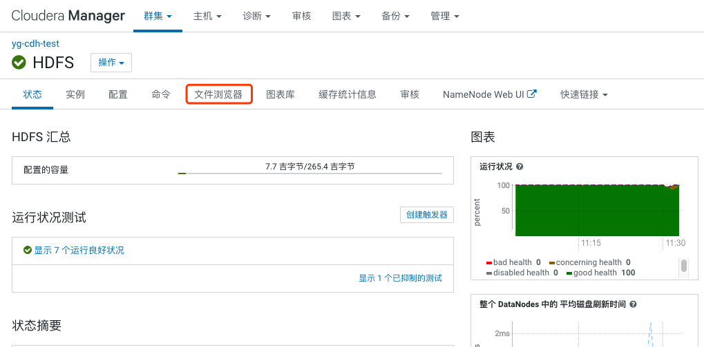
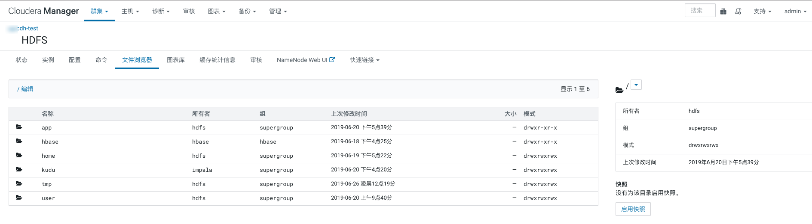
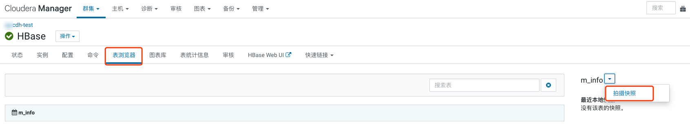
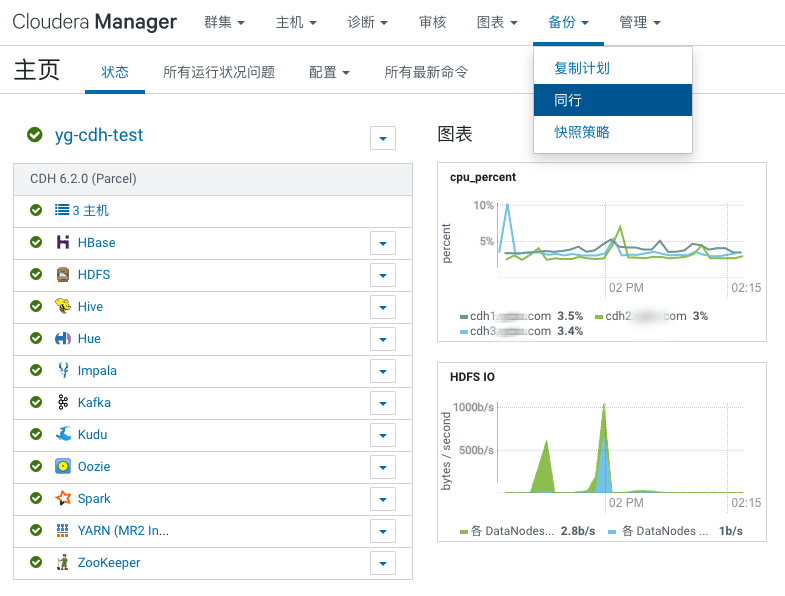
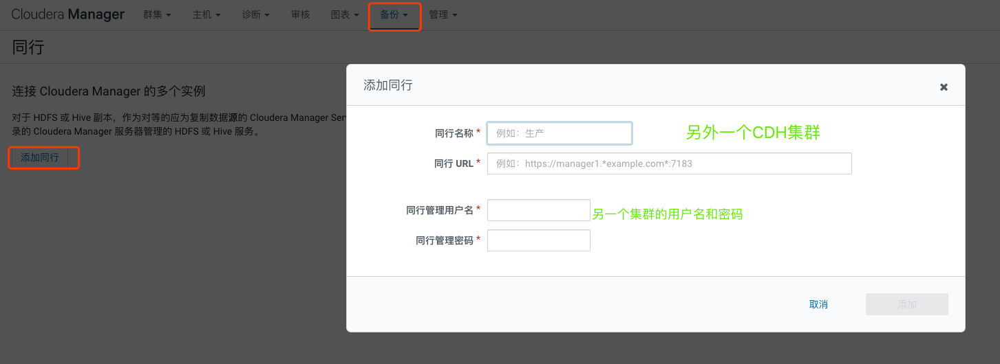

Hadoop 数据备份和恢复
======
[0661-6.2.0-Hadoop数据备份与恢复](https://mp.weixin.qq.com/s/8HDJXEgRW86WD-OxRT-xDg)

# 1 NameNode元数据
## 1.1 备份
备份之前，需要确保元数据已经同步到集群的最新状态。

首先将Hadoop进入安全模式，Hadoop在安全模式下会禁止 HDFS的写操作，这样可以在备份元数据时避免数据不一致的情况。
```bash
sudo -u hdfs hdfs dfsadmin -safemode enter
```

执行如下命令，将最新的fsimage保存到磁盘，并重置edits
```bash
sudo -u hdfs hdfs dfsadmin -saveNamespace
```

任意选择一个NameNode节点，将NameNode元数据目录进行备份，元数据位置可查看HDFS配置`dfs.namenode.name.dir`的路径，
例如配置的值为`/opt/hadoop/dfs/nn`，执行如下命令：
```bash
cd 备份的位置
cp -r /opt/hadoop/dfs/nn/* ./nnbak/
```

## 1.2 恢复

当需要恢复NameNode元数据时，只需要将前面备份的nnbak复制回`/opt/hadoop/dfs/`下，这是可以查看下文件的属组信息，如果不是`hdfs`需要修复：
```bash
# 先将Hadoop离开安全模式
sudo -u hdfs hdfs dfsadmin -safemode leave
# 恢复对一个文件的属组信息
cd /opt/hadoop/dfs/nn/
chown hdfs:hdfs -R current/
chown hdfs:hdfs -R in_use.lock
```

然后在Cloudera Manager页面上重启HDFS服务，如果有受影响的服务，则重启对应服务即可。


# 2 HDFS数据
HDFS中可以对目录创建Snapshot，创建之后不管后续目录发生什么变化，都可以通过快照找回原来的文件和目录结构，

次功能需要使用的是CDH管理页面HDFS的**文件浏览器**功能，**注意**此功能需要为Cloudera Enterprise版本的功能，Cloudera Express版没有这个功能菜单。


## 2.1 启用快照
点击HDFS的**文件浏览器**后，如下图，即为HDFS的文件目录，可以点击进入需要开启快照的数据目录，在右侧点击启用快照，根据提示进行操作即可。


## 2.2 创建快照
在HDFS的文件浏览器页面，对启用快照的目录，点击右侧的`拍摄快照`，输入快照名后，等待创建完成。当运行一段时间后，文件发生了变化，可以根据需要自行`拍摄快照`，
创建的快照，可以在对应目录下右侧看到（包含快照名称、创建时间的歌等）。

## 2.3 恢复快照
当需要恢复某个快照时，在启用快照的目录下，右侧<kbd>▼</kbd>选择`从快照还原目录`，选择需要还原的快照名进行还原。


# 3 HBase数据
同 `2 HDFS数据`中方法所示，HBase也可以采用同样的方式，对表进行快照，如下图：




# 4 CDH组件的元数据
CDH上的组件元数据可能保存在Mysql、MariaDB、Oracle、PostgreSQL等，这里以Mysql为例，个组件对应的库名可查看 [Databases for Cloudera Software](https://www.cloudera.com/documentation/enterprise/6/6.2/topics/cm_ig_mysql.html#concept_dsg_3mq_bl)

## 4.1 备份
备份前需要在 Cloudera Manager 页面将组件服务和 Cloudera Management Service `停止`，然后进入到元数据库所在的服务器，备份对应的库：
```bash
# -u使用自己的用户名，-p改为对应的密码
mysqldump -uroot -p123456 --databases amon hue metastore nav navms oozie rman scm sentry > dump.sql
```

备份完毕后，可以查看此备份文件，备份文件中包含了上面需要备份的库以及库下所有表的结构和数据。

## 4.2 恢复
在Mysql服务器上执行如下命令：
```bash
# -u使用自己的用户名，-p改为。dump.sql为上一步备份的元数据sql文件
mysql -uroot -p123456 < dump.sql
```

Cloudera Manager 页面启动前面关闭的服务。可以在`hive` 、`impala` shell中查看数据是否正常。


# 5 BDR备份数据
BDR(Backup and Disaster Recovery)备份和灾难恢复。**注意** 这个备份功能也是Cloudera Enterprise版本才有的。

在CM主页点击备份，下拉菜单中点击同行。添加同行


将数据备份到另一个CDH集群（目标集群）



