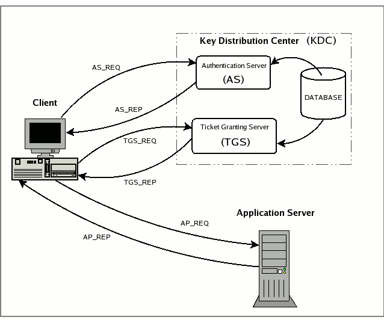

Kerberos
==========
[Kerberos](http://www.kerberos.org/)

Kerberos 于1983年被开发为 MIT 雅典娜计划的身份验证引擎。1987年以开源形式发布，1993年成为IETF标准。

Kerberos 最初是在 1980 年代为麻省理工学院的 Athena 项目开发的，现已发展成为现代计算机网络中部署最广泛的用于身份验证和授权的系统。
Kerberos 当前随所有主要的计算机操作系统一起提供，并且具有特殊的位置，使其成为分布式认证和授权问题的通用解决方案，
该问题允许在企业联盟（ federated enterprises）与对等社区（peer-to-peer communities）之间进行“单点登录”。
MIT已开发并维护适用于 Apple Macintosh，Windows 和 Unix 操作系统的 Kerberos 软件的实现。

# Kerberos Software Documentation.
[MIT Kerberos 文档 (1.19-prerelease)](http://web.mit.edu/kerberos/krb5-current/doc/)

## 1 [对于用户](http://web.mit.edu/kerberos/krb5-current/doc/user/index.html)
* [密码管理](http://web.mit.edu/kerberos/krb5-current/doc/user/pwd_mgmt.html#password-management)
    - [修改密码](http://web.mit.edu/kerberos/krb5-current/doc/user/pwd_mgmt.html#changing-your-password)
    - [授予访问您帐户的权限](http://web.mit.edu/kerberos/krb5-current/doc/user/pwd_mgmt.html#granting-access-to-your-account)
    - [密码质量验证](http://web.mit.edu/kerberos/krb5-current/doc/user/pwd_mgmt.html#password-quality-verification)
* [票据管理](http://web.mit.edu/kerberos/krb5-current/doc/user/tkt_mgmt.html#ticket-management)
    - [Kerberos 票据属性](http://web.mit.edu/kerberos/krb5-current/doc/user/tkt_mgmt.html#kerberos-ticket-properties)
    - [用 kinit 获得票据](http://web.mit.edu/kerberos/krb5-current/doc/user/tkt_mgmt.html#obtaining-tickets-with-kinit)
    - [用 klist 查看票据](http://web.mit.edu/kerberos/krb5-current/doc/user/tkt_mgmt.html#viewing-tickets-with-klist)
    - [用 Kdestroy 销毁票据](http://web.mit.edu/kerberos/krb5-current/doc/user/tkt_mgmt.html#destroying-tickets-with-kdestroy)
* [用户配置文件](http://web.mit.edu/kerberos/krb5-current/doc/user/user_config/index.html#user-config-files)
    - [kerberos](http://web.mit.edu/kerberos/krb5-current/doc/user/user_config/kerberos.html#kerberos)
    - [.k5login](http://web.mit.edu/kerberos/krb5-current/doc/user/user_config/k5login.html#k5login)
    - [.k5identity](http://web.mit.edu/kerberos/krb5-current/doc/user/user_config/k5identity.html#k5identity)
* [用户指令](http://web.mit.edu/kerberos/krb5-current/doc/user/user_commands/index.html)
    - [kdestroy](http://web.mit.edu/kerberos/krb5-current/doc/user/user_commands/kdestroy.html)
    - [kinit](http://web.mit.edu/kerberos/krb5-current/doc/user/user_commands/kinit.html)
    - [klist](http://web.mit.edu/kerberos/krb5-current/doc/user/user_commands/klist.html)
    - [kpasswd](http://web.mit.edu/kerberos/krb5-current/doc/user/user_commands/kpasswd.html)
    - [krb5-config](http://web.mit.edu/kerberos/krb5-current/doc/user/user_commands/krb5-config.html)
    - [ksu](http://web.mit.edu/kerberos/krb5-current/doc/user/user_commands/ksu.html)
    - [kswitch](http://web.mit.edu/kerberos/krb5-current/doc/user/user_commands/kswitch.html)
    - [kvno](http://web.mit.edu/kerberos/krb5-current/doc/user/user_commands/kvno.html)
    - [sclient](http://web.mit.edu/kerberos/krb5-current/doc/user/user_commands/sclient.html)

<br/>

### 1.1 密码管理
您的密码是 Kerberos 验证身份的唯一方法，如果有人发现了您的密码，那么该人可以伪装您-发送来自您的电子邮件、阅读、编辑或删除您的文件，或者像您一样登录其他主机-没人能分辨出两者之间的区别。
因此，选择一个良好的密码并将其保密很重要。如果需要将您的帐户访问权授予其他人，则可以通过 Kerberos 进行访问（请参阅 [Granting access to your account](http://web.mit.edu/kerberos/krb5-current/doc/user/pwd_mgmt.html#grant-access)）。
绝对不要出于任何原因将密码告诉任何人，包括系统管理员。您应该经常更改密码，尤其是在您认为有人发现了密码的任何时候。

#### 1.1.1 修改密码
要更改 Kerberos 密码，请使用 kpasswd 命令，它将要求您输入旧密码（以防止他人在您不在时访问您的计算机并更改密码），然后两次提示您输入新密码（您必须键入两次的原因是要确保正确键入）。
例如，用户 david 将执行以下操作：
```bash
shell% kpasswd
Password for david:    <- Type your old password.
Enter new password:    <- Type your new password.
Enter it again:  <- Type the new password again.
Password changed.
shell%
```

如果 david 输入了不正确的旧密码，他将得到以下消息：
```bash
shell% kpasswd
Password for david:  <- Type the incorrect old password.
kpasswd: Password incorrect while getting initial ticket
shell%
```

如果您输入有误，并且没有以相同的方式两次输入新密码，则 kpasswd 会要求您重试：
```bash
shell% kpasswd
Password for david:  <- Type the old password.
Enter new password:  <- Type the new password.
Enter it again: <- Type a different new password.
kpasswd: Password mismatch while reading password
shell%
```

更改密码后，更改需要一段时间才能在系统中传播。根据系统的设置方式，此过程可能需要几分钟到一个小时甚至更长的时间。
如果您需要在更改密码后不久获得新的 Kerberos 票证，请尝试使用新密码。 如果新密码不起作用，请使用旧密码再试一次。


#### 1.1.2 授予访问您帐户的权限
如果您需要授予某人登录帐户的访问权限，则可以通过 Kerberos 进行登录，而无需告知该人您的密码。只需在主目录中创建一个名为 [.k5login](http://web.mit.edu/kerberos/krb5-current/doc/user/user_config/k5login.html#k5login-5) 的文件。
该文件应包含您要授予访问权限的每个人 Kerberos 的 principal。 每个 principal 必须位于单独的行上。 这是一个示例 `.k5login` 文件：
```
jennifer@ATHENA.MIT.EDU
david@EXAMPLE.COM
```

该文件将允许用户 jennifer 和 david 使用您的用户 ID，前提是他们在各自的 realm 中拥有 Kerberos 票证。如果要通过网络登录到其他主机，
则需要在每个这些主机上的 `.k5login` 文件中包括自己的 Kerberos 主体。

使用 `.k5login` 文件比提供密码安全得多，因为：
* 您只需在 `.k5login` 文件中删除主体即可随时取消访问。
* 尽管该用户可以完全控制您在一个特定主机（或一组主机，如果您的 `.k5login` 文件是共享的，例如通过 NFS）上的帐户，但该用户不会继承您的网络特权。
* Kerberos 会记录谁获得票证的日志，因此系统管理员可以在必要时找出谁可以在特定时间使用您的用户 ID。

一种常见的应用程序是在根目录的主目录中具有 `.k5login` 文件，从而使该计算机可以通过根目录访问 Kerberos 主体。这使系统管理员可以允许用户成为本地 root 用户，
或以 root 用户远程登录，而无需提供 root 密码，也无需任何人通过网络键入 root 密码。

#### 1.1.3 密码质量验证
TODO

<br/>

### 1.2 票据管理
在许多系统上 Kerberos 是内置于登录程序中的，登录时会自动获得票据。其他程序（例如 ssh）可以将票据的副本转发到远程主机，其中大多数程序在退出时也会自动销毁您的票证。
但是，麻省理工学院（MIT）建议您一定要在销毁 Kerberos 票据时明确销毁它们。确保这种情况发生的一种方法是将 kdestroy 命令添加到您的 `.logout` 文件中。
此外，如果您要离开计算机，并且担心使用您的许可的入侵者，那么销毁票证的所有副本或使用锁定屏幕的屏幕保护程序是最安全的。

#### 1.2.1 Kerberos 票据属性
Kerberos 票据可以具有各种属性：

如果票据是可转发的，则 KDC 可以根据可转发票据发行新的票据（如有必要，使用其他网络地址）。这允许进行身份验证转发，而无需再次输入密码。例如，如果具有可转发 TGT 的用户登录到远程系统，
则 KDC 可以使用该远程系统的网络地址为该用户发布新的 TGT，从而使该主机上的身份验证就像用户在本地登录一样工作。

当 KDC 基于可转发票据就创建新票据时，它将在该新票据上设置**转发**标志。基于设置了转发标志的票据创建的任何票据也将设置其转发标志。

可代理票据（**proxiable** ticket）类似于可转发票据，因为它允许服务采用客户端的身份。但是与可转让票据不同，可代理票据仅针对特定服务发行。
换句话说，不能基于可代理但不可转发的票证发放票据。

代理票据（**proxy** ticket）是基于可代理票据发行的。

已发布的票据（**postdated** ticket）设置了无效的标志。在票据上列出的开始时间之后，可以将其提交给 KDC 以获取有效的票据。

带有可更新标记（**postdateable** flag）的授权票据的票据可用于获取已过期的服务票据。

可续票据（**Renewable** tickets）可用于获取新的会话密钥，而无需用户再次输入密码。可续票据有两个有效期，首先是该特定票据到期的时间，
第二个是基于此可续票据发行的任何票据的最新可能到期时间。

具有初始标志（**initial flag**）的票据是根据身份验证协议而不是授权票据的票据发行的。希望确保最近提供了用户密钥以进行验证的应用服务器可以指定必须将该标志设置为接受票据。

无效的票据（**invalid** ticket）必须被应用程序服务器拒绝。通常已发布的票据都带有此标志集，并且必须经过 KDC 的验证才能使用。

预认证票据（**preauthenticated** ticket）是仅在请求票据的客户端已向 KDC 进行身份验证后才发行的票证。

硬件身份验证（**hardware authentication**）标志设置在需要使用硬件进行身份验证的票据上，硬件仅应由请求票据的客户端拥有。

如果票据已设置了传输策略（**transit policy**）已检查标志，则颁发此票据的 KDC 会执行已迁移领域（transited-realms）检查策略，并检查票据上的已迁移领域列表。
已迁移领域列表包含发布第一个票据的 KDC 的 realm 与发布当前票据 KDC 的 realm 之间的所有中间 realm 的列表，如果未设置此标志，则应用程序服务器必须检查经过的 realm 本身，否则拒绝票据。

好的代理委托标志（**okay as delegate** flag）指示票据中指定的服务器适合作为由该 realm 的策略确定的代理。
某些客户端应用程序可能会使用此标志来决定是否将票据转发到远程主机，尽管许多应用程序不赞成这样做。

匿名票据（**anonymous** ticket ）是其中命名的 principal 该领域的通用 principal 的匿名票据；它实际上并未指定将使用这个票据的个人。该票据仅用于安全地分配会话密钥。

#### 1.2.2 用 kinit 获得票据
如果您的站点已将 Kerberos V5 与登录系统集成，则登录时会自动获得 Kerberos 票证。否则您可能需要使用 [kinit](http://web.mit.edu/kerberos/krb5-current/doc/user/user_commands/kinit.html#kinit-1) 
程序显式获取 Kerberos 票据。同样，如果您的 Kerberos 票据过期，请使用 kinit 程序获取新票证。

要使用 kinit 程序只需键入 `kinit`，然后在提示符下键入密码。例如 Jennifer（用户名是 `jennifer` ）在 `Bleep, Inc.`（一家域名为 `mit.edu` 和 Kerberos 领域 `ATHENA.MIT.EDU` 的虚拟公司）工作。 她将输入：
```
shell% kinit
Password for jennifer@ATHENA.MIT.EDU: <-- [Type jennifer's password here.]
shell%
```

如果您输入的密码错误，kinit 会给您以下错误信息，而且您不会获得 Kerberos 票证。
```bash
shell% kinit
Password for jennifer@ATHENA.MIT.EDU: <-- [Type the wrong password here.]
kinit: Password incorrect
shell%
```

默认情况下，kinit 假设您要在默认 realm 中使用自己的用户名票据。假设 Jennifer’s 的朋友戴维 David 来访，他想借一个窗口检查他的邮件。David 需要在自己的示例 `EXAMPLE.COM` 上获取票据。他会输入：
```
shell% kinit david@EXAMPLE.COM
Password for david@EXAMPLE.COM: <-- [Type david's password here.]
shell%
```

David 随后将获得可用于登录自己的计算机的票据。请注意，他是在 Jennifer 的计算机上本地输入密码的，但是从来没有通过网络。本地主机上的 Kerberos 对另一个 realm 的 KDC 执行了身份验证。

如果您希望能够将票据转发给其他主机，则需要请求可转发票据，通过指定 `-f` 选项来执行此操作：
```bash
shell% kinit -f
Password for jennifer@ATHENA.MIT.EDU: <-- [Type your password here.]
shell%
```

请注意，kinit 不会告诉您它已获得可转发票据，您可以使用 [klist](http://web.mit.edu/kerberos/krb5-current/doc/user/user_commands/klist.html#klist-1) 
命令进行验证（请参阅 [使用 klist 查看票证](http://web.mit.edu/kerberos/krb5-current/doc/user/tkt_mgmt.html#view-tkt)）。

通常，您的票据适合系统的默认票据寿命，在许多系统上这是十个小时。您可以使用 `-l` 选项指定其他票据有效期。将字母`s`添加到秒数，`m`表示分钟，`h`表示小时或`d`表示几天的值。
例如，要获取可连续使用三个小时的 `david@EXAMPLE.COM` 可转让票据，请输入：
```
shell% kinit -f -l 3h david@EXAMPLE.COM
Password for david@EXAMPLE.COM: <-- [Type david's password here.]
shell%
```

**注意**：您不能混合使用单位；指定 3h30m 的生命周期将导致错误。另请注意，大多数系统都指定了最大票证寿命，如果您要求更长的票据寿命，它将被自动截断为最长寿命。


#### 1.2.3 用 klist 查看票据
[klist](http://web.mit.edu/kerberos/krb5-current/doc/user/user_commands/klist.html#klist-1)命令显示您的票据。初次获得票据时，您将获得只有票据的票据。 清单看起来像这样：
```bash
shell% klist
Ticket cache: /tmp/krb5cc_ttypa
Default principal: jennifer@ATHENA.MIT.EDU

Valid starting     Expires            Service principal
06/07/04 19:49:21  06/08/04 05:49:19  krbtgt/ATHENA.MIT.EDU@ATHENA.MIT.EDU
shell%
```

票据缓存是票据文件的位置。在上面的示例中，该文件名为 ` /tmp/krb5cc_ttypa`。默认 principal 是您的 Kerberos 主体。

“valid starting”（有效开始）和“expires”（到期）字段描述了票据有效的时间段。 “service principal”（服务主体）描述了每张票据。授予票据的票据具有第一部分 krbtgt 和作为领域名称的第二部分。

现在，如果 jennifer 连接到机器 `daffodil.mit.edu` ，然后再次键入“klist”，她将得到以下结果：
```bash
shell% klist
Ticket cache: /tmp/krb5cc_ttypa
Default principal: jennifer@ATHENA.MIT.EDU

Valid starting     Expires            Service principal
06/07/04 19:49:21  06/08/04 05:49:19  krbtgt/ATHENA.MIT.EDU@ATHENA.MIT.EDU
06/07/04 20:22:30  06/08/04 05:49:19  host/daffodil.mit.edu@ATHENA.MIT.EDU
shell%
```

发生了什么事：当 Jennifer 使用 ssh 连接到主机 `daffodil.mit.edu`时，ssh程序向 KDC 提供了授权票据的票证，并请求主机`daffodil.mit.edu`的票据。
KDC发送了主机票据，然后将 ssh 呈现给主机`daffodil.mit.edu`，并且允许她登录而无需输入密码。

假设您的 Kerberos 票据允许您登录另一个域中的主机，例如`trillium.example.com`，该主机也位于另一个 Kerberos 领域 `EXAMPLE.COM` 中。 
如果您使用此主机，则将获得`EXAMPLE.COM`领域的票据授权票据，以及`trillium.example.com`的新主机票据。 klist 现在将显示：
```bash
shell% klist
Ticket cache: /tmp/krb5cc_ttypa
Default principal: jennifer@ATHENA.MIT.EDU

Valid starting     Expires            Service principal
06/07/04 19:49:21  06/08/04 05:49:19  krbtgt/ATHENA.MIT.EDU@ATHENA.MIT.EDU
06/07/04 20:22:30  06/08/04 05:49:19  host/daffodil.mit.edu@ATHENA.MIT.EDU
06/07/04 20:24:18  06/08/04 05:49:19  krbtgt/EXAMPLE.COM@ATHENA.MIT.EDU
06/07/04 20:24:18  06/08/04 05:49:19  host/trillium.example.com@EXAMPLE.COM
shell%
```

根据主机和领域的配置，您可能还会看到带有服务 principal `host/trillium.example.com@`的票据。如果是这样，则意味着您的主机不知道 `trillium.example.com` 所在的领域，
因此它向 `ATHENA.MIT.EDU KDC` 进行了推荐。下次您连接到`trillium.example.com`时，将使用外观奇特的条目来避免需要再次推荐。

您可以使用 `-f` 选项查看适用于票据的标志。标志是：

标志 | 说明
:---- | :----
F	| 可转发（Forwardable）
f	| 转发（forwarded）
P	| 可代理（Proxiable）
p	| 代理（proxy）
D	| 可过期（postDateable）
d	| 过期的（postdated）
R	| 可续的（Renewable）
I	| 初始的（Initial）
i	| 无效的（invalid）
H	| 硬件认证（Hardware authenticated）
A	| 预认证（preAuthenticated）
T	| 运送策略检查（Transit policy checked）
O	| 好的委托（Okay as delegate）
a	| 匿名（anonymous）

这是一个示例清单，在此示例中，用户`jennifer`获得了她的初始票据（**I**），这些票据可以转发（**F**），并且过期的（**d**）但尚未验证（**i**）：
```bash
shell% klist -f
Ticket cache: /tmp/krb5cc_320
Default principal: jennifer@ATHENA.MIT.EDU

Valid starting      Expires             Service principal
31/07/05 19:06:25  31/07/05 19:16:25  krbtgt/ATHENA.MIT.EDU@ATHENA.MIT.EDU
        Flags: FdiI
shell%
```

在以下示例中用户 david 的票据已从另一台主机转发（**f**）到该主机，票据是可转发的（**F**）：
```bash
shell% klist -f
Ticket cache: /tmp/krb5cc_p11795
Default principal: david@EXAMPLE.COM

Valid starting     Expires            Service principal
07/31/05 11:52:29  07/31/05 21:11:23  krbtgt/EXAMPLE.COM@EXAMPLE.COM
        Flags: Ff
07/31/05 12:03:48  07/31/05 21:11:23  host/trillium.example.com@EXAMPLE.COM
        Flags: Ff
shell%
```


#### 1.2.4 用 Kdestroy 销毁票据
Kerberos 票据证明您确实是您自己，如果有人访问存储它们的计算机，票据可能会被盗。如果发生这种情况，拥有它们的人可以像你一样伪装，直到它们过期。
因此，当您离开计算机时，应销毁 Kerberos 票据。

销毁票据很容易。 只需键入 kdestroy：
```bash
shell% kdestroy
shell%
```

如果 kdestroy 无法销毁您的票据，它将发出哔哔声并给出错误消息。例如如果 kdestroy 找不到要销毁的票据，则会显示以下消息：
```bash
shell% kdestroy
kdestroy: No credentials cache file found while destroying cache
shell%
```

<br/>

### 1.3 用户配置文件
主目录（home directory）中的以下文件可用于控制 Kerberos 行为，因为它适用于您的帐户（除非它们已被主机的配置禁用）：

#### 1.3.1 kerberos
##### 描述（DESCRIPTION）
Kerberos 系统对网络环境中的各个用户进行身份验证，在对 Kerberos 进行身份验证之后，您可以使用启用 Kerberos 的程序，而不必向这些程序显示密码或证书。

如果您从 [kinit](http://web.mit.edu/kerberos/krb5-current/doc/user/user_commands/kinit.html#kinit-1) 收到以下响应：
```
kinit: Client not found in Kerberos database while getting initial credentials
you haven’t been registered as a Kerberos user. See your system administrator.
```

Kerberos 名称通常包含三个部分。第一个是 primary，通常是用户或服务的名称。 第二个是实例，在用户的情况下通常为 null，但是，某些用户可能具有特权实例，例如 root 或 admin，
对于服务，实例是运行它的机器的全限定名，也就是说计算机 ABC（`ssh/ABC@REALM`）上可能会运行 ssh 服务，这与计算机 XYZ（`ssh/XYZ@REALM`）上运行的 ssh 服务不同。
Kerberos 名称的第三部分是 realm，该领域对应于为 principal 提供身份验证的 Kerberos 服务，领域通常是全大写的，并且通常与领域中主机名的结尾匹配（例如，`host01.example.com` 可能在 `EXAMPLE.COM` 中）。

编写 Kerberos 名称时，主体名称与实例（如果不为null）之间用斜杠（slash）分隔，然后是领域（如果不是本地领域）并以`@` 符号开头。以下是有效的 Kerberos 名称的示例：
```
david
jennifer/admin
joeuser@BLEEP.COM
cbrown/root@FUBAR.ORG
```

使用 Kerberos 进行身份验证时您将获得一张初始的 Kerberos 票据（Kerberos 票据是提供身份验证的加密协议消息）。Kerberos 将此票据用于 ssh 等网络实用程序。票据交易是透明进行的，因此您不必担心其管理。

但是请注意票据将过期。管理员可以将更多特权票据，例如具有服务或 root 或 admin 实例的特权票据 在几分钟内过期，而具有更多普通特权的票据可能需要几个小时或一天的时间。
如果您的登录会话超出了时间限制，则必须使用 [kinit](http://web.mit.edu/kerberos/krb5-current/doc/user/user_commands/kinit.html#kinit-1) 命令重新对 Kerberos 进行身份验证才能获取新票据。

有些可延长有效期的票据超过了最初的有效期。这意味着 `kinit -R` 可以延长其寿命而无需您重新进行身份验证。

如果要删除本地票据，请使用 [kdestroy](http://web.mit.edu/kerberos/krb5-current/doc/user/user_commands/kdestroy.html#kdestroy-1) 命令。

Kerberos 票据可以转发，为了转发票据，您必须在初始化时请求可转发票据，拥有可转发票据后，大多数 Kerberos 程序都有一个命令行选项可将其转发到远程主机。
这对于例如在本地计算机上运行 kinit 然后切换到另一个进行工作很有用。请注意，不应在不受信任的机器上执行此操作，因为它们将拥有您的票据。

##### 环境变量（ENVIRONMENT VARIABLES）
几个环境变量会影响启用 Kerberos 的程序的操作。这些包括：

###### KRB5CCNAME
凭据缓存文件的默认名称格式为`TYPE:residual`，默认缓存的类型可以确定缓存集合的可用性。FILE不是集合类型；是 KEYRING，DIR 和 KCM。

如果未设置将使用配置文件中的 `default_ccache_name` 的值（请参阅 KRB5_CONFIG）。如果未设置该参数则默认类型为 `FILE`，其余类型为路径 `/tmp/krb5cc_*uid*`，其中 uid 是用户的十进制 ID。

###### KRB5_KTNAME
以 `TYPE:residual` 形式指定默认 keytab 文件的位置。如果不存在任何类型，则假定为**FILE**类型，而其余为 keytab 文件的路径名。如果未设置，则将使用 [DEFKTNAME](http://web.mit.edu/kerberos/krb5-current/doc/mitK5defaults.html#paths)。

###### KRB5_CONFIG
指定 Kerberos 配置文件的位置。默认值为`SYSCONFDIR/krb5.conf`。 可以指定多个文件名，用冒号分隔；所有存在的文件将被读取。

###### KRB5_KDC_PROFILE
指定 KDC 配置文件的位置，该文件包含用于密钥分发中心守护程序和关联程序的其他配置指令。默认值为 `LOCALSTATEDIR/krb5kdc/kdc.conf`。

###### KRB5RCACHENAME
（1.18版中的新增功能）以`type:residual`的形式指定默认重播缓存的位置。剩余路径名称的 `file2` 类型在指定位置指定版本2格式的重播缓存文件。
`none` 类型（忽略剩余）将禁用重播缓存。 `dfl` 类型（忽略剩余）表示默认值，它使用临时目录中的 file2 重播缓存。 默认值为 `dfl:`。

###### KRB5RCACHETYPE
如果未指定 **KRB5RCACHENAME** 则指定默认重播缓存的类型。无法指定剩余，因此 none 和 dfl 是唯一有用的类型。

###### KRB5RCACHEDIR
指定 `dfl` 重播缓存类型使用的目录。默认值为 `TMPDIR` 环境变量的值，如果未设置 TMPDIR，则为`/var/tmp`。

###### KRB5_TRACE
指定要写入跟踪日志输出的文件名。跟踪日志可以帮助阐明 Kerberos 库在内部所做的决策。例如 `env KRB5_TRACE=/dev/stderr kinit` 会将有关 [kinit](http://web.mit.edu/kerberos/krb5-current/doc/user/user_commands/kinit.html#kinit-1) 
的跟踪信息发送到 `/dev/stderr`。默认设置是不将跟踪日志输出写入任何地方。

###### KRB5_CLIENT_KTNAME
默认客户端 keytab 文件名。如果未设置，则将使用 [DEFCKTNAME](http://web.mit.edu/kerberos/krb5-current/doc/mitK5defaults.html#paths)。

###### KPROP_PORT
使用的 [kprop](http://web.mit.edu/kerberos/krb5-current/doc/admin/admin_commands/kprop.html#kprop-8) 端口。 默认为754。

###### GSS_MECH_CONFIG
指定包含 GSSAPI 机制模块配置的文件名。缺省值为读取 ` SYSCONFDIR/gss/mech` 和目录 `SYSCONFDIR/gss/mech.d` 中带有 `.conf` 后缀的文件。


对于某些程序（例如登录系统程序和 setuid 程序），大多数环境变量都是禁用的，这些程序设计为在不受信任的流程环境中运行时是安全的。

##### 还可查看（SEE ALSO）
[destroy](http://web.mit.edu/kerberos/krb5-current/doc/user/user_commands/kdestroy.html#kdestroy-1), 
[kinit](http://web.mit.edu/kerberos/krb5-current/doc/user/user_commands/kinit.html#kinit-1), 
[klist](http://web.mit.edu/kerberos/krb5-current/doc/user/user_commands/klist.html#klist-1), 
[kswitch](http://web.mit.edu/kerberos/krb5-current/doc/user/user_commands/kswitch.html#kswitch-1), 
[kpasswd](http://web.mit.edu/kerberos/krb5-current/doc/user/user_commands/kpasswd.html#kpasswd-1), 
[ksu](http://web.mit.edu/kerberos/krb5-current/doc/user/user_commands/ksu.html#ksu-1), 
[krb5.conf](http://web.mit.edu/kerberos/krb5-current/doc/admin/conf_files/krb5_conf.html#krb5-conf-5), 
[kdc.conf](http://web.mit.edu/kerberos/krb5-current/doc/admin/conf_files/kdc_conf.html#kdc-conf-5), 
[kadmin](http://web.mit.edu/kerberos/krb5-current/doc/admin/admin_commands/kadmin_local.html#kadmin-1), 
[kadmind](http://web.mit.edu/kerberos/krb5-current/doc/admin/admin_commands/kadmind.html#kadmind-8), 
[kdb5_util](http://web.mit.edu/kerberos/krb5-current/doc/admin/admin_commands/kdb5_util.html#kdb5-util-8), 
[krb5kdc](http://web.mit.edu/kerberos/krb5-current/doc/admin/admin_commands/krb5kdc.html#krb5kdc-8)

##### 错误（BUGS）

##### 作者（AUTHORS）
Steve Miller, MIT Project Athena/Digital Equipment Corporation  
Clifford Neuman, MIT Project Athena  
Greg Hudson, MIT Kerberos Consortium
Robbie Harwood, Red Hat, Inc.

##### 历史（HISTORY）
MIT Kerberos 5 实现是由 MIT 开发的，许多外部团体对此做出了贡献。当前由 MIT Kerberos 联盟维护。

##### 限制（RESTRICTIONS）
版权所有 1985, 1986, 1989-1996, 2002, 2011, 2018 麻省理工学院（Masachusetts Institute of Technology）。


#### 1.3.2 .k5login
##### 描述（DESCRIPTION）
`.k5login` 文件位于用户的主目录中，其中包含 Kerberos 主体列表。允许使用文件中的主体的有效票据的任何人使用文件所在目录的用户的 UID 进行主机访问。 
一种常见的用法是将`.k5login`文件放置在根目录的主目录中，从而使系统管理员可以通过 Kerberos 对主机进行远程根目录访问。

##### 例子（EXAMPLES）
假设用户 alice 在其主目录中有一个 `.k5login` 文件，其中仅包含以下行：
```bash
bob@FOOBAR.ORG
```

这样一来 bob 就可以使用 bob 的 Kerberos 票据用 `ssh(1)` 等 Kerberos 网络应用程序来访问 alice 的帐户。在默认配置中（在`krb5.conf`中将`k5login_authoritative`设置为 true），
此`.k5login`文件不会让 alice 使用这些网络应用程序访问她的帐户，因为未列出她！如果没有`.k5login`文件，或者将`k5login_authoritative`设置为 false，
则默认规则将允许计算机默认领域中的主体 alice 访问该 alice 帐户。

让我们进一步假设 alice 是系统管理员。Alice 和其他系统管理员会将他们的委托人放在每台主机上 root 的 `.k5login`文件中：
```bash
alice@BLEEP.COM

joeadmin/root@BLEEP.COM
```

这将使系统管理员可以使用其 Kerberos 票据登录到这些主机，而不必键入root密码。请注意，由于 bob 为其自己的主体 `bob@FOOBAR.ORG` 保留 了Kerberos 票据，
因此他不会拥有任何需要 alice 票据的特权，例如对站点的任何主机的根访问权限或更改权限 alice 的密码。

##### 还可查看（SEE ALSO）
kerberos(1)


#### 1.3.3 .k5identity
##### 描述（DESCRIPTION）
`.k5identity`文件位于用户的主目录中，其中包含用于根据所访问的服务器选择客户端 principal 的规则列表，这些规则用于在可能的情况下缓存集合中选择凭证缓存。

空行 和 以`＃`开头的行将被忽略。 每行具有以下形式：
```bash
principal field=value ...
```

如果服务器主体满足所有字段约束，则选择主体作为客户端主体。可以识别以下字段：

###### realm
如果服务器主体的领域是已知的则将其与值进行匹配，这可以是使用 shell 通配符的模式。对于基于主机的服务器主体，通常只有在`krb5.conf`中存在 \[domain_realm] 节，并带有主机名映射时，才能知道该领域。

###### service
如果服务器主体是基于主机的主体，则将其服务组件与值进行匹配，该值可以是使用 shell 通配符的模式。

###### host
如果服务器主体是基于主机的主体，则其主机名组件将转换为小写并与值匹配，这可能是使用 shell 通配符的模式。

如果服务器主体匹配 `.k5identity` 文件中多行的约束，则使用第一行匹配的主体。 如果没有行匹配，则将以其他方式选择凭据，例如领域启发式或当前的主缓存。

##### 例子（EXAMPLES）
下面的示例 `.k5identity` 文件如果服务器主体位于该领域内，则选择客户端主体 `alice@KRBTEST.COM`，如果服务器主机位于服务器子域中，则选择主体`alice/root@EXAMPLE.COM`，
然后选择主体`alice/mail@EXAMPLE.COM` 上访问 IMAP 服务时`mail.example.com`：
```bash
alice@KRBTEST.COM       realm=KRBTEST.COM
alice/root@EXAMPLE.COM  host=*.servers.example.com
alice/mail@EXAMPLE.COM  host=mail.example.com service=imap
```

##### 还可查看（SEE ALSO）
kerberos(1), [krb5.conf](http://web.mit.edu/kerberos/krb5-current/doc/admin/conf_files/krb5_conf.html#krb5-conf-5)


<br/>

### 1.4 用户指令
#### 1.4.1 kdestroy
http://web.mit.edu/kerberos/krb5-current/doc/user/user_commands/kdestroy.html
##### 概要（SYNOPSIS）
```bash
kdestroy [-A] [-q] [-c cache_name]
```

kdestroy 实用程序通过覆盖和删除包含它们的凭据缓存来破坏用户的活动 Kerberos 授权票据。如果未指定凭据缓存，则会破坏默认凭据缓存。

###### 选项 （OPTIONS）
* **-A**
如果有缓存集合则销毁该集合中的所有高速缓存。可以与 `-c` 选项一起使用以指定要销毁的集合。

* **-q**
安静运行，如果 kdestroy 无法销毁用户的票据，通常会发出哔声。`-q`标志禁止这种行为。

* **-c cache_name**
使用 cache_name 作为凭据（票据）缓存名称和位置；如果不使用此选项，则使用默认的缓存名称和位置。
默认凭据缓存在系统之间可能会有所不同。如果设置了 KRB5CCNAME 环境变量，则其值将用于命名默认票据缓存。

* **-p princ_name**
如果有高速缓存集合，请销毁 princ_name 的高速缓存，而不是主高速缓存。可以与`-c`选项一起使用以指定要搜索的集合。

##### 注意（NOTE）
大多数安装建议您将 kdestroy 命令放在 `.logout` 文件中，以便注销时自动销毁票据。

##### 环境（ENVIRONMENT）
有关 Kerberos 环境变量的描述，请参见 [kerberos](http://web.mit.edu/kerberos/krb5-current/doc/user/user_config/kerberos.html#kerberos-7)。

##### 档案（FILES）
[DEFCCNAME](http://web.mit.edu/kerberos/krb5-current/doc/mitK5defaults.html#paths)

Kerberos 5 凭证缓存的默认位置

##### 还可查看（SEE ALSO）
[kinit](http://web.mit.edu/kerberos/krb5-current/doc/user/user_commands/kinit.html#kinit-1), 
[klist](http://web.mit.edu/kerberos/krb5-current/doc/user/user_commands/klist.html#klist-1), 
[kerberos](http://web.mit.edu/kerberos/krb5-current/doc/user/user_config/kerberos.html#kerberos-7)


#### 1.4.2 kinit
http://web.mit.edu/kerberos/krb5-current/doc/user/user_commands/kinit.html
##### 概要（SYNOPSIS）
```bash
kinit [-V] [-l lifetime] [-s start_time] [-r renewable_life] [-p | -P] [-f | -F] [-a] [-A] [-C] [-E] [-v] [-R] 
[-k [-t keytab_file]] [-c cache_name] [-n] [-S service_name] [-I input_ccache] [-T armor_ccache] [-X attribute[=value]] [principal]
```

##### 描述（DESCRIPTION）
`kinit` 获取并缓存用于主体的初始票据授全票据。如果不存在主体，kinit 会根据现有凭证缓存内容或调用`kinit`的用户的本地用户名来选择适当的主体名称。 一些选项会修改主体名称的选择。

###### 选项 （OPTIONS）
* **-V**
显示详细输出。

* **-l lifetime**
（[持续时间](http://web.mit.edu/kerberos/krb5-current/doc/basic/date_format.html#duration)字符串）请求具有生存期 lifetime 的票证。
例如，`kinit -l 5:30` 或 `kinit -l 5h30m`。
如果未指定 `-l` 选项，则使用默认的票证生存期（由每个站点配置）。指定的票证寿命超过最大票证寿命（由每个站点配置）将不会覆盖已配置的最大票证寿命。

* **-s start_time**
（[持续时间](http://web.mit.edu/kerberos/krb5-current/doc/basic/date_format.html#duration)字符串）请求过期的票据。已发布的票证设置了无效的标志，使用前需要重新提交给 KDC 进行验证。
`start_time` 指定票证有效之前的延迟时间。

* **-r renewable_life**
（[持续时间](http://web.mit.edu/kerberos/krb5-current/doc/basic/date_format.html#duration)字符串）获取可续票据，总声明周期的 renewable_life

* **-f**
请求可转发票据。

* **-F**
请求不可转发的票证。

* **-p**
要求提供可替代的票。

* **-P**
获取不可代理的票。

* **-a**
请求仅限于主机的本地地址的票证。

* **-A**
要求票据不受地址限制。

* **-C**
请求规范化主体名称，并允许 KDC 使用与请求的主体不同的客户机主体进行回复。

* **-E**
将主体名称视为企业名称。

* **-v**
请求将缓存中的票据授权票据（设置了无效标志）传递给 KDC 进行验证。 如果票据在其请求的时间范围内，则将缓存替换为已验证的票证。

* **-R**
请求更新授予票据的票据。请注意，即使过期的票据仍在其可更新寿命内，也无法对其进行更新。
请注意，有时`klist`报告的已过期的可更新票据可能会使用此选项进行更新，因为 KDC 应用宽限期来解决客户端 KDC 时钟偏斜。
请参阅 [krb5.conf](http://web.mit.edu/kerberos/krb5-current/doc/admin/conf_files/krb5_conf.html#krb5-conf-5)的时钟偏移设置。

* **-k [-i | -t keytab_file]**
请求从本地主机的密钥标签中的密钥获得的票据。keytab 的位置可以使用 `-t keytab_file` 选项指定，也可以使用`-i`选项来指定默认客户端 keytab 的使用。
否则，将使用默认的 keytab。默认情况下，请求本地主机的主机票证，但可以指定任何主体。在KDC上，特殊的 keytab 位置 KDB：
可用于指示 kinit 应该打开 KDC 数据库并直接查找密钥。这允许管理员以支持基于密钥的身份验证的任何主体的身份获得票据。

* **-n**
请求匿名处理。支持两种类型的匿名主体。

①对于完全匿名的 Kerberos，请在 KDC上 配置 pkinit，并在客户端的`krb5.conf`中配置`pkinit_anchors`。
然后，将`-n`选项与`@REALM`形式的主体一起使用（一个空的主体名称，后跟一个符号和一个领域名称）。如果 KDC 允许将返回匿名票据。
②支持第二种形式的匿名票据；这些暴露于领域的票据隐藏了客户的身份，而不是客户的领域。 对于此模式，请使用具有正常主体名称的`kinit -n`。 如果 KDC 支持，则主体（但不包括领域）将被匿名主体替换。

从1.8版开始，MIT Kerberos KDC 仅支持完全匿名操作。

* **-I input_ccache**
指定已经包含票据的凭据缓存的名称。在获取该票据时，如果还将有关如何获取该票证的信息也存储到缓存中，则该信息将用于影响如何获取新凭据，包括预选择对 KDC 进行身份验证的相同方法。

* **-T armor_ccache**
指定已经包含票据的凭据缓存的名称。如果 KDC 支持则此缓存将用于处理请求，防止脱机字典攻击并允许使用其他预身份验证机制。防御还确保在运输过程中不会修改 KDC 的响应。

* **-c cache_name**
使用 cache_name 作为 Kerberos 5 凭证（票据）缓存位置。 如果不使用此选项，则使用默认的缓存位置。

默认的缓存位置在系统之间可能会有所不同。 如果设置了 KRB5CCNAME 环境变量，则将其值用于查找默认缓存。如果指定了主体名称，并且默认缓存的类型支持一个集合（例如 DIR 类型），
则将选择一个包含该主体凭据的现有缓存，或者创建一个新的缓存并成为新的主缓存。 否则`kinit` 会破坏默认缓存的任何现有内容。

* **-S service_name**
指定获取初始票据时要使用的备用服务名称。

* **-X attribute[=value]**
指定要由预认证模块解释的预认证属性和值。可接受的属性和值值因模块而异。可以多次指定此选项以指定多个属性。如果未指定任何值，则假定为“是”。
PKINIT 预认证机制可以识别以下属性：
    - **X509_user_identity=value**：指定在哪里可以找到用户的 X509 身份信息
    - **X509_anchors=value**：指定在哪里找到可信的 X509 锚信息
    - **flag_RSA_PROTOCOL[=yes]**：指定使用 RSA，而不是默认的 Diffie-Hellman 协议
    - **disable_freshness[=yes]*：禁用发送新鲜度令牌（仅用于测试目的）
    


#### 1.4.3 klist
http://web.mit.edu/kerberos/krb5-current/doc/user/user_commands/klist.html
##### 概要（SYNOPSIS）
```bash
klist [-e] [[-c] [-l] [-A] [-f] [-s] [-a [-n]]] [-C] [-k [-t] [-K]] [-V] [cache_name|keytab_name]
```

#### 1.4.4 kpasswd
http://web.mit.edu/kerberos/krb5-current/doc/user/user_commands/kpasswd.html
##### 概要（SYNOPSIS）
```bash
kpasswd [principal]
```


#### 1.4.5 krb5-config
http://web.mit.edu/kerberos/krb5-current/doc/user/user_commands/krb5-config.html
##### 概要（SYNOPSIS）
```bash
krb5-config [--help | --all | --version | --vendor | --prefix | --exec-prefix | --defccname | --defktname | --defcktname | --cflags | --libs [libraries]]
```


#### 1.4.6 ksu
http://web.mit.edu/kerberos/krb5-current/doc/user/user_commands/ksu.html
##### 概要（SYNOPSIS）
```
ksu [ target_user ] [ -n target_principal_name ] [ -c source_cache_name ] [ -k ] [ -r time ] [ -p | -P] [ -f | -F] [ -l lifetime ] [ -z | Z ] [ -q ] [ -e command [ args ... ] ] [ -a [ args ... ] ]
```

#### 1.4.7 kswitch
http://web.mit.edu/kerberos/krb5-current/doc/user/user_commands/kswitch.html
##### 概要（SYNOPSIS）
```bash
kswitch {-c cachename|-p principal}
```

#### 1.4.8 kvno
http://web.mit.edu/kerberos/krb5-current/doc/user/user_commands/kvno.html
##### 概要（SYNOPSIS）
```
kvno [-c ccache] [-e etype] [-q] [-h] [-P] [-S sname] [-I for_user] [-U for_user] [-F cert_file] [–u2u ccache] service1 service2 ...
```

#### 1.4.9 sclient
http://web.mit.edu/kerberos/krb5-current/doc/user/user_commands/sclient.html
##### 概要（SYNOPSIS）
```
sclient remotehost
```

## 2  [对于管理员](http://web.mit.edu/kerberos/krb5-current/doc/admin/index.html)

## 3  [对于应用开发人员](http://web.mit.edu/kerberos/krb5-current/doc/appdev/index.html)

## 4  [对于插件模块开发人员](http://web.mit.edu/kerberos/krb5-current/doc/plugindev/index.html)

## 5  [构建 Kerberos V5](http://web.mit.edu/kerberos/krb5-current/doc/build/index.html)

## 6  [Kerberos V5概念](http://web.mit.edu/kerberos/krb5-current/doc/basic/index.html)

## 7  [协议和文件格式](http://web.mit.edu/kerberos/krb5-current/doc/formats/index.html)

## 8  [MIT Kerberos 功能](http://web.mit.edu/kerberos/krb5-current/doc/mitK5features.html)

## 9  [如何从源代码构建此文档](http://web.mit.edu/kerberos/krb5-current/doc/build_this.html)

## 10  [对 MIT Kerberos 文档的贡献](http://web.mit.edu/kerberos/krb5-current/doc/about.html)

## 11  [资源资源](http://web.mit.edu/kerberos/krb5-current/doc/resources.html)


<br/>

**********

# 指南 - Kerberos 协议教程
[A guided tour of Kerberos: Tutorial](http://www.kerberos.org/software/tutorial.html)

本教程由 **Fulvio Ricciardi** 撰写，并由它的许可在这里转载。Ricciardi 先生在意大利莱切（Lecce, Italy）[国家核物理研究所](http://www.infn.it/)工作，
他还是 Linux 项目 [zeroshell.net](http://zeroshell.net/) 的作者，他最初在[该项目上发布了本文](http://zeroshell.net/kerberos/)，Thank you, Mr. Ricciardi!

```
文档版本： 1.0.3    (2007-11-27)
作者：Fulvio Ricciardi (Fulvio.Ricciardi@le.infn.it)
     INFN - 国家核物理计算与网络服务研究所-意大利莱切
```

* 1 介绍
* 2 目的
* 3 组件和术语的定义
    - 3.1 Realm
    - 3.2 Principal
    - 3.3 票据（Ticket）
    - 3.4 加密（Encryption）
        * 3.4.1 加密类型
        * 3.4.2 加密密钥（Encryption key）
        * 3.4.3 盐（Salt）
        * 3.4.4 key 版本号 - kvno （Key Version Number）
    - 3.5 密钥分发中心 - KDC（Key Distribution Center）
        * 3.5.1 数据库（Database）
        * 3.5.2 身份认证服务 - AS（Authentication Server）
        * 3.5.3 票据授权服务 - TGS（Ticket Granting Server）
    - 3.6 会话密钥（Session Key）
    - 3.7 身份验证（Authenticator）
    - 3.8 重放缓存（Replay Cache）
    - 3.9 认证缓存（Credential Cache）
* 4 Kerberos 操作
    - 4.1 身份验证服务请求 - AS_REQ（Authentication Server Request）
    - 4.2 身份验证服务回复 - AS_REP（Authentication Server Reply）
    - 4.3 票据授权服务请求 - TGS_REQ（Ticket Granting Server Request）
    - 4.4 票据授权服务重放 - TGS_REP（Ticket Granting Server Replay）
    - 4.5 应用服务请求 - AP_REQ（Application Server Request）
    - 4.6 身份预认证（缺失 应用服务重放 - AP_REP）
* 5 深入理解票据（Tickets in-depth）
    - 5.1 初始票据（Initial tickets）
    - 5.2 可续票据（Renewable tickets）
    - 5.3 可转发票据（Forwardable tickets）
* 6 交叉认证（Cross Authentication）
    - 6.1 直接信任关系（Direct trust relationships）
    - 6.2 传递信任关系（Transitive trust relationships）
    - 6.3 分层信任关系（Hierarchical trust relationships）
    
<br/>

## 1 介绍
Kerberos 协议目标是在开放和不安全的网络（open and insecure networks）上提供可靠的身份验证，其中属于该协议的主机之间的通信可能会被拦截。
但是请注意，如果使用的计算机容易受到攻击则 Kerberos 不提供任何保证：身份验证服务、应用程序服务(imap, pop, smtp, telnet, ftp, ssh , AFS, lpr, ...) 
和客户端必须保持不断更新以确保请求用户和服务提供者的真实性。

以上几点说明了这一句话：`Kerberos是用于不受信任网络上的受信任主机的身份验证协议`，举例说明一下并重申一下这一概念：
如果获得对服务器的特权访问的人可以复制包含密钥的文件，则 Kerberos 的策略就没有用。确实入侵者会将此密钥放在另一台计算机上，
并且只需要为该服务器获得一个简单的欺骗 DNS 或 IP 地址即可将其显示为真实的服务器。


## 2 目的
在描述组成 Kerberos 身份验证系统的元素并查看其操作之前，下面列出了协议希望实现的一些目标：
* 用户的密码绝不能通过网络传播；
* 用户密码绝不能以任何形式存储在客户端计算机上：使用后必须立即丢弃；
* 用户密码永远不要以未加密的形式存储在身份验证服务数据库（authentication server database）中；
* 要求用户在每个工作会话中仅输入一次密码，因此用户可以透明地访问其授权使用的所有服务，而不必在此会话期间重新输入密码。此特征称为**单点登录**（Single Sign-On）。
* 认证信息管理是集中式的且位于认证服务器上。应用程序服务不得包含其用户的身份验证信息，这对于获得以下结果至关重要：
    1. 管理员可以通过在单个位置执行操作来禁用任何用户的帐户，而不必在提供各种服务的多个应用程序服务上执行操作；
    2. 用户更改密码时，同时更改所有服务的密码；
    3. 没有身份验证信息的冗余，否则这些冗余信息必须在各个地方得到保护；
* 用户不仅必须证明自己是谁，而且在被请求时，应用程序服务还必须向客户端证明其真实性，此特性称为**相互认证**（Mutual authentication）。
* 完成身份验证和授权后，如果需要客户端和服务器必须能够建立加密连接。为此 Kerberos 提供了对用于加密数据的加密密钥的生成和交换的支持。


## 3 组件和术语的定义
此部分提供了对象和术语的定义，其知识对于随后的 Kerberos 协议描述至关重要。由于许多定义是基于其他定义的，因此作者尽可能尝试将它们排序，
以便在定义术语时不提前给出术语的定义。但是，可能需要阅读本节两次（twice）才能完全理解所有术语。

### 3.1 领域（Realm）
术语 Realm 表示认证管理域，其目的是建立一个边界，在该边界内身份验证服务有权对用户、主机或服务进行身份验证。 这并不意味着用户和服务之间的认证必须属于同一 realm：
如果两个对象是不同 Realm 的一部分，并且它们之间存在信任关系，则可以进行认证。这种特性将在下文描述为**交叉认证**。

基本上 user/service 仅在其与该 realm 的身份验证服务共享秘密（密码/密钥）时才属于该 realm。

**realm 的名称区分大小写**，即大写和小写字母之间有区别，但通常情况下 realm 始终以大写字母出现。在组织中使 realm 名称与 DNS域相同（也是大写字母）也是一种好习惯。 
在选择 realm 名称时遵循这些提示可以大大简化 Kerberos 客户端的配置，尤其是在需要与子域（subdomains）建立信任关系时。 
举例来说，如果组织属于 DNS 域 `example.com`，则相关 Kerberos 的 realm 最好是 `EXAMPLE.COM`。

### 3.2 主体（Principal）
委托人是用于引用身份验证服务数据库中条目的名称，principal 与给定 realm 的每个用户、主机或服务相关联。 Kerberos 5 中的主体具有以下类型：
```bash
component1/component2/.../componentN@REALM
```

但是实际上最多使用两个组件，对于引用用户的条目 principal 是以下类型：
```bash
Name[/Instance]@REALM
```

该实例是可选的且通常用于更好地限定用户类型，例如管理员用户通常具有admin实例。以下是引用给用户的 principals 的示例：
```bash
pippo@EXAMPLE.COM    admin/admin@EXAMPLE.COM    pluto/admin@EXAMPLE.COM
```

相反如果条目引用服务，则主体采用以下形式：
```bash
Service/Hostname@REALM
```

第一个组件是服务的名称，例如 imap、AFS、ftp。通常 “主机” 一词用于表示对计算机（telnet，rsh，ssh）的一般访问。
第二部分是提供所请求服务的计算机的完整主机名（FQDN），重要的是，此组件必须与应用程序服务器 IP 地址的 DNS 反向解析完全匹配（用小写字母表示）。
以下是引用服务的 principals 的有效示例：
```bash
imap/mbox.example.com@EXAMPLE.COM
host/server.example.com@EXAMPLE.COM
afs/example.com@EXAMPLE.COM
```

应该注意的是最后一种情况是一个例外，因为第二个组件不是主机名，而是主体所指的 AFS cell 的名称。 最后有些 principals 不涉及用户或服务，但在身份验证系统的操作中起作用。
一个整体示例是 `krbtgt/REALM@REALM` 及其关联的密钥，用于加密票据授予票据（我们将在后面介绍）。

在 Kerberos 4 中组件最多不能超过两个，它们之间用字符`.`分隔而不是`/`，而引用服务的 principals 中的主机名是简称即不是 FQDN。以下是有效的示例：
```bash
pippo@EXAMPLE.COM    pluto.admin@EXAMPLE.COM    imap.mbox@EXAMPLE.COM
```

### 3.3 票据（Ticket）
ticket 是客户端提供给应用程序服务器以证明其身份真实性的东西，ticket 是由身份验证服务器发行的，并使用其预定服务的密钥进行加密。
由于此密钥是仅在身份验证服务器和提供服务的服务器之间共享的秘密，因此即使请求 ticket 的客户端也无法知道它或更改其内容，ticket 中包含的主要信息包括：
* 请求用户的 principal（通常是用户名）；
* principal 服务的目的；
* 可以使用 ticket 的客户端计算机的 IP 地址，在 Kerberos 5 中此字段是可选的，也可以是多个字段，以便能够在 NAT 或多宿主下运行客户端。
* ticket 有效期开始的日期和时间（以时间戳格式）；
* ticket 的最大寿命
* 会话密钥（其基本作用如下所述）；

每个 ticket 都有一个有效期（通常为10小时），这是必不可少的，因为身份验证服务器不再对已发出的 ticket 具有任何控制权，即使 realm 管理员可以随时阻止某个用户发布新 ticket，
也不能阻止用户使用他们已经拥有的 ticket，限制 ticket 寿命的原因是为了限制随时间的滥用。

ticket 包含许多其他信息和标志，这些信息和标志描述了他们的行为，但我们在这里不做介绍。在了解身份验证系统的工作原理之后，我们将再次讨论 ticket 和 标志。

### 3.4 加密（Encryption）
如您所见 Kerberos 通常需要对在身份验证的各个参与者之间传递的消息（ticket 和身份验证）进行加密和解密。重要的是要注意 Kerberos 仅使用对称密钥加密（换句话说相同的密钥用于加密和解密）。
某些项目（例如 pkinit）正在积极引入公钥系统，以便通过呈现与经认证的公钥相对应的私钥来获得初始用户身份验证，但是由于目前尚无标准，因此我们暂时跳过此讨论。

#### 3.4.1 加密类型
Kerberos 4 实现了一种加密类型即**56位 DES**，这种加密的弱点以及其他协议漏洞已使 Kerberos 4 过时了。但是 Kerberos 版本5 不能确定支持的加密方法的 number 或类型。
支持并最佳地协商各种类型的加密是每个特定实现版本的任务，但是协议的这种灵活性和可扩展性加剧了 Kerberos 5 各种实现之间的互操作性问题。
为了让用了不同实现的客户端以及应用程序和身份验证服务器能够互操作，它们必须至少具有一种共同的加密类型。与 Kerberos 5 的 Unix 实现和 Windows Active Directory 中存在的
实现之间的互操作性相关的困难就是一个典型的例子。实际上 Windows Active Directory 支持有限数量的加密，并且与 Unix 一样仅具有 56位的 DES。
尽管必须保证互操作性，但是尽管众所周知的风险也要求使后者保持启用状态。随后使用 MIT Kerberos 5 的 1.3 版本解决了该问题，
此版本引入了 RC4-HMAC 支持，该支持也存在于 Windows 中，并且比 DES 更安全。在受支持的加密中（但不是 Windows），值得一提的是三重 DES（3DES）以及较新的 AES128 和 AES256。

#### 3.4.2 加密密钥（Encryption key）
如上所述 Kerberos 协议的目的之一是防止用户密码以未加密的形式存储，甚至在身份验证服务器数据库中也是如此。考虑到每种加密算法都使用其自己的密钥长度，
很明显如果不强迫用户为支持的每种加密方法使用固定大小的不同密码，则加密 key 不能是密码。 由于这些原因引入了 string2key 函数，该函数将未加密的密码转换为适合于要使用的加密类型的加密密钥。
每次用户更改密码或输入密码进行身份验证时都会调用此方法。string2key 称为哈希函数，这意味着它是不可逆的：鉴于加密密钥无法确定生成该密钥的密码（除非通过暴力），著名的哈希算法是 MD5 和 CRC32。

#### 3.4.3 盐（Salt）
与版本4不同在 Kerberos 5 中引入了**密码盐**的概念。 这是在应用 string2key 函数获取密钥之前要与未加密密码连接的字符串。Kerberos 5 使用与 salt 相同的 principal 用户：

<p align="center">K<sub>pippo</sub> = string2key(P<sub>pippo</sub> + "pippo@EXAMPLE.COM")</p>

K<sub>pippo</sub>是用户 pippo 的加密密钥，而 P<sub>pippo</sub> 是用户的未加密密码。这种盐具有以下优点：
* 属于同一 realm 并且具有相同的未加密密码的两个 principals 仍然具有不同的密钥。 例如假设有一个管理员负责日常工作（`pippo@EXAMPLE.COM`）且一个负责管理工作（`pippo/admin@EXAMPLE.COM`），
为方便起见，此用户很可能为两个 principals 设置了相同的密码，盐的存在保证了相关密钥是不同的。
* 如果用户在不同的 realm 中有两个帐户，则经常会出现两个 realm 的未加密密码相同的情况，由于盐的存在，一个 realm 中一个帐户的可能破坏不会自动导致另一个 realm 被妥协。

可以配置一个 null 盐来与 Kerberos 4 兼容，反之亦然，为了与 AFS 兼容可以配置一个盐，它不是 principal 的完整名称，而仅仅是 cell 的名称。

在讨论了加密类型、string2key 和 salt 的概念之后，可以检查以下观察的准确性：为了使各种 Kerberos 实现之间具有互操作性，仅协商一种通用的加密类型是不够的，但是同样也需要使用相同类型的 string2key 和 salt。

还需要注意的是，在解释 string2key 和 salt 的概念时仅引用了用户 principals 而没有引用服务器的 principals，原因很明显：即使服务与身份验证服务器共享秘密，它也不是未加密的密码（谁会输入它呢？），
而是由管理员在 Kerberos 服务器上生成的密钥，其存储为它所提供服务的服务器上。

#### 3.4.4 key 版本号 - kvno （Key Version Number）
当用户更改密码或管理员更新应用程序服务器的密钥时，此更改将通过增加计数器来记录，标识密钥版本的计数器的当前值称为**密钥版本号**或更简称为 `kvno`。

### 3.5 密钥分发中心 - KDC（Key Distribution Center）
我们已经谈到认证服务器，由于它是用户和服务认证中涉及的基本对象，因此我们现在将对其进行更深入的研究，但不涉及其操作的所有细节，而将其作为协议操作部分的主题。

Kerberos 环境中的身份验证服务器基于其用于访问服务的 ticket 分发功能，被称为**密钥分发中心**，或更简称为 KDC。由于它完全驻留在单个物理服务器上（它通常与单个进程重合），
因此可以从逻辑上将其分为三个部分：数据库、身份验证服务器（AS）和 票证授予服务器（TGS），让我们简单地看一下它们。

**注意**：可以使服务器在 Master/Slave（MIT 和 Heimdal）或多主控结构（Windows Active Directory）中的 realm 内为冗余。协议没有描述如何获得冗余，而是取决于所使用的实现方式，在此将不进行讨论。

#### 3.5.1 数据库（Database）
数据库是与用户和服务关联的条目（entries）的容器，即使经常使用术语 principal 作为条目的同义词，我们也使用 principal（即条目的名称）来引用条目，每个条目包含以下信息：
* 条目所关联的 principal；
* 加密密钥和相关的 kvno；
* 与 principal 关联的 ticket 的最大有效期；
* 可以更新与 principal 相关联的 ticket 的最长时间（仅 Kerberos 5）；
* 表征 ticket 行为的属性或标志；
* 密码到期日期；
* principal 的到期日，之后将不发行 ticket。

为了使窃取数据库中存在的密钥更加困难，实现中使用与主 `K/M@REALM` 关联的主密钥（master key）对数据库进行加密。 即使是任何数据库转储、用作备份
或从 KDC 主服务器向从属服务器传输也都使用此密钥进行加密，为了重新加载它们必须知道该密钥。

#### 3.5.2 身份认证服务 - AS（Authentication Server）
身份验证服务器是 KDC 的一部分，当尚未经过身份验证的用户必须输入密码时它会响应来自客户端的初始身份验证请求。响应于身份验证请求，AS发出一个特殊的 ticket，
称为票证授予票据（Ticket Granting Ticket），或更简单地说是 TGT，与之关联的主体是 `krbtgt/REALM@REALM`。
如果用户实际上就是他们所说的真实身份（我们将在后面看到他们的演示方式），则可以使用 TGT 获得其他服务票证而无需重新输入密码。

#### 3.5.3 票据授权服务 - TGS（Ticket Granting Server）
票证授予服务器是 KDC 组件，它通过有效的 TGT 将服务票证分发给客户端，从而保证了身份的真实性，以便在应用程序服务器上获得请求的资源。
TGS 可以看作是一个应用程序服务器（假设要访问它，必须提供 TGT），该服务器提供服务票证的发行服务，重要的是不要混淆缩写 TGT 和 TGS：第一个表示票证，第二个表示票务。

### 3.6 会话密钥（Session Key）
如我们所见用户和服务与 KDC 共享一个秘密。对于用户此秘密是从其密码派生的密钥，而对于服务这是其密钥（由管理员设置）。这些密钥被称为长期密钥，因为它们在工作会话更改时不会更改。

但是，至少在客户端在服务器上打开工作会话的时间内，用户还必须与服务共享一个秘密：发行票证时由 KDC 生成的此密钥称为会话密钥。
用于服务的副本由 KDC 封装在票证中（无论如何，其应用服务器知道长期密钥并可以对其进行解码并提取会话密钥），而用于用户的副本则与用户的长期密钥封装在加密的数据包中。 
会话密钥在证明用户的真实性方面起着基本作用，我们将在以下段落中看到。

### 3.7 身份验证（Authenticator）
即使用户 principal 存在于票证中并且只有应用程序服务器才能提取且可能管理此类信息（因为票证已使用服务的密钥进行了加密），但这不足以保证客户端的真实性。
当合法客户将票证发送到应用程序服务器时，冒名顶替者可以捕获（记住一个假设在开放且不安全的网络下）票证，并在适当时机将其发送给非法获取服务。
另一方面，将机器的 IP 地址包括在可以使用的地方不是很有用：众所周知，在开放和不安全的网络中，地址很容易被伪造。为了解决该问题，必须利用这样一个事实，
即客户端和服务器至少在会话期间，具有一个只有他们才知道的会话密钥（KDC 自生成它以来也知道它，但是从定义上来说它是受信任的!!!）。因此将应用以下策略：
客户端与包含票证的请求一起添加另一个包（身份验证器），其中包含用户 principal 和时间戳（在那时），并使用会话密钥对其进行加密；必须提供服务的服务器在收到此请求后，
将第一张 ticket 解包提取会话密钥，如果用户确实是他/她所说的话，则服务器可以对验证者进行解密以提取时间戳。
如果后者与服务器时间相差少于2分钟（但是可以配置容差）则认证成功。这强调了属于同一 realm 的机器之间同步的重要性。

### 3.8 重播缓存（Replay Cache）
冒名顶替者有可能同时窃取票证和验证者并在验证者有效的2分钟内使用它们，这是非常困难但并非不可能的。为使 Kerberos 5 解决这个问题，引入了重播缓存。
在应用程序服务器中（但在 TGS 中），也可以记住最近2分钟内到达的身份验证器，如果它们是副本则可以拒绝它们。这样只要冒名顶替者不够聪明，
无法复制票证和验证器并使它们在合法请求到达之前到达应用程序服务器，就可以解决问题。 这确实是一个骗局，因为当冒名顶替者可以访问该服务时真实用户将被拒绝。

### 3.9 凭据缓存（Credential Cache）
客户端永远不会保留用户的密码，也不会记住通过应用 string2key 获得的密钥：它们用于解密来自 KDC 的答复并被立即丢弃。 但是另一方面，要实现单点登录（SSO）特性，
即要求用户每个工作会话仅输入一次密码，则必须记住票证和相关的会话密钥，该数据的存储位置称为**凭据缓存**，该高速缓存需要放置的位置并不取决于协议，而是因实现方式而异。
通常出于可移植性目的，它们位于文件系统（MIT 和 Heimdal）中。在其他实施方式（AFS 和 Active Directory）中，为了在出现易受攻击的客户端的情况下提高安全性，
将凭据缓存放置在仅内核可访问且不能在磁盘上交换的内存区域中。

## 4 Kerberos 操作
最后获得了前面段落中描述的概念之后，可以讨论 Kerberos 的工作方式。我们将通过列出并描述身份验证期间在客户端和 KDC 之间以及客户端和应用程序服务器之间传递的每个数据包来完成此操作。
在这一点上，重要的是要强调**应用程序服务器永远不要直接与密钥分发中心进行通信**：票据服务即使由 TGS 打包，也只能通过希望访问它们的客户端才能到达服务。下面将列出我们将讨论的消息（另请参见下图）：

- **AS_REQ** 是初始用户身份验证请求（即使用 kinit 发出的请求）。此消息定向到称为身份验证服务器（AS）的 KDC 组件；
- **AS_REP** 是身份验证服务器对先前请求的答复。基本上它包含 TGT（使用 TGS 密钥加密）和会话密钥（使用发出请求的用户的密钥加密）；
- **TGS_REQ** 是从客户端到票据授权服务器（TGS）的服务票证请求。该数据包包括从先前的消息中获得的 TGT 和由客户端生成并使用会话密钥加密的身份验证器。
- **TGS_REP** 是票据授权服务器对先前请求的答复。位于其中的是请求的服务票证（使用服务的密钥加密）和由 TGS 生成并使用 AS 生成的先前会话密钥加密的服务会话密钥；
- **AP_REQ** 是客户端发送到应用程序服务器以访问服务的请求。这些组件是从 TGS 获得的带有先前答复的服务票证，以及由客户端再次生成的身份验证器，但是这次使用服务会话密钥（由TGS生成）进行了加密；
- **AP_REP** 是应用程序服务器提供给客户端的答复，以证明它确实是客户端期望的服务器。并非总是请求此数据包，客户端仅在需要相互认证时才向服务器请求。



现在参考 Kerberos 5 更详细地描述每个先前的阶段，但会指出与版本4的区别。但是应该记住 Kerberos 协议相当复杂，本文档不作为指南。 对于那些想知道确切的操作细节的人（无论如何，这些细节已经在 RFC1510 中编写了）。
下面的讨论被有意抽象的，但对于那些检查 KDC 日志的人员来说理解各种身份验证转换和发生的任何问题就足够了。

**注意**：后续段落将未加密的数据括在圆括号`()`中，将加密的数据括在大括号`{}`中：`( x, y, z )`表示x,y,z未加密；`{ x, y, z }K` 表示使用对称密钥 K 一起加密了x,y,z。
同样重要的是要注意，包中列出的组件的顺序与实际消息（UDP 或 TCP）中的实际顺序无关。讨论非常抽象，如果您希望获得更多详细信息，请参阅具有描述性协议 ASN.1 的背景知识的 RFC1510。

### 4.1 身份验证服务请求 - AS_REQ（Authentication Server Request）
在此阶段中称为初始身份验证请求，客户端（kinit）向 KDC（更具体地为 AS）请求票证授予票证。该请求是完全未加密的，如下所示：

<p align="center">AS_REQ = (Principal<sub>Client</sub> , Principal<sub>Service</sub> , IP_list , Lifetime )</p>

其中：
* Principal<sub>Client</sub> 是与寻求身份验证的用户关联的 principal（例如`pippo@EXAMPLE.COM`）； 
* Principal<sub>Service</sub> 是与票证要求的服务关联的 principal，因此是字符串`krbtgt/REALM@REALM`（请参阅 Note *）； 
* IP_list 是一个 IP 地址列表，指示可以在其中使用将要发出的票证的主机（请参阅 Note **）； 
* Lifetime 是要发行的票证的最大有效时间（要求的）。

Note *：将 Principal<sub>Service</sub> 添加到初始身份验证请求似乎是多余的，因为这将一直设置为 TGS 主体，即`krbtgt/REALM@REALM`。但是事实并非如此，
实际上计划在工作会话中仅使用一项服务的用户不会使用单一登录，而是可以直接向 AS 请求该服务的票证从而跳过随后的请求到TGS。从操作角度来看（MIT 1.3.6），
以下命令已足够：`kinit -S imap/mbox.example.com@EXAMPLE.COM pippo@EXAMPLE.COM`

Note **：IP_list 也可以为空，在这种情况下任何机器都可以使用相应的票证。这解决了那些在 NAT 下的客户端的问题，因为它们的请求将以与请求用户的源地址不同但与进行 NAT 的路由器相同的源地址到达服务。
相反对于具有多个网卡的计算机，IP_list 应该包含所有网卡的 IP 地址：实际上很难预先预测提供服务的服务器将与哪个连接联系。

### 4.2 身份验证服务回复 - AS_REP（Authentication Server Reply）
当前一个请求到达时，AS 会检查 KDC 数据库中是否存在 Principal<sub>Client</sub> 和 Principal<sub>Service</sub>：如果两者中至少有一个不存在则会向客户端发送错误消息，否则 Authentication Server如下处理答复：
* 它随机创建一个会话密钥，该密钥将是客户端和 TGS 之间共享的秘密。假设为 SK<sub>TGS</sub>；
* 它将创建 TGT 并将其放入请求用户的 principal，principal 服务（通常为 `krbtgt/REALM@REALM,`，但请阅读上一段的 Note *），IP地址列表（前三部分信息是在它们通过 AS_REQ 数据包到达时进行复制），
时间戳格式的日期和时间（KDC 的日期和时间），lifetime（请参阅 Note *）以及最后的会话密钥。 SK<sub>TGS</sub>； 因此 TGT 如下所示：
<p align="center">TGT = (Principal<sub>Client</sub> , krbtgt/REALM@REALM , IP_list , Timestamp , Lifetime , SK<sub>TGS</sub> )</p>
* 它生成并发送包含以下内容的答复：先前创建的票证，已使用服务的密钥进行了加密（我们将其称为K<sub>TGS</sub>）； 服务 principal、timestamp、lifetime 和 
会话密钥均使用请求服务的用户的密钥进行了加密（我们将其称为K<sub>User</sub>），总结为：
<p align="center">AS_REP = {Principal<sub>Service</sub> , Timestamp , Lifetime , SK<sub>TGS</sub>}K<sub>User</sub>  { TGT }K<sub>TGS</sub></p>

该消息似乎包含冗余信息（Principal<sub>Service</sub>、Timestamp、Lifetime 和会话密钥）。但是事实并非如此：由于 TGT 中存在的信息是使用服务器的密钥加密的，客户端无法读取它，因此需要重复该信息。 
此时当客户端收到回复消息时，它将要求用户输入密码，盐与密码连接在一起，然后应用 string2key 函数：使用生成的密钥，尝试使用存储在数据库中的用户的密钥来解密由 KDC 加密的消息部分。 
如果用户确实是他/她说的人，并因此输入了正确的密码，则解密操作将成功，因此可以提取会话密钥，并将 TGT（保持加密状态）存储在用户的凭据缓存中。

Note *：实际 lifetime，即票证中的实际 lifetime 是以下值中的最小值：客户端请求的 lifetime、用户 principal 中包含的 lifetime 以及服务 principal 中包含的 lifetime。
实际上，在实现方面，可以从 KDC 的配置中设置另一个限制，并将其应用于任何票证。

### 4.3 票据授权服务请求 - TGS_REQ（Ticket Granting Server Request）
此时，用户已经证明是他/她所说的那个人（因此，在他/她的凭证缓存中有一个 TGT 和会话密钥 SK<sub>TGS</sub>，想要访问该服务但还没有合适的 ticket，则发送一个 TGS_REQ，其构造如下：
* 使用用户 principal、客户端机器时间戳创建身份验证器，并使用与 TGS 共享的会话密钥对所有内容进行加密，即：
<p align="center">Authenticator = { Principal<sub>Client</sub> , Timestamp} SK<sub>TGS</sub> </p>

* 创建一个请求数据包，其中包含：需要票证且未加密生命周期的服务 principal；该票证已使用TGS的密钥加密的 TGT；和刚刚创建的身份验证器。概括起来如下：
<p align="center">TGS_REQ = ( Principal<sub>Service</sub> , Lifetime, Authenticator) { TGT }K<sub>TGS</sub> )</p>

### 4.4 票据授权服务重放 - TGS_REP（Ticket Granting Server Replay）
当先前的请求到达时 TGS 首先验证 KDC 数据库中是否存在所请求的服务的主体（Principal<sub>Service</sub>）：如果存在，则使用 `krbtgt/REAM@REALM` 的字符串打开 
TGT 并提取会话密钥SK<sub>TGS</sub> 作为要解密的身份验证器。对于要发行的票据服务，进行检查以下情况是否有肯定的结果：
* TGT 尚未过期；
* 身份验证器中存在的 Principal<sub>Client</sub> 与 TGT 中存在的 Principal<sub>Client</sub> 相匹配；
* 验证者不存在于重播缓存中并且尚未过期；
* 如果IP_list不为null，它将检查请求数据包（TGS_REQ）的源 IP 地址是否为列表中包含的 IP 地址之一；


先前检查的条件证明 TGT 确实属于发出请求的用户，因此 TGS 开始按以下方式处理答复：
* 它随机创建一个会话密钥，该密钥将是客户端和服务之间共享的秘密。假设为 SK<sub>Service</sub>；
* 它创建服务票证，将请求用户的 principal、服务的 principal、IP地址列表、时间戳格式的（KDC的）日期和时间、生存期（作为TGT生存期与与服务 principal 相关联），最后是会话密钥 SK<sub>Service</sub>。被称为 T<sub>Service</sub> 的新票证是：
<p align="center">T<sub>Service</sub> = ( Principal<sub>Client</sub> , Principal<sub>Service</sub> , IP_list , Timestamp , Lifetime , SK<sub>Service</sub>)</p>

* 它发送包含以下内容为回复消息：先前创建的票证、已使用服务密钥加密（我们将其称为 K<sub>Service</sub> ）、服务 principal、时间戳、生存期 和 新会话密钥都使用从 TGT 提取的会话密钥进行了加密。 概括起来如下：
<p align="center">TGS_REP = {Principal<sub>Service</sub> , Timestamp , Lifetime , SK<sub>Service</sub>}SK<sub>TGS</sub> { T<sub>Service</sub> }K<sub>Service</sub> </p>

当客户端收到答复后，在凭据缓存中具有会话密钥 SK<sub>TGS</sub>，它可以解密包含其他会话密钥的消息部分，并将其与服务票证 T<sub>Service</sub> 一起存储，但是该票证仍保持加密状态。

### 4.5 应用服务请求 - AP_REQ（Application Server Request）
具有访问服务的凭据（即票证和相关会话密钥）的客户端可以通过 AP_REQ 消息向应用程序服务器请求对资源的访问。应该牢记的是与先前涉及 KDC 的消息不同，
AP_REQ 不是标准的而是根据应用程序而有所不同，因此应用程序程序员负责建立策略，客户端将使用该策略使用其凭据向服务器证明其身份。 但是，我们可以通过示例考虑以下策略：

* 客户端创建一个包含用户 principal 和 时间戳的身份验证器，并使用与应用程序服务器共享的会话密钥 SK<sub>Service</sub> 加密所有内容，即：
<p align="center">Authenticator = { Principal<sub>Client</sub> , Timestamp }SK<sub>Service</sub> </p>

* 它创建一个包含服务票证 T<sub>Service</sub> 的请求数据包，该服务票证已使用其密钥和刚刚创建的身份验证器进行了加密，概括起来如下：
<p align="center">AP_REQ = Authenticator { T<sub>Service</sub> }K<sub>Service</sub> </p>

当先前的请求到达时，应用程序服务器使用所请求服务的密钥打开票证，并提取会话密钥 SK<sub>Service</sub>，它将其用于解密身份验证器。为了确定发出请求的用户是真实的，并因此授予对该服务的访问权限，服务器将验证以下条件：
* 票据尚未过期；
* 身份验证器中存在的 Principal<sub>Client</sub> 与票证中存在的 Principal<sub>Client</sub>  相匹配；
* 验证者不存在于重播缓存中并且尚未过期；
* 如果 IP_list（从票证中提取）不为空，则检查请求包的源 IP 地址（AP_REQ）是否为列表中包含的IP地址之一；

**注意**：先前的策略与票证授权服务器用来检查请求服务票证的用户的真实性的策略非常相似，但这不足为奇，因为我们已经解释了 TGS 可以被视为应用服务器，其服务是向那些使用 TGT 证明自己身份的人提供票证。

### 4.6 应用服务重放 - AP_REP （缺失）

### 4.7 身份预认证
从 Authentication Server Reply（AS_REP）的说明中可以看出，在分发票证之前 KDC 只需检查数据库中是否存在请求用户和服务提供者的 principal。然后尤其是在涉及到 TGT 的请求时这甚至会更加容易，
因为 `krbtgt/REALM@REALM` 确实存在，因此只要知道用户的 principal 就可以通过简单的初始身份验证请求获得 TGT 就足够了。显然，如果请求来自一个非法用户，则无法使用该 TGT，因为他们不知道密码，
也无法获取用于创建有效身份验证器的会话密钥。但是以这种简单方式获得的该票证可能会遭受暴力攻击，以试图猜测该票证旨在提供的服务的长期密钥。显然，即使使用当前的处理能力，猜测服务的秘密也不是一件容易的事，
然而 对于 Kerberos 5 还是引入了预认证概念以增强安全性。因此，如果 KDC 策略（可配置）请求对初始客户端请求进行身份预验证，则身份验证服务器将以错误包答复，指示需要进行身份预验证。
鉴于错误，客户端要求用户输入密码并重新提交请求，但是这次添加了用用户长期密钥加密的时间戳，我们知道这是通过在加盐后将 string2key 应用于未加密的密码（如果有）来获得的。
这次，由于KDC知道用户的秘密密钥，因此它尝试解密的请求中存在时间戳，如果成功，并且时间戳符合要求，即包含在已建立的容限内，则它判断请求的用户是真实的，并且身份验证过程可以正常继续。

重要的是要注意，身份预验证是 KDC 策略，因此协议不一定要求它。在实现方面默认情况下 MIT Kerberos 5 和 Heimdal 禁用了预身份验证，而 Windows Active Directory 和 
AFS kaserver（这是经过预身份验证的 Kerberos 4）中的 Kerberos 会请求它。


## 5 深入理解票据（Tickets in-depth）
如前面所述，既然已经讨论了 KDC 的操作以及身份验证所涉及的主机之间的消息，那么现在我们来看看票据。这些取决于它们是否在其中设置了属性（也称为标志），它们以某种方式运行。
我在下面列出了最重要的票据类型，即使考虑到我在谈论协议也不完全正确，我仍将引用 MIT Kerberos 5 的 1.3.6 版（足以使事情变得清楚）。

### 5.1 初始化票据（Initial tickets）
初始化票据是直接从 AS 获得的，即当用户必须通过输入密码进行身份验证时，从这里可以推断出，TGT 始终是初始票据。另一方面，服务票据由 TGS 在提供 TGT 时分发，因此不是初始票据。
但是该规则有一个例外：为了保证用户仅在几秒钟之前输入密码，某些 Kerberos 应用程序可能会要求服务票据是初始的。在这种情况下，尽管不是 TGT，但票证是从 AS 而不是 TGS 请求的，
因此是初始票据。在操作方面，用户 pippo 希望获得机器 `mbox.example.com` 上 imap服务 的初始票证（因此无需使用 TGT），因此使用以下命令：
```bash
[pippo@client01 pippo]$ kinit -S imap/mbox.example.com@EXAMPLE.COM pippo@EXAMPLE.COM
Password for pippo@EXAMPLE.COM: 
[pippo@client01 pippo]$ 
[pippo@client01 pippo]$ klist -f
Ticket cache: FILE:/tmp/krb5cc_500
Default principal: pippo@EXAMPLE.COM

Valid starting     Expires            Service principal
01/27/05 14:28:59  01/28/05 14:28:39  imap/mbox.example.com@EXAMPLE.COM
        Flags: I

Kerberos 4 ticket cache: /tmp/tkt500
klist: You have no tickets cached
```

应该注意标志 I 的存在，表明它是一张初始票。

### 5.2 可续票据（Renewable tickets）
可以将可续票据重新提交给 KDC 进行更新，即在整个生命周期内将其重新分配。显然仅当票据尚未过期且未超过最大续订时间（在密钥分发中心数据库中设置）时，KDC 才会接受续订请求。
能够更新票据的原因在于出于安全原因需要具有短时票据，而不必长时间重新输入密码：例如假设一项工作必须处理数天且无需任何人工干预 。在以下示例中，pippo 要求购买一张门票，
该门票最多可使用一小时，但可续签8天：
```
kinit -l 1h -r 8d pippo
Password for pippo@EXAMPLE.COM:
[pippo@client01 pippo]$ 
[pippo@client01 pippo]$ klist -f
Ticket cache: FILE:/tmp/krb5cc_500
Default principal: pippo@EXAMPLE.COM

Valid starting     Expires            Service principal
01/27/05 15:35:14  01/27/05 16:34:54  krbtgt/EXAMPLE.COM@EXAMPLE.COM
        renew until 02/03/05 15:35:14, Flags: RI


Kerberos 4 ticket cache: /tmp/tkt500
klist: You have no tickets cached
while for pippo to renew his ticket without re-entering the password:

[pippo@client01 pippo]$ kinit -R
[pippo@client01 pippo]$ 
[pippo@client01 pippo]$ klist -f
Ticket cache: FILE:/tmp/krb5cc_500
Default principal: pippo@EXAMPLE.COM

Valid starting     Expires            Service principal
01/27/05 15:47:52  01/27/05 16:47:32  krbtgt/EXAMPLE.COM@EXAMPLE.COM
        renew until 02/03/05 15:35:14, Flags: RIT


Kerberos 4 ticket cache: /tmp/tkt500
klist: You have no tickets cached
```

### 5.3 可转发票据（Forwardable tickets）
假设我们在具有相关 TGT 的机器上进行工作会话，并希望从该机器登录另一台机器并保留 ticket，可转让票据是解决此问题的方法。从一台主机转发到另一台主机的票据本身是可转发的，
因此，一旦通过身份验证，便可以在所有所需计算机上访问登录名，而不必重新输入任何密码。

为了在没有 Kerberos 的情况下获得相同的结果，有必要使用安全性低得多的方法，例如 rsh 或 ssh 的公钥身份验证。
但是，后一种方法在用户主目录位于网络文件系统（例如 NFS 或 AFS）上的系统可能不可行，因为私钥（应为私有）将通过网络。

## 6 交叉认证（Cross Authentication）
我们已经提到了属于某个 realm 的用户验证和访问另一个 realm 的服务的可能性。称为交叉身份验证的此特征基于以下假设：所涉及的 realm 之间存在信任关系，
这可能是单向的，这意味着 realm A 的用户可以访问 realm B 的服务，但反之则不能；或者是双向的，正如人们可能期望的那样，也可以相反。
在以下各文章段落中，我们将研究交叉身份验证，将信任关系分为 直接、传递和分层。

### 6.1 直接信任关系（Direct trust relationships）
这种类型的信任关系是基本的，是交叉身份验证的基础并且用于构造其他两种类型的关系，我们将在后面介绍。当 realm B 的 KDC 直接信任 realm A 的 KDC 时，就会发生这种情况，
从而允许后者的用户访问其资源。从实际的角度来看，直接信任关系是通过使两个参与的 KDC 共享一个密钥来获得的（如果需要双向信任，则密钥将变为两个）。为此，
引入了远程 TGT 的概念，在两个 realm A 和 B 的示例中，TGT 的形式为 `krbtgt/B@A`，并使用相同的密钥添加到两个 KDC 中，该密钥是确保两个 realm 之间信任的秘密。
显然，要使其成为双向的（即 A 也信任 B），有必要在两个 KDC 中创建远程 TGT `krbtgt/A@B`，并将它们与另一个密钥相关联。

我们将在下面的示例中很快看到，引入远程 TGT 使得交叉身份验证成为常规 intra-realm 身份验证的自然概括：这说明只要接受一个 realm 的 TGS 可以验证另一 realm 的 TGS 发出的远程 TGT，
则先前对 Kerberos 操作的描述将继续有效。请注意，当远程 TGT 不是由 AS 发布时（由本地发布，而是由本地票据授权服务器在发布本地 TGT 时发生）时，会出现形式上的异常。

现在让我们看一个例子来阐明所有这些，假设示例 `EXAMPLE.COM` 的用户 `pippo`（其关联 principal 为 `pippo@EXAMPLE.COM`）希望通过 ssh 访问属于 `TEST.COM` realm 的 `pluto.test.com` 服务器：

* 如果 Pippo 在 `EXAMPLE.COM` realm 中尚未具有 TGT，他将发出初始身份验证请求（`kinit`）。显然答复来自其 realm 的 AS。
* 他给出了 `ssh pippo@pluto.test.com` 命令，该命令应在 `pluto.test.com` 上打开远程 shell 而无需重新输入密码。
* ssh 客户端对 DNS 进行两次查询：计算出 `pluto.test.com` 的 IP，然后对刚获得的地址进行反向查询，以获取规范形式的主机名（FQDN）（在这种情况下它与 `pluto.test.com` 一致）;
* 然后，由于先前的结果 ssh 客户端意识到目的地不属于用户的 realm，因此向该 realm 的 TGS 询问 `EXAMPLE.COM`（请注意，它为此向其 realm 的 TGS 询问）以获得远程TGT `krbtgt/TEST.COM@EXAMPLE.COM`;
* 通过远程 TGT，它向 `TEST.COM` realm 的 TGS 索要 `host/pluto.test.com@TEST.COM` 服务票据；
* 当 `TEST.COM` 票据授权服务收到请求时，它将检查其数据库中是否存在 principal `krbtgt/TEST.COM@EXAMPLE.COM`，它可以用来验证信任关系。
如果此验证是肯定的，则最终会发出服务票据（使用 `host/pluto.test.com@TEST.COM` 的密钥加密），然后 pippo 将其发送到主机 `pluto.test.com` 以获取远程 shell。

### 6.2 传递信任关系（Transitive trust relationships）
当必须进行交叉身份验证的 realms 的数量增加时，要交换的密钥的数量将平方增加。 例如如果有5个 realms 并且关系必须是双向的，则管理员必须生成20个密钥（将5个元素的组合乘以2乘以2）。

为解决此问题，Kerberos 5 在信任关系中引入了可传递性：如果 realm A 信任 realm B，realm B 信任 realm C，则 A 将自动信任 C。此关系属性将大大减少密钥的数量（即使身份验证次数增加）。

但是，仍然存在一个问题：如果身份验证路径（capath）不是直接的则客户端无法猜测。 因此，必须通过在每个客户端的配置中创建一个特殊的节（\[capaths]）来告知他们正确的路径。 
这些路径也必须是 KDC 已知的，KDC 将使用它们来检查运转。

### 6.3 分层信任关系（Hierarchical trust relationships）
如果在组织内部使用以大写字母表示 DNS 域名称的 realm 的约定（强烈建议选择），并且如果后者属于一个层次结构，则 Kerberos 5 将支持（具有层次结构的）具有信任关系的
相邻 realm（自然而然，假定的信任必须由适当的密钥来支持），并且将自动构造（无需附加功能）可传递认证路径。 但是，管理员可以通过强制客户端配置中的限制来更改此自动机制（例如，出于效率方面的考虑）。

<br/>

**********

# 论文
* [努力实现Web身份和服务的个性化（2008年12月22日，草案1.0）](http://www.kerberos.org/software/kerbweb.pdf)
* [为什么Kerberos是可信的安全解决方案？](http://www.kerberos.org/software/whykerberos.pdf)
* [将Kerberos集成到您的应用程序中的最佳实践](http://www.kerberos.org/software/appskerberos.pdf)
* [MIT Kerberos管理员的操作指南](http://www.kerberos.org/software/adminkerberos.pdf)
* [Kerberos在现代信息系统中的作用](http://www.kerberos.org/software/rolekerberos.pdf)
* [在混合环境中部署和使用Kerberos的推荐做法](http://www.kerberos.org/software/mixenvkerberos.pdf)

* 其它连接
[USEFUL LINKS](http://www.kerberos.org/docs/links.html)


<br/><br/>

**********

# 在 CDH 6.x 中开启 Kerberos


# 安装 KDC 服务
```bash
# 在 CDH 中某个节点安装
yum -y install krb5-server krb5-libs krb5-auth-dialog1 krb5-workstation
```

# 修改 /etc/krb5.conf 配置
重点修改 default_realm、kdc、admin_server、domain_realm
```yaml
[logging]
 default = FILE:/var/log/krb5libs.log
 kdc = FILE:/var/log/krb5kdc.log
 admin_server = FILE:/var/log/kadmind.log

[libdefaults]
 dns_lookup_realm = false
 dns_lookup_kdc = false
 ticket_lifetime = 24h
 renew_lifetime = 7d
 forwardable = true
 default_realm = SINOSIG.COM
# 禁止使用 UDP
 udp_preference_limit = 1
 kdc_timeout = 3000

#注意的是node1是你kdc服务的主机host
#作用域一般一个集群配一个足矣
[realms]
 W.COM = {
  kdc = cdh2
  admin_server = cdh2
 }

[domain_realm]
 .cdh2 = SINOSIG.COM
 cdh2 = SINOSIG.COM

```

# 修改 /var/kerberos/krb5kdc/kadm5.acl 配置
```bash
# 以 admin 的
*/admin@SINOSIG.COM      *
```


