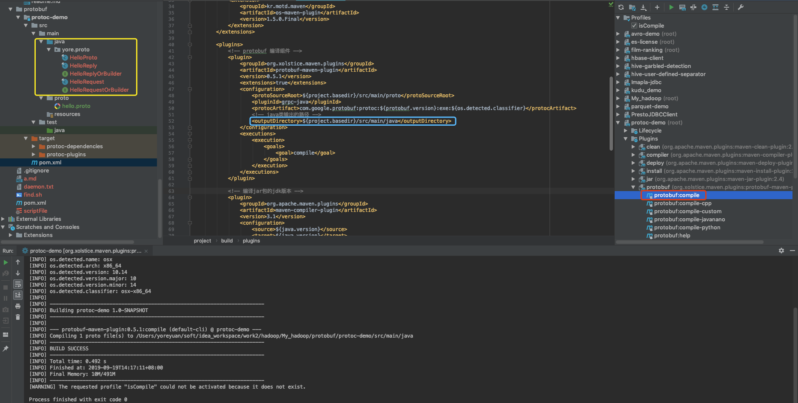

Google Protocol-buffers
===
[官网链接](https://developers.google.cn/protocol-buffers/)

# 1. 简介
Protocol Buffers 是 Google 的开源项目，用于结构化数据串行化的灵活、高效、自动的方法，
例如 XML ，不过它比 XML 更小、更快、也更简单。你可以定义自己的数据结构，然后使用代码生成器生成的代码来读写这个数据结构。
甚至可以在无需重新部署程序的情况下更新.

同XML相比，Protobuf的优势在于高性能，它以高效的二进制存储方式比XML小3到10倍，快20到100倍，原因在于：
* ProtoBuf序列化后所生成的二进制消息非常紧凑
* ProtoBuf封解包过程非常简单

## 1.1 工作原理
在 `.proto` 文件定义消息， message 是 `.proto` 文件最小的逻辑单元，有一系列 name-value 键值对构成。
如下定义一个 persion 的 `.proto` 文件。
```proto
message Person {
  required string name = 1;
  required int32 id = 2;
  optional string email = 3;

  enum PhoneType {
    MOBILE = 0;
    HOME = 1;
    WORK = 2;
  }

  message PhoneNumber {
    required string number = 1;
    optional PhoneType type = 2 [default = HOME];
  }

  repeated PhoneNumber phone = 4;
}
```

一个 message 包含 
* 字段限制 ： 
    - optional 可选的
    - required 必须的
    - repeated 重复的
* 字段类型
* 字段名称
* 编号

```
序列化数据
Person person
person.set_name("yore")
person.set_id(123)
person.set_email("aa@bb.cc")

fstream output("myfile", ios::out | ios::binary);
Person.SerializeToOstream(&output);

# 反序列化
fstream input("myfile", ios::in | ios::binary);
Person person;
person.ParseFormIstream(&input);cout <<  "Name: "  << person.name()  << endl;cout <<  "E-mail: "  << person.email()  << endl;
```

# 安装

## 编译方式安装
```bash
# 下载。访问https://github.com/protocolbuffers/protobuf/releases，下载对应版本

# 编译
cd protobuf
# 获取GoogleMock，并生成对应的configure脚本
./autogen.sh
# 进行环境检测，并生成对应的makefile或Makefile  --prefix=/usr/local可以指定安装路径
./configure
# 按照makefile编译工程
make

# 安装。执行makefile里面的install部分，进行安装       --prefix=/usr/local可以指定安装路径
make install

# 查看版本信息
protoc --version

```

## Mac 系统下安装
```bash
# 下载
wget https://github.com/protocolbuffers/protobuf/releases/download/v3.9.1/protoc-3.9.1-osx-x86_64.zip

# 创建一个文件夹
mkdir protoc-3.9.1
# 解压到protoc-3.9.1内
unzip protoc-3.9.1-osx-x86_64.zip -d protoc-3.9.1

# 配置环境变量
export PROTOC_HOME=/Users/yoreyuan/soft/protoc-3.9.1
export PATH=$PATH:$PROTOC_HOME/bin


# 查看版本信息
protoc --version

```

# 使用

[protoc-demo](../protobuf/protoc-demo/src/main/proto/hello.proto)


```bash
# 通过命令编译
protoc -I=源地址 --java_out=目标地址  源地址/xxx.proto

# maven
mvn protobuf:compile
# 或者 Plugins -> protobuf -> protobuf:compile

```




