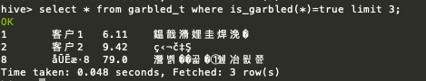

Hive乱码检测分析
==

# 一、自定义函数方法对乱码进行分析

## 1.1 编写代码

## 1.2 打包自定义函数代码
将打包好的jar上传到服务器上，hive-garbled-detection-1.0-SNAPSHOT-jar-with-dependencies.jar

## 1.3 添加到 hive 中
以下操作进入Hive CLI操作  

1. 添加自定义jar包： `add jar /root/hive-garbled-detection-1.0-SNAPSHOT-jar-with-dependencies.jar;`
2. 查看添加的jar包： `list jar;`
3. 创建自定义的函数: 
```sql
--创建临时函数(临时函数仅对当前session有效)
create temporary function is_garbled as 'yore.IsGarbled';
create temporary function ratio_garbled as 'yore.RatioGarbled';

--创建永久函数（对全局永久有效）
create function is_garbled as 'yore.IsGarbled' USING JAR 'hdfs://cdh1:8082/自定义函数jar包路径';

```

## 1.4 查看自定义的函数
```bash
hive>  show functions;
```

如果注册的是永久函数，可以在hive源数据信息表中的查看
```
mysql> show tables;
mysql> select * from FUNCS;

```

## 1.5 使用
```sql
--返回乱码的记录，并限制返回的条数,is_garbled()括号中也可以指定需要检测的特定字段
select * from garbled_t where is_garbled(*)=true limit 3;

--统计乱码行记录占总数据的比值
select ratio_garbled(*) from garbled_t;

```

## 1.6 删除自定义函数
```sql
--删除自定义临时函数
DROP TEMPORARY FUNCTION is_garbled;
DROP TEMPORARY FUNCTION ratio_garbled;
```


## 1.7 测试
测试数据准备 garbled_test.txt
```
原始数据：
1   客户1 6.11    撑着油纸伞
2   客户2 9.42    独自
3   客户3 18.31    彷徨在悠长、
4   客户4 3.33    悠长
5   客户5 91    又寂寥的雨巷
6   客户6 33    我希望逢着
7   客户7 92    一个丁香一样地
8   客户8 79    结着愁怨的姑娘
9   客户9 25    她是有
10   客户10 65    丁香一样的颜色
11   客户11 28    丁香一样的芬芳
12   客户13 17    丁香一样的忧愁


乱码数据

1	客户1	6.11	鎾戠潃娌圭焊浼�
2	客户2	9.42	独自
3	客户3	18.31	彷徨在悠长、
4	客户4	3.33	悠长
5	客户5	91	又寂寥的雨巷
6	客户6	33	我希望逢着
7	客户7	92	一个丁香一样地
8	åŪĒ户8	79	瀯볡��곫�①쉪冶묈쮼
9	若€댎9	25	她是有
10	客户10	65	丁香一样的颜色
11	客户11	28	丁香一样的芬芳
12	客户13	17	丁香一样的忧愁

```

```sql
create table garbled_t(
    id int,
    name string,
    num double,
    desc string
) row format delimited fields terminated by '\t';


load data local inpath '/root/hdfs_data/garbled_test.txt' overwrite into table garbled_t;

select * from garbled_t;

```

## 1.8 自定义 Hive 函数执行结果

自定义函数 is_garbled(参数)说明：* 对查询表的所有字段数据进行分析；还可以指定某些字段 `is_garbled(name, desc)`



- - - - 

# 关于中文乱码的说明
中文乱码对于计算机是完全无法感知的，因为计算机保存这些信息都是按照字节保存，
乱码发生于我们查看数据时为了让我们更好理解这些数据，需要按照给定的编码方式解析显示。

查看 Hive 中保存的数据乱码信息，当在未明确给定编码方式时基本无法准确判断数据是否发生了乱码。
比如 `ss201888asdf;#????鏇挎崲妯` ，很明显可能发生了乱码，因为我们开始无法理解这部分信息了，
但如果单看`鏇挎崲妯`每个字都是中文汉字，只不过是按按照GBK方式转码后的结果，
但其实源字节按照 UTF-8解析后为 `替换模式` ，这几个字连在一起我们可以理解，所以按照 UTF-8 解析是正确的。

这里的判断不针对上面的情况，我们只用正则匹配，判断字符串中的字符只要符合 UTF-8的中文编码就判断为未发生乱码


# 其他
防止 Hive 中出现乱码，可以进行相关的设置，将编码进行统一，例如统计以 UTF-8编码格式

* 在 `hive-site.xml` 中将 `javax.jdo.option.ConnectionURL` 的值添加 `&amp;characterEncoding=utf8`（元数据保存到Mysql时）
```
    <property>
		<name>javax.jdo.option.ConnectionURL</name>
		<!--<value>jdbc:derby:;databaseName=metastore_db;create=true</value>-->
		<value>jdbc:mysql://node1:3306/hive?createDatabaseIfNotExist=true&amp;useUnicode=true&amp;characterEncoding=utf8&amp;useSSL=false</value>
    	<description>JDBC connect string for a JDBC metastore</description>
	</property>
```
* 修改字段注释字符集： `alter table COLUMNS_V2 modify column COMMENT varchar(256) character set utf8;`
* 修改表注释字符集: `alter table TABLE_PARAMS modify column PARAM_VALUE varchar(4000) character set utf8;`
* 修改分区表参数，以支持分区键能够用中文表示 
```
alter table PARTITION_PARAMS modify column PARAM_VALUE varchar(4000) character set utf8 ;
alter table PARTITION_KEYS modify column PKEY_COMMENT varchar(4000) character set utf8;
```
* 修改索引注解： `alter table INDEX_PARAMS modify column PARAM_VALUE varchar(4000) character set utf8;`

+ 在建表时指定某个字段为给定的编码 `WITH SERDEPROPERTIES("field.delim"=',',"serialization.encoding"='UTF8')`
+ 查看hive源数据库是否为 latin1 编码 `show create database hive;`
+ 设置保存元数据的库，例如Mysql的默认字符编码格式 , 在Mysql 中输入 `mysql> \s`, 查看 `Server characterset、Db characterset、Client characterset、Conn. characterset`四个是否为`utf8`
```
[client]
default-character-set=utf8
在[mysqld]
default-character-set=utf8
init_connect='SET NAMES utf8' 
```
+ 将文件数据导入Hive时，先查看文件的编码格式 `file --mime-encoding 数据文件.txt` ，如果现实的编码格式不是utf8(例如是iso-8859-1)，
可以先转成utf8 `iconv -f iso-8859-1 -t utf-8 原始数据文件.TXT -o 转换后数据文件.TXT`，最后将这个文件的数据加载到Hive表中。

- 其他情况也有可能是远程终端在显示中文时出现的乱码。
